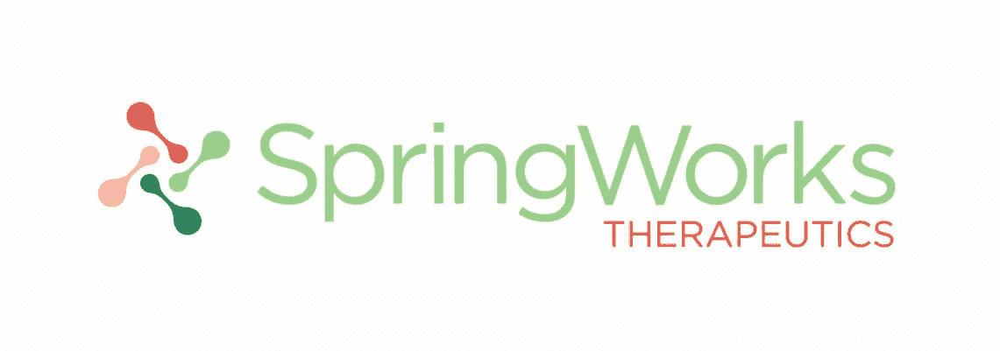
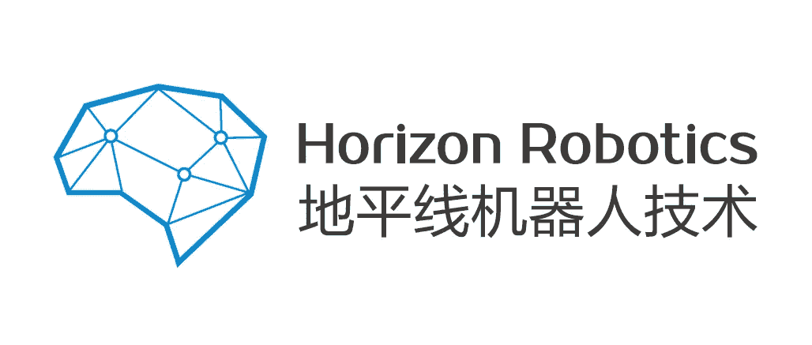
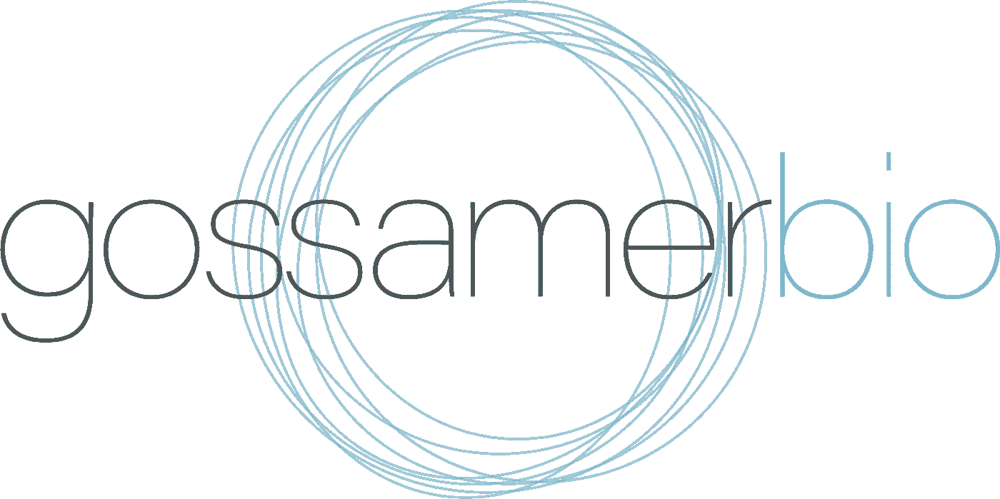
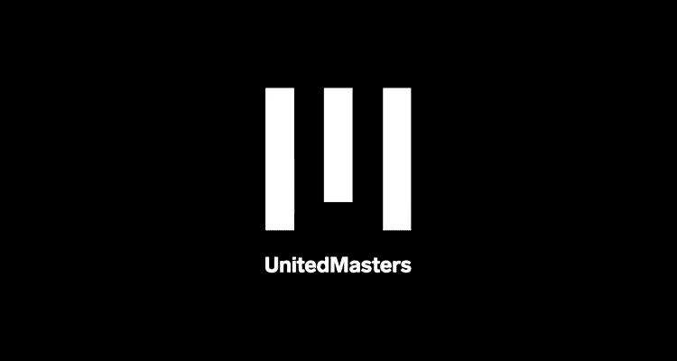
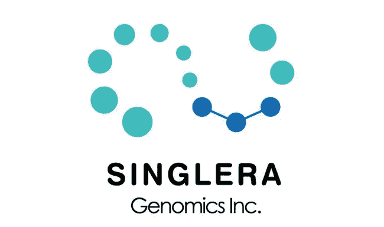

# CB 排名前 6 位女性创办的公司

> 原文：<https://medium.com/swlh/top-6-female-founded-companies-by-cb-rank-b1aecaca473>

女士们很久以前就站在创新的最前沿，震撼着商界。以下是去年在 CrunchBase 上获得 A 轮融资的女性创办的公司名单。

# [**春草疗法**](http://www.springworkstx.com/)

**生物技术/美国**

创始人:**劳拉·沙利文**

成立日期:2017 年

筹集资金:1.03 亿美元

SpringWorks Therapeutics 是一家新型的治疗开发公司。SpringWorks 团队的使命是将科学家、生物制药合作伙伴、患者团体、资助者和慈善家联系起来，为得不到充分服务的患者提供有前途的变革性科学。

公司遵循使命驱动的治疗开发方法，迅速采取行动，为有迫切需要的人提供治疗。

# [联合疗法](https://www.tmunity.com/)

**遗传学、卫生保健、治疗学/美国**

创始人:**安妮·周、布鲁斯·布拉扎、布鲁斯·莱文、卡尔·琼、詹姆斯·赖利、赵**

成立日期:2015 年

筹集的资金:1 亿美元

Tmunity Therapeutics 是一家私营生物治疗公司，致力于通过向更多患有严重疾病的患者提供下一代 T 细胞免疫疗法的全部潜力来拯救和改善生命。Tmunity 正在开发新的 T 细胞受体(TCR)工程 T 细胞、调节性 T 细胞(Treg)和通用工程 T 细胞平台，这些平台对体内 T 细胞的激活和定向表现出一流的控制，以及激活、扩增和遗传工程化来自外周血、脐带血和肿瘤的 T 细胞的专有技术。

该公司正在迅速向肿瘤学、传染病和自身免疫性疾病的临床个性化下一代免疫疗法迈进。

# [地平线机器人](http://www.horizon.ai/)

**机器人、半导体、服务业/中国**

创始人:**陶安妮，黄畅，方毅，，**

成立日期:2015 年

筹集的资金:1 亿美元

地平线机器人是嵌入式人工智能的领导者。该公司致力于提供高性能、低功耗和低成本的集成和开放的嵌入式人工智能解决方案。该公司设想世界上 1000 多种设备，如自动驾驶汽车，将配备“大脑”，成为智能实体，具有从感知、理解到决策的能力，以实现安全、方便和有趣。

Horizon 团队结合了算法、软件、硬件和芯片开发能力，以及拥有丰富工业经验的强大 R&D 团队。

# [戈瑟姆传记](http://gossamerbio.com/)

**医疗保健/美国**

创始人:**法希姆·哈斯南，希拉·古吉拉特**

成立日期:2015 年

筹集的资金:1 亿美元

Gossamer Bio 是一家总部位于圣地亚哥的公司，专注于发现和开发新型差异化治疗产品，以解决各种目标患者群体中尚未满足的高需求。Gossamer Bio 由前 Receptos 执行团队创建，其战略是利用一个资产丰富的许可环境，重点关注高未满足需求的领域，利用一个在免疫学、炎症、纤维化和肿瘤学领域具有良好执行记录的团队。

# [美国大师赛](https://unitedmasters.com/)

**营销、音乐、音乐标签/美国**

创始人:**克里斯蒂娜·萨伦，克里斯蒂娜·萨伦，史蒂夫·斯托特**

成立日期:2017 年

筹集资金:70 00 万美元

United Masters 将技术、讲故事和文化结合在一起，为音乐人提供了一种替代剥削性唱片公司交易的选择。艺术家向 United Masters 支付有竞争力的价格，在互联网上从 Spotify 到 YouTube 再到 SoundCloud 分销他们的音乐，他们分享版税，而艺术家保留主录音的权利。

最有前途的艺术家被邀请接受由音乐营销专家团队支持的财务、营销和发行支持。

# [Singlera Genomics](http://www.singleragenomics.com/)

**遗传学、卫生保健、健康诊断学/美国**

创始人:**张、、刘强、、**

成立日期:2014 年

筹集资金:60 00 万美元

Singlera Genomics 是一家快速发展的公司，专注于非侵入性基因检测。Singlera 的主要产品和服务包括肿瘤诊断和个性化治疗、无创产前诊断、植入前基因筛查和定制化科研服务。Singlera 致力于精准医疗的发展，努力通过早期、准确和信息丰富的诊断来帮助患者。

此外，Singlera Genomics 还为制药公司和医学研究机构提供定制的下一代测序服务。它在美国和中国都有运营中心。

[*纳塔利娅·库库什金娜*撰写](https://www.linkedin.com/in/natalia-kukushkina-b62397132/)

## 这篇文章发表在《T4》杂志《创业》(The Startup)上，这是 Medium 最大的创业刊物，有 333，853+人关注。

## 在这里订阅接收[我们的头条新闻](http://growthsupply.com/the-startup-newsletter/)。

