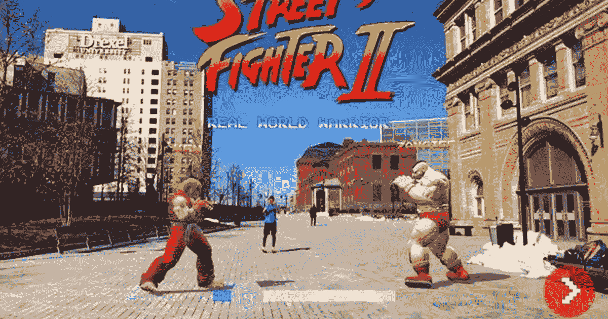

# 7 大增强现实应用——2018 年 4 月

> 原文：<https://medium.com/swlh/top-7-augmented-reality-apps-april-2018-678b7fe5961d>

波士顿咨询集团的一项新研究显示，美国每月有超过 8000 万人参与增强现实。

这就是为什么我为你收集了 2018 年 4 月的 7 大增强现实体验。尽情享受吧！

# Bareburger Snapchat 3D 食物菜单

快餐汉堡餐厅 [Bareburger](https://www.bareburger.com/) 将会用增强现实中呈现的汉堡和其他物品的 3D 模型取代所有的纸质菜单。

areburger Snapchat 3D Food Menu

# 增强现实应用程序帮助帕金森患者

莱斯大学的生物工程学生开发了一款智能手机应用程序，可能会帮助帕金森病患者改善行走步态。

Augmented Reality App to Help Parkinson’s Patients

# Zara AR 应用

AR 应用只是 Zara 创新技术的最新实验。在下载了 [Zara AR 应用](https://itunes.apple.com/us/app/zara-ar/id1366154100?mt=8)后，顾客可以将他们的手机指向前述的商店橱窗，模特 Léa Julian 和 Fran Summers 被赋予了 7 到 12 秒的生命。

Zara AR App

# 街头霸王 AR 体验

如果你曾经想玩一个更激烈和现实版的“街头霸王”，那么这个增强现实游戏就是为你准备的。以下是视频的文字记录。

看看街头霸王。在现实生活中。这是一个由 [Abhishek Singh](http://shek.it/) 创建的 AR 项目

Street Fighter AR Experience

# 保时捷 AR

这款[增强现实](https://insideevs.com/supersized-augmented-reality-tesla-model-3-video/)显示器可以让你第一次看到汽车的全貌(里里外外)。

Porsche AR

# AR round——AR 领域的分散式广告解决方案

Arround Platform 将自己描述为“增强现实中的广告解决方案”，当用户使用应用内摄像头时，使用覆盖在用户屏幕上的全息图。

ARROUND — Decentralized Advertising Solution in AR

# 用增强现实探索火星

谷歌先锋计划主持人 Edward Dovlatyan 花了一天时间在佩克学校分享谷歌的新 Expledition AR 技术

五年级、六年级和七年级的学生有机会探索火星表面，研究其中一个火星漫游者的机械和工作原理，并探索火星陨石坑的深度。

Exploring Mars with Augmented Reality

# 今天到此为止！

如果这篇文章对你有帮助，请分享，这样其他人也能喜欢，**并且不要忘记关注** [**尤瓦尔·凯什彻**](https://medium.com/u/9e16c0b9e56f?source=post_page-----678b7fe5961d--------------------------------) 以获得更多好东西👏👏👏。

下个月见！

## 这篇文章发表在《创业公司》杂志上，这是 Medium 最大的创业刊物，有 317，238 人关注。

## 订阅接收[我们的头条](http://growthsupply.com/the-startup-newsletter/)。

