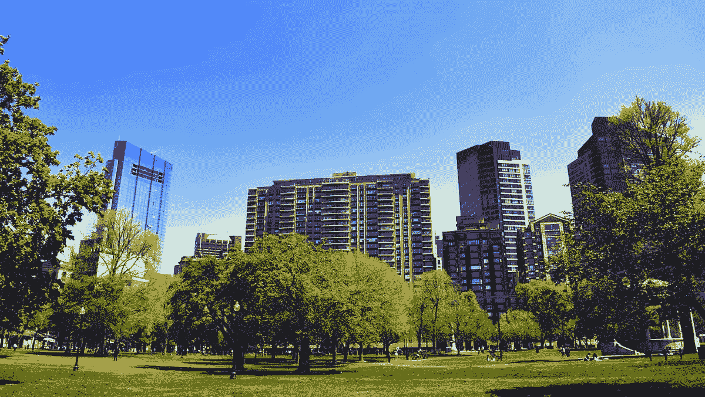

# 避免精疲力尽比你想象的要容易

> 原文：<https://medium.com/swlh/top-9-ways-to-avoid-burnout-78e38377796d>

激情是一种美丽的东西。一个想法突然出现在你的脑海中，当你沉浸在其中时，你会失去对这个世界的所有感觉。这可能是你最新的创业想法或者工作中的新设计项目。但是，即使你沉浸在一个带给你快乐的项目中，也可能潜伏着疲惫。倦怠可能表现为身体或精神上的疲惫，这里提供的建议旨在对抗它。

让我们面对它；在今天的职业世界里，人们对员工的期望比以往任何时候都高。我们每周 7 天、每天 24 小时都在休息，在智能手机上设置了电子邮件通知，待办事项应用程序会在周末提醒我们。你选择你的职业可能是因为你喜欢它，擅长它，并且它包含了创造性的挑战。但是在你的领域中，最成功的领导者可能没有提到的一件事是，你必须自己承担起避免精疲力竭的责任。总会有另一个你可能正在努力的功能，或者你可能正在参加的会议，但是你要找到一个对你个人来说舒适的平衡。

如果你想达到最高生产率，你必须学会如何后退一步放松。这听起来可能违反直觉，但却是事实。在 Proto.io，我们努力工作，但也为呼吸腾出空间。这篇文章介绍了我们用来避免精疲力尽的一些小贴士。

# 1.外出

有时候，我在工作日会遇到这样的情况，我的思绪变得混乱，无法集中注意力。虽然我可以去喝一杯含咖啡因的饮料，试着继续前进，但我还是去散步了。晒晒太阳，闻闻办公室附近的花香，听听音乐，让我的血液加速流动——所有这些都有助于我以一个清晰的头脑回到工作中。如果我在散步前发现很难想出新的想法，那么当我回到你的办公桌前时，那些阻碍创造力的障碍已经消失了。我相信，有时候需要换个风景来改变心态。

# 2.限制通知

除非你是一个随叫随到的开发人员，否则当你不在办公室的时候，你很有可能会屏蔽掉一些通知。通知让我们焦虑。每个通知看起来都很紧急，即使它并不紧急。加州州立大学多明格斯山分校[的心理学名誉教授拉里·罗森解释说](http://www.chicagotribune.com/lifestyles/health/ct-phone-ringing-anxiety-20170424-story.html)“我们已经训练自己，几乎就像巴甫洛夫的狗一样，象征性地对振动可能意味着什么垂涎三尺……如果你不处理振动的手机或嘟嘟的短信，大脑中导致焦虑的信号将继续占据主导地位，你将继续感到不舒服，直到你解决它们。”

虽然在你的职业生活中有很多事情你可能无法控制，但关闭不必要的通知是你可以做的一件事，这将显著降低你的压力水平。我并不主张对工作中发生的事情置身事外，但是设定界限，这样你就可以休息并专注于个人事务，这将有助于避免精疲力竭。

# 3.把午餐放在你的日历上

有这么多项目争夺你的注意力，很容易安排在午餐时间开会。然后一天就要结束了，你很饿，很难集中注意力。如果你每天抽出 30 分钟或更多的时间去吃点东西，或者至少热些东西，离开办公桌坐一会儿，你会对自己有好处。当你吃得合理时，你可以更有效地工作，所以把它作为优先事项。有时候你需要改变时间表，为投资者会议腾出空间，或者修复让你的网站崩溃的东西，但是有一个健康的时间表，你通常会坚持，这将有助于你远离压力。

# 4.步行会议

我以前的一个主管曾经建议我们在外面进行每周检查，这是个好主意。在附近散步时，我们短暂地换了一下风景，并讨论了新的活动想法。我们没有坐在闷热的办公室里，而是有视觉刺激来启发我们。(走出户外，欣赏[视觉上令人惊叹的](https://blog.proto.io/top-6-visually-stunning-parks-visual-design-teams-visit/)景色，这对设计团队来说是一个奇迹。)这对于你需要做笔记的协作会议来说是行不通的，但如果某些会议不需要电脑，那么在天气允许的情况下，它们可能是搬到户外的好选择。

# 5.去度假

这是一个避免精疲力尽的小窍门，比其他的花费更多的时间和金钱，但它无疑是最重要的一个。随着越来越多的科技公司提供无限假期，你会认为他们的员工可能会休更多的假。然而，开放式休假政策往往会产生相反的效果。当他们的同事似乎每天都在工作时，一些员工害怕自己看起来像个懒鬼。

最成功的企业都知道，放松的员工会做得最好。但是员工并没有充分利用他们的假期。对于那些采用假期累积模型的人，[项目:休假发现](https://www.projecttimeoff.com/state-american-vacation-2017)2016 年，美国工人平均获得 22.6 天假期，但只休了 16.8 天。这些额外的日子本可以用来避免筋疲力尽。

No burnout as far as the eye can see.

如果你所有可用的现金都用来启动你的生意，或者因为其他原因资金紧张，该怎么办？停留可以像你在地球的另一边旅行一样有效。探索你所在城市的新博物馆，观看你最喜欢的节目的最新一季，去远足。假期可以有多种不同的形式，但是花时间关注自己是回到工作岗位准备实现目标的关键。

# 6.改变你的环境

许多公司选择了开放式办公室布局，虽然这可能会培养一种开放和透明的文化，但有时会严重影响你的工作效率。如果你在工作环境中感到压力过大，试着在一个新的(更安静的)地方完成一些工作。也许一家咖啡馆或图书馆是深入研究让你夜不能寐的大项目的最佳地点。

# 7.睡一会儿

说到晚上睡不着，当你压力很大，快要筋疲力尽的时候，睡觉可能是你最不想做的事情。但这是阻止你走向极端的主要因素之一。找出最适合你的睡眠时间，并坚持按照时间表来睡。当你通常在晚上 11 点至早上 6:30 睡觉时，在工作日的凌晨 1 点睡觉会让你分心。典型的建议是每晚睡 7-8 个小时，但你可能需要更多或更少的时间。对你来说合适的量有助于你醒来准备好开始新的一天，避免不必要的熬夜导致下午的疲惫。

# 8.代表

如果你在一个团队中工作，并有其他人可以分配工作，利用他们的才能。仅仅因为你可以想象*可以*自己做所有的工作，这并不意味着你应该做。伸出手寻求帮助。当有大量及时的交流时，团队会运作得更好。在项目快过期之前寻求帮助。当你经常和你的团队一起检查并讨论每个人的问题时，你可以利用这个机会让你的团队知道有一个大的截止日期即将到来，你可以利用他们的帮助。你的团队有许多不同的优先事项。如果你提前通知他们，随着截止日期的临近，你就不太可能被超过你应承担的工作量所困。

# 9.说出来

与人交谈可以帮助你减轻压力，避免精疲力尽，可以是一个值得信赖的治疗师，一个朋友，甚至是你的妈妈。选择一个好的倾听者，他也能给出有针对性的反馈。停下来和关心你的人讨论一下你过得怎么样有助于你坚持下去，即使你的待办事项比以往任何时候都多。

**关闭思路**

这些预防措施可能是避免精疲力尽的最佳方法，但这是一个独立的过程。帮助你降低压力的方法可能对你的同事不起作用。最好尝试不同的方法，看看什么对你最有效。我们都想在工作中出类拔萃，避免精疲力尽使这成为可能。

你有帮助你避免精疲力尽的减压技巧吗？请发推文给我们 [@Protoio](https://twitter.com/protoio) ，让我们知道什么对你有效！

*Proto.io 让任何人都能构建感觉真实的移动应用原型。不需要编码或设计技能。快速实现您的想法！* [*立即注册 Proto.io*](http://proto.io/) *的 15 天免费试用，并开始下一个移动应用设计。*

*原载于 2017 年 11 月 7 日*[*blog . proto . io*](https://blog.proto.io/top-9-ways-avoid-burnout/)*。*

## 这个故事发表在 [The Startup](https://medium.com/swlh) 上，这里有 266，100+人聚集在一起阅读 Medium 关于创业的主要故事。

## 在这里订阅接收[我们的头条新闻](http://growthsupply.com/the-startup-newsletter/)。

