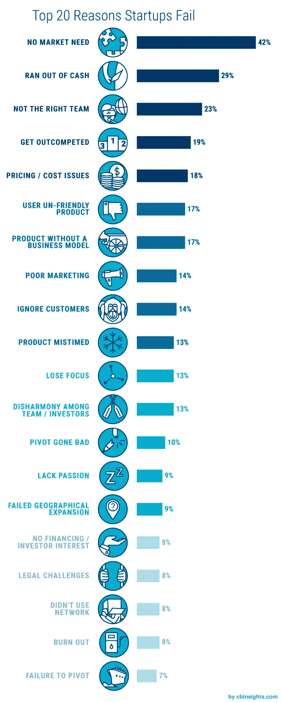

# 2018 年创业公司失败的主要原因

> 原文：<https://medium.com/swlh/top-reasons-why-startups-fail-in-2018-dfe3627f72fc>

人生最难做的一件事就是从零开始建立一家公司。为了证明这有多难，研究表明，只有 8%的初创公司在 3 年后仍在运营。为什么其他人会死？他们是怎么死的？是什么阻止了他们的死亡？

为了回答这个问题，我们对一些涉足创业领域的公司进行了剖析。大多数公司(如果不是全部的话)相对来说都不太出名，但我们需要知道的只是它们失败的原因。

以下是我们收集的一些原因。

# 可用资金管理不善

一个详细的、万无一失的计划是好的，对工作的热情更好，但如果一个企业拥有所有这些，而他们缺乏足够的资金，他们很可能在头五年内失败。

然而，企业想出筹集第一轮资金的方法并不罕见。初始资金的一个常见来源是创始人/联合创始人。然后我们有家人、朋友和天使投资者。杰夫·贝索斯依靠家庭让亚马逊运转起来；埃隆·马斯克自掏腰包为特斯拉筹集资金；还有朋友家的马克·扎克伯格。

但是，这些来源是有限的，这就是为什么重要的是有一个可靠的，不断流入的现金注入业务。你会震惊地发现运营一家初创公司的日常事务要花多少钱。现在想象一下，把你所有的种子资金都花在无聊的事情上。这正是活动邀请和活动分享公司 [**Spinvite**](https://www.audreyledoux.com/single-post/2017/09/12/Spinvite---The-Partys-Over-A-Postmortem) 所做的。他们倾其所有开发了一种新奇的、未经测试的产品。

[**胡夫**](https://collapsed.co/startups/fuhu) 是另一家提供儿童平板电脑和应用程序的公司，但由于利润率不足以支付日常开支，不得不关闭运营。与 [**Zirtual**](https://www.crunchbase.com/organization/zirtual) 同样的问题；他们超过了燃烧速度。故事的故事是另一个有趣的案例研究；经营企业的成本高于他们的收入，结果他们缓慢而痛苦地死去。

# 内部问题

每当团队来到董事会向风险投资家推销他们的商业提案时，风险投资家关注的一件事就是团队的凝聚力。他们同步吗？有不和谐的迹象吗？一位著名的天使投资人曾经说过，他宁愿让 A 管理团队执行 B 级项目，也不愿让 B 管理团队接手 A 级项目。

分歧、无能、嫉妒或缺乏激情是癌症创业的特征。尽管症状可能不会立即显现，但结局是肯定的。不幸成为这场瘟疫受害者的公司之一是**。**

****

**非洲短片在线分销商 Hubrif 于 2018 年 1 月正式破产，主要原因是创始人之间在管理职责上一直存在分歧。同样，一家总部位于伦敦的互联网公司 [**Sharkius Games**](https://www.failory.com/interview/sharkius) ，由于在招聘员工过程中犯下的一些致命错误，于 2017 年 11 月停业。**

**其他公司如[**【GuGo】**](https://www.crunchbase.com/organization/gugo#section-overview)[**梯队交流**](http://nonsensefrommichael.blogspot.com/2017/02/why-my-startup-failed.html) 将其失败归因于缺乏激情和意见不合。**

# **不充分/误导的市场调查**

**42%的创业公司失败是因为他们未能解决市场需求。你可能会问，“这怎么可能？”不幸的是，的确如此。这是因为他们完全忽视了市场调查的重要性。一些创始人认为市场调查包括与几个朋友和家人交谈，以获得他们对产品的意见。好难过。**

****

**[**记得**](http://www.jfdi.asia/blog/adrian-tan-why-my-startup-failed/) 就是这方面的经典例子。他们试图为家庭创建一个活的剪贴簿，但他们很快意识到他们的产品没有市场。他们于 2015 年 4 月关闭。 [**KOLOS**](http://www.fuckedupstartups.com/technical-concepts/kolos-ipad-racing-wheel/) 是同期关闭的另一家企业，他们的理由是，“我们的产品不是人们想要的”。**

**同样， [**Sharingear**](https://www.crunchbase.com/organization/sharingear) ，一个点对点的乐器租赁市场，由于市场规模小，现金告罄，于 2016 年 1 月倒闭。市场研究还需要发现环境的竞争有多激烈，以及你的创业公司如何拥有优势。这是[**gamestube**](https://np.reddit.com/r/Entrepreneur/comments/504wjz/we_hear_a_lot_about_the_success_stories_on_here_i/d71d1vo/)没能做到的事情。**

# **过早结垢**

**最近公布的数据显示，70%的初创公司在应该扩大规模之前就扩大了规模。尽管每个初创公司的目标都是摆脱“初创公司”的标签，成为一家盈利的老牌公司，但这不应该导致过早死亡。Kaitek 是 2018 年 1 月倒闭的公司之一，他们唯一做错的事情是他们试图在太短的时间内做太多的事情。**

**[**RewardMe**](https://www.crunchbase.com/organization/rewardme) ，一个同时面向餐厅和零售商的忠诚度平台，也将他们在 2015 年 6 月的失败归因于过早的规模化。通常，陷入这种困境的公司通常是那些不知道其客户的终身价值的公司，那些具有非重复商业模式的公司，以及那些在业务范围内花费太多时间而不是在 it 上工作的公司。**

# **缺乏重点和灵活性**

**一个好的商业经理的一个特质是坚韧——面对风暴保持坚定的能力。就像马克·扎克伯格在董事会想卖掉脸书时所做的那样，或者像耐克的创始人考虑开始他们的服装生产线时那样。但是这种特性应该谨慎使用。**

**有时候，你可能会走向毁灭，而你的专注让你看不到前方的危险。比如杰夫·贝索斯；他无限制地收购小公司。或者甚至贝宝，当他们星球大战启发的汇款方式不起作用。最重要的是要确保你坚持你的计划，如果计划不成功，你可以修改它。**

****

**如果你不是，你可能会像承诺在 15 分钟内提供有机健康膳食的公司 [**Sprig**](https://www.crunchbase.com/organization/sprig-2) 一样结束。即使他们得到了大量的资金支持，他们也没能重新制定战略来实现他们的目标。**

# **结论**

**后见之明的问题是，有一种倾向是让我们的确认偏见影响我们的判断。创业公司失败还有其他几个可能的原因；不利的法规、坏账、法律战、糟糕的营销、糟糕的产品体验等。最重要的是对你计划进入的市场进行足够的研究，并制定一个强有力的战略。**

****

**顶部见！**

**娜塔莉亚·库库什金娜撰写**

****

## **这个故事发表在[的创业](https://medium.com/swlh)上，这是 Medium 最大的创业刊物，有 356，974+人关注。**

## **订阅接收[我们的头条新闻](http://growthsupply.com/the-startup-newsletter/)。**

****