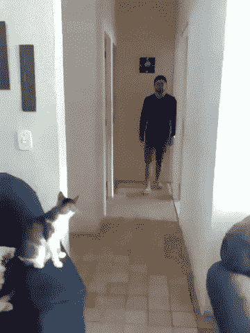
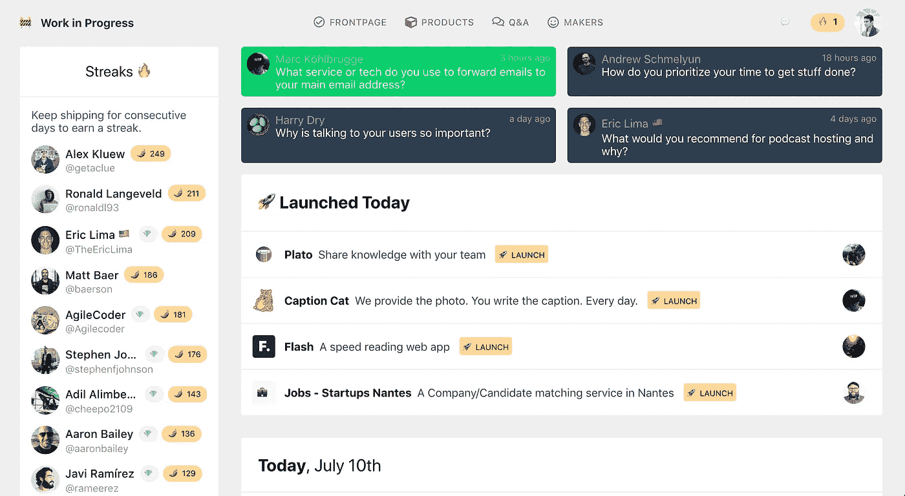
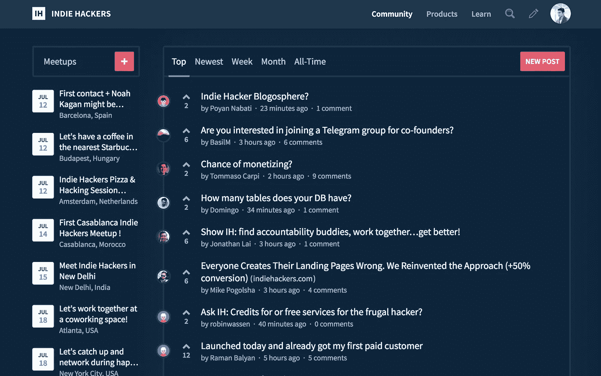
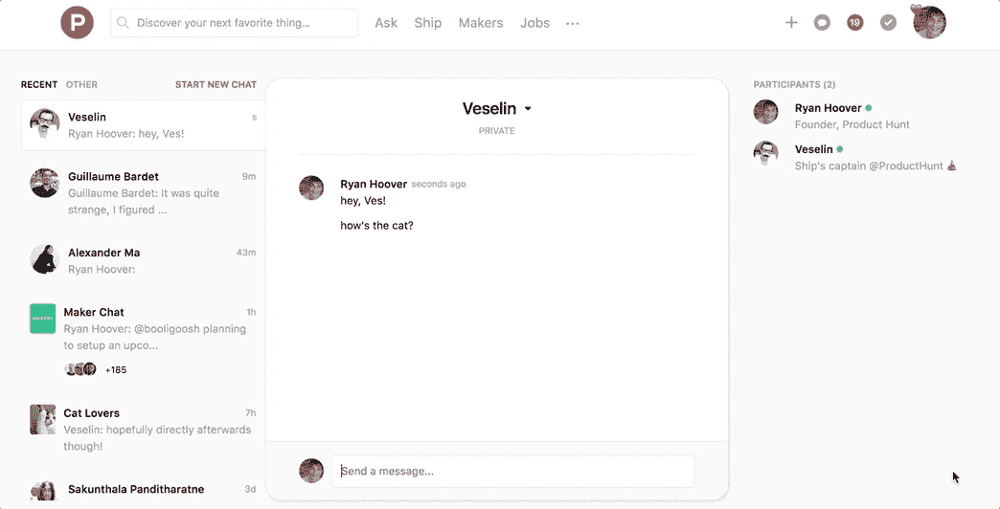
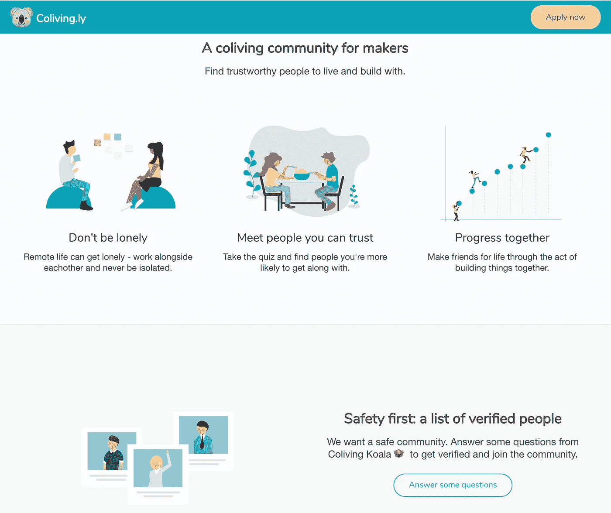

# 远程工作的顶级资源—😸带着你的猫

> 原文：<https://medium.com/swlh/top-resources-for-working-remotely-with-your-cat-ac2e6685b802>

## 我的“同居”之旅

大约两年前，我写了这篇文章，标题是， [*都 2016 年了，你为什么还要去办公室？*’](http://www.prototypr.io/blog/2016-still-going-office/)。远程工作有很多好处！

> *不再通勤*
> 
> 有更多时间与家人和朋友在一起
> 
> 你可以去旅行，去你想去的地方！

很多都是真的，听起来很棒。然而，现在在 2018 年，我有一些教训，为什么*办公室外的*生活并不总是为我工作，跟随一些帮助我保持联系的资源。我将介绍:

*   我最喜欢的在线创客社区
*   最有吸引力的居住社区(对我来说)
*   关于一个项目的信息，我很高兴尝试下一个项目！

投入👇

## 和猫一起生活

经过 2-3 年的远程工作和在家工作([远程工作！=在家工作](https://blog.trello.com/working-from-home-is-not-remote-work))，我发现非办公室生活通常意味着“和猫在一起的生活”，有时会忘记如何与人相处。例如:

*   😺*“有更多时间与家人和朋友在一起”*:听起来不错——只要你的家人和朋友不在办公室😅。否则你就只能独自和猫在一起了。

*   *‘你去旅行’*:*这听起来也很棒，但是既费时又费钱。如果你正在开始自己的事业，旅行会让你慢下来很多…我只是负担不起这么多。*
*   *共同工作空间——最终我开始质疑为什么我要每天支付 25 英镑，只是为了和其他人在一起。我家里已经有我需要的一切了。所以，这就是我和一只猫的结局。*
*   *在咖啡馆工作也不错，直到你厌倦了看着人们给杯子拍照，听着婴儿哭泣。*

*所以最后，我发现我大部分时间都独自和一只猫在一起。*

**

*…然后猫就走了。*

# *社区资源*

*现在怎么办？当需要寻找一种更好的数字生活方式时，这三个在线社区给了我很大的帮助。在里面呆了一段时间后，我发现有人可以和我聊天，他们知道我在做什么。*

> *作为人类，我们最多只能和 150 个人建立有意义的关系。*
> 
> *在这 150 个中，有 5 个是我们最亲密的朋友，10 个在第二层，35 个在第三层，100 个在最外层。*

# *🔗3 个在线社区*

*虽然我只和每个人的两三个人交谈过，但这真的很重要！我没有解释为什么我把时间花在制作项目上而不是看电视上，这些社区的人们已经理解并鼓励我:*

## ***1。** [**工作进行中**](http://wip.chat)*

**

> *进行中的工作是一个创客社区。我们互相帮助，共同承担责任，专注于产品的生产、运输和发展。*
> 
> *我们公开分享我们的待办事项，庆祝我们的成功，讨论我们的失败，跟踪我们的目标，并为彼此提供可行的反馈。*
> 
> *不要自己发货，一起发货！*

*正在进行的工作是一个电报聊天，与网站上的待办事项列表集成。对我来说，Telegram 的使用将它与其他在线体验区分开来，因为你可以与 WIP.chat telegram bot 交互来设置和检查你的待办事项列表。这真的很有趣，也很容易做到，这是一个支持的社区。*

*能够看到其他人检查物品在某种程度上给我创造了一种团体感——*‘还有其他人也在做这种事！*’*

**

## ***2。** [**独立黑客**](http://indiehackers.com)*

**

> *我们是几千名创始人和开发者，互相帮助开始盈利的在线业务。这个社区是一个友好的地方，可以分享我们的经验和项目，获得有价值的反馈，交换技巧，并相互依靠以获得支持。*

*独立黑客是一个论坛，所以它比 WIP 之类的群聊更容易关注。在独立黑客网站上，你可以阅读独立制作人的故事，并了解如何创造有利可图的业务。*

*播客部分也充满了黄金，如果你只有时间，我推荐这一集:*

* [## 直面你的恐惧，跨越游牧名单的更高等级

### 大家好吗？这是来自 IndieHackers.com 的考特兰，我在这里与盈利互联网的创始人交谈…

www.indiehackers.com](https://www.indiehackers.com/podcast/043-pieter-levels-of-nomad-list)* 

## ***3。** [**产品猎奇聊天**](https://blog.producthunt.com/chat-by-product-hunt-41c31d8e20cf?ref=producthunt)*

*产品搜索一直是一个很棒的社区，但现在通过新的聊天功能与其他制造商联系更好:*

**

*[https://blog.producthunt.com/chat-by-product-hunt-41c31d8e20cf](https://blog.producthunt.com/chat-by-product-hunt-41c31d8e20cf?ref=producthunt)*

# *🌏3 个居住社区*

*在网上成功后，我想知道如果我周围有更多支持我的人会是什么样，我偶然发现了共同生活的概念。*

> *合住是一种现代住房形式，在这里，居民共享生活空间和一系列兴趣、价值观和/或意图。*

*这比一起工作更有意义，因为我不需要租一间办公室来和人们在一起——以我已经支付的租金价格，同居有我需要的一切。我最喜欢的选项是:*

## *1.[Sende.co](http://sende.co/)*

> *石头房子和花园为您的活动和完成工作进行了优化。享受志趣相投的人的陪伴、美食和支持的氛围。位于 20 个居民村。*

* [## 森德是西班牙的一个乡村合作与共同生活空间

### 新鲜的山间空气有助于良好的睡眠(我们建议 9 小时睡眠，可选午睡)。在夏天，日落是…

sende.co](http://sende.co/)* 

## *2.[孙和 Co](https://sun-and-co.com/)*

> *孙公司是整个地中海沿岸第一个共同生活和工作的社区。这是自由职业者、企业家、独立工作者、数字游民和任何寻求工作与休闲完美平衡的人的理想去处。*

* [## 孙公司|外埠独立工作者之家

### 更聪明地工作。活得更好。规则变了。现在工作和学习都是以非常规的方式进行的。生活和分享…

sun-and-co.com](https://sun-and-co.com/)* 

## *3.[市区校园](https://www.urbancampus.com/)*

*这是我真正要去的地方，在马德里！如果你要来，给我打个电话！*

> *城市校园重新定义了我们在城市中共同生活的方式。住在自己的工作室里，享受丰富的共享空间和服务。在你的私人办公室、开放空间和各种实验室工作。享受我们独创的餐厅和社交空间，与人和想法交流。*

* [## 城市校园——好奇者的空间

### 城市校园在欧洲城市设计和运营以人为本的校园，重新定义我们共同生活的方式…

www.urbancampus.com](https://www.urbancampus.com/)* 

*也有其他的社区，像外的[，但是那些要贵得多。我认为他们可能更关注旅行/生活方式方面。](https://www.outsite.co/)*

*我列出的这三家都很实惠——我想这是因为他们知道我们很多人都没有钱，只是想找个地方一起做东西。这些是我的要求:*

*   *好人*
*   *好地方*
*   *负担得起的*
*   *不关注额外津贴*

## *[Coliving.ly](https://coliving.ly/)*

*在这段旅程中(在我决定尝试城市校园之前)，我还考虑过租赁 Airbnbs，或与其他制造商一起集体预订公寓。*

*这方面的问题是安全和在正确的时间找到正确的人。我对同居的概念很感兴趣，所以我想我可以试着建立一个网站来实现这一点。*

*你可以在下面看看，但是我稍后会再发一篇关于这个的文章。如果您对该概念有任何反馈，请分享:*

* [## 创客社区

### 加入一个对居住感兴趣的认证制造商的目录。然后像 Airbnb 一样通过团体预订节省居住空间。

coliving.ly](https://coliving.ly/) 

K

谢谢！

## 这篇文章发表在 [The Startup](https://medium.com/swlh) 上，这是 Medium 最大的创业刊物，拥有 343，876+人关注。

## 在这里订阅接收[我们的头条新闻](http://growthsupply.com/the-startup-newsletter/)。

*