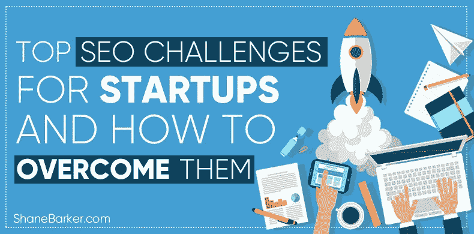

# 初创公司面临的最大 SEO 挑战以及如何克服它们

> 原文：<https://medium.com/swlh/top-seo-challenges-for-startups-and-how-to-overcome-them-af9f66632911>

随着快速发展的排名算法和搜索引擎优化技术，企业很难优化他们在搜索结果中的存在。创业公司的 SEO 变得更具挑战性，因为他们需要在资金耗尽之前传播他们的业务。

作为一家初创公司，你需要告诉人们你是谁，以及你可以如何帮助他们。让可能对你的产品或服务感兴趣的人找到你的最好方法是在相关搜索结果中排名靠前。

精选的相关内容:

*   自动化链接建设:一种轻松获得链接的方式
*   [提高搜索排名的 52 个最佳 SEO 审计工具](https://shanebarker.com/blog/best-seo-audit-tools/)

为初创公司利用有效的 SEO 技术可以帮助你在目标消费者的心目中留下印记，并获得超过竞争对手的优势。你可以为你的网站带来有针对性的流量，并获得吸引重要受众的机会。

但是要做到这一点，你需要为你的品牌起草一个可靠的搜索引擎优化策略。我建议你聘请一个领先的搜索引擎优化顾问或公司，以迎合你的创业搜索引擎优化的需求。

一个搜索引擎优化专家可以帮助你让你的网站很容易被正确的受众注意到。他们还可以帮助你为初创公司选择正确的 SEO 实践，保护你的网站免受谷歌的处罚(T4)。

在这篇文章中，我将讨论初创公司面临的主要 SEO 挑战，以及如何克服这些挑战来发展业务。

# 介绍初创公司面临的主要 SEO 挑战

意识到优化你的内容以提高搜索效果的主要挑战可以让这个过程变得更容易。作为一个创业者，你应该看看下面的挑战，并准备好克服它们。

# 1.搜索引擎优化的期望与现实

当你雇佣一个搜索引擎优化专家来帮助你发展你的创业公司时，你显然期望很快得到结果。然而，结果有时需要时间。无论你如何优化你的网站，你仍然需要时间来赢得搜索引擎的尊重和信任。

有许多因素，包括[搜索引擎算法](https://moz.com/blog/search-engine-algorithm-basics)，会影响你的搜索引擎优化策略的结果。随着时间的推移，你将需要不断地产生伟大的内容，并建立相当数量的高质量的链接。

有时候，你的竞争对手可能会在他们的 SEO 策略上花更多的钱。这也可以防止你的排名比他们高。

所以在你质疑你的搜索引擎优化顾问的知识和专业技能之前，你应该对你的搜索引擎优化策略何时能产生可见的结果有一个现实的了解。

精选的相关内容:

*   [优化搜索结果的 30 款最佳网络分析工具](https://shanebarker.com/blog/web-analytics-tools/)

# 假 SEO 公司

[假冒的 SEO 公司](http://www.forbes.com/sites/joshsteimle/2014/01/16/seo-how-to-avoid-the-big-ripoff/)已经出现了数十家。他们会告诉你，搜索引擎优化是所有关于关键字，黑帽的做法，和欺骗搜索引擎。

如果有人承诺每周给你 50 美元，你最好对此持怀疑态度。不合理的低成本是假 SEO 公司会抛给你的第一个诱饵。

他们可能会敦促你在不相关的、排名较低的网站上发布客座博文，并在拥有糟糕会员资格的社交媒体网站上创建账户，只是为了向你展示工作已经完成。

如果一家公司承诺一周内有结果，你最好避开他们。你应该花时间分析并选择合适的顾问或公司来处理你对创业公司的 SEO 需求。

# 预算

许多创业公司忘记为他们的 SEO 需求分配预算。如果你想让创业公司的搜索引擎优化策略产生最大的效果，你应该从一开始就为它分配搜索引擎优化预算。

对于创业公司来说，确定具体的 SEO 目标是很重要的，比如他们想要驱动的流量或他们想要排名的关键词。一旦你知道你想要实现什么，你就可以起草一个策略来帮助你实现。

你的下一项工作是将预算分配到特定的领域，包括:

为初创公司雇佣搜索引擎优化专家

生产高质量的内容是真实的，相关的，关键字优化

接触高 DA 网站，寻找客座博文和链接建设机会

通过社交媒体、新闻稿、社区论坛等推广内容。

订阅关键字研究、竞争对手分析、[反向链接分析](https://shanebarker.com/blog/backlink-analysis-tools/)等付费工具

你应该学会如何为初创公司规划 SEO 预算，以及如何明智地将预算用于各种 SEO 活动。

# 新旧 SEO 策略对比

像谷歌这样的搜索引擎不断改变它们的算法，并推出新的算法。换句话说，索引你的在线业务的参数会一直变化。这是至关重要的，你的搜索引擎优化专家与最新的更新同步。大多数几年前稳操胜券的旧 SEO 策略今天会受到搜索引擎的惩罚。所以，站长们沉湎于过去实际上可以在 SEO 中拉下创业企业。

精选的相关内容:

*   [掌握本地搜索引擎优化的艺术，为你的本地业务排名](https://shanebarker.com/blog/local-seo/)

# 进展缓慢

SEO 是让你的品牌名称在万维网上引起注意的几个在线努力的高潮。某些搜索引擎优化策略，如 AdWords 和付费社交媒体活动，可以显示立竿见影的效果。然而，其他通用的搜索引擎优化工作可能需要时间来显示结果。如果你想更清楚地了解所花的时间，问问你的 SEO 顾问。你应该自己进行一些研究，并核实这些说法。

# 社交媒体与搜索引擎优化

如今，我们被社交媒体包围着。人们很自然地认为，出现在脸书、推特和其他平台上意味着一切的终结。然而，现实可能完全不同。[社交媒体](https://shanebarker.com/blog/social-media-marketing-strategies/)和搜索引擎优化并不是相互竞争的力量，但它们确实是相辅相成的。换句话说，社交媒体管理是 SEO 的一部分。所以，如果你正面临在两者之间做出选择的困境，不要再担心了。

# 投资回报(ROI)

对于 SEO 领域的初创企业来说，如果某个特定的活动不能产生足够的投资回报，那么搁置它是有道理的。然而，计算搜索引擎优化活动的投资回报率可能是一个相当大的挑战。幸运的是，有足够的工具可以有效地衡量投资回报率。大多数 SEO 专家会很方便地给你 ROI 的统计数据，这样你就不会错误地计算了。

# 创业公司如何克服 SEO 挑战

对于初创公司来说，克服这些 SEO 挑战并不像看起来那么困难。你需要花时间进行充分的研究，制定策略，找到合适的 SEO 专家或公司，然后开始行动。

让我们来看看一些最有效的方法来最大限度地提高创业公司的搜索引擎优化策略的效果。

精选的相关内容:

*   [你现在需要知道的 25 个最好的 WordPress 搜索引擎优化插件](https://shanebarker.com/blog/best-seo-plugins-for-wordpress/)

# 列出竞争专家的名单

最初，你必须花足够的时间找到合适的人。不要让你关注的第一个 SEO 专家参与进来。把你的名单缩小到几个你认为适合这份工作的专家。然后你可以排除其余的，坚持一个。给创业公司 SEO 问题量身定做解决方案的专家永远是最好的选择。

# 查看在线评论

知名企业和商业人士的在线评论非常重要。这主要是因为人们不能伪造这样的实体的评论。这些评论会让你很好地了解客户对 SEO 专家有多满意。专家对评论的反应也会让你了解你所面对的是什么样的性格。

# 获得推荐和推荐

不要忽视家人、朋友、同事和商业熟人的建议。如果你从一个对你最感兴趣的人那里得到了可靠的推荐，那就再好不过了。与推荐的 SEO 专家取得联系，向他或她详细解释你的创业。即使这个人不是最合适的，你也一定会得到一些有价值的建议。

# 确保专家是最新的

如前所述，你必须雇佣一个了解当前搜索引擎优化策略的搜索引擎优化顾问。

坚持旧策略的人可能会给你的网络形象带来厄运。准备一些问题问你的专家。确保他们没有建议任何不道德的在线行为，如链接农场。最终，使用这些策略的 SEO 创业公司会受到惩罚。

精选的相关内容:

*   [如何为你的网站或博客选择一个搜索引擎优化友好的主题:帮助你的 7 个技巧](https://shanebarker.com/blog/seo-friendly-theme-your-website-blog/)

# 仔细检查过去的经验

人们可以很容易地声称拥有丰富的经验，从而在竞争中领先。通过交叉验证专家过去的工作历史来避免欺诈性的索赔。不要羞于打电话给推荐人或前雇主，询问专家的情况。警惕那些所谓的 SEO 专家告诉你不能提供参考联系人。如果他们在给你的建议中提到了一个名字，他们必须接受核实。

# 预约

在这个科技发达的现代世界，你不一定需要亲自去见某个人。你可以随时使用像 [Skype](http://www.skype.com/en/) 这样的工具，在特定的时间与 SEO 专家取得联系，讨论问题和策略。如果达成交易，这也可以成为未来快速沟通的渠道。

# 协商有竞争力的费用

大多数有经验的创业 SEO 专业人士可能会要求很高的费用。然而，作为一家初创公司，你需要控制你的外向现金流。你应该试着协商一个对双方都有利的合理费用。了解工作需要的时间。确保您的报酬符合专家的技能和经验水平。

# 签署聘书或聘书

通过签署[聘书](https://www.optimizesmart.com/best-seo-contract-in-the-world/)或聘书，与 SEO 专家官员达成交易。不要让自己陷入不受任何书面规定约束的非正式关系中。这有两种方式。对你来说，这是专家每周至少为你工作固定时间的保证。对专家来说，协议意味着付款保证。在这种情况下，你们更容易信任对方。

# 每月更新

当然，你不是搜索引擎优化专家，但这并不意味着你不检查进展。你必须知道专家在做什么，如何工作。一个好的 SEO 顾问会用你能理解的语言解释进度。如果他们没有，你可以随时要求他们这样做。只要确保你在记录事情的时候没有妨碍工作就行了。每个月有一个固定的时间来检查之前设定的里程碑是否已经达到。

精选的相关内容:

*   [55 位专家揭示营销人员最佳 SEO 排名跟踪工具](https://shanebarker.com/blog/seo-ranking-tools-expert-roundup/)
*   [如何将电子邮件营销与 SEO 整合](https://shanebarker.com/blog/integrate-email-marketing-seo/)

# 结论

在搜索结果优化的最初阶段，初创公司面临这些 SEO 挑战是很自然的。要克服这些挑战，你需要的只是一个可靠的 SEO 策略和一个有经验的 SEO 顾问或公司的指导。

搜索引擎优化顾问可以帮助你优化你的商业网站的相关搜索查询，这样你就可以得到你的目标受众的注意。一起，你可以创建和实施搜索引擎优化策略，可以很好地为您的利基和业务。

在为 SERPs 优化您的业务时，您还面临过其他挑战吗？我很乐意讨论并帮助你克服它们。请在下面的评论区给我写信，或者你也可以安排一个 [30 分钟的免费咨询电话](https://shanebarker.com/hire/#mailmunch-pop-565692)与我联系。

***最初发表于*******。****

***关于作者***

*[谢恩·巴克](https://shanebarker.com)是[内容解决方案](https://contentsolutions.io/)和 [Gifographics](http://gifographics.co/) 的创始人兼首席执行官。你可以在[推特](https://twitter.com/shane_barker)、[脸书](https://www.facebook.com/ShaneBarkerConsultant/)、 [LinkedIn](https://www.linkedin.com/in/shanebarker/) 、 [Instagram](https://www.instagram.com/shanebarker/) 上和他联系。*

**

## *这篇文章发表在 [The Startup](https://medium.com/swlh) 上，这是 Medium 最大的创业刊物，拥有+403，714 名读者。*

## *在这里订阅接收[我们的头条新闻](http://growthsupply.com/the-startup-newsletter/)。*

**