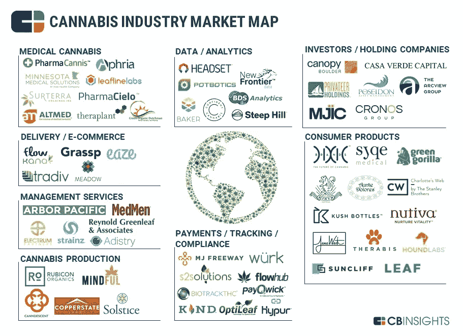

# 大麻行业的顶级初创公司

> 原文：<https://medium.com/swlh/top-startups-in-cannabis-industry-5089d72ee6c5>

初创公司正在寻找新的方法来为大麻企业量身定制创新。公司构建数字合规解决方案、数据分析工具和一系列消费产品。

# 医用大麻

像 [**PharmaCannis**](http://www.pharmacannis.com/il) 这样的公司生产或销售用于医疗目的的大麻。

**披露的融资额:**:4500 万美元

# 交付/电子商务

像 [**Eaze Solutions**](http://eaze.com/) 或 [**Flow Kana**](https://www.flowkana.com/) 这样的公司开发直接面向消费者的大麻交付促进平台或在线市场。

**披露的资金:**2450 万美元和 26 万美元

# **管理服务**

品牌管理公司 [**Strainz**](https://strainz.com/) 等公司为大麻产业提供商业管理服务。

**披露的融资额:**800 万美元

# **大麻生产**

种植用于娱乐或娱乐和医疗用途的大麻的公司。 [**Rubicon 控股**](https://rubiconorganics.com/) 就是其中之一。

**披露的融资额:**572 万美元

# 支付/跟踪/合规

诸如 [**Optileaf**](http://optileaf.com/) 或 [**Hypur**](http://hypur.com/) 等公司开发数字化解决方案来帮助订单和销售管理、支付处理、合规性保证以及种子到销售跟踪。

**已披露的融资额:**69 万美元和 618 万美元

# **消费品**

像 [**Jane West**](https://www.janewest.com/) 这样的公司生产并直接向消费者销售大麻制品或大麻配件。

已披露的融资额:80 万美元

# **投资者/控股公司**

这些是最活跃的以大麻为中心的投资公司和控股公司。 [**以克罗诺斯集团**](https://thecronosgroup.com/) 为例。

**披露的资金:**不适用

# **数据/分析**

[**Headset**](https://www.headset.io/) 等公司正在开发专门针对大麻行业的基于数据的商业和市场情报工具。

**披露的融资额:**143 万美元

[*娜塔莉亚·库库什金娜*](https://www.linkedin.com/in/natalia-kukushkina-b62397132/)

## 这个故事发表在 [The Startup](https://medium.com/swlh) 上，这是 Medium 最大的创业刊物，拥有 329，974+人关注。

## 在这里订阅接收[我们的头条新闻](http://growthsupply.com/the-startup-newsletter/)。

