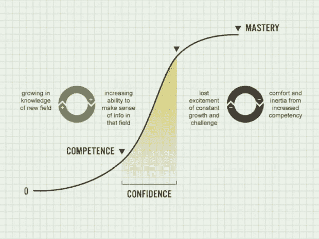

# 2018 年纽约世界商业论坛的主要收获

> 原文：<https://medium.com/swlh/top-takeaways-world-business-forum-nyc-2018-7d228a6c6918>

由世界商业思想(WOBI)组织的 2018 年[纽约世界商业论坛](https://www.wobi.com/wbf-nyc/)的主题是引领指数主义时代，该论坛聚集了来自世界各地的数百名商业领袖，从商业、经济、心理、科学、艺术和创新领域最具影响力的人物那里了解如何驾驭这一新的格局。

World Business Forum NYC 2018 Highlights

以下是令人难以置信的强大的 [#WBFNYC](https://twitter.com/search?q=%23WBFNYC&src=typd) 2018 的顶级收获，演讲者包括塞斯·戈丁、胡安·恩里克斯、惠特尼·约翰逊、莎拉·路易斯、丹尼尔·卡内曼、丹尼尔·戈尔曼、苏珊·大卫、托德·戴维斯、杰夫·伊梅尔特和阿里安娜·赫芬顿。

# TL；速度三角形定位法(dead reckoning)

如果你没有时间阅读整篇文章，这里有一个快速列表:

1.  **瞄准最小的可行市场，而不是最大的。赛斯·戈丁**
2.  有目的地创造一种文化，以便在网络经济中繁荣发展。赛斯·戈丁
3.  只有当我们创造艺术时，我们才能让改变发生
4.  **智能设计是下一次工业革命。—** 胡安·恩里克斯
5.  **时间+能力=无聊……而无聊的人不会创新。优化组织的学习曲线，打造创新团队。—** 惠特尼·约翰逊
6.  **创造力=(尊重开发过程+追求卓越——集体思考)x 毅力。莎拉·刘易斯**
7.  **通过延迟直觉和开发系统、客观的决策方法来改善决策。—** 丹尼尔·卡内曼
8.  **情商和认知控制对于高效学习、领导力和职业成功至关重要。丹尼尔·戈尔曼**
9.  领导的一个关键任务是帮助人们达到最佳认知效率和生产力的“心流”状态— 丹尼尔·戈尔曼
10.  不舒服是进入有意义生活的代价。发展情绪灵活性有助于我们在艰难的情况下坚持不懈，以实现目标、恢复力和幸福。苏珊·大卫
11.  我们看到的决定我们做的，我们做的决定我们得到的——所以戴上有用的眼镜。托德·戴维斯
12.  在动荡的时代，优秀的领导者必须有自己的观点，看到新的战略模式，采取果断的行动，消除恐惧，与团队建立联系，并拥有自己的叙述。杰夫·伊梅尔特
13.  在当今这个永远在线、技术互联的世界，我们必须记住人类的操作系统是不同的。离线停机对我们的健康和成功至关重要。— 阿里安娜·赫芬顿

# **1。瞄准最小的可行市场，而不是最大的。**

塞思·戈丁在互联网时代说过这样的话，

> “好消息是，现在地球上的每个人都可以成为您的客户。坏消息是——地球上的每个人现在都可能成为你的竞争对手。”

随着客户现在比我们知道得更多，我们必须更加努力地工作，通过个人关系赢得他们的信任和业务。

为了做到这一点，赛斯教了我们祖鲁语单词“Sowubana”，意思是“我看见你了”，并问道:

> *“还有什么比被人看见、被人理解、被人同情和拥有尊严更让人渴望的吗？”*

换句话说，人们非常渴望被理解，渴望成为某件事情的一部分。

赛斯对这种需求的回答？

> “我们所拥有的是一个向少数关心的人展示的机会，而不是打断那些不关心的人。你需要做的是挑选一小群迫切想要、需要和关心你的人。如果你出现在处于边缘的人面前，他们会选择听你的——走向边缘是我们构建可行事物的方式。”

# **2。有目的地创造一种文化，在连接经济中茁壮成长。**

赛斯向我们解释说，部落是由文化、思想或思维方式联系在一起的人群。历史上，人类有三个主要的部落:精神、工作和社区。但是现在，对于每一种兴趣和想法，都有数量呈指数增长的部落。

赛斯敦促我们“有目的地创造一种文化”，因为，

> *“有那么多脱节的人，他们渴望你来领导他们。”*

根据赛斯的说法，当我们走到一起时，我们创造了最大的价值(*“我们所有人都比我们任何人都聪明”*)。这导致了“连接经济”的兴起，它基于:

*   **协调**
*   **信任**
*   **权限**
*   **交换意见**

# **3。只有当我们创造艺术时，我们才能让改变发生**

赛斯也和我们分享了这个观察结果，

> “当实业家可以无视你的时候，他们就会走在前面。当每个人的行为都一样时，营销人员就会脱颖而出……我们所有人都被洗脑了，飞得太低了。为了安全起见。但你知道谁不会退缩吗？艺人不憋。”

营销人员的工作是创造故事，做出改变，让改变发生。正如赛斯所说，

> “我们只有在创作艺术的时候才能让改变发生。”

> “你的老板要求创新，但却说，‘失败不是一个选项。’对此唯一正确的回答是“那也不是成功。”因为所有的创新都是一次又一次的失败，直到你成功。"

关于时间，赛斯告诉我们，

> “总是太快了……准备好和准备好之间有着巨大的差异。做好准备就是要确定它会起作用。但艺术永远不确定。”

# **4。智能设计是下一次工业革命。**

胡安·恩里克斯解释说，

> *“你现在可以用给计算机芯片编程的方式给细胞编程。* W **我们现在正进入智能设计时代——下一次工业革命**，”

这将包括:

*   可编程的生命形式——你几乎可以制造任何东西。
*   **规模** —这个软件自己做硬件。你可以开始以更低的成本提高细胞的生产力。
*   **理论生物学**——将生物学领域从“让我们看看会发生什么”转变为“我想我知道会发生什么。”
*   **消费者授权** —医学将变得更加个性化。遗传学的发展比生物技术和制药要快。

Juan 与我们分享了一些新的发展和趋势:

> “今年你就可以打印细胞了。”
> 
> “今天，我们只花了大约 1%的医疗保健资金来改善健康，而不是治疗健康。这种情况将会改变。”
> 
> "医学可能会开始与食物和营养相结合来预防疾病."
> 
> “亚马逊收购全食超市并压低健康食品的成本，这简直是疯了？如果你考虑到健康食品对医疗保健的重要性，就不会了。”

Juan 还预测，未来成功的公司将专注于:

*   **大数据**
*   **个性化**
*   **生命科学**
*   **医疗费用控制**
*   **跨行业整合**
*   **消费者授权**

# **5。时间+能力=无聊…而无聊的人不会创新。优化组织的学习曲线，打造创新团队。**

惠特尼·约翰逊和我们分享了一个叫做 S 曲线的图表。她解释说，虽然 S 曲线通常用于可视化业务增长和市场渗透率(底部是转折点，中间是高速增长阶段，顶部是市场饱和)，但 S 曲线也可以通过查看我们的个人和组织学习曲线来帮助我们了解人们。

在学习 S 曲线上，底部是我们刚接触一个领域或一项技能的时候(学习，效率较低)，中间是我们通过接受挑战学习更多东西而获得能力和信心的时候(参与和效率最高)，顶部是我们达到精通的时候(最终变得无聊)。

Whitney Johnson’s learning S-curve diagram. Image source: whitneyjohnson.com

根据惠特尼的说法，

> “你组织中的每个人都在不断学习，包括你自己。你的组织是学习曲线的集合。你可以建立一个团队，通过优化这些学习曲线来创新。”

**对于您组织的最佳 S 曲线，您希望 15%在低端，15%在高端，70%在最佳点(中间)。**

那么，如何执行这种学习型 s 曲线策略呢？

1.  **从曲线低端的人开始:**

*   雇佣有潜力的人，而不仅仅是熟练程度。重视他们缺乏经验；
*   一旦你在曲线的低端雇用某人，有一个计划。

2.**一旦人们找到了学习的最佳点，给他们:**

*   更多约束；
*   更多的目标；
*   更多的摩擦；
*   不断增长的更多挑战。

**3。大多数人典型的学习 S 曲线是 4 年左右。在曲线的顶端:**

*   **延长曲线:**
*   原地跳跃——找个教练，多了解你所在的行业，等等。；
*   带着徒弟成为师傅；
*   接受挑战性的任务。
*   **跳转到新曲线:**
*   承担更大的职责或新的责任；
*   跳槽到一个新的行业。

Whitney 建议我们，在学习 S 型曲线的过程中，

> “你能给人们的最好回报就是学习的机会。做一个给人们力量去他们没去过的地方，过上最好生活的领导者。”

# **6。创造力=(尊重开发过程+追求卓越——群体思维)x 勇气。**

莎拉·刘易斯分享了她在研究历史上著名的创意人物后发现的创造力的三个共同特征:

*   这些人都专注于精通，而不仅仅是成功。这就要求他们关心可及范围和近在咫尺的胜利。
*   这些人在他们的创作过程中创造了一种违反直觉的风格，因为他们尊重发展的胚胎阶段。隐私对他们来说至关重要。
*   这些人非常坚韧。但是他们也知道什么时候该放弃。他们发展了一种柔软的耐力。

关于精通，莎拉解释道，

> "精通并不等同于成功，而是一种不断的追求."

“差一点就赢了”和“差一点就赢了”的力量推动着对掌控的追求。

关于创造力的培养，萨拉建议我们，

> “在你的组织中培养和发挥创造力，解决值得解决的问题，实现真正的创新。”

创造性的、创新性的解决方案经常是如此的违反直觉，以至于它们看起来是错误的。“群体思维”会扼杀创意。领导者培养创造力的一种常见方式是引入“干扰者”,故意阻止快速达成共识，鼓励更好地解决问题。

# **7。通过推迟直觉和发展一个系统的、客观的决策过程来改进决策。**

丹尼尔·卡内曼和我们分享了他在直觉研究中的一些重要收获，

> "直觉是自动产生的，具有很高的可信度，而且从统计数据来看，它经常是错误的."

> “很多人做决定的时候，决定第一；然后理由就来了。当把判断比作算法时，一般来说，算法有一半的时间做得更好。为什么？因为算法是无噪声的。当你给他们同样的问题两次，他们会给你同样的输出。人不是这样的。与人相处，判断有不一致性和不稳定性。”

那么，人们和组织如何才能做出更好的决策呢？丹尼尔建议道:

> **“尽可能接近算法来做出判断。拥有确保纪律和某种一致性的标准程序和思维方式，这样你就可以减少系统中的噪音。”**

**丹尼尔分享的一个重要决策原则是延迟直觉。**

> “如果你把直觉推迟到组织好所有信息之后，它会更好、更准确。决策的危险在于过早的直觉和结论。一旦你开始得出一个结论，剩下的时间基本上就浪费了，因为你会用它来证明你已经决定要做的事情。”

**在做商业决策时，运用“外部观点”也很有帮助。**“外部视角”练习包括思考过去与当前案例相似的案例，并查看这些案例中所发生事件的统计数据。然后，当你在看当前的案例时，你问*“我有一个好的理由来假设现在发生的事情会与过去类似案例中发生的事情不同吗？如果是，为什么？”*

**丹尼尔还建议企业领导人进行“事前分析”,作为最终决策过程的一部分。**

> “预分析是一种想法，即在尚未 100%做出决定的决策点，但很清楚风向是什么，然后你召集几个人，让他们在面前放一张白纸，然后你进行以下练习:
> 
> 假设我们做了那个决定并执行了，现在一年过去了，这是一场灾难。现在写下导致那场灾难的历史。"

基本上，它是在做出决定之前进行事后分析，以鼓励更好的决策。

> “人们倾向于乐观地做决策。这给了他们悲观的动机。这项工作可能不会改变最终的决定，但它将鼓励一个更稳健的决定和计划，以减少更多的潜在风险。”

# **8。情商和认知控制对于高效学习、领导力和职业成功至关重要。**

根据丹尼尔·戈尔曼(Daniel Goleman)提到的一项商业专业人士调查，91%的高管认为软技能和情商技能对领导力最为重要。在所有级别的所有工作中，情商的重要性是智商的两倍——你在公司阶梯上的位置越高，这种差距就越大。

正如丹尼尔所说，

> “领导力是通过他人把工作做好的艺术和手艺——你不能仅仅依靠智商做到这一点。”

丹尼尔和我们分享了情商的四个要素:

1.  **自我意识**

*   对自己的想法、感觉、动机和偏见的情感意识

**2。社会意识**

*   **移情在这里是一个关键因素。共情有 3 种:**
*   认知同理心——我理解你的想法；
*   情感共鸣——我理解你的感受；
*   移情关注——我关心你。
*   组织意识也很重要。
*   这包括与你周围的人的社会理解、联系和同步性。

**3。** **自我管理**

*   **情绪自控是自我管理的一个基本要素。这包括:**
*   弹性——达到巅峰状态后需要多长时间才能回到平静状态；
*   适应性——早期的适应性可以预测生活和事业的成功和满足感；
*   成就导向——喜欢度量、反馈和记录你做得如何；
*   成长心态——积极的观点，寻求挑战，并总是寻找改进的方法。

**4。关系管理**

*   影响力；
*   冲突管理；
*   辅导和指导——领导者的任务之一是培养新的领导者；
*   团队合作——高绩效团队拥有集体情商。

Daniel 还建议我们立志发展一种鼓舞人心的领导风格，因为我们的领导风格对文化有很大的影响(无论是好是坏)。丹尼尔按照从积极到消极的顺序为我们列出了所有最常见的领导风格。

1.  **远见卓识** —巨大的积极影响

*   提供长期方向和愿景

**2。辅导** —巨大的积极影响

*   发展员工的长期发展

**3。附属** —较小的积极影响

*   创造和谐的工作关系

**4。民主**——较小的积极影响

*   通过协作建立承诺

**5。树立榜样** —负面影响

*   推动完成任务

6。指挥——负面影响

最后，丹尼尔给我们留下了这些领导力发展步骤，作为我们领导力发展旅程的一部分:

1.  **动机**
2.  **支持**
3.  **评估**
4.  **学习计划**
5.  **练习**

# **9。领导的一个关键任务是帮助人们达到最佳认知效率和生产力的“流动”状态。**

丹尼尔还解释了大脑活动和表现之间的联系。

根据丹尼尔的说法，如果大脑活动太低(无聊)或太高(压力)，表现就会很差。如果大脑活动处于中间，表现是最佳的——这被称为最佳认知效率，或者更普遍地被称为“心流”。

> “不管你有什么技能，你都是在将技能发挥到极致。这是每个人都想去的地方。领导的任务就是帮助人们进入并保持最佳状态。”

关于帮助你的团队实现“心流”，丹尼尔分享了这些可行的技巧:

1.  **给出非常明确的目标；**
2.  让那个人以自己的方式自由到达目的地——不要微观管理；
3.  **提供即时的绩效反馈；**
4.  **挑战人们的技能组合。**

# **10。不舒服是有意义生活的代价。发展情绪灵活性有助于我们在艰难的情况下坚持不懈，以实现目标、恢复力和幸福。**

像 Seth Godin 一样，Susan David 也以 Sowubana(会议上的一个流行主题)的定义开始了她的情感灵活性会议，Sowubana 的意思是“我看到你了”，这是他们在南非打招呼的方式，Susan 是哪里人。

苏珊接着提出了这个问题，

> “看我们自己需要什么？我们爱、生活、养育和领导的方方面面——我们认为我们做的每件事都是好的或坏的，积极的或消极的。这种僵硬是有毒的。”

据苏珊所说，

> “人们倾向于对我们的感觉和情绪保持僵化——总是紧紧抓住自己，而不是呼吸到这个世界……当我们试图压抑自己的情绪时，它们会变得更强烈……当我们抛开正常、自然的人类经验时，我们就无法发展出应对现实世界的技能，而不是按照我们希望的那样。”
> 
> “我们为自己的感情寻找合理的出路。但我们不能简单地分析和合理化，并判断我们如何摆脱生活中一些最困难的情况……当我们看到自己时，我们更有可能也更有能力看到别人。”

苏珊解释说，情感敏捷与更高水平的目标实现、弹性和幸福感相关。

> “彻底接受我们的情感是真正改变的基石。当我们超越好情绪和坏情绪的概念，转而开始接受人们需要将人性的完整性带到工作场所的想法时，我们就实现了敏捷性。”

根据 Susan 的说法，我们可以遵循以下步骤来发展情绪灵活性:

1.  **露面。**
2.  **验收和准确性。**

*   摒弃人们应该如何感受的观念，拥抱人们的真实感受。

**3。练习自怜。**

*   从思想和情感中学习。

**4。出去。**

*   情绪是数据，而不是指令。

**5。带着好奇心和勇气去注意。**

*   “我看你”和“我同意你”是不一样的

**6。放手吧。**

**7。走你的为什么。**

*   远离“不得不”的目标，转而思考我们的价值观和我们“想要”做的事情。

**8。向前看。**

Susan 以分享结束了她的会议，

> “价值观并不相互排斥。我们可以珍惜我们的事业和家庭。最常发生冲突的不是我们的价值观，而是我们的目标。当我们的目标发生冲突时，我们可以开始权衡特定情况下的利弊……我们有机会思考我们想要成为什么样的人，这让我们能够提升我们为什么成为什么样的人。”

# **11。我们看到的决定我们做的，我们做的决定我们得到的——所以戴上有用的眼镜。**

根据托德·戴维斯的说法，

> “我们依靠他人来实现自己的个人成功，但我们无法控制他人……因此，领导者可以培养的最重要的能力是我们的影响力——当你从自己做起时，这是最有效的。”

托德对发展你的领导能力和影响力的最重要的建议是:**戴有用的眼镜。**

> “我们所看到的决定了我们所做的一切。我们所做的给了我们所得到的结果。”

“戴上有用的眼镜”是指看到事物的本来面目，而不是我们如何说服自己。

他解释说，这一切都归结于我们每个人看待世界的个人范式——这可能会扭曲我们体验生活的方式。但是背景很重要。

> “一旦你看到事情的本来面目，你就会采取不同的行动，看到不同的结果。”

为了强调我们的范式如何影响结果，托德分享了一个他和女儿一起训练马拉松的故事。托德的女儿是聋子，她试图融入学校。他已经完成了他的第一次马拉松，并准备开始第二次训练，所以他叫他的女儿加入他。

第一周她做得不错，但第二周她说太难了，于是她退出了。在内部，他认为这是一件好事，这样他就可以专注于自己的训练。那一年，他错过了自己的马拉松时间目标，女儿还在苦苦挣扎。

下一场马拉松来了，他邀请她再次加入。这一次，她坚持了一会儿，但几个星期后她又恢复了平静。那一次马拉松来了又去，他又错过了目标，女儿还在纠结。

当下一次马拉松来临时，托德注意到同样的结果一次又一次地发生在他们身上。所以他退后一步，意识到他一直用错误的眼光看待他的女儿。在过去，因为他试图激励她，但也关注自己的时间，他会绕着她跑。那并没有真正激励她。

所以他决定尝试一些新的东西。这一次，他一直跟在她身边，她一周又一周地坚持训练。终于到了一起赛跑的时候了。一英里又一英里，他的女儿开始跑得越来越快——比他们训练时的速度快得多。他们一起冲过了终点线，比他们以前训练过的速度要快得多。

这在托德心中植入了通过不同的视角看待人们的价值观，并看到他们真正的能力——这永远改变了他的人际关系。

托德问 WBFNYC 的观众，为什么我们有时会犹豫是否考虑不同的范式。与会者提出的一些最常见的答案包括:

*   **对未知的恐惧**
*   **自我**
*   **体验**
*   **信任**
*   **判断**
*   **舒适性**

最后，托德给我们留下了一些建议，告诉我们如何在日常生活中应用“戴上有用的眼镜”的概念。

> “找出一个不像你希望的那样理想的情况或关系。列出所有你认为导致这段关系不如你所愿的事情。现在，回过头来圈出所有你认为是真实的事实(其他人也会认为是事实)。把事实和信仰分开。”

# **12。在动荡时期，优秀的领导者必须有自己的观点，看到新的战略模式，采取果断行动，消除恐惧，与团队建立联系，并拥有自己的叙述。**

杰夫·伊梅尔特(Jeff Immelt)向我们讲述了他在全球动荡时期担任通用电气(General Electric)首席执行官 16 年来学到的一些领导力课程。杰夫认为，在动荡时期，优秀的领导者:

1.  **得有观点**

*   知道你代表什么。知道如何获得成功。

**2。参见新模式**

*   系统思维(横向)
*   物理世界和分析世界的碰撞
*   不是创新的数字化转型(流行词)，而是释放新水平的生产力和成果(下一代创新和生产力)

**3。构建基于系统的战略**

*   **创新**
*   技术—4a(自动化、人工智能、增材制造、分析)
*   商业模式
*   **值**
*   客户(基本)
*   生态系统(加速)——合作伙伴、供应链、网络效应
*   **语境**
*   工作的未来(启用/破坏)——始终考虑战略对您的团队和公司的影响

**4。雇佣人才**

**5。从下往上看**

**6。适应不确定性**

**7。采取行动&执行**

*   **在各个层面倾听**
*   寻找在你的组织中传播的声音
*   **自己看**
*   不要遵循传统智慧
*   **通过复杂性操作**
*   浏览政治和商业系统
*   **改变**
*   过程改变——在别人做错的地方改进
*   个人改变——修正自己的错误

**8。吸收恐惧**

*   把它扛在肩上，面对彻底的改变，保持对团队的乐观
*   在受到打击时保持领先，在困境中保持乐观

**9。培养一个思想、行动和背景多元化的领导团队，包括:**

*   分析师—规划和损益
*   运营商—业务优化者
*   建设者——冒险者和底层。这些类型的人需要其他两类人的保护才能做好他们的工作。

10。与团队联系

*   **人脉对文化至关重要**
*   了解人们如何工作
*   非正式性和准入

11。拥有你的叙述

*   你必须看到好的一面和坏的一面，真实完整地讲述你公司的故事

# 13。在当今这个永远在线、技术互联的世界，我们必须记住，人类的操作系统是不同的。离线停机对我们的健康和成功至关重要。

阿里安娜·赫芬顿在本次活动的闭幕主题演讲中首先与我们分享了一个关于“成功”给她生活带来的个人代价的故事。

> “创办《赫芬顿邮报》两年后，作为两个十几岁女儿的离婚母亲，我因疲惫和睡眠不足而崩溃，颧骨骨折，几乎失去了右眼。”

> “我做了所有这些医学测试来找出我的问题，结果只有一个医生告诉我——Arianna，你得的是一种文明的疾病——倦怠。药物对你无能为力。你必须改变你的生活方式。”

> 现在，我们比照顾自己更好地照顾我们的智能手机。我敢打赌，现在，这个房间里的每个人都知道你的手机还剩多少电池。但是我倒下的那天，如果你问我过得怎么样，我可能会说我很好。"

在 Arianna 跌倒后，她有一个痛苦和紧急的警钟。就在那时，她开始研究幻觉，为了成功，你必须耗尽精力。

> “自从我改变了习惯，我比以往任何时候都更有效率。更重要的是，我比以往任何时候都更享受生活。”

Arianna 分享说，当她筋疲力尽、精疲力竭时，她并不真正喜欢自己或她所做的决定。她的新健康公司 Thrive Global 试图通过引入一系列“微步骤”来解决这个问题。

> “创造可持续行为改变的方法是通过小的、渐进的、日常的改变。在这些微小的步骤上，我们的座右铭是“小而不倒”。每当你想开始新的东西时，从小处着手——这样你就不会失败。如果你想开始锻炼，不要说你要开始锻炼一个小时。假设你要开始锻炼 5 分钟。然后后来再去 10 分钟等等。”

Arianna 说，我们可以采取最关键的微小步骤来帮助我们在生活中走向繁荣，

> “我希望这里的每个人现在都不要抱着手机睡觉。这只是一个可怕的习惯…智能手机才 10 岁。我们只是发现了这项技术意想不到的后果。”

> “科学表明，如果你在看手机之前，哪怕只花一分钟来呼吸、思考、设定一天的目标，你会更快乐。与其回应这个世界对你的要求，不如从设定自己一天的目标和日程开始。”
> 
> “我们需要保护自己免受手机的伤害。让我们面对它；我们都上瘾了。让我们承认我们都是手机迷…如果你是个酒鬼，你不会在床头柜上放一个瓶子。所以如果你对手机上瘾，你就不能把手机放在床头柜上。”

# **我的个人心得:**

这是我第一年参加世界商业论坛，这次经历远远超出了我的预期。从这次活动中得出的大量可靠且可行的建议几乎可以应用到我的个人生活和领导生涯中。几个星期后，我仍然发现自己充满活力，并受到鼓舞，继续对演讲者提出的观点进行额外的研究。

到目前为止，阿里安娜·赫芬顿的演讲对我影响最大。像 Arianna 一样，几年前我也有过自己的警钟。当我每周工作 70-100 小时，经营一家快速增长的科技初创公司，并处理与商业伙伴的激烈冲突时，我开始经历健康问题的冲击，包括持续数周的偏头痛和因疲惫而晕倒。在一系列昂贵的测试后，我的医生告诉我和 Arianna 一样的事情——来自我工作和生活方式的压力导致了我的大多数健康问题。

于是在 2015 年，我卖掉了自己所有的东西，买了一个背包，开始了一年的自我发现和成长，同时独自环游世界。那次旅行标志着我更有目的地生活的旅程的开始，听到 Arianna 分享她在当今高度互联的世界中寻找平衡的努力，真的引起了我的共鸣。

阿里安娜开始限制屏幕时间的建议尤其鼓舞人心。按照她的建议，我开始在 iPhone 上使用新的“屏幕时间”功能来跟踪我每天和每周花在手机上的时间，并很快意识到我认为只是一个小问题的东西实际上是一个全面的成瘾。

我不会分享我花在手机上的时间，因为坦率地说，这很尴尬。这么说吧，这足以让我想要重新评估我度过时间的方式——这最终也是我度过生命的方式。从 WBFNYC 开始，我就用苹果的屏幕时间功能在手机上实施了社交媒体限制。我仍然比我希望的更多地使用我的手机，但是每周我使用它的次数都在减少。(另外，如果你是安卓用户，Arianna 分享说 Thrive Global 推出了一款与安卓手机屏幕时间功能类似的应用，可在谷歌应用商店购买)。

突然间，我发现自己有了更多的时间和精力去做更多我一直想做但以前“从来没有时间”去做的事情。仅在上周，我就加入了印第安纳波利斯全美有色人种协进会青年委员会，担任他们气候正义倡议的领导者，为 2019 年全年建立了全面的个人现金流预测和财务计划，并启动了一项重返大学的计划。所有这些都是在我全职担任 steric cycle Environmental Solutions 的营销策略师，并协调和参加几次与朋友和家人的节日聚会之外完成的。谁知道在接下来的一年里，当我继续减少我的屏幕时间时，我还能把我的时间和精力用在什么事情上呢？可能性是如此令人兴奋！

我还是没有开始睡觉的时候手机不在床边(对不起，Arianna！)，但是，我完全打算在未来几周内将这个习惯付诸实践——以及其他几个“微步骤”，以在 2019 年改善我的健康和福祉。

Sarah Lewis 关于发展创造力的建议和 Seth Godin 关于通过创造艺术来做出改变的建议是另外两个领域，我已经看到自己在处理策略和解决问题的方式上做出了重大改变。随着我在未来一年开始实施和测试来自 WBFNYC 2018 演讲嘉宾的强大建议，我期待在我的工作和生活中看到更多积极的结果。

非常感谢 WOBI 邀请我采访今年的会议，也非常感谢所有演讲者分享他们的宝贵经验和智慧。希望我能在 2019 年再次参加！献给我在 WBFNYC 遇到的所有可爱的人，以及所有阅读这篇文章的人，祝你们在新的一年里茁壮成长，情感敏捷，创造力，同理心，学习，健康的挑战，追求卓越，持续成长。

**Sowubana，朋友们。**

*原载于 2018 年 12 月 23 日*[*【www.rocket-strategy.com】*](https://www.rocket-strategy.com/top-takeaways-world-business-forum-nyc-2018/)*。*

## 这篇文章发表在 [The Startup](https://medium.com/swlh) 上，这是 Medium 最大的创业刊物，拥有+402，714 名读者。

## 在这里订阅接收[我们的头条新闻](http://growthsupply.com/the-startup-newsletter/)。

