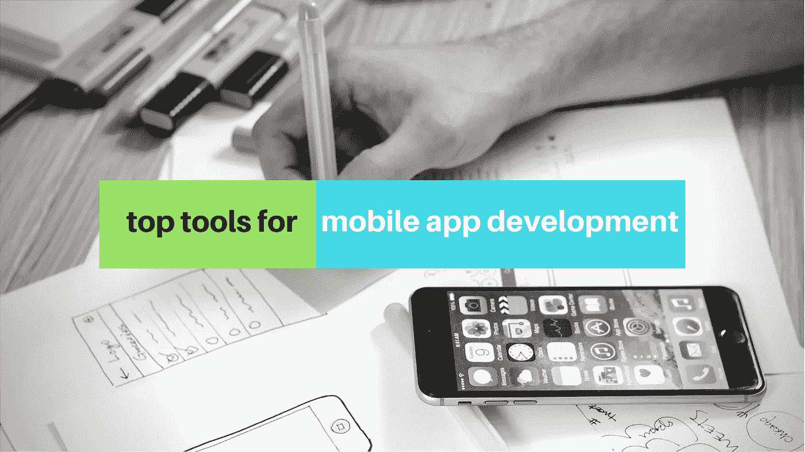
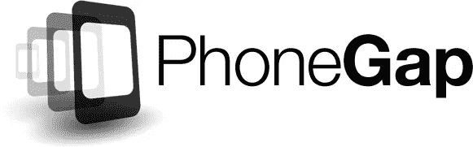
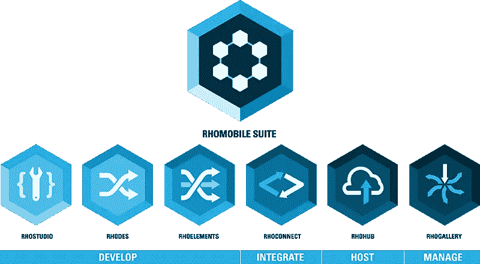
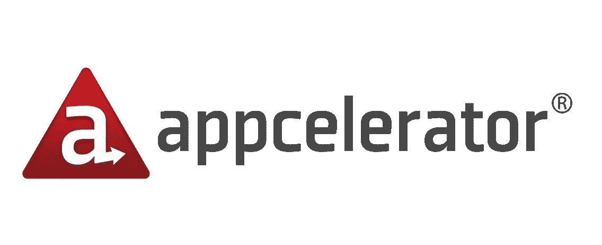
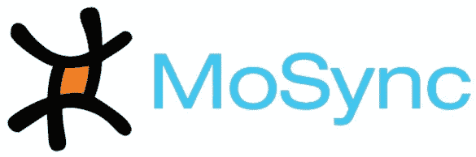
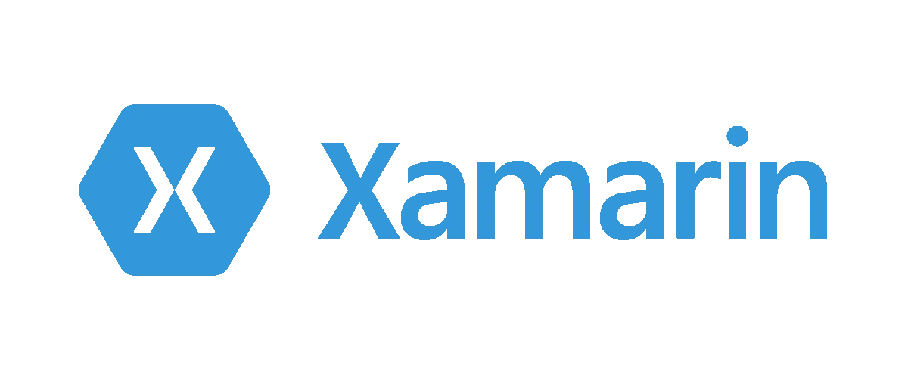

# 移动应用开发的顶级工具

> 原文：<https://medium.com/swlh/top-tools-for-mobile-app-development-1e1bd9d1f247>

我们被选择宠坏了，被工具淹没了。仅仅是对所有这些进行分类本身就像是一项工作。让人应接不暇。我们明白了。我们都知道每个平台都有其独特的功能、特性和行为。然而，今天每个人都在涉足多平台应用程序，所以当构建跨格式应用程序时，你需要找出什么最适合你。而这并不需要耗费你所有的资源来一次开发几个平台。幸运的是，市场上有一堆令人惊叹的多平台开发工具。下面是我们可以依靠的设备列表。

# PhoneGap

PhoneGap 允许开发人员为 Android、iPhone、Symbian、Palm、BlackBerry、iTouch 和 iPad 设备开发应用程序，并使用设备硬件功能，如 GPS/定位、加速度计、摄像头、声音等等。Adobe 的产品，你可以用它来翻译 CSS、HTML5 和 JavaScript 的代码。这个平台使用标准的 web 开发语言，比如 JavaScript 和 HTML。PhoneGap 还提供 Adobe AIR 应用程序和在线培训课程，以帮助我们访问原生 API 并在他们的平台上构建移动应用程序。这个开源平台使得构建跨平台应用程序变得更加容易。如果您的移动应用程序在性能方面不依赖于设备的原生功能，这个工具将最适合您。唯一的限制是它不适合图形密集型应用。

# RhoMobile

RhoMobile 附带了一个基于 Ruby 的开源框架，称为 Rhodes。这使得开发人员能够构建以数据为中心、跨平台的原生应用程序，涵盖广泛的操作系统和智能手机。它的结构与 PhoneGap 非常相似。操作系统包括 Symbian、iPhone、Android、Windows Mobile 和 RIM，这几乎涵盖了所有操作系统。Ruby 加入了它现在的 web 技术，比如 HTML5，CSS3，JavaScript。此外，RhoMobile 提供的这个框架只需要编写一次代码。然后，您可以使用这些代码为大多数主流智能手机构建应用程序。为了快速、轻松、准确地完成工作，本机应用非常适合与可用的硬件配合使用。RhoMobile 还配备了一个托管开发环境 RhoHub 和 RhoSync，以保持用户手持设备上所有应用程序的最新数据，这些设备可以作为独立的服务器使用。

当涉及到保护您的数据时，如果您担心不得不自带设备(自带设备)，自动数据加密将大大缓解这种担忧，其对象关系映射器允许后端数据的自动同步。它支持应用程序同步和离线数据访问。然而，它缓和了 Windows Mobile/CE 的射频识别(RFID)插件。如果它更加开源的话，它会更受欢迎。

# 加速器

这个由 Twitter 强大粉丝支持的 Titanium 开发平台可以帮助你在 JavaScript、HTML、PHP、Ruby 和 Python 等 web 编程语言的帮助下开发本地移动、平板和桌面应用。如今，它每月为一千多个本地应用提供支持。Titanium 的一个伟大之处在于，它让您可以轻松访问 300 多个位置信息和 API，以及可定制的事件和动作指标。你可以将所有应用程序数据存储在设备上或云中，这些应用程序可以完全基于硬件。它还具有令人印象深刻的应用使用洞察，可以轻松监控您的应用性能。Appcelerator 非常适合那些利用基于 web 的技能集同时进行多操作系统应用程序开发的组织。我们遇到的一个缺点是它的支持团队，他们反应很慢，尤其是开发人员社区。

# 同步

基于标准 web 编程的 MoSync 是另一个多平台移动应用程序开发 SDK(软件开发工具包)工具。这包含了集成的库、编译器、设备配置文件、运行时和其他有用的工具。虽然 MoSync 已经支持 PHP、JavaScript、Python、Ruby 和其他类似的语言，但它现在包含了用于 C/C++编程的基于 Eclipse 的集成开发环境。MoSync 提供了对一系列操作系统的支持，包括 Android、Windows Mobile、Moblin、Symbian 和一个移动 Linux 发行版。随着 MoSync 2.4 的发布，对黑莓和 iPhone OS 的支持即将到来。

# Xamarin

Xamarin 是一个 C#代码库，与其他框架不同，它允许我们使用本机 ide、API 和语言。它可以普遍应用于多种平台，而 Git 集成内置于 Xamarin Studio 中。Xamarin 支持各种设备的质量监控和功能测试。它配有安卓模拟器。此外，为了帮助您快速入门，Xamarin 提供了一些示例应用程序。你可以在流行的移动平台上分享大约四分之三的代码。因此，使用 Xamarin，您不仅减少了开发成本，还缩短了上市时间。然而，iOS 和 Android 的开源库普遍存在兼容性问题。这是 Xamarin 必须解决的问题，以鼓励大型项目的开发。

# 单交

Monocross 是一个跨平台的开源移动框架，它利用 C#、Microsoft.NET 和 Mono 框架为 Android 智能手机和平板电脑、iPads 和 iphone、Windows Phone 以及支持 Webkit 的设备开发多平台支持的应用程序。人们可以保留跨各种平台的应用程序、模型和控制器的编码，同时通过调整平台容器和视图，即用户界面，努力在所有主要平台上提供本机体验。此外，它使应用程序移植更加容易，帮助企业应对平台的快速变化。然而，互联网上对 Monocross 的文档、资源和支持很少，这使得使用这个框架开发应用程序的工作变得更加困难。另外，如果你是初学者，你可能会对它的可用性和特性感到困惑，因为网上几乎没有可用的文档和支持资源。

*原载于 Product Insights 博客来自*[*cognitive clouds*](https://www.cognitiveclouds.com)*:Top*[*移动应用开发公司*](https://www.cognitiveclouds.com/custom-software-development-services/mobile-app-development-company)

## 这个故事发表在 [The Startup](https://medium.com/swlh) 上，这是 Medium 最大的企业家出版物，拥有 294，522+人。

## 在这里订阅接收[我们的头条新闻](http://growthsupply.com/the-startup-newsletter/)。

