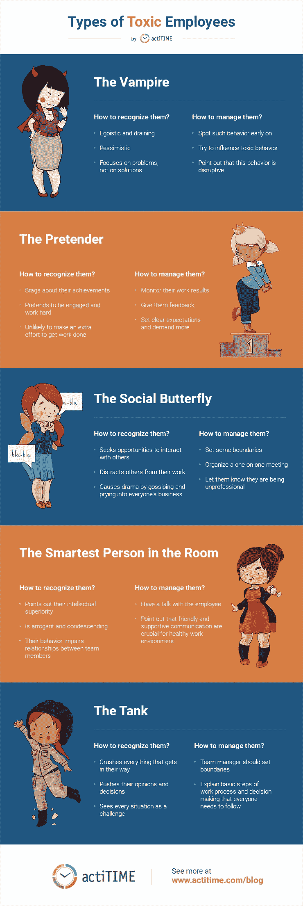

# 有毒员工及其管理

> 原文：<https://medium.com/swlh/toxic-employees-and-how-to-manage-them-3ec1f4388470>

Photo by [Frank Busch](https://unsplash.com/@frankbusch) on [Unsplash](https://unsplash.com/)

在日常生活和工作中，我们有时不得不面对控制欲强、令人厌烦、不支持我们的人，或者，一句话，有毒的人。他们消极的态度、过度的反应和曲解的倾向招致了戏剧性的事件，甚至使处理常规情况变得困难。

完全避免与有毒的人交流并不总是一个选择。尤其是在工作中，他们可能是出色的员工，但仍然会对工作环境产生负面影响，破坏团队合作。然而，它们的毒性可以而且需要得到控制。

我们现在来看看有毒员工的主要类型，以及如何更好地管理他们的一些建议:

# 有毒员工的类型

## 吸血鬼

吸血鬼是一个自私自利、耗尽精力且经常控制欲强的人。他们通常消极悲观，倾向于关注问题，而不是解决方案。所有这些都吸走了周围每个人的积极性，创造了一个消极的环境。

团队和项目经理应该尽早发现这种行为。不要指望他们会改变态度，而是努力影响他们的行为。向他们指出，他们的消极态度和操纵行为是不专业的，会破坏工作环境。

## 伪装者

伪装者对工作环境的危害并不大，但它会破坏对团队的信任。

让自己整天忙忙碌碌，吹嘘自己的成就(不一定高于平均水平)，假装很投入，努力工作，伪装者实际上不太可能付出额外的努力来完成工作。

更重要的是，当其他员工意识到这样的人在做什么时，他们的工作生活在他们眼中会显得苛刻和不公平，他们可能也会开始懈怠。

这些员工可以通过跟踪工具进行监控。你需要确保他们在工作时间专注于手头的任务。不要害怕给他们反馈，设定明确的期望，并开始对他们要求更多。

## 交际花

这种人会寻找一切可能的机会与他人互动——大多与工作无关。

在你的团队中有一个交际花的好处是，这个人倾向于在工作时间之外组织各种活动。但是，他们也倾向于分散别人的工作，开玩笑，通常通过闲聊和刺探每个人的事情引起戏剧。

是时候设定一些界限了。与交际花的一对一会面是必须的。你应该让他们知道他们是不专业的和分散注意力的——特别是如果他们倾向于传播流言蜚语。

## 房间里最聪明的人

另一种类型的有毒员工是最聪明的，他们永远不会忘记指出他们的智力优势。虽然仅仅是聪明是错误的，但当傲慢和优越感开始影响团队沟通时，有害行为就会出现。这可能会破坏工作环境，损害团队成员之间的关系。

为了防止这种情况，与这种类型的员工交谈，并指出友好和支持性的沟通对于健康的工作环境和对团队的信任至关重要，这反过来对于实现团队的目标也很重要。

## 坦克

就像一辆真正的坦克一样，这个人碾碎一切挡路的东西——或者至少努力做到这一点。他们推动自己的意见和决定，即使他们没有立场，往往是傲慢的，并认为每一个情况下，他们可以赢或输的挑战。

同样，团队经理应该设定界限，如有必要，向此人解释每个人都需要遵循的工作流程和决策的基本步骤。

# 摘要

管理有毒的人通常是具有挑战性的，但幸运的是有办法处理工作场所的有毒行为并改善工作环境。了解上面提到的有毒员工的类型将有助于你处理你所面临的情况。

## 这篇文章发表在《初创企业》杂志上，这是 Medium 最大的创业刊物，拥有 335，210 多名读者。

## 订阅接收[我们的头条新闻](http://growthsupply.com/the-startup-newsletter/)。

