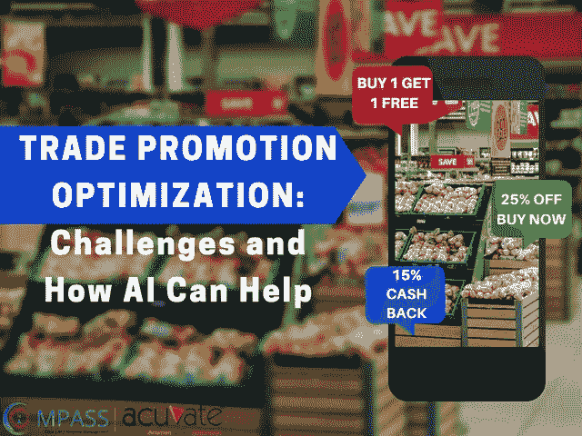
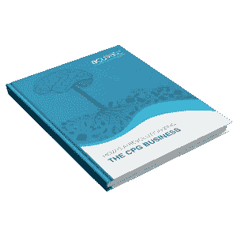

# 贸易促进优化:挑战和人工智能如何帮助

> 原文：<https://medium.com/swlh/trade-promotion-optimization-challenges-and-how-ai-can-help-8f4834180844>

> *40%的* [***CPG 贸易推广***](https://acuvate.com/compass/solutions/by-business-need/trade-promotion-optimization-management/) *支出没有推动预期结果—尼尔森控股*

*   在一个特定的时间段和特定的产品，零售商在一个地点的表现如何？
*   BOGO vs 半价——我应该申请什么，在哪里申请？
*   我过去的贸易推广有什么效果？它会在不同的产品或场景中再次发挥作用吗？
*   我的竞争对手如何优化他们的促销活动，他们的促销日历是什么样的？
*   如果我在接下来的 6 个月里保持品牌 A 的基本价格，并在接下来的 1 个月里推广品牌 B 的 BOGO，我的预测销售额是多少？

这些只是整个消费品行业的决策者( [**CPG**](https://acuvate.com/bi-for-fmcg/) )为了优化他们的促销活动而每天面临的数百个问题中的一小部分。事实的真相是，与其他行业相比，消费品行业的 5Ps 营销具有难以想象的多样性和复杂性。这使得全面的 360 度数据驱动的决策几乎是不可能的任务。

有各种来源的可用数据——零售商、数字媒体、尼尔森和其他数据经纪人、过去促销的数据等等。为了了解和优化下一季度或下一季度的促销活动，您打算获取、利用和分析多少信息？

您如何为每种产品、区域和 SKU 选择最佳组合，以便在给定的预算限制内创造销量、销售额、利润和其他众多重要参数最大化的促销？

[**Download the free eBook: How AI is revolutionizing the CPG Business**](https://acuvate.com/ebook/how-is-ai-revolutionizing-the-cpg-business/)

你如何识别和开展最划算的促销活动？

消费品制造商继续将其预算的很大一部分用于管理促销和降价，作为与零售合作伙伴协作的一部分。— [高德纳公司](https://www.gartner.com/doc/3587241/market-guide-trade-promotion-management)

## 消费品行业的贸易促销优化——典型场景和挑战

*   **数据可用性挑战**

大多数制造商通常依靠像尼尔森和 IRI 这样的联合数据经纪人来设计促销策略。虽然这些数据仍然是必不可少的，但仅仅依靠这些数据并不能提供对现实的整体看法。

**阅读更多:** [数据经纪人:消费品公司如何实现 ROI 最大化](https://acuvate.com/blog/data-brokers-can-consumer-goods-companies-maximize-roi/)

*   **数据格式不正确&表格**

决策者要么仍然依赖于无尽的电子表格来了解促销数据，要么使用不合标准的贸易促销优化分析和软件工具，这些工具具有浅薄的仪表板和洞察力。他们还被迫访问来自多个系统的数据，以获得全面的信息。所有这些做法都使数据消费复杂化，并且很难整合到日常决策工作流程中。

*   **高度依赖于找到熟练的船员**

每天访问数据和生成定制报告的另一个臭名昭著的障碍是对 IT 服务或 MIS 团队的高度依赖。业务用户不能自己定制仪表板，必须依赖这些团队来获得新报告或更新旧报告。

*   **缺少/困难的假设分析**

许多贸易推广策略的制定包括预测和准确预测“如果 X 发生了会有什么影响”或“如果我为一棵摇钱树进行 BOGO 推广，我的投资回报率和销售额会有什么影响”。然而，一些贸易促进工具和软件缺少这种类型的深入分析，或者提供不能提供真正商业价值的一般性分析。

*   **新计划基于直觉或部分智力**

由于缺乏足够的数据、低效的数据协调和预测智能，组织无法衡量贸易促销的有效性。因此，缺乏对即将到来的贸易促销的数据支持的优化——要么进行轻微的改变，要么什么都不做。决策者求助于从过去的经验、本能或部分智力中学习。阅读更多关于[人工智能驱动的贸易促进优化解决方案指南针](https://acuvate.com/blog/trade-promotion-optimization-challenges-ai-can-help/)。

## 这个故事发表在 [The Startup](https://medium.com/swlh) 上，这是 Medium 最大的创业刊物，拥有 328，729+人关注。

## 在这里订阅接收[我们的头条新闻](http://growthsupply.com/the-startup-newsletter/)。

