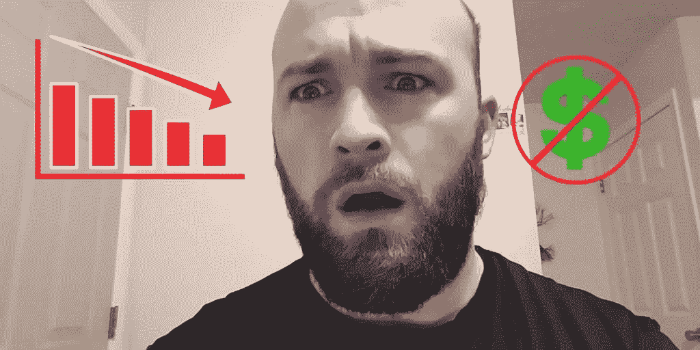

# 交易密码:我在第一个月学到的你需要知道的事情

> 原文：<https://medium.com/swlh/trading-cryptos-things-i-learned-in-my-first-month-that-you-need-to-know-1ff761a6a7b2>

注意:这不是财务建议。自己做研究！希望通过阅读这篇文章，你可以避免我早期犯的一些错误，但是要自己做决定(祝你好运！). [*在 Steemit*](https://steemit.com/bitcoin/@michaelluchies/trading-cryptos-10-things-i-learned-in-my-first-month-that-you-need-to-know) *上可以看到完整的原帖。*

多年来，我知道比特币和加密货币，多年来，我坐在一旁看着硬币的价值越来越高。上个月，我不再找借口解释为什么我没有购买任何加密货币，我开始用非常有限的知识和几百美元进行交易。

我最初决定在 Ripple (XRP)股价为 0.20 美元时投资几百美元。当我在想如何让一个朋友帮忙购买 Ripple 时(我等了几个星期)，它攀升到了 0.80。最后，我进去了，得到了我的 XRP 股票。我看到价格来回波动，担心价格会回落到原来的水平，这样我就没有多少钱可以投资了。我开始把我的钱转移到其他硬币上。价格再次上涨。我从 Ripple 换了更多的钱，等待价格回落。当我写这篇文章的时候，XRP 现在是每枚硬币 2.2 美元，你可以想象，我并没有通过用 Ripple 换其他硬币而赚到三倍的钱。

这是我第一个月学到的许多教训之一。以下是我在第一个月学到的十条经验:

# 提前设定你的目标

无论你在生活中做什么，你都应该首先设定你的目标，了解达到这些目标需要什么，制定一个计划，然后执行。在跳入加密货币的所有兴奋中，我没有目标或计划，我只是想进去！

我的一个朋友，也是我认识的一个更有经验的交易者，他有非常明确的目标(赚足够的钱来偿还一定数量的债务)。一旦他们见面，他会卖掉他投资组合中的东西，并对结果非常满意。这并不意味着他再也不会交易了，但是通过设定这些具体的目标，他消除了所有的“如果”,以及在买卖时做什么的不确定性。

我现在有了目标，虽然我仍然会犯很多错误，但这些目标，而不是恐惧或直觉，将指导我的决定。

# 不要混淆短期收益和长期潜力

我们处在加密货币的狂野西部。当涉及到未来的潜力和价值时，没有人应该相信的硬币在几天或几周内增加了 10 倍。将短期收益与长期潜力分开很重要。一枚硬币今天涨了 50%，并不意味着一年后(甚至是下个月)它还会在这里。在投资一枚新硬币之前做好研究。

在创建你的目标和投资加密货币时，我给你的建议是努力思考一枚硬币的长期潜力，而不是它在过去几天的表现如何。如果你不相信一枚硬币，不要只是投资它，因为其他人都相信。与此同时，如果你相信一枚硬币，你可能会坚持你的投资，而不是试图在一天内变得富有。几天后，我卖掉了我的 XRP，投资了一种看起来正在腾飞的另类硬币。正因为如此，我错过了 100%的收益。

# FOMO(害怕错过)可能很贵

老实说，如果不是比特币的成功，我们很少有人会投资加密货币。我错过了巨大的收益，继续阅读一个又一个关于人们致富的故事。我把钱准备好了，买了一些比特币！呜哇，我加入了。比特币随后下跌了 30%。我赔钱了，因为我担心我会错过更大的收益。

我现在正在跟踪硬币的运动，研究它们，等待合适的时机购买，而不是把钱扔进加密货币，因为我担心它会在没有我的情况下起飞。

# [**在 Steemit**](https://steemit.com/bitcoin/@michaelluchies/trading-cryptos-10-things-i-learned-in-my-first-month-that-you-need-to-know) 上阅读全文

## 这篇文章发表在[《创业](https://medium.com/swlh)》上，这是 Medium 最大的创业刊物，有 293，189+人关注。

## 在这里订阅接收[我们的头条新闻](http://growthsupply.com/the-startup-newsletter/)。

