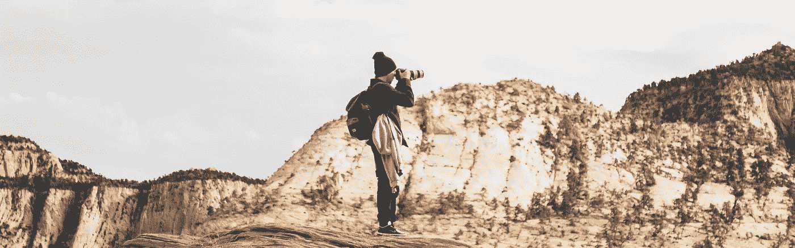
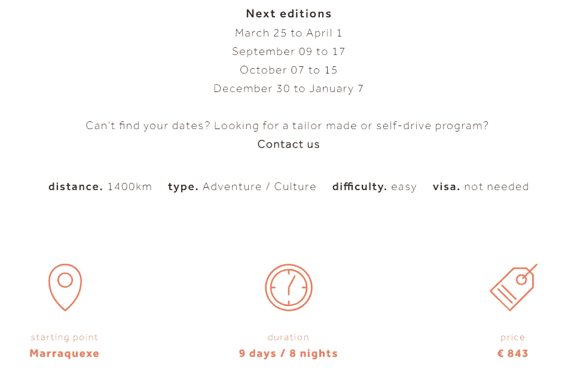
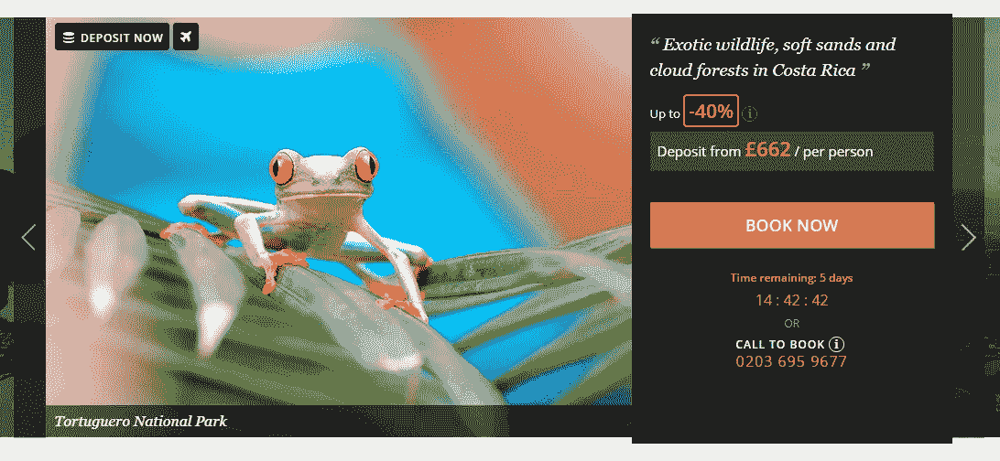
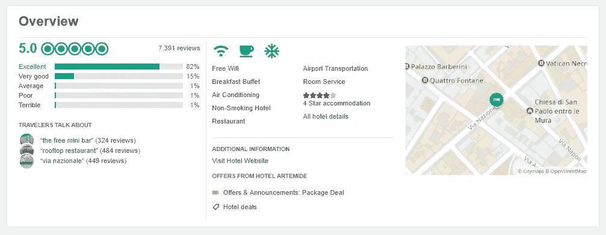
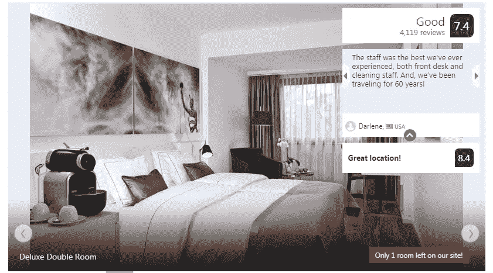
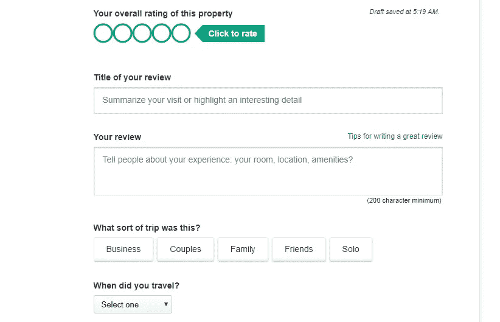
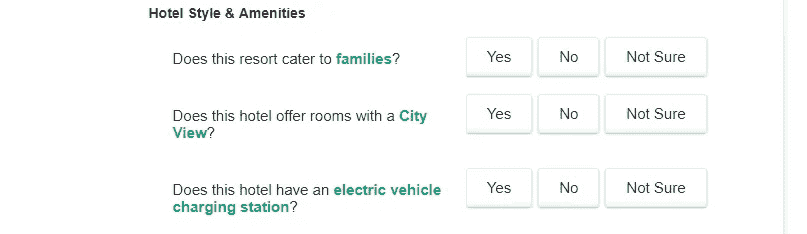
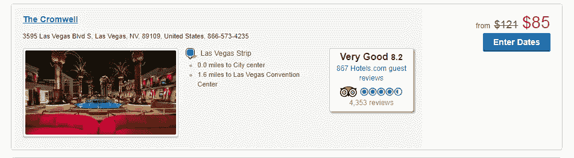

# 旅游网站:内容组织的 UX 方面

> 原文：<https://medium.com/swlh/travel-sites-ux-aspects-of-content-organization-5708fe68e25d>

用户体验(UX)是你的旅游网站受欢迎程度和盈利能力的重要组成部分。人们普遍认为，UX 通常是关于网站的功能性和可用性，是设计师的领域。虽然不排除这个观点，但我们想提醒你网站成功的要素是内容组织。为什么不从 UX 的角度来看呢？

由于越来越多的人不仅押注于专业文本、图像或视频，还押注于所谓的用户生成内容，让我们来看看这两者。

# 专业视角:皮克想象

从客户吸引力和 SEO 的角度来看，高质量的内容增加了价值。它让你的网站看起来专业可信。这是一个巨大的购买决策因素。作为网站的所有元素，内容不仅要有说服力和功能性，还要对用户友好。让我们看看这是什么意思。

**复制**。好的文案会增加价值。把你的网站看作是提供一个连续的体验，而不是孤立的内容页面，这很好。组织内容，使页面自然地指向另一个，鼓励用户继续探索或点击。但是不要让网站的文字太多。给梦想和想象留下空间。包含浓缩信息和鼓舞人心的行动号召的短文效果最佳。以下是大纲如何做到这一点:

**照片**。令人愉悦的图像增强了用户对新体验的渴望。但是照片不仅仅是让人高兴，它们还能帮助用户更快更容易地找到他们想要的东西。这里有一些在你的网站中加入照片时要记住的提示。顾客更喜欢大尺寸、高质量的图片，比如 Airbnb 或 Kayak 网站上的图片。这些不一定是传统旅游景点的陈旧图像，如巴黎的埃菲尔铁塔或里约热内卢的救世主耶稣。使用意想不到的类比，创造特殊的氛围，如 Bouteco 或 Secret Escapes:

**视频**。专业视频也为你的旅游网站增值。一些网站，如 Geobeats.com，甚至将视频作为旅游目的地信息的主要来源。从最新的趋势来看，360 度视频最令人印象深刻。你可以看看“爱达荷州精彩之旅”是如何利用 360 度和传统视频来吸引顾客的:

# 用户生成的内容:社会证明

想想这些数字:95%的消费者报告在预订旅游前阅读评论。人们花半个多小时阅读评论，并在旅行计划阶段阅读多达 20 篇评论。当人们面临一个代价高昂的决策时，评论和评论可以增加信任，帮助人们战胜不确定性和挫败感。这证明了点评对你的旅行社网站有多重要。

**总结点评**。研究表明，人们更喜欢看到第一个总结性的评论，而不是全文。它有助于快速获得所有必要的信息，只需一瞥。由于空间有限，这种趋势在手机上更加明显。通过评论过滤是一个额外的优势，一方面带来了透明度，另一方面创造了健康的竞争。在这方面，Tripadvisor 和 Booking.com 是互联网用户中无可争议的领导者:

仔细考虑评论的形式，从一开始就让它们结构化，并吸引不喜欢写长文章的用户:

使用多项选择的答案来获得价值，而不要过多地回答你的问题来打扰你的客户:

**第三方评论整合**。使用 API(例如猫途鹰的 API)在你的网站上整合第三方评论。例如，Hotels.com 不仅将猫途鹰评论与他们自己的客户评论整合在一起，还突出显示了其他用户喜欢的列表:

用户的照片和视频。请记住，评论不一定是文字性的。89%的旅行者表示观看过旅游视频，而 45%的休闲旅行者和 72%的商务旅行者表示，他们在观看视频后会被提示预订行程。尤其是当它涉及到年轻一代时，人们往往更依赖于图像和视频，而不是文本。猫途鹰利用这一趋势，在网站上积极添加高质量的用户生成的图片。除了建立信心，它欢迎用户作为积极的参与者进入品牌，这是形成品牌忠诚度的最佳方式。像 FivePointFive 这样的网站在鼓励人们起锚时甚至强调视频评论:

# 结果

内容组织是 UX 旅游网站的重要组成部分。无论是专业的还是用户生成的内容，都值得你去关注和有目的的填充。结构良好、高质量和有意义的文本、图片和视频吸引不同类型的人，并帮助他们做出决定，他们可能会在您的网站上购买旅游产品。

准备好进一步讨论[旅游网站开发](https://stfalcon.com/en/industries/travel)了吗？我们很自豪被 Clutch.co 评为[15 大生活方式和旅游应用开发公司](https://clutch.co/app-developers/travel-lifestyle/leaders-matrix)的第二名，我们将继续寻求扩大我们的合作伙伴关系并分享我们的专业知识！让我们一起提升旅游业！

【stfalcon.com】最初发表于**。**

**

## *这篇文章发表在 [The Startup](https://medium.com/swlh) 上，这是 Medium 最大的创业刊物，拥有+368，052 名读者。*

## *在此订阅接收[我们的头条新闻](http://growthsupply.com/the-startup-newsletter/)。*

**