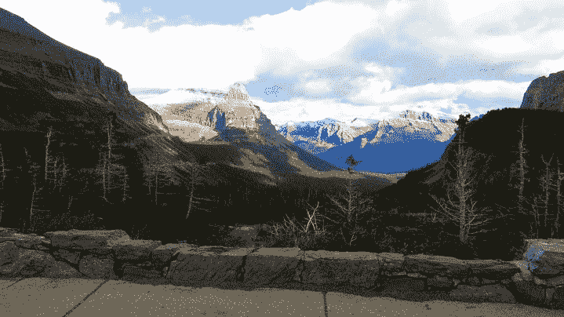
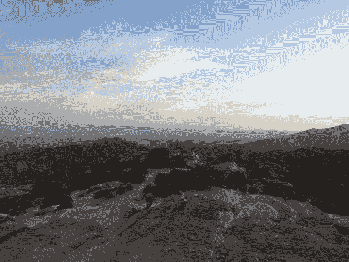

# 旅行让我害怕，但后悔更让我害怕

> 原文：<https://medium.com/swlh/traveling-terrifies-me-but-regret-scares-me-even-more-7bf49e9eab07>

对于那些认为我喜欢旅行方方面面的人来说:你错了！

> 旅行在很多方面都很困难——尤其是对像我这样内向的人来说。事实上，低调旅行让我害怕得要死，因为我经常想，在这些地方我到底会不会遇到什么人。

不过，我想每个人都会害怕。这就是为什么我的许多朋友知道他们可以独自去冒险，却不去冒险。我认为许多人只是害怕他们面前的东西:在你一个人都不认识的情况下旅行的直接后果。

> 你看，这就是问题所在。这些人害怕错误的事情。也许你自己从来没有像我这样想过，但我更害怕如果我现在不跟随我的心，我以后会后悔。

我不知道当我长大后是否会有遗憾。

我不知道现在人们晚上躺在床上无眠地数着他们所有的旅行遗憾，这算不算一件事。也许不是。但是，从老年人跟我谈论追逐梦想的方式来看，如果可以的话，似乎很多人会有不同的做法。

> 基本上，这就是我把自己扔出门外的原因。你们猜怎么着，伙计们？我和你一样害怕。不同的是，我更害怕后悔，而不是去新的地方。

我不是里奇·史蒂夫斯或安东尼·鲍代恩。在我一生中，除了我自己的国家，我还去过另外两个国家。我计划在今年夏天将这个数字翻倍，但这只是暂时的。

我正在放松风帆，把它作为对我未来的投资。一个希望尽可能消除遗憾的未来。

我写这些是因为消除你对我作为一个绝对热爱旅行的人的任何误解是很重要的。

我并不总是喜欢它。

> 老实说，很累。在一个陌生的地方，一个人都不认识，令人不安和孤独。很难对财务状况感到紧张，也不知道四个月后你会在哪里。做这件事让我很害怕。

我是一名旅游博主 **，我和你一样害怕旅游。**

但是，我的朋友们，我在旅途中意识到，这些恐惧很大程度上是基于无知。你当然会交到朋友！在你人生的这个阶段之前，你是如何交到朋友的？

> 你也会找到旅行的好理由(快乐、自我发现等等。)比你想象的要甜蜜。相信我。

但是伙计们，这两种认识仍然不是我今年夏天去东南亚的原因。

仍然驱使我的是后悔的可能性。我不想成为那个没见过世面的人。时间是如此珍贵，比许多人意识到的还要珍贵。所以我几乎要把自己扔出门外。

> 想在媒体上建立自己的观众群吗？我有一个名为“**你的第一批 1000 名追随者**的免费 5 天电子邮件课程，它将教你我是如何做到的！[在这里报名](https://app.convertkit.com/landing_pages/290945)。

## 这篇文章发表在《T4》杂志《创业》(The Startup)上，这是 Medium 最大的创业刊物，有 319，931 人关注。

## 在这里订阅接收[我们的头条新闻](http://growthsupply.com/the-startup-newsletter/)。

