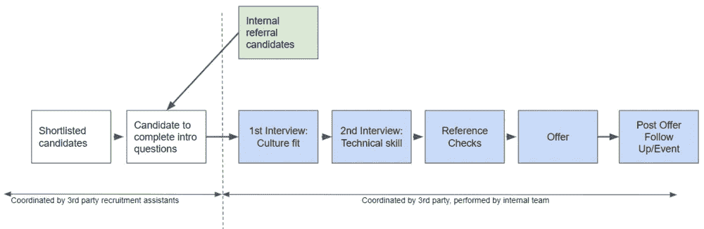

# 六个月内将工程团队扩大两倍——第四部分:招聘(终于！)

> 原文：<https://medium.com/swlh/tripling-an-engineering-team-in-six-months-part-four-hiring-finally-6aa60dbfdb5d>

我目前在一家软件公司担任交付经理，负责监督设计和开发团队(又名“工程”)，他们正在构建一个全新的物业管理软件即服务平台。2016 年，我们被一个私人投资财团收购，并获得了资金注入，以便“走得更快”。这个博客系列总结了我在六个月内将工程团队扩大三倍的经验。

# 第四部分:招聘(终于！)

如果您还没有，请阅读:

*   [第一部分:背景故事](https://www.zacsky.com/blog/2017/8/tripling-an-engineering-team-in-six-months-part-one-the-background-story)，概述了 2016 年发生的事情，这些事情导致我们需要以这样的速度扩大规模；和
*   [第二部分:计划扩展](https://www.zacsky.com/blog/2017/8/tripling-an-engineering-team-in-six-months-part-two-planning-to-scale)我深入研究了我们制定的实际计划，以及我们如何验证其可行性
*   [第三部分:为成功做好准备](https://www.zacsky.com/blog/2017/8/tripling-an-engineering-team-in-six-months-part-three-setting-up-for-success)，重点是在你真正开始打电话、寻找熟人或绑架竞争对手员工之前*需要做的所有准备工作。*

第四部分:招聘(最终)是关键。在本文中，我将介绍学到的经验教训，我们如何跟踪我们的招聘流程，以及我们如何在招聘方法中实施灵活性。

但首先，我们的赞助商要说一句话。不，等等，我的意思是说一点我个人的招聘哲学。这是关于实际招聘流程的第一课…

# 第一课:承担责任

在所有的招聘中，无论规模大小，实际的招聘经理必须是关键驱动力。最终对个人和团队负责的人必须尽可能多地参与进来。

收购完成后的三个星期，我除了招聘什么也没做。没什么。有些日子，我从早上 8 点到下午 6 点有 5 个连续的面试。在此期间，我忽略了所有其他的职责，以便启动和运行流程，并为我期望的候选人设定标准。我的参与至关重要，因为最终所有这些人要么直接向我汇报，要么通过一个新的领导职位间接向我汇报。我最终要负责任。

在最初的活动爆发后，我筋疲力尽，但我已经建立了流程，我的团队的其他成员，为剩余的招聘活动的成功做好了准备。质量(包括技术和个人)的基准设定得很清楚，我们的流程定义得很好，我已经向所有新提拔的领导展示了如何招聘。从那时起，我们作为一个团队前进，有权做决定，并相信我们都有一个共同的理解，但我不认为它会如此顺利，如果我没有在最初几周筋疲力尽几乎杀死自己。

旁注:然后我去了斐济，享受了一个美好的两周假期，其中包括了一些这样的事情:

我近乎精疲力尽的经历也是一个提醒，完美地引导着我走向下一课。

# 第二课:寻求帮助

这几乎可以成为第 1a 课。虽然我认为我在早期招聘热潮中的紧张参与对成功至关重要，但这也对我的健康有点不利。我需要帮助。

我已经意识到，我们需要一些全职人员专注于早期阶段耗时的任务——处理新来申请人的噪音，整理简历，检查工作权利，筛选名单，预约面试，等等。从一开始，我就想招聘一名全职技术专家。

我也有一个，但他只是在我假期结束后才开始。那是我们开始后的一个月，所以对我来说没有别的办法，只有在最初的几个星期里摧毁自己，这真的凸显了寻求帮助的重要性。

在进行这种规模的招聘时，你需要帮助。以下是我们安排的助手:

## 内部技术招聘人员

这是我从一开始就想要的角色。跨人力资源和工程技能的人。一个可以做所有招聘“软技能”的人，但也知道足够多的工程知识，可以与我们的候选人探讨技术概念。

此人负责投放广告、管理社交网络内容、寻找联系人、审核申请、进行首次电话联系、销售机会，同时也是候选人申请过程中的公共联系人。

## 管理人员

这个角色就是让我、我的工程主管和上面提到的内部招聘人员的招聘工作变得更容易。他们的职责包括组织面试、预定会议室、发送候选人资料、整理简历、确保 jira 的信息更新等等。

## 外部招聘人员

外部招聘人员是我们之前合作过的一家公司，我们在这里再次使用他们来快速入门。他们是唯一使用的招聘公司，因此他们有机会用他们拥有的任何高质量的联系人来填补我们的招聘漏斗。他们还提供了一批我们使用的承包商，以帮助我们在雇佣永久员工的同时扩大规模。

额外收获:有这样一家外部公司在那里，并与人们交谈，有助于在行业中为我们正在做的事情产生轰动，这反过来又有助于说服人们申请加入我们。

# 第三课:定义良好的内部流程

正如之前在[第三部分:为成功做准备](https://www.zacsky.com/blog/2017/8/tripling-an-engineering-team-in-six-months-part-three-setting-up-for-success)中所提到的，我们很早就定义了我们的招聘流程。这让每个人都清楚了流程，并对内部角色和职责有了共同的理解。

我不会重复招聘流程，但我会再次强调在组织内明确定义和理解这一点是多么重要。不要留下未记录的假设或未提及的明显步骤。正是这些错误导致候选人“落榜”。

一旦你有了一个很好的招聘流程，你需要考虑跟踪和最大周期时间等问题。

## 跟踪

我们使用定制的吉拉板来跟踪我们的招聘任务。我们的招聘流程中的每一步都有一个专栏，核心招聘团队每天(如果不是每小时)都在审查和更新。

我们用标签来标记角色，指派负责后续步骤的人，并使用吉拉时间提醒来保持对任何已经“卡住”的候选人的关注。如果一天之内一张卡片没有从专栏中移走，那么我们就犯了错误——没有看简历，没有打电话给他们，或者没有做出决定。这是不可接受的。

最后一点是进入下一点的完美过渡。

## 定义最大周期时间

定义希望招聘流程的每个步骤花费的最长时间。我说的不是实际的面试(如果你之前做过几次，你应该已经知道你的面试/评估需要多长时间)。我说的是在你把一个候选人带走之前允许的最长时间。

我们的例子:

*   申请审核=第 1 天
*   第一次接触=第一天
*   第一次面试=第 2-4 天
*   复试=第 5-7 天
*   证明人调查=第 7-8 天
*   优惠=第 9–10 天

因此，我们的目标是 2 周的周转时间，理想情况下会更短。

老实说，我并没有统计出我们的平均周转时间，但有趣的是感觉很快。我们行动迅速，在两周的计划内找到了优秀的候选人。我*可以*去挖掘实际的数据，但是没有数据并不会困扰我。设定这些目标的目的不是为了创建新的指标或统计数据，而是为了确保我们掌握流程。

通过了解这些数字，任何人都可以快速查看 jira 公告板，并通过查看哪些申请人被“卡住”的时间最长来确定下一步应该采取什么行动。如果我们有喜欢的候选人，但还没有人打电话来，那就拿起电话吧！

# 第四课:知道你哪里灵活

在实际招聘过程中，最后一个重要的教训是，要知道何时何地可以灵活应变。这听起来并不多，但重要的是，参与该过程的每个人都有权在有意义的时候做一些不同的事情。

流程的灵活性因公司、团队、项目和规模而异。我在这里写不出一个适用于所有人的神奇系统。但是我将提供一些我们在流程中安装的灵活性的例子，以便使它们更有效。

招聘过程中灵活性的三个例子:

## 初始编程练习

有时，我们使用一些简单的编码练习，在申请人空闲时在家完成，作为额外的筛选工具。我们知道这样做并不适合所有人，但是到目前为止，我们已经在当地行业中引起了一些反响，所以我们询问的大多数人都愿意花 30 分钟来做这些练习。

我们为什么要用它？当我们有一个好的申请人，但觉得他们的简历/申请对他们的技术能力提出了质疑时，我们就使用它。我们认为，一名工程师观看一个人编码的视频是值得的，有可能筛选出我们让两名工程师一起工作 90 分钟的候选人。我们确实设法剔除了一些当时没有达到我们要求水平的申请者。

这不是一个完美的解决方案，也不是我们每次都使用的东西，但绝对是一个有价值的工具。

## 内部推荐人直接参加面试

这是一个通用的经验法则:如果已经为我们工作的人推荐了一个申请人，那么我们就会面试他们。我们信任我们的员工，如前所述，我们已经建立了一个奇妙的文化和团队环境，所以我们知道没有人想破坏这一点。如果有人愿意推荐，那么这个人就值得被录取。这些申请人必须经历同样的过程，并且仍然被期望达到我们为每个人设定的同样的高标准。我们没有雇用他们所有人，但对我来说，这是显而易见的。

## 家庭作业

作为最初编程练习(相对简单)的替代，有时我们会给“家庭作业”一些技术挑战，作为候选人的最终测试。这通常是在面对面的技术面试之后进行的，通常是当我们觉得候选人在面试中表现出压力和紧张时。

我们尽了最大努力让每个人在面试中感到放松，但是走进一个有 2 个以上非常聪明的工程师参加的技术面试可能会有压力。有些人比其他人更好地应对技术面试的压力，但我认为基于此排除某些人是不公平的。他们不会每天都以面试的方式编码，所以这并不总是对他们技能的有效解读。

在这种情况下，我们会给他们一个做家庭作业的机会。这是一个编码样本，与他们的工作更相关，通常目标是花费大约 4 个小时。这是一个很大的要求，但大多数意识到自己紧张的候选人都非常愿意接受这个机会。

值得注意的是，申请人仍然必须首先在面试中表现出一定的技术能力。对于那些搞砸面试的人来说，这不是最后一次机会，但对于那些我们认为很有可能说服我们的人来说，这更像是一次机会。

结果？在完成作业后，我们雇佣了几个人，他们都是团队的重要成员。

# (第四部分的)结尾

我在这里学到了许多小技巧和诀窍，但我想让它比[荷马的《奥德赛》](https://en.wikipedia.org/wiki/Odyssey)更简短。我在这里介绍的是最重要的技巧——大赢或速赢——这些东西要么产生最大的回报，要么最容易实现。

这就结束了第四部分:招聘(终于！).我们即将结束这个系列。接下来是第五部分:雇佣后。

【www.zacsky.com】最初发表于**。**

**您可以* [*注册我的电子邮件列表*](https://www.zacsky.com/#footer) *获取新内容提醒，如果您有任何问题或想要取得联系，您可以* [*给我*](https://www.zacsky.com/contact-me/) *发电子邮件，或者在*[*Twitter*](http://twitter.com/zac_sky)*上大声喊出来。**

## *完整系列:六个月内将工程团队增加两倍*

*   *第一部分:背景故事*
*   *[第二部分:计划扩展](/@zac_sky/tripling-an-engineering-team-in-six-months-part-two-planning-to-scale-d65419b3b537)*
*   *[第三部分:为成功做准备](/@zac_sky/tripling-an-engineering-team-in-six-months-part-three-setting-up-for-success-8b32ece4c3bb)*
*   *第四部分:招聘(终于！)*
*   *[第五部分:后期雇佣](/@zac_sky/tripling-an-engineering-team-in-six-months-part-five-after-hiring-640bf033cb0f)*

**

## *这个故事发表在[的《创业](https://medium.com/swlh)，这里有 266，300 多人聚集在一起阅读 Medium 关于创业的主要故事。*

## *订阅接收[我们的头条新闻](http://growthsupply.com/the-startup-newsletter/)。*

**