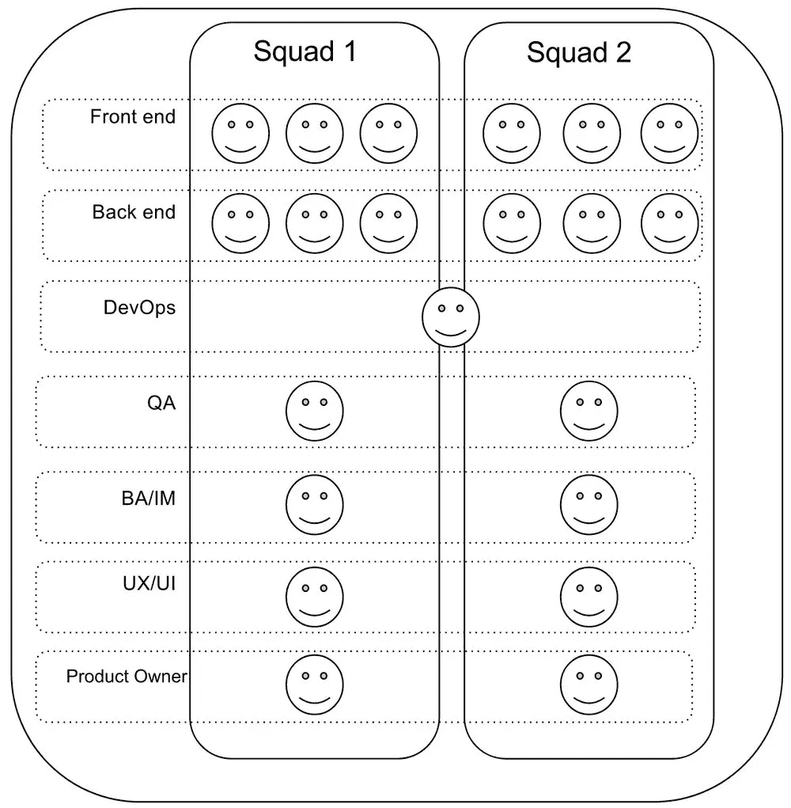
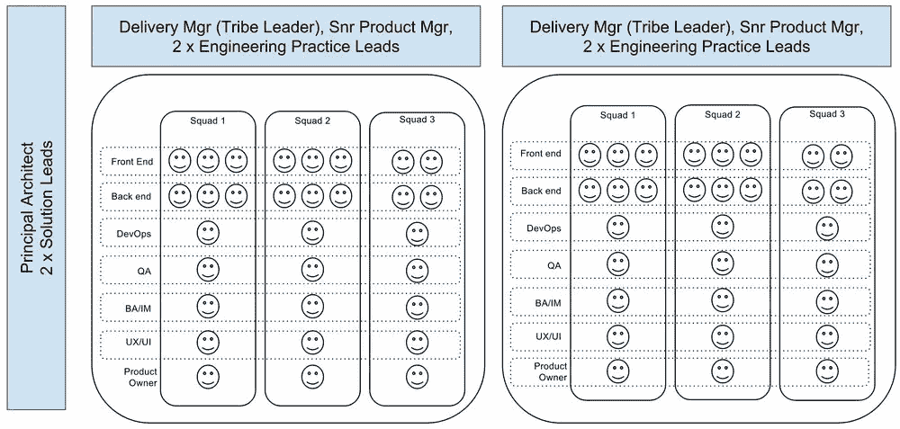
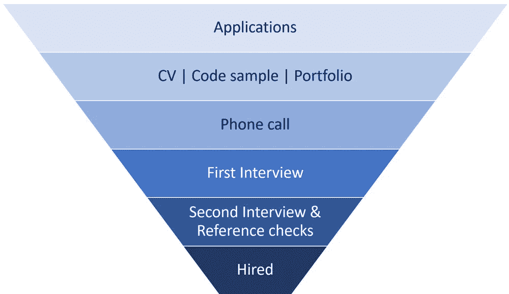
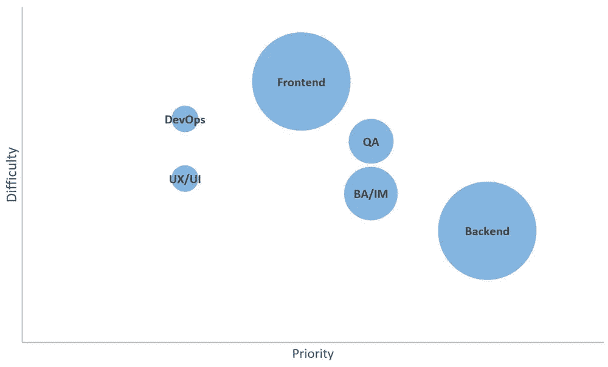

# 六个月内将工程团队扩大两倍——第二部分:规划规模

> 原文：<https://medium.com/swlh/tripling-an-engineering-team-in-six-months-part-two-planning-to-scale-d65419b3b537>

我目前在一家软件公司担任交付经理，负责监督设计和开发团队(又名“工程”)，他们正在构建一个全新的物业管理软件即服务平台。2016 年，我们被一个私人投资财团收购，并获得了资金注入，以便“走得更快”。这个博客系列总结了我在六个月内将工程团队扩大三倍的经验。

# 计划扩展

如果你还没有这样做，请阅读[第一部分:背景故事](https://www.zacsky.com/blog/2017/8/tripling-an-engineering-team-in-six-months-part-one-the-background-story)，它概述了 2016 年发生的事情，导致我们需要以这样的速度扩展。

在这篇文章中，第二部分:计划扩展，我将深入探讨我们如何实际计划我们正在着手的庞大任务，我们需要问的问题，以及我们在这个过程中吸取的重要教训。

我将通过按时间顺序回顾计划过程来做到这一点。

# 第一步:定义当前状态

如[第一部分](https://www.zacsky.com/blog/2017/8/tripling-an-engineering-team-in-six-months-part-one-the-background-story)所示，规划规模的第一步是绘制世界的现状。我们的大概是这样的:

我们的团队大致分为两个平行的小组，分别负责我们正在处理的关键主题领域。

这些小队流动性很大。他们将围绕大块的工作(我们称之为增量)形成，完成它，然后重组为一个团队，根据需要交换角色和领域。这给了团队灵活性的机会，促进了技能提升和知识共享，并使每个人都能够拥有他们正在构建的解决方案。

这并不是说我们所做的一切都是完美的。我们有一些小问题，或者需要改进的地方，但是我们大部分都克服了，因此我们取得了很大的进步。但是，当您扩展现有团队时，您也扩展了任何现有的问题，因此我们在扩展之前做的关键任务之一是评估我们当前的问题。

# 评估当前问题

> “当您扩展现有团队时，您也扩展了任何现有的问题”

问题、难题、低效，不管你怎么称呼它们。所有团队都有*其中的一些*，没有一个团队是完美的，但他们经常陷入一切照旧的思维模式。有些人喜欢称之为[沸水中的青蛙寓言](https://en.wikipedia.org/wiki/Boiling_frog)。

在一个小团队中，问题通常是众所周知的，并且被接受，或者至少被确定为低优先级。每个人都知道如何变通，他们可以继续他们更高优先级的工作。

但是，当你扩大一个团队时，这些小问题就会被放大。新人加入的速度比你跟得上的速度要快，关于为什么事情是/不是以某种方式完成的故事也就不知道了。有变通办法的问题变成了痛点，问题变得更加困难，效率低下被夸大了。

因此，在扩展团队之前，评估我们当前的问题并尝试预测新问题可能会在哪里出现是非常重要的。

我们的一些例子:

*   增量越来越大，越来越长
*   测试范围的不同定义
*   开发人员在测试完成之前转移到新的工作

除了上面的列表，还有很多，但是这些给了你一个我所说的基本概念。在我们这个小团队中，没有一个人是引人注目的。但是我们需要在扩展之前将它们调用出来，以确保我们在扩展计划中考虑到了它们。

这才是重点。在你衡量之前，你需要了解你当前处境的一切——好的和坏的。否则，当曾经是小而简单的问题突然爆发成大而棘手的问题时，你会措手不及。

在定义了我们所处的位置之后，通过绘制结构并指出当前的不足，我们准备好处理下一步。

# 第二步:猜测未来

猜一猜，大胆地猜一猜，未来会是什么样子。你会雇佣多少人？团队会是什么样子？你需要更多的领导力来帮助指导和辅导新手吗？可能还需要其他什么角色？诸如此类。

鼓起勇气，知道这一切都将是一种胡乱的猜测。当你六个月后回顾过去时，你可能会嘲笑自己的幼稚。计划有改变的习惯，当你试图快速扩展团队时，你会发现计划有极快改变的习惯。

我不会涉及我们未来计划的每一个迭代。相反，这是我们最后找到的一个:

注意:这是“最终”计划，我们的结局实际上很不一样。

在项目的第一阶段，我们已经实现了我们自己定制的 [Spotify 工程模型](https://labs.spotify.com/2014/03/27/spotify-engineering-culture-part-1/)，所以扩展它是有意义的。我们添加了清晰的实践领导角色、新的交付管理、新产品角色，并且总体上采用了我们在小团队中不需要的部落方法。

我们相信这一计划使我们达到了所需的团队规模，同时也为潜在的未来增长建立了一个框架。每个部落都被设计成可以通过在所有团队中包含足够的领导力和技术能力来独立运作。这样，如果我们需要，我们可以简单地添加另一个部落(和经理，实践领导，产品团队，设计师，工程师，分析师，测试人员等)，这将是自给自足的。

既然我们对未来有了乐观的看法，我们就必须战胜它。

# 第三步:测试计划

这一步是关于戳和刺激计划，撕开它，并试图质疑每一个假设。计划和团队图在纸上看起来很棒，但是在现实生活中如何实现呢？

以下是我们挑战的大事件，大致按主题分组:

## 技术可行性

*   六个小队可以并行工作而不互相妨碍吗？
*   我们现有的架构支持这种规模吗？
*   我们如何保持代码质量？
*   我们的编码过程/实践需要改变吗？
*   这么多人签入代码，我们如何实现 CD？

## 过程

*   当前的开发过程会扩展吗？
*   我们将如何管理 3 次代码变更(拉请求等)
*   我们如何让新人加入进来，并让他们快速上手？

## 产品

*   我们有足够的工作来支持这个规模吗？
*   我们知道后测试客户想要什么吗？
*   我们将如何掌握产品变化？

每一个都值得一个单独的帖子来充分回答，所以我不会在这里深入探讨。这些是更多的例子，作为在你承诺大胆扩大计划之前需要进行的批判性思考的类型。

一旦计划通过关注内部方面得到了有力的检验，现在是关注外部方面的时候了。也就是说，你真的能雇佣到你需要的人吗？我从漏斗求和开始。

## 漏斗总和

漏斗总和是通过招聘漏斗步骤来确定您在每个阶段的当前/最近人数，然后将其外推至扩大计划。这个测试旨在回答这样一个问题:你真的能在你所在的地方雇佣那么多人吗？

我喜欢逆向工作。假设成功录用了一名员工，为了完成这一次录用，我需要在招聘流程的每一步看到多少名候选人。在某些情况下，我很容易意识到，每次招聘我都需要看到 30 至 40 份申请。其他人可能是 50，甚至 100+。了解这一数字非常重要，它是指导所有招聘活动决策的重要信息。

我建议对每个招聘的角色类型进行这种类型的分析，因为申请人池和申请人过滤率在技能组合和领域之间有很大差异。这也将有助于了解角色的优先顺序。

## 订购目标

这一步是定义招募人员加入团队的顺序。这里有三个方面作为关键因素:

*   优先级——立即拥有这个角色有多重要。
*   难度——招聘该职位的难度，或提前期。
*   数量—每种角色类型所需的人数。

基于三个维度的排序目标可能会令人困惑和难以理解。为了帮助证明这一点，我用一个二维气泡图将其可视化。

这个图表的使用很简单——从右上角开始，一直到左下角。

这似乎是一个非常简单的想法，因为它是。它不会让你大吃一惊，也不会让你产生意想不到的疯狂想法，但它会帮助你仔细检查你的优先事项。

第二部分完成了。唷。

如您所见，在考虑扩展计划实际上是否可行以及是否值得推进之前，有很多东西需要评估。我再怎么强调做这项分析的重要性也不为过。以这种强度和速度进行缩放是极其困难的。不全是仙女牙线和旋转木马。

但在试图用无数的问题和辩论来撕毁提议的团队模式后，我们设法到达了另一边，仍然紧握着画有笑脸的纸。我们仍然认为这是可能的。我们知道这将是困难的，但这不会阻止我们。所有值得做的事情都很难，对吗？如果很容易，每个人都会做。

回想起来，我们对这将有多难只有最基本的概念。但那是以后的事了。

*最初发表于*[*【www.zacsky.com】*](https://www.zacsky.com/blog/2017/8/tripling-an-engineering-team-in-six-months-part-two-planning-to-scale)*。*

以下是本系列所有帖子的链接。您可以 [*注册电子邮件列表*](https://www.zacsky.com/#footer) *以获得新内容的提醒，如果您有任何问题或想要取得联系，您可以* [*给我发电子邮件*](https://www.zacsky.com/contact-me/) *或在*[*Twitter*](http://twitter.com/zac_sky)*上大声喊出来。*

## 完整系列:六个月内将工程团队增加两倍

*   第一部分:背景故事
*   [第二部分:计划扩展](/@zac_sky/tripling-an-engineering-team-in-six-months-part-two-planning-to-scale-d65419b3b537)
*   [第三部分:为成功做准备](/@zac_sky/tripling-an-engineering-team-in-six-months-part-three-setting-up-for-success-8b32ece4c3bb)
*   [第四部分:招聘(终于！)](/@zac_sky/tripling-an-engineering-team-in-six-months-part-four-hiring-finally-6aa60dbfdb5d)
*   [第五部分:后期雇佣](/@zac_sky/tripling-an-engineering-team-in-six-months-part-five-after-hiring-640bf033cb0f)

## 这个故事发表在 [The Startup](https://medium.com/swlh) 上，这里有 266，300 多人聚集在一起阅读 Medium 关于创业的主要故事。

## 订阅接收[我们的头条新闻](http://growthsupply.com/the-startup-newsletter/)。

