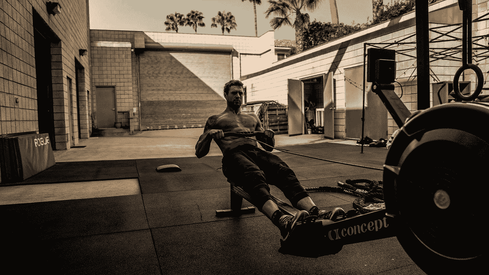

# 为什么真正的自由是建立在纪律的基础上

> 原文：<https://medium.com/swlh/true-freedom-is-carried-on-the-back-of-discipline-88a4041ebf0a>

Photo by [Wesley Quinn](https://unsplash.com/@captnquinn?utm_source=medium&utm_medium=referral) on [Unsplash](https://unsplash.com?utm_source=medium&utm_medium=referral)

在阅读蒂姆·费里斯的《[导师部落》时，我对他采访的许多游戏规则改变者很感兴趣。具体来说，我被](https://www.amazon.com/Tribe-Mentors-Short-Advice-World/dp/1328994961)[的乔科·威林克](https://twitter.com/jockowillink)迷住了。乔科是前海豹突击队员，现在是游戏规则的改变者。他关于自律的想法是如此不可思议，我也想和你分享一些他的见解。

乔科采取了一种独特的方式来说明每个人都想要自由，但很少有人愿意为他们的自由而工作。简而言之——你投入什么，就会得到什么。

由此，我希望你诚实地问自己以下三个问题，思考自己在生活中以下领域的自律水平:

你符合自己的标准吗？

你在每个领域都有勤奋的纪律实践吗？

**你是否在某些方面比较弱？如果有，你会如何改进？**

现在，让我们解开这些特定领域的纪律。

# 金融的

这可能是自由可以到来的最明显的领域；以现在节约为代价。许多人没有完全掌握这一概念，而是发现自己说，他们希望财务自由，但不花什么是必要的财政传奇。

# 身体的

我每周四次在早上 6 点跑步。我总是喜欢它吗？绝对不行。然而，现在投资于我的身体健康将会给我以后更健康的自由。事实上，每周跑步 1-1.5 小时可以让你多活 5-6 年。*心脏健康是财富，然而今天许多人患有慢性健康疾病，这些疾病本可以通过多年的体育锻炼来避免。*

# *知识分子*

*如果你每天不花至少一个小时阅读，你就不会有智力上的自由。如果你连续五年每天阅读 1 小时，那就是 1825 小时。磨砺智力是获得智力自由的唯一途径。这需要有意识的训练和努力。书籍本身还不会阅读。*

# *专业的*

*“[坐 8:15 的车去市里](https://www.youtube.com/watch?v=sNfpPKoTHZs)”——猜猜是谁*

*如果你想创造你想要的职业自由，你需要坐 6:15 的车去城里，不要指望吃完晚饭就躺在电视机前。完善你的手艺的职业自由需要时间、精力和对伟大的热情。在你的业余时间里，需要精力和纪律来创造奇迹，并成为自由职业者。*

*最终，如果没有有意的训练，你将很难达到自由的生活。选择权真的在你。乔科每天都在重复这种有意的努力，比他周围 99%的人都努力。是什么阻碍了你的自由？*

*想让你的生活、人际关系和职业更上一层楼吗？给我发邮件，了解如何获得我的书:[你最好的十年](http://www.faheyconsulting.org/books)。*

**

## *这个故事发表在[的创业](https://medium.com/swlh)上，这是 Medium 最大的创业刊物，有 318，583+人关注。*

## *订阅接收[我们的头条新闻](http://growthsupply.com/the-startup-newsletter/)。*

**