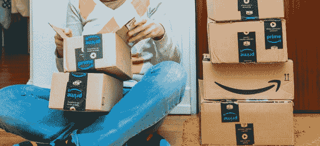
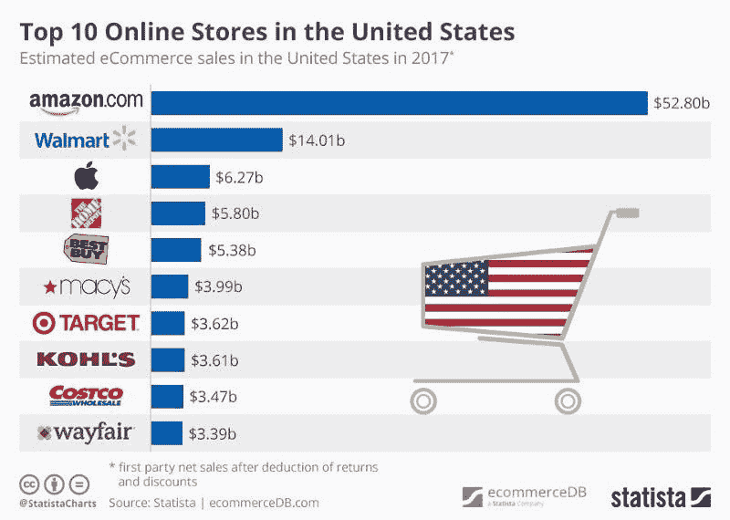
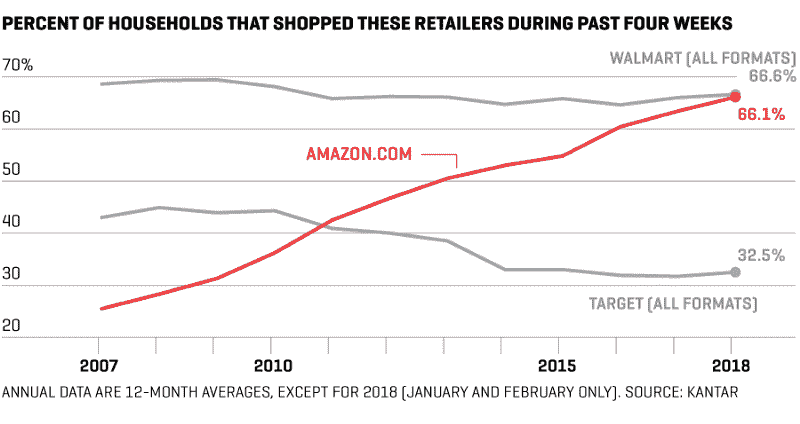
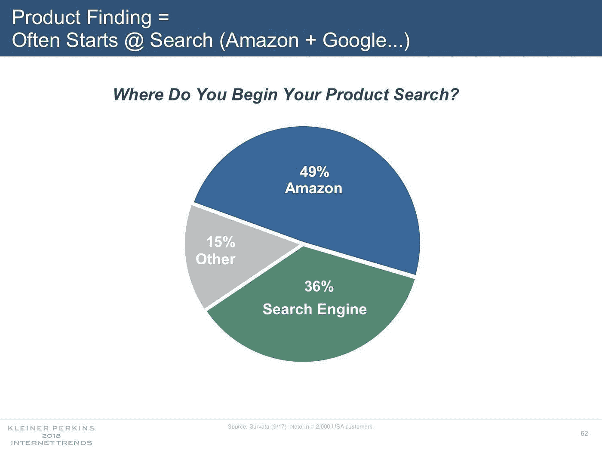

# 信任、不信任和反垄断。亚马逊没坏。该不该修？

> 原文：<https://medium.com/swlh/trust-mistrust-antitrust-amazon-is-not-broken-should-it-be-fixed-bc98cfa13d8c>

## 成功、效率和规模是值得钦佩的成就。应该对它们进行监管吗？

© Shutterstock.com

“在亚马逊早期，华尔街分析师之间流传的一个笑话是，首席执行官杰夫·贝索斯正在建造一座纸牌屋。2000 年进入第六个年头，该公司仍未盈利，并持续亏损数百万美元，每个季度都比上一个季度更大。

然而，一部分股东认为，通过向广告和大幅折扣投入资金，亚马逊正在进行一项合理的投资，一旦电子商务起飞，这种投资将产生回报。该公司每个季度都会报告亏损，其股价也会上涨。一家新闻网站捕捉到了这种分裂的情绪，问道:“亚马逊:庞氏骗局还是网络的沃尔玛？””—《耶鲁法律评论》的莉娜·卡恩

18 年后，这不再是一个笑话。没有人真正怀疑亚马逊是二十一世纪商业的巨人。

# 亚马逊辩称，该公司并不像看上去那样占据主导地位。

> *“我认为水平宽度和垂直深度有很大的区别……”*

–亚马逊消费者部门的负责人杰夫·威尔基在 10 月告诉华尔街日报[。](https://www.wsj.com/articles/jeff-wilke-the-amazon-chief-who-obsesses-over-consumers-1507627802)

威尔基说，亚马逊在全球零售业中的份额不到 1%，并提到了亚马逊所有不同业务中的“难以置信的竞争”。

> 我不认为这些领域中的任何一个是只有一个赢家的足球游戏

**绘制亚马逊的市场份额图**

三张图表展示了亚马逊不断增长的零售业务和电子商务优势:

1.  530 亿美元的电子商务收入
2.  66%的美国家庭经常在亚马逊购物
3.  49%的产品搜索从亚马逊开始

几乎 530 亿美元，没有其他公司接近亚马逊在美国的一般商品电子商务总收入和市场份额

排名第二的沃尔玛去年在线销售了价值 140 亿美元的商品，不到亚马逊的三分之一。

令人大开眼界的是，66%的美国家庭在四周的时间里在亚马逊购物，与在沃尔玛商店和网上购物的家庭数量相当。

Kantar Research 最近发布了这一数据…在 2007 年至 2017 年的四周时间内，在亚马逊、沃尔玛和塔吉特购物的家庭百分比(12 个月的平均值-2018 年仅显示 1 月和 2 月)

而且，几乎一半的产品搜索都是从访问亚马逊开始的…

凯鹏华盈(Kleiner Perkins)的玛丽·米克尔图表。

# 亚马逊让数百万小企业得以创建和扩张

作为零售商、销售商、制造商和供应商，你应该拥抱亚马逊还是应该避开他们？

2017 年，亚马逊全球销售的超过一半的商品来自第三方卖家，包括数百万中小企业。仅在 2017 年，就有超过 30 万家美国中小企业开始在亚马逊上销售，“亚马逊履行”为全球小企业运送了数十亿件商品。

2017 年，超过 14 万家中小企业在亚马逊上的销售额超过 10 万美元，2017 年，通过 Kindle Direct Publishing，超过 1000 名独立作者的版税超过 10 万美元。

*——数据来自杰夫·贝索斯 2018 SEC*[*致亚马逊股东的信*](https://www.sec.gov/Archives/edgar/data/1018724/000119312518121161/d456916dex991.htm)

# *21 家上市公司超过 10%的收入来自亚马逊*

*以其 **FarberWare** 和**凯膳怡**产品线而闻名的家居用品制造商 Lifetime Brands ，过去常常在 10 月底前完成大部分假日出货。作为一家传统的实体批发商，Lifetime Brands 在假期前将产品运送给零售商，以便商店能够及时装满他们的货架。*

*但今年，它的仓库一直忙到 12 月。这是因为亚马逊正在大量订购，以满足在线假日购物者不断增长的需求。Lifetime Brands 总裁丹西格尔(Dan Siegel)表示，按照这种速度，如果亚马逊在三年内成为其最大的客户，他不会感到惊讶(亚马逊在四年前甚至没有进入前 25 名)。*

> *西格尔说:“我们已经转移了我们仓库的资源，以满足亚马逊的高需求。“亚马逊现在真的在冒烟。”*

*Lifetime Brands 是一家年收入约为 6 亿美元的上市公司，它的变化说明了即使是大型上市公司也开始依赖亚马逊的在线购物网站。随着亚马逊主导地位的增长，它改变了许多行业中许多公司的游戏规则。*

*Lifetime Brands 的股票在过去一年下跌了约 5%，其来自亚马逊的收入尚未超过 10%，这需要披露，并通过沃尔玛和好市多等其他零售商销售。但根据 FactSet 的数据，至少有 21 家上市公司在最近一个财年从亚马逊获得了 10%或更多的收入。*

*这份名单包括像 GoPro、Roku 和 T2 FitBit 这样的消费电子公司，也包括主要的全食食品供应商 T4 联合天然食品公司。空运服务集团(Air Transport Services Group)是一家货运公司，负责处理亚马逊的部分航空货运，其 29%的收入来自这家电子商务巨头。**应用光电**，其数据中心设备帮助亚马逊销售其 AWS 云服务，创造了亚马逊高达 58%的销售额。*

*这比它的一些竞争对手要复杂得多。例如， **Target** 只有 8 家供应商通过了 10%的收入披露门槛，而**微软**只有 7 家。 **EBay** 只有两个。与此同时，像沃尔玛和苹果这样的公司仍然拥有比亚马逊更长的超级供应商名单。”—尤金·金(Eugene Kim)，美国消费者新闻与商业频道，“[随着亚马逊的主导地位不断增长，供应商被迫遵守其规则](https://www.cnbc.com/2017/12/21/as-amazons-dominance-grows-suppliers-are-forced-to-play-by-its-rules.html)。"*

# *就业破坏还是就业创造？*

**

***零售岗位，两种观点:***

*“创纪录的关店数量和零售破产数量的激增，以及向网上购物的转移，迫使零售商大幅裁员，尽管其他雇主都在争相寻找合格的员工。”*

> *根据劳工部 2017 年 12 月的就业报告，包括百货商店在内的百货商店受到的冲击最大，失去了 90，300 个工作岗位。服装店又裁员 28600 人。药店亏了 18400。”—克里斯·伊西多尔，CNN，“[工作无处不在！除了在商店。”](http://money.cnn.com/2018/01/05/news/economy/retail-job-losses/index.html)*

*一些经济学家认为电子商务创造了更多——也许是报酬更高的——工作。经济学家迈克尔·曼德尔(Michael Mandel)估计，自大萧条开始以来，电子商务领域创造了 355，000 个新工作岗位，而实体零售店总共损失了约 50，000 个工作岗位。这一增长大部分来自仓库中的大型履行中心。**仓储并非专为电商所用，但仓储岗位的变化与亚马逊在该州的岗位增长**高度相关；自 2009 年以来，仓储就业人数飙升了近 50%。履行中心的工资比一般零售工作高 26%，仓库工资目前的增长速度是全国平均水平的两倍。——[《零售业就业的无声危机》](https://www.theatlantic.com/business/archive/2017/04/the-silent-crisis-of-retail-employment/523428/)*

***据亚马逊称，该公司已经在全球创造了超过 170 万个直接和间接的工作岗位。***

*仅在 2017 年，该公司就直接创造了超过 13 万个新的亚马逊工作岗位，不包括收购，使全球员工总数超过 56 万人。新的工作涵盖了广泛的职业，从人工智能科学家到包装专家，再到履行中心助理。除了这些直接雇佣，亚马逊估计 Marketplace 在全球范围内创造了 90 万个就业岗位，亚马逊的投资在建筑、物流和其他专业服务领域创造了 26 万个就业岗位。—数据来自杰夫·贝索斯 2018 SEC " [致亚马逊股东的信](https://www.sec.gov/Archives/edgar/data/1018724/000119312518121161/d456916dex991.htm)*

***如果你打不过他们，加入他们……或者，拆散他们***

**

*成功、效率和规模是值得钦佩的成就。应该对它们进行监管吗？*

*“反垄断机构不应该让在位者的日子好过。那么，他们应该做什么？有两种思想流派。一是关注消费者对质量、品种和价格的兴趣。几十年来，这一直是美国反垄断政策的标准方法。由于亚马逊利润微薄，价格低廉，因此很少引发反垄断问题。*

*另一种观点——可以追溯到早期的反垄断时代，当时标准石油和后来的美国电话电报公司被拆分——认为竞争本质上是好的，即使很难量化对消费者的好处，而且社会应该警惕大型或占主导地位的公司，即使它们的行为看起来是良性的。”——蒂姆·哈福德为《金融时报》撰文，[“终结亚马逊主导地位的案例。"](https://www.ft.com/content/aba8d444-fb94-11e7-a492-2c9be7f3120a)*

> **除了作为零售商，亚马逊现在还是一个营销平台、交付和物流网络、支付服务、信贷机构、拍卖行、主要图书出版商、电视和电影制片人、时装设计师、硬件制造商和云服务器领域的领先主机。**

*尽管亚马逊取得了惊人的增长，但利润微薄，选择以低于成本的价格进行大规模扩张。通过这一战略，该公司将自己定位于电子商务的中心，并成为依赖于它的许多其他企业的重要基础设施。该公司的结构和行为构成了反竞争问题——然而它逃脱了反垄断审查。*

*莉娜·卡恩(Lina Kahn)在她广为流传的研究[“亚马逊的反垄断悖论”(Amazon ' s Antitrust Paradox)](https://www.yalelawjournal.org/note/amazons-antitrust-paradox)中指出，“当前的反垄断框架——特别是其将竞争与‘消费者福利’挂钩，定义为短期价格效应——无法捕捉现代经济中的市场力量架构。*

*如果我们主要通过价格和产量来衡量竞争，我们就无法认识到亚马逊的主导地位对竞争造成的潜在危害。具体而言，目前的理论低估了掠夺性定价的风险，以及不同业务线之间的整合可能会证明是反竞争的。*

*由于两个原因，这些担忧在在线平台的环境中变得更加突出。首先，平台市场的经济学为公司创造了追求增长而非利润的激励，这是一种得到投资者回报的策略。在这种情况下，掠夺性定价变得高度理性——尽管现有理论认为它是非理性的，因此不可信。其次，由于在线平台是关键的中介，跨业务线的整合使这些平台能够控制竞争对手所依赖的重要基础设施。这种双重角色也使得平台能够利用从使用其服务的公司那里收集的信息来削弱他们作为竞争对手的地位。"*

*相反，2011 年被《纽约时报》任命为“美国反垄断法院长”的沃顿法律研究和商业伦理教授赫伯特·霍温坎普在[“如何建立更好的反垄断政策”](http://knowledge.wharton.upenn.edu/article/anti-trust/)中指出:*

> *“我认为反垄断政策不应该把让小企业留在市场上作为目标。我觉得它的目标应该是消费者福利最大化。当产出最高时，消费者通常是最好的。高产出意味着低成本和高质量，这有利于消费者。事实是，有时需要相当大的企业才能让消费者受益。”*

# *信任与反垄断*

***消费者信任和喜爱亚马逊**,因为它的便利性、品种、价格、速度、购买便利性、无摩擦体验和不断创新对他们有利。*

> *“我喜欢顾客的一点是他们有着神圣的不满，”杰夫·贝索斯写道。*
> 
> *“他们的期望从来不是一成不变的，而是不断上升的。这是人之常情。”*

*贝佐斯指出，随着技术的进步，客户比以往任何时候都要求更多、更快。这意味着不能快速适应这些挑战的公司和组织可能会很快被客户遗忘。*

> *“在这个世界上，你不能固步自封，”贝佐斯说。“客户不会有。”*

***竞争对手不信任和憎恨亚马逊**，因为该公司在市场上的主导地位，他们在投资大量长期资本支出方面的独特地位，而无需为市值付出短期惩罚的代价，以及亚马逊愿意接受低利润来换取客户获取和忠诚度。有趣的是，当提到好市多、TJX 公司和罗斯商店时，这些竞争对手就不那么敢言了。*

*零售商很害怕。品牌关注。供应商有分歧。求职者很愤怒。此外，传统法规不再适用。*

*这是一个新的局面，伴随着创新的加速、新的购买途径和客户期望的提高。生存下来的不是最强壮的，也不是最聪明的。它是最能适应变化的。*

*我们不能把旧规则应用于新的世界秩序。零售商、品牌、供应商、求职者和法规都需要改变。*

*2018 年，大卫·j·卡茨——纽约市*

**

## *这篇文章发表在 [The Startup](https://medium.com/swlh) 上，这是 Medium 最大的创业刊物，有 333，853+人关注。*

## *订阅接收[我们的头条新闻](http://growthsupply.com/the-startup-newsletter/)。*

**