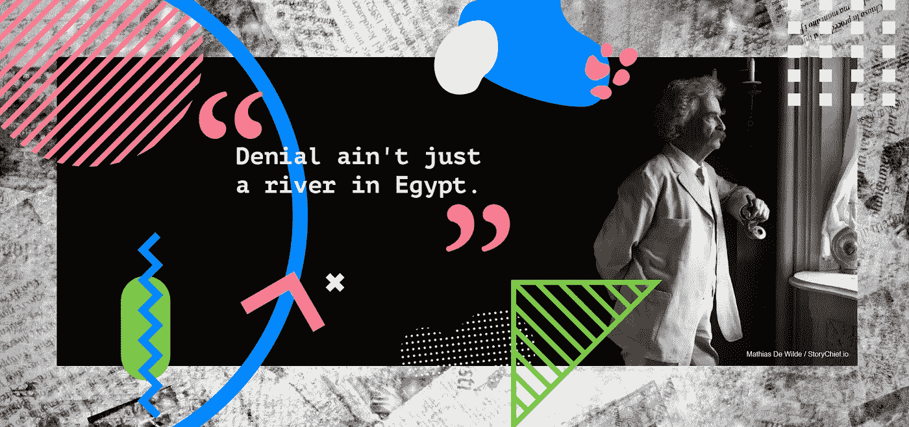
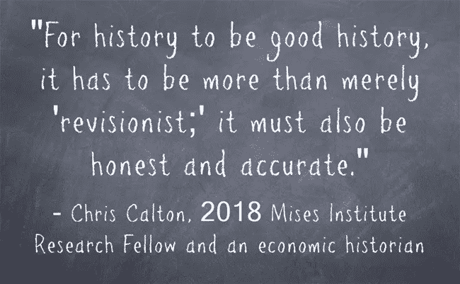

# 高质量内容中的真实每次都胜过修正主义历史

> 原文：<https://medium.com/swlh/truth-in-quality-content-beats-revisionist-history-every-time-501b22658899>

© Mathias De Wilde / Storychief.io

从历史上看，修正主义历史受到了不好的指责，[也许是理所应当的](http://www.slate.com/blogs/schooled/2015/10/06/texas_textbook_controversy_roni_dean_burren_finds_omission_in_son_s_geography.html)——下面这条推文就是一个很好的例子。有些人将永远追求伪装成追求真理的否认，反之亦然。

这就引出了一个问题:马克·吐温是否真的说出了那句关于否认的话…

## 质疑一切是人类的天性

作为一个社会，我们应该努力集体度过难关，学会接受一个故事可能来自的所有不同角度。大约在 2006 年，当时任州长杰布·布什和他的佛罗里达州众议院[禁止在公立学校教授“修正主义历史”时，我们中的一些人甚至可能会指着佛罗里达州嘲笑它。](https://www.historians.org/news-and-advocacy/statements-and-resolutions-of-support-and-protest/aha-statement-on-the-2006-florida-education-bill)

这可不是闹着玩的。

求知欲中的每一个里程碑，无论是好的还是坏的，都是这个过程的一部分，也应该如此被欣赏。这是一个在相信一个故事之前后退一步，查看更大的图片并考虑任何新证据来源的机会——因为你永远不知道。此外，从废品堆中总能学到一些东西。修正主义的历史本身没有错，只要它是真实的和事实性的。

[https://mises.org/wire/why-revisionist-history-important](https://mises.org/wire/why-revisionist-history-important)
Truth Matters

[行为学](https://mises.org/library/praxeology-methodology-austrian-economics)——研究人类行为的科学——指出所有的行为都指向某个目标。这需要**牛顿第三定律:**对于每一个动作，都有一个大小相等方向相反的反作用力——并给它一个任意的期限。

哪个作家不喜欢软期限呢？

## 最终游戏仍必须产生一些高质量的东西

作为一种短期解决方案，Clickbait 在按照你的方式驱动流量方面是有效的，但优质内容的真实性每次都胜过修正主义的历史。像《宿醉》这样的喜剧电影将这一理论提升到了一个新的高度，作为对我们自己生活的滑稽模仿。让我们面对现实吧，在我们最亲密的社交圈里，我们都有“那个”朋友患有选择性记忆——他对事件的记忆与群体中的其他人不同。是否涉及某种形式的醉酒是一个故事本身；你必须自己决定这个朋友是否是一个可靠的来源。

为你的企业制作高质量的在线内容并没有什么不同。在任何东西被大众消费之前，可能会有无数的修改，而最终用户永远不会看到也不应该受到这些修改。内容创作团队首当其冲，并自豪地佩戴着他们的徽章。

你很少会遇到一个作家在该得到荣誉的时候不想得到荣誉，另一方面，每个优秀的作家都会承认自己的错误。team 中可能没有“我”，但是每个编辑的来源很重要。在团队环境中，责任和可信度很重要，因为建立信任至关重要。

## 版本历史对数字环境有好处

在 Story Chief，我们通过一个名为[版本历史的功能提供了一种结束无数编辑和修改的方法，这是任何编辑团队的必备功能。从鸟瞰的角度来看，故事中的所有变化不再是一种奢侈，而是一种基本需求。编辑团队的每个成员都必须有能力突然进入，或者返回并恢复或回收以前的版本。更新和重新发布“旧”内容现在是“新内容”，在万维网令人担忧的饱和内容库中，这是负责任的事情。](https://storychief.io/version-history)

因此，我们已经接受了创造过程的美丽，并感受到了其他人一样的痛苦，因为看到想法被扔来扔去，不可避免地被彻底扔了，一条无休止的死亡之路。是的，奎勒·库奇，而不是福克纳。[再次提醒你，如果你不相信我们，要经常检查你的消息来源。](http://www.slate.com/blogs/browbeat/2013/10/18/_kill_your_darlings_writing_advice_what_writer_really_said_to_murder_your.html)

但是如果你能让你的宝贝们起死回生呢？

你可以，在故事部。您不必重新发明轮子，因为您的轮毂和所有辐条将永远留在版本历史中。我们让修正主义历史再次伟大。[加入我们，自己去看看吧。](https://app.storychief.io/register)

## 这个故事发表在 [The Startup](https://medium.com/swlh) 上，这是 Medium 最大的创业刊物，有 320，924+人关注。

## 订阅接收[我们的头条新闻](http://growthsupply.com/the-startup-newsletter/)。

