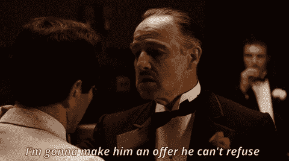

# 试图让你的观众采取行动？先利用这个技能

> 原文：<https://medium.com/swlh/trying-to-get-your-audience-to-take-action-look-to-utilize-this-skill-first-6600c74057ef>

## 大多数时候，它不仅仅是持续发布内容。

Photo by [Davids Kokainis](https://unsplash.com/photos/mC4uxCSg1Ts?utm_source=unsplash&utm_medium=referral&utm_content=creditCopyText)

> 很多人都在问自己——我到底是如何在网上赚钱的？

这个问题的答案可以有许多不同的方向。然而，所有的方向都源于练习和完善一种特定的写作技巧，这是许多人忽略的:

## **文案**

有这么多网站、帖子、课程和视频宣扬这项技能是有原因的——因为它能带来收入。

想想看:你已经[能够影响相当规模的观众](/swlh/how-to-create-an-opt-in-off-that-actually-gets-people-to-opt-in-6ddc2ad613b9)，并且你已经利用这些重复出现的观众进入一个可行的电子邮件列表；但是你仍然没有看到任何美元的符号，作为这个辛苦的单词的结果。

> 这可能是因为你期望内容与文案工作相关…

(不，更多的内容并不能弥补缺乏战略说服力的文案。)

*   如果你的电子邮件列表没有足够的注册人数，答案就是复制。
*   如果你的电子书或课程没有足够的销量，答案是复制。
*   如果你没有足够的每周播客下载量，答案是复制。
*   如果你的生意没有足够的客户，答案就是复制。
*   如果你一直在做广告，但仍然没有赚钱，是的，你仍然有一个复制的问题。

# 文案是受众转变的催化剂

文案是将你的受众从状态 A(他们不知道你是谁，他们浏览了你的内容，可能会表现出一些兴趣)转移到状态 B(他们加入了你的电子邮件列表，购买了你的产品，分享了你的帖子，成为了一个热情而忠诚的粉丝)。

有时候，我对互联网(或许你也对我感到厌倦)感到厌烦，他们谈论着让人们采取行动的最新和最伟大的策略。

我想让你知道我已经意识到的一个顿悟:**所有这些策略实际上都有效！**

> 然而，困难在于，如果你在没有真正理解文案的基础方面的情况下，就报名参加并实践所有这些不同的营销策略，这就像你在没有首先理解如何让你的火箭离开地球大气层的情况下，就概述了下一次伟大的太空探险…

不要先寻找星系间——花一些时间，学会看到更广阔的画面。

[在最基本的层面](https://writingcooperative.com/how-to-write-the-ultimate-blog-post-13edc83b8fd4)，你要发布的所有内容都有三个关键方面**:**

1.  确切地知道谁是理想的读者，
2.  知道你对他们做出了什么样的承诺
3.  知道你的文章包含了兑现承诺所需的所有**关键信息**。

如果你还不清楚这些部分，你可能想后退一步，重新评估你的内容生成…

# 当你理解了你的听众——就该说服了

Photo by [Hans-Peter Gauster](https://unsplash.com/photos/3y1zF4hIPCg?utm_source=unsplash&utm_medium=referral&utm_content=creditCopyText)

一旦你真正了解了那些分享你的帖子、给你投票和订阅你的名单的人**你就可以开始考虑把他们的状态从 A 转换到 b 了**

> 这是关于创造透明、道德的沟通，向你的追随者说明他们将如何解决你承诺帮助他们解决的问题。

这是一种专注、清晰、尊重的沟通，带有说服的意图。

**通俗地说——文案。**

# 学习入门文案的万全之策

Photo by [JESHOOTS.COM](https://unsplash.com/photos/-2vD8lIhdnw?utm_source=unsplash&utm_medium=referral&utm_content=creditCopyText)

在写这篇文章的时候，我发现很难找到一种方式来展示我是如何磨练文案写作技巧的。

剧透:我并不是想说服你买我的东西或者报名参加一门课程。

我不希望这变成一些元文章，说明和教育你的副本，以便让你从我这里购买一些东西。

这篇文章我不想这么做。

因此，我没有寻求帮助来阐释这种教育，而是偶然发现了作家兼博客作者麦克·金的一篇文章。

我认为他简明扼要地说明了我是如何学会写文案的(以及基础课程和大量的研究)。正如金所说，

> **“你应该这样做:**
> 
> 拿起笔记本
> 
> 拿起笔
> 
> 找到一封一流的销售信函
> 
> 用笔记本和笔手抄整封信
> 
> 重复步骤 4 五次。没错，五个。5x。辛科。"

我把这反映在我自己的教育上。

在将近两年的时间里，我创建了自己的内容并帮助超过 1200 人学习如何利用他们在博客上写的内容获得巨大的收视率和财政收入——我也报名参加了我应得的教育项目。

通过加入这些项目，我的电子邮箱会收到源源不断的“推销邮件”

这些邮件来自其他博主、内容创作者和企业，他们希望用标题和邮件正文中的*优秀的*文案向我推销和说服我。

> 我记下了我实际上暂停并点击的电子邮件。

我想——妈的……我是个聪明人——如果这个人能说服我点击，他们肯定是在做他们的文案工作。

我在我的电子邮件中创建了一个“滑动文件夹”,收集了我收到的所有写得很好的副本。

我用这份拷贝作为我未来发送给我的追随者的文章和电子邮件的蓝图。

我发现，这是提高你作为文案写作技能的基本方法。

## 从那里开始，总有一些课程和研究可以让你进一步磨练自己的技能，成为一名 T2 大师级的说服者。

The Vito Corleone of [Copywriting](https://media.giphy.com/media/l0Iy5Wa8fkAewhfW0/giphy.gif)

# 👋🏻你好，我是乔恩

想建一个赚钱的博客？你必须知道如何利用你的激情，并将其与人们想要的东西融合在一起。加入**1200 名其他人**的行列，参加我为期 6 天的免费**“创业博客”**课程，你将学会如何在经济上实现你的激情。

**🚨** [**> >世卫组织还想自己当老板？< <**](https://mailchi.mp/4b982beed325/free-6-step-course) **🚨**

(你还将获得一份免费的 ***“如何撰写终极博文”*** )

## 这篇文章发表在 [The Startup](https://medium.com/swlh) 上，这是 Medium 最大的创业刊物，拥有+388，268 名读者。

## 在这里订阅接收[我们的头条新闻](http://growthsupply.com/the-startup-newsletter/)。

