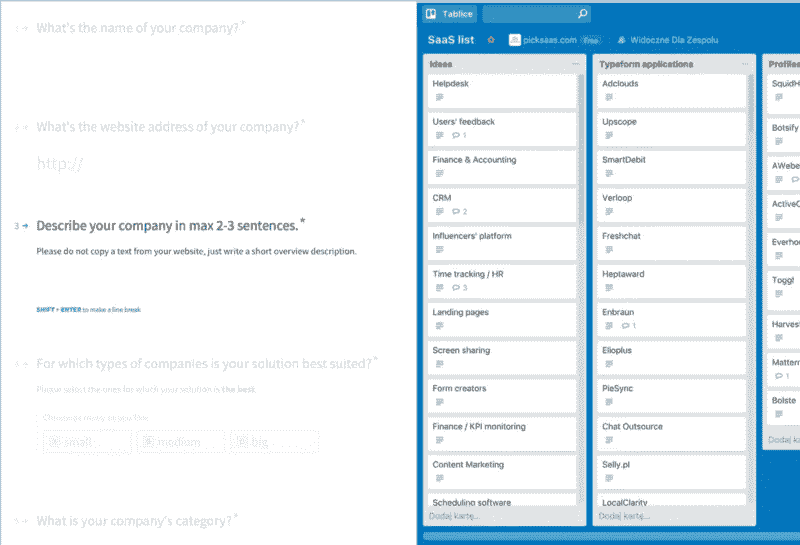
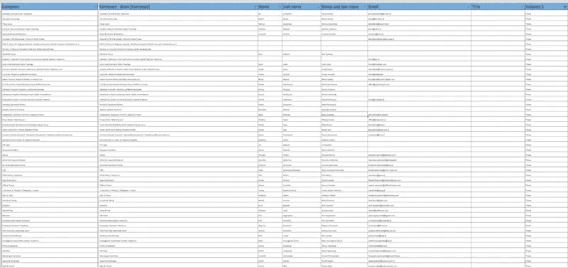
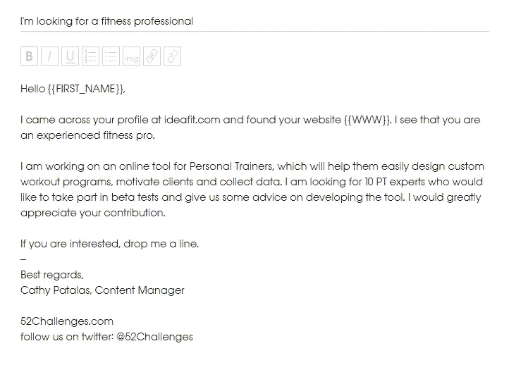
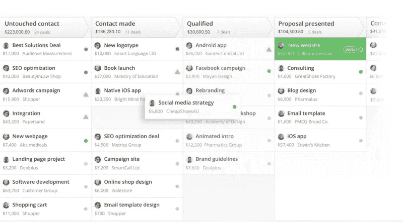

# 将 SaaS 应用程序转变为自动化销售引擎

> 原文：<https://medium.com/swlh/turning-saas-apps-into-an-automated-sales-engine-43e1f95e83b4>

我每天都在使用几十个云应用程序。在 picksaas 中，在过去的一年里，[我们已经测试了超过 150 个云应用程序](https://picksaas.com/blog/saas-products-usability),只是为了知道哪些应用程序应该推荐给我们的用户。知道有成千上万种不同的产品存在，识别出那些在他们所做的事情中非常优秀的产品是一个相当大的挑战。

不难看出，**同类最佳的云产品非常适合管理一个简单的流程，并且可以轻松地与其他 SaaS 应用程序连接**。这些产品太棒了，感谢像 [Pipedrive](https://picksaas.com/crm/pipedrive?utm_source=blog) 、 [Stencil](https://picksaas.com/design-platforms/stencil?utm_source=blog) 或 [Monday](https://picksaas.com/project-management/monday.com?utm_source=blog) 这样的应用程序，以及我们的用户，我们已经能够显著提高销售额，在没有专业设计知识的情况下创建漂亮的图形，并以更有效的方式管理项目。

# 充分利用您的云工具

就个人而言，这些应用程序是日常工作的伟大推动者，可能没有更好的方式来更有效、节省时间和销售更多。**但是云应用的真正潜力只有当你开始将它们连接在一起**，在众多不同的工具之间自动化数据流动时才可见。

然后，您会发现自己在繁琐的手动任务上浪费了多少时间，这些任务只需使用几个云应用程序就可以轻松实现自动化，并通过 Zapier 或本地应用程序的集成连接在一起。仅向您展示一个例子，我们在 picksaas 体验过，我们一直在使用 [Typeform](https://www.typeform.com/?utm_source=picksaas) 收集来自 saas 供应商的提交，以在 picksaas 上展示他们的产品。在我们收到提交后，需要相当长的时间来分析应用程序，并决定它是否符合质量标准，以在我们的平台上展示。但是提交的数量开始快速增长，所以我们必须通过使用 [Trello](https://picksaas.com/project-management/trello?utm_source=blog) 来处理请求和管理我们团队内部的测试过程。将提交的[字体](https://www.typeform.com/?utm_source=picksaas)复制并粘贴到 [Trello](https://picksaas.com/project-management/trello?utm_source=blog) 中变成了一项乏味且多余的任务。

*Typeform integrated with Trello*

但是我们为什么要在这上面浪费时间呢？！幸运的是，由于使用了 Zapier，我们能够**自动化这个过程，现在，我们所有的 Typeform 应用程序都自动变成了我们“SaaS 列表”板**中的[**Trello**](https://picksaas.com/project-management/trello?utm_source=blog)**卡片。无需花费更多时间进行手动复制和粘贴，这只是连接 SaaS 应用的数百种方式之一，让您的生活变得前所未有的轻松。**

# 构建销售流程

有两种方法可以接触到你的潜在客户。最好的情况是一个有效的、以内容为中心的集客策略，当你的客户需要你的产品或服务的时候，他们会找到你。但是要看到内向型战略的效果需要时间和大量的资源。如果你不想等待或想在此期间采取行动，而你的内容策略变得越来越有效，**你也可以转向外向销售**。

要实现对外销售，你基本上需要三样东西:

1.  **潜在客户/潜在客户** —可能对你的产品或服务感兴趣的客户名单，以及他们的联系方式
2.  联系他们的**方式和过程——这可能是一个有计划的电话脚本或电子邮件活动。**
3.  一旦你确定了顾客的需求，你就可以达成交易的计划。

# 收集外展系统的组件

## 潜在客户数据库

管理潜在客户数据库是一项挑战。虽然您可以使用复杂的外部软件来完成，但大多数情况下，您最终会将所有数据存储在 excel 文件中。那么为什么要把它复杂化呢？有了 [Google Spreadsheet](https://docs.google.com/spreadsheets/?utm_source=picksaas) ，你应该能够非常有效地处理你的潜在客户列表，添加尽可能多的信息，并根据你喜欢的标准过滤列表。有了[谷歌电子表格](https://docs.google.com/spreadsheets/?utm_source=picksaas)，你还能获得一个巨大的优势，那就是将你的数据库连接到其他云应用。这给了你无限的机会在许多不同的过程中使用收集的数据，包括销售。

*The prospects’ database in Google Spreadsheet*

## 电话与邮件

与你的潜在客户互动是销售过程中的一个关键点。你第一次接近客户的方式会对他在进一步的交流中如何看待你的公司产生巨大的影响，即使他没有决定购买你的产品。这就是为什么**应该优先考虑个性化**。

> *“您需要根据每位潜在客户的背景对每封电子邮件和语音邮件进行个性化处理，并每次都以整体信息为基础。”麦克·罗伯格，* [*销售加速公式*](https://www.amazon.com/Sales-Acceleration-Formula-Technology-Inbound/dp/1119047072)

虽然更好的方式是给你的客户逐个打电话和发邮件，让沟通 100%私人化，但这并不总是最有效的方案。如果你已经有了一个数据库，里面有数百家同行业的公司，这些公司都与可能需要你的产品或服务的高管有直接联系，那该怎么办？也许给所有人发电子邮件是个好主意，同时保持个人联系？

这可以通过使用[冷邮件应用](https://picksaas.com/cold-mailing?utm_source=blog)来实现，比如[啄木鸟](https://picksaas.com/cold-mailing/woodpecker?utm_source=blog)，它可以让你发送大批量的个人电子邮件，**安排自动跟进，并监控你感兴趣的潜在客户的反应**，他们可能会成为你的客户。创建电子邮件模板，标记将被替换为个性化信息的字段，选择将成为您的活动收件人的潜在客户，您的邮件就可以发送了。

*Email campaign in Woodpceker*

如果你不知道如何写一封有效的外联邮件，看一看一份关于冷邮件的综合指南也许是值得的。

> *“给小批量的公司发电子邮件会更有效，让交流尽可能私人化。”凯茜·帕塔拉斯，CMO*[*啄木鸟*](https://picksaas.com/cold-mailing/woodpecker?utm_source=blog)

# 管理对感兴趣的潜在客户的销售

尽管如此，发送数百封电子邮件很可能会有数十封回复，询问更多细节或你的报价。那么，在你的电子邮件活动之后，如何进行进一步的沟通和联系呢？

*Pipeline of deals in Pipedrive*

这就是 [CRM 系统](https://picksaas.com/crm?utm_source=blog)成为必备的地方。使用 [Pipedrive](https://picksaas.com/crm/pipedrive?utm_source=blog) 或 [Salesflare](https://picksaas.com/crm/salesflare?utm_source=blog) ，您将使用简单的交易管道处理进一步的沟通，规划每个客户要执行的活动。但 CRM 最好的一点是它与你的邮箱和日历集成在一起，让你可以直接从应用程序发送电子邮件，并将你选择的任何活动自动添加到你的日历中。

# 自动化应用程序之间的数据流

那么，将所有这些放在适当的位置，如何让它们一起工作呢？毕竟，你不想浪费时间从谷歌电子表格手动复制数据到[啄木鸟](https://picksaas.com/cold-mailing/woodpecker?utm_source=picksaas)然后到你的 [Pipedrive](https://picksaas.com/crm/pipedrive?utm_source=blog) CRM。它们应该作为一个完整的系统。

幸运的是，这是一件相当容易的事情。使用 Zapier，你可以设置一个自动化功能，**将谷歌电子表格中的任何新行添加到啄木鸟的****潜在客户列表中。同样，回复您活动的**联系人可以**自动上传到**[**pipe drive**](https://picksaas.com/crm/pipedrive?utm_source=blog)，在您的销售渠道中创建新的交易。借助 Pipedrive 的本机集成，您不必担心如何将活动与日历同步。这是通过与 Gmail 和谷歌日历账户的本地连接自动完成的。****

****

***The sales engine built using cloud apps***

**将这些联系起来并建立技术来支持你的销售会给你带来巨大的安慰，因为你可以专注于最重要的任务，即与你的客户沟通并实际销售你的产品，而不是担心记笔记或记住联系特定的公司。**

**建立销售环境并不是最困难的事情，但它绝对需要一些知识，特别是与销售团队的沟通模式，向他们展示如何利用这些工具所能提供的优势。尽管如此，花费一些时间或资源来建立这样一个结构化的系统绝对是值得的，因为根据我的经验，它通常会对公司的效率、时间管理以及销售渠道的数量和质量产生重大的长期积极影响。**

**-> [在你的公司安装一个自动化销售引擎](http://consulting.picksaas.com)**

***在*[*picks AAS*](https://picksaas.com/?utm_source=blog)*中，我们向客户咨询如何使用云解决方案实现业务自动化。***

***在我们免费的* [*15 分钟咨询*](https://calendly.com/picksaas/consultation/) *期间，我们将为您提供利用自动化销售、项目管理或营销系统发展业务的方法。***

***我们还分析云应用程序，并帮助我们的用户发现最佳应用程序来发展他们的业务。***

***要接收我们关于最佳应用程序的更新，以促进您的业务发展，您可以* [*订阅*](https://picksaas.us16.list-manage.com/subscribe/post?u=0a811ad254e7cd14718599e3a&id=bdf0cfd95) *我们的每周增长提示，或者关注我们的*[*Twitter*](https://twitter.com/picksaas)*。***

***原载于*[*picksaas.com*](https://picksaas.com/blog/connected-cloud-apps-for-sales)*。***

****

## **这个故事发表在 [The Startup](https://medium.com/swlh) 上，这是 Medium 最大的创业刊物，拥有 307，871+人关注。**

## **在这里订阅接收[我们的头条新闻](http://growthsupply.com/the-startup-newsletter/)。**

****