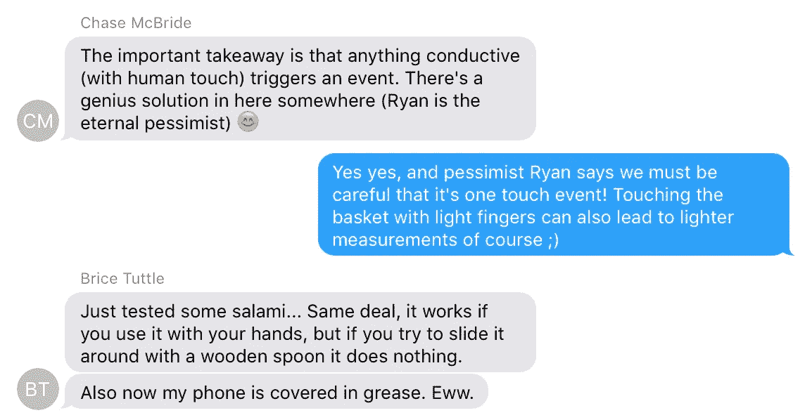
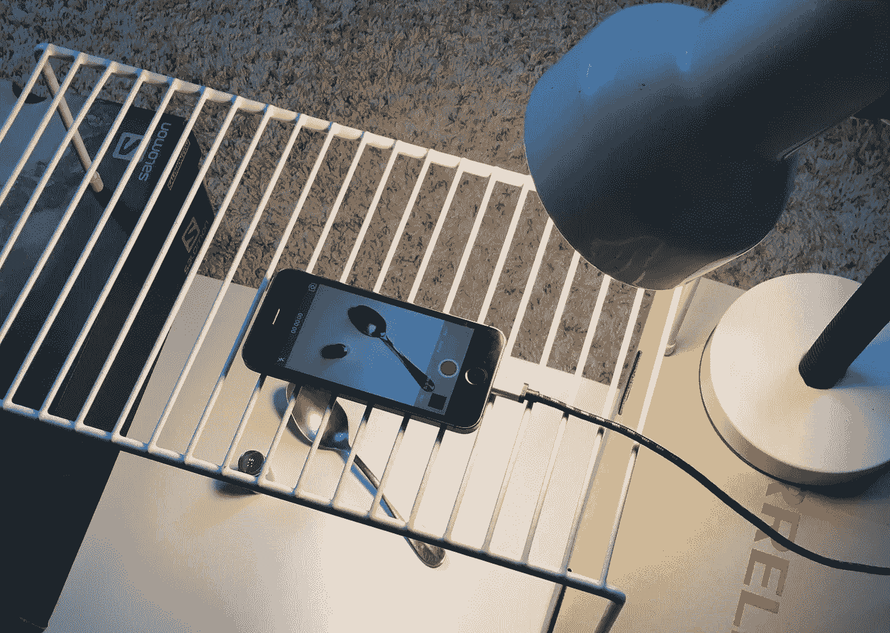

# 将 iPhone 6s 变成数字秤

> 原文：<https://medium.com/swlh/turning-the-iphone-6s-into-a-digital-scale-f2197dc2b6e7>

# 2015 年 9 月 9 日

iPhone 6s 发布，其全新的压力感应硬件亮相。一个简单但有点模糊的 API 文档很快就发布了。将该功能称为强制触摸或 3D 触摸的问题仍未解决。

# 2015 年 9 月 12 日

我的朋友蔡斯·麦克布赖德打电话来问了几个技术问题(粗略翻译:*创业想法*)。Chase 和他的朋友 Brice Tuttle 一直在讨论这个使用 3D Touch 的秤应用程序的想法。这是我第一次听说这个主意。快速浏览一下 API 就可以发现，我们不能简单地在屏幕上放置任何东西，然后获得一个*力*值。App Store 获得力值的唯一友好方式是用手指触摸屏幕，即使这样，返回的力也将是手指正下方的力。

我们在电话里讨论这个最初的障碍，这时我的兴奋变成了担忧。我开始回忆起其他时候苹果并没有对他们设备传感器的新用途感到兴奋，但我记得尽管如此，App Store 仍有一些创造性的变通方法，包括[一个使用振动来旋转手机的全景应用](https://www.youtube.com/watch?v=tTMxyNyTsAY)、[基于磁力计的螺柱探测器](https://www.youtube.com/watch?v=3DYbELuz36g)、[基于摄像头/闪光灯的心率监视器](https://www.youtube.com/watch?v=bnw4_b1Rbz4)，甚至 [Square 无处不在的耳机插孔读卡器](https://squareup.com/reader)。一个创造性的解决方案正在等待被发现。创造一个规模从不可能变成了一个挑战。

# 2015 年 9 月 21 日至 24 日

此时，我们知道返回的压力值是一个介于 0.00 到 maximumPossibleForce 之间的浮点数(1.00 是平均触摸)。我们仍然不知道如何在没有手指的情况下触发触摸，但我们有一些想法。

我有一台我喜欢的 5s，但如果决定要这样做，我需要预订一台 6s。离电话在我手里还有大约五天时间，所以在此期间我们能做什么呢？我们需要构建一个准系统测试应用程序来立即投入运行，并且我们需要想出一种在不接触屏幕的情况下称量物体的方法。没有它，我们会死在水里。

Chase 和 Brice 在旧金山，我在圣路易斯奥比斯波，我们在 FaceTime 上交流内心的想法，集思广益寻找解决方案。我们尝试了铝箔、手表电池、苹果、胡萝卜、硬币，甚至意大利腊肠——有一次我们用一片意大利腊肠做了一个肉篮子，用针作为导电把手粘在罐子盖上(如下图)。这些解决方案都不符合方便、普通和不易腐烂这三个条件。

Meat basket

# 2015 年 9 月 24 日

## iPhone 将于明天到货

尽管意大利香肠篮很有趣，但盲目地编写一些似乎注定要成为油腻的点击诱饵标题的东西正在燃烧我的士气。

我们再次思考了这个问题:**我们需要一个可以导电的物体，具有手指状的电容，形成一个手指状的触摸点，是一个家用物品，并且可以放置要称重的物品……**

传导、电容、普通和弯曲到单点接触。
**勺子是我们一直在寻找的完美解决方案。**

Gravity’s calibration screen

# 2015 年 9 月 25 日

每辆驶过的汽车都会引起轻微的恐慌。没有一个是棕色的。当 UPS 快递员终于在黄昏时分到达时，他勉强穿过街道，然后我把我的签名卖给了他，跑了进去。100 克校准重量、零钱罐和电子秤都准备好了，我下载了测试应用程序，并开始记录不同数量的美国镍币(每枚约 5 克)在金属勺上的力值。

0–10 nickels and then 10 nickels + 100g weight (on a metal spoon)

> “老兄。它完全是线性的”

由于力的值与重量呈线性相关，将任何力转换成重量就像记录已知重量的力并创建线性回归一样简单。甚至有可能使用一些统计数据来预测校准进行得有多好(有许多因素会影响校准)。我们选择使用硬币进行校准，其框架便于未来的国际化。

# 2015 年 9 月 29 日

## 等待审核

在不到四天的时间里，我们完成了应用程序，测试了我们的入职，建立了[一个准系统网站，](http://gravity-scale.com)整理了我们的营销材料，计划了发布策略，并提交给了苹果。

# 2015 年 10 月 7 日

## 拒绝

不幸的是，Gravity 因为有误导性的描述而被拒绝了，我们马上就知道了原因:app store 上有几十个“scale”应用程序。问题是，其中 80%是笑话应用程序， *"* 仅用于娱乐目的 *"* ，另外 20%试图使用你的 iPhone 的倾斜度来称重，一旦它被放在一个充气袋上并使用一枚硬币校准。Gravity 很可能与恶作剧应用混淆，并因声称它是一个真正的工作秤而被拒绝。

Screenshot from an App Store search for “digital scale”

## 上诉

就在同一天，我在一些鞋盒上搭建了一个厨房架子，制作了一个小演示视频，并提交了一份上诉，以证明重力是一个真正的工作秤，可能会与恶作剧应用程序混淆。

## 演示视频

# 2015 年十月十五日

## 无秤应用

长话短说，电话中的最终答案是**体重秤应用的概念不适合应用商店**。

至少可以说，我们过去和现在都很失望，但我们理解苹果这次可能不允许 scale 应用的一些原因。

## 手机损坏？

可能是因为如果人们试图在手机上放置重物，屏幕可能会损坏——问题是传感器的重量不会超过最大重量约 385 克(0.85 磅)，那么轻的重量很难损坏屏幕(重力也会发出亮红色警告)。除此之外，很难在勺子上平衡重物，但人就是人，我们完全理解为什么苹果没有宣传 6s 的新防水特性。

## 滥用 API？

3D Touch 背后的硬件确实是令人兴奋的事情，我们还没有看到它的所有创造性应用被探索。我们知道 Gravity 奇怪地使用了 API 和 3D 触摸传感器，但也知道有许多已发布的应用程序以新颖的方式使用了 iPhone 的硬件；我们也意识到这些应用程序并不总是能立即进入商店。

## 吸毒？

苹果在道德和伦理上有责任做出正确的选择，无论是与[邦联旗帜](http://www.usatoday.com/story/tech/2015/06/25/apple-pulls-confederate-flag-games/29287163/)、[改变毒品法](http://fortune.com/2015/02/13/apple-marijuana-social-network/)，还是[使用表情符号打击欺凌](http://www.adweek.com/news/advertising-branding/first-emoji-ever-made-social-cause-launches-today-its-eye-bullying-167699)，我们对此表示尊重。有些人立即看到了药物的重力内涵(勺子肯定没有帮助)，但大约 1-3 克的准确度，没有人会用重力称量药物，但它仍然足够好地让我妈妈确定她给我的信需要多少邮资。

# 那现在怎么办？

> “一个拥有超过 150 万款最佳应用的应用商店。超过 150 万个精心挑选的、令人敬畏的、令人惊讶的、谁知道手机能做什么的应用程序。”—苹果的[神奇应用广告](https://www.youtube.com/watch?v=E3AIeOBTN0g)

我们非常尊重苹果公司用来维持高质量应用程序选择的主观过程，并期待看到 3D Touch 的其他创造性应用，但我们也希望有一天 Gravity 能够成为一个精心挑选的，任何人都可以在 App Store 上下载并放在口袋里的手机应用程序。

## 想了解更多？
在[gravity-scale.com](http://gravity-scale.com)报名重力更新。

# 像这样？你可能会喜欢我的另一个应用: [**黑盒**](https://appsto.re/i6YF4s6)

发表于*[**# SWLH**](https://medium.com/swlh)**(***《创业》、《流浪癖》、《生活黑客》)**

******