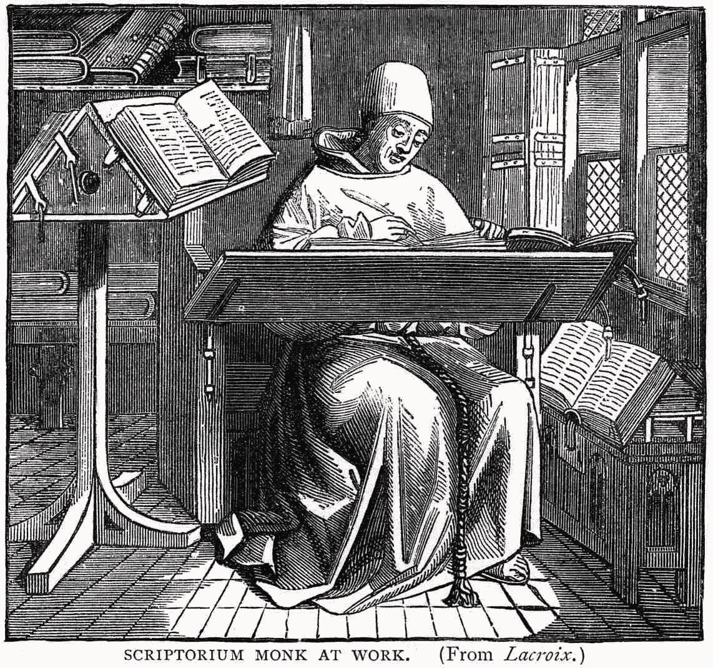
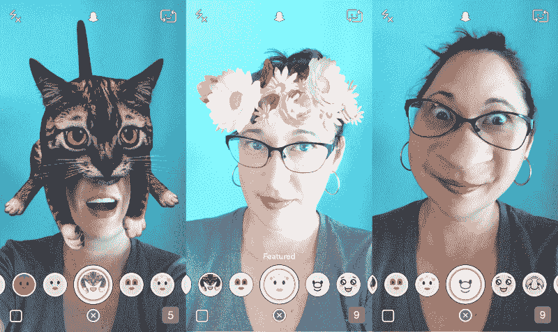

# 电视不错。阅读不好。

> 原文：<https://medium.com/swlh/tv-good-reading-bad-cd9f405fa76e>

在 15 世纪之交，书籍是一种稀缺商品，很少在教会之外使用。几个世纪以来，它们都是由僧侣用羽毛笔和墨水手写的，僧侣通常是他们社区中唯一识字的人。完成一篇原文或复制一小本可能需要几个月的时间。像《圣经》这样较大的书可能需要几年时间。

古腾堡活字印刷术的出现是一项革命性的技术。不到一个世纪，它的繁殖能力改变了欧洲的面貌。到 16 世纪之交，它带来了超过 1.5 亿的新印刷，以及识字率的大幅上升。

知识——曾经是教会和社会精英独享的珍贵工具——开始渗透到大众中，慢慢瓦解了长期的垄断。这种知识的爆炸性传播和它所播种的思想直接导致了新教改革、科学革命和欧洲文艺复兴。

# 人类与讲故事

尽管知识的传递发生了巨大的转变——从口头到文本——但主要的吸引力还是一样的:讲故事。无论是洞穴绘画、古滕贝格出版社出版的书籍，还是 Snapchat 故事，叙事总能让我们理性化并理解我们的世界。

实验心理学家弗里茨·海德和玛丽安·西姆的以下研究就是一个很好的例子。在观看了一段展示一些基本几何图形的动画短片后，研究对象被要求描述他们所看到的。

正如你可能猜到的那样，几乎所有的参与者都将形状拟人化，并以故事的形式讲述事件。这些形象被赋予了广泛的特征:邪恶、勇敢、嫉妒、坏脾气，这些特征引导着他们在银幕上的行动故事。叙事使原本无意义的事件有了实质内容；它也有助于我们的记忆和吸收信息的能力。

我们对故事的吸引力可能可以追溯到语言的起源，但我们讲述和与它们互动的方式随着技术的发展而发展。我们的符号，曾经是墙上模糊的图像，演变成复杂的文字系统。基本的喉音很快让位于口头传统。摄影让位给了电影，为视频和数字媒体开辟了道路。

由我们支配的一系列插座、应用程序和经济实惠的数字硬件正在创造一种极其丰富的体验，这种体验正在彻底改变我们创造和消费知识的方式。虽然古滕贝格的出版社在几百年前确实做了同样的事情，但它只能通过文本和静态图像传递体验，覆盖范围相对有限。相比之下，当今数字媒体的视觉效果要好得多。

# 油管（国外视频网站）

在 15 世纪初，只有少数人能够阅读或写作——甚至更少的人有任何分发他们的书面内容的意图。几乎在一夜之间，印刷机使大规模生产书面文字成为可能，引发了全球社会和文化的变革。

YouTube 相当于视频。

从电影诞生到 20 世纪 80 年代，电影制作需要昂贵的高科技设备和发行渠道。当然，家用摄像机在 80 年代变得相当流行，但质量一直很差，直到 2000 年代中期。

快进到现在，技术拼图已经就位。不仅有可能用数字设备拍摄一部故事片，还有各种各样的平台可以让数百万人看到艺术家的作品。

2010 年 7 月 24 日，雷德利·斯科特和凯文·麦克唐纳正是这样做的，探索我们新时代的民主本质。他们的项目“一天的生活”促使全球的电影制作人拍摄他们的生活片段，并提交他们的镜头。随着这一天接近尾声，电影制作人的任务是编辑来自 192 个国家的超过 4500 小时的镜头。结果，一旦削减和抛光，是显着的:

# 突然的

数字技术的无处不在不仅打破了传播的障碍，它还把录音设备放在了每个人的手中。有史以来第一次，地球上几乎每个人都将拥有一部手机形式的相机。结果呢？

> 去年拍摄的照片比电影史上任何时候都多 50 倍。

直到最近，我们一直将这些强大的设备(以及它们产生的无限图像)作为旧技术形式的复制品:照相机、摄像机、暗室、编辑卷轴、电话。

然而，像 Snapchat 这样的早期视觉应用正开始改变我们讲述故事的方式。

一个微小的皱纹，就像一个快照的短暂存在，似乎对我们创造和消费的视觉内容的普遍性和一次性视而不见。摄影曾经是一项长达数周的工作，包括购买胶片、拍摄和冲洗；我们现在在不到 24 小时内拍摄、编辑和告别我们的材料。

传统视觉叙事的蓝图正在被迅速重新构想。

我们创建、存储和编辑视频越来越容易，这创造了一种新的视觉语言，允许我们开发和理解越来越复杂的叙事。现在，我们的材料可以在可访问的平台上自由共享，我们的同行可以随心所欲地重新操纵我们的工作。

和文本一样，移动图像现在也可以进行各种各样的重组:它们可以被压缩、拉伸、剪切和复制无数次。有了这种新发现的流动性，我们的移动图像拥有了和文本一样的创作和消费能力。

> 正如我们的技术给了我们除了打电话或发短信之外与他人交谈的无数方式一样，很快将会有各种各样的方式来捕捉、操纵和传播我们的视觉故事。

# 增强现实

几千年的口头文化最终被印刷术引发的文学革命所取代。站在数字革命的边缘，似乎另一个巨大的转变可能很快会降低识字的重要性，并将我们转变为一种视觉故事讲述者的文化。

我们的世界在不停地录制和广播，毫无疑问，视频比文本提供了更丰富的体验。

此外，我们的数字硬件正在快速转型。

> 相机已经从吸收和产生图像的机器转变为能够识别和视觉增强周围物体的机器。

Snapchat 的镜头效果和 Pokemon Go 中的捕捉模式就是最好的例子。

iPhone 7 中的摄像头生产成本仅为 26 美元，这表明这项技术不仅变得更加实惠，而且更加紧凑。

> 随着它成为我们生活中更大的一部分，我们周围的虚拟世界将与现实世界融为一体。

有趣的是，这将是我们学习过程的一部分。打开一个增强的过滤器并在心脏手术中得到指导，而不是像传统文本一样阅读图表并填充静态介质的间隙，这将有多大帮助？

这种增加的丰富性也将适用于讲故事。穿过一座城市，打开一个增强的滤镜，进行一次你选择的历史之旅，这将是多么迷人的一件事？巴黎会突然出现，就像第一次世界大战时期一样。或者，街道可能成为一个广阔的 RPG，有一些增强的角色引导你通过一系列的故事情节。

当然，会有我们无法预见的应用，但关键因素将是相机作为镜头的能力，可以识别我们周围的元素。

知识将不再唾手可得，它将围绕在我们周围，随时可得。

无论我们是想观察一种飞过我们视野的蝴蝶，还是想检查一辆经过的公共汽车的路线，或者想了解更多我们正在漫步的街区的历史，我们的周围环境很快就会成为信息的口袋，我们的镜头将允许我们随心所欲地探索和分析。

> 这项技术的即时性将慢慢消除我们查阅文本的需要。

我们将拥有一个信息世界，而不是退回到图书馆或打开我们的手机或笔记本电脑，就在我们眼前——一个增强现实界面，它将像几百年前印刷机一样彻底改变和启发世界。

***注:*** *作者承认他们对书面文字的依赖代替了日益逼近的扩充的乌托邦。*

> 如果你喜欢读这篇文章，请点击页脚的♥按钮，这样更多的人可以欣赏伟大的设计！

嗨，我是[丹尼尔](http://www.danieleckler.com)。我创办了一些公司，包括 Piccsy (acq。2014)和 EveryGuyed (acq。2011).我目前对新的职业和咨询机会持开放态度。通过[电子邮件](mailto:hi@danieleckler.com)联系。

本文由[肖恩·朗肯](http://www.shaunroncken.com)合著。

# 你可能也会喜欢:人性化设计

我写的一篇互动文章，探索了拟人化设计的过去、现在和未来。此外[还可用作会议、活动等的演讲](http://designforhumanity.danieleckler.com/)。