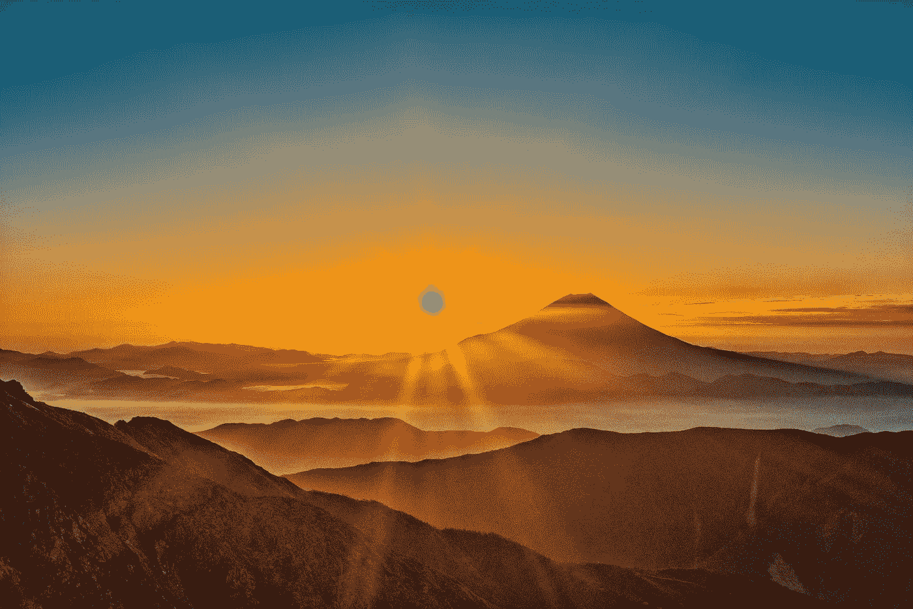

# 人类的黄昏 1.0

> 原文：<https://medium.com/swlh/twilight-of-humans-1-0-fc20c1f3db69>

## 新的黎明

Mt. Fuji

> “首先我们制造工具，然后他们制造我们。”
> 
> 马歇尔·麦克卢汉

作为企业家和领导者，我们的工作是扫描技术融合的未来前景，以预测和利用机会，避免潜在的陷阱。随着技术对现有秩序和地位的破坏…