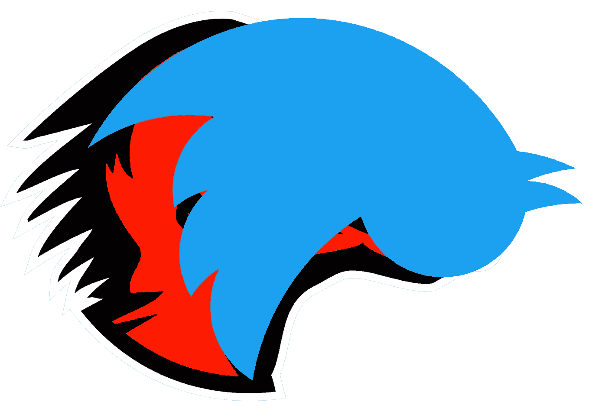

# Twitter 可能成为下一个 Mozilla

> 原文：<https://medium.com/swlh/twitter-could-be-the-next-mozilla-e788e3bfd841>

你还记得网景公司吗？这家公司创造了世界上第一个商业网络浏览器和服务器。

即使你从未使用过这些产品，你也可能熟悉网景对网络的一些持久贡献，如 JavaScript 语言、SSL 安全协议或 *< img >* 标签……而且你很可能在某个时候使用过网景浏览器的开源继任者 Mozilla Firefox。

网景公司成立时是马赛克通信公司。(事实上，他们的 [1994 网站仍然在线](http://home.mcom.com)，值得一看！)公司改名是为了避免与较老的 NCSA Mosaic 浏览器冲突。1995 年 8 月，网景公司在纳斯达克股票交易所上市，在交易的最初几个小时里，它的股票上涨了近三倍，以超过 20 亿美元的市值收盘——这对一个没有利润的公司来说(在当时)是闻所未闻的。在亚马逊、谷歌或脸书之前，网景是最早的轰动一时的互联网公司。

网景公司的衰落几乎和它的崛起一样迅速。微软开始向浏览器开发投入大量资金，并将 Internet Explorer 免费与 Windows 捆绑在一起，从而扼杀了商业浏览器的市场。服务器产品也面临着激烈的竞争，尤其是来自免费的 Apache 服务器项目。失去了收入来源后，网景公司首先将其浏览器开源，试图对抗微软在 R&D 的巨头，最终在 1998 年末被美国在线收购，交易完成时价值 100 亿美元。网景公司的股东大概很高兴，尽管最后没有其他人真正高兴。

开源的 Mozilla 浏览器在 AOL/Netscape 的支持下继续生存。几年后，当 AOL 对 Netscape/Mozilla 浏览器失去兴趣时，这个项目被剥离出来，成为非营利性的 Mozilla 基金会。与此同时，随着微软的 Internet Explorer 开发多年停滞不前，浏览器的命运发生了转变，为 Mozilla 的浏览器(新命名为 Firefox 的精简版)打开了一扇窗。

今天，Mozilla 基金会是开放网络的核心参与者。作为一个非营利组织，它提供了一个与三大巨头——谷歌、苹果和微软——利益的重要平衡，这三大巨头拥有其余的网络浏览器引擎。Mozilla 还开发了许多其他项目，有些不成功，坦率地说缺乏目的(Firefox OS)，有些为困难的技术问题提供了重要的解决方案(Rust 编程语言)。如果没有 Mozilla，今天的网络会更加贫穷。

这一切和 Twitter 有什么关系？今天的社交媒体公司看起来很像 1998 年的网景公司。Twitter 是最初的社交媒体先驱之一，但它还没有达到脸书那样的全球增长水平。Twitter 的核心产品已经停滞不前，而该公司的 R&D 似乎被浪费在完全独立的应用程序上，如 Vine 和 Periscope。(在网景公司，高管们希望公司开发一个“群件套件”，而不仅仅是一个浏览器。Twitter 缺乏关注似乎也是类似的情况。)

和浏览器一样，Twitter 实际上在现代互联网上提供了一个重要的基础设施服务。只是不清楚这本身是否具备成长型上市公司的素质。就网景公司而言，答案最终是“不”。对于 Twitter，答案也越来越像是“不”。

最新消息(截至 2016 年 10 月 14 日)表明，Twitter 不会被收购:Salesforce 公开表示有兴趣，但显然已经放弃了任何交易，其他传闻中的收购者几周前就否认了他们的兴趣。

这给 Twitter 带来了什么？该公司当然会继续存在，但很难想象其股价会很快回升。Twitter Inc .的收入正在增长，但它一直在以每年约 5 亿美元的速度亏损。新管理层将不得不大幅削减开支以使公司扭亏为盈。这种以利润为导向的裁员很容易成为一种恶性循环，最终会破坏 Twitter 这个产品的优点。

Twitter 应该有一条更积极的前进道路，Mozilla 的例子提供了一个可以效仿的榜样。将该平台的核心剥离出来，成为一个非营利组织，即“Tweetzilla 基金会”。让释放出来的推文流成为网络通信基础设施的重要组成部分。开放 Twitter-the-company 多年前关闭的 API，同时试图迫使用户远离第三方客户端(这样做是为了更容易提供广告，但它在开发人员社区中对 Twitter 产生了持久的恶意)。

与此同时，这家盈利性公司——姑且称之为“推特媒体公司”(Twitter Media Inc .)——应该专注于在推特平台上打造最好的消费者体验。双倍享受受益于 Twitter 实时反馈的直播和其他媒体体验。让广告平台如此引人注目，以至于第三方 Twitter 客户想要分一杯羹。这就是谷歌的 AdSense 计划:它在数百万个网站上提供广告，但它不需要控制网络本身。

没错，Twitter Media 将会是一家比现在的 Twitter 更小的公司，而让 Tweetzilla 基金会起步将会很困难(现在 Twitter 的运营成本可能是巨大的)。但这是一个更积极的未来愿景，而不是看到 Twitter 公司陷入一种可悲的运营，试图从一个封闭的社交网络的核心用户那里榨取越来越多的利润。

目前公开上市的 Twitter Inc .的董事会可能不会批准任何非盈利性的分拆——但如果 Twitter 私有化了呢？随着股价下跌，价格标签变得更容易接受。众所周知，史蒂夫·鲍尔默对 Twitter 很感兴趣，拥有该公司约 5%的股份。像鲍尔默这样财力雄厚的富有远见卓识的人可以提出收购 Twitter 的全部股票，将公司私有化，然后创建基金会。

作为一种商业努力，这不会立即盈利。但是对于一些想在互联网历史上留下自己印记的人来说，它可能有独特的吸引力。(他可以简单地称之为“鲍尔默基金会”，只是为了让它更明显。)而私人 Twitter 媒体最终仍可能成为一家高利润的公司。

这是一个相当疯狂的场景。我在这里用鲍尔默作为一个极端的例子，说明即使是私人投资者也有可能把 Twitter 变成比现在重要得多的东西。

然而，任何这样的道路都需要从愿景开始。如果你喜欢 Twitter，为什么不在评论里分享你的呢？