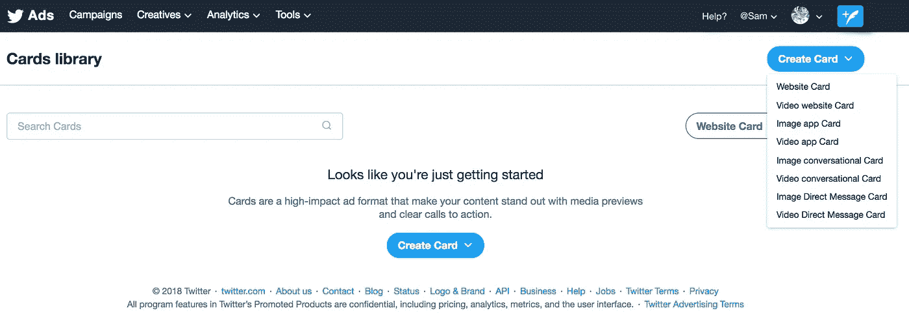
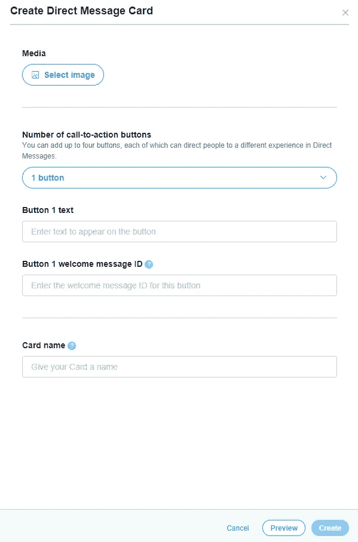
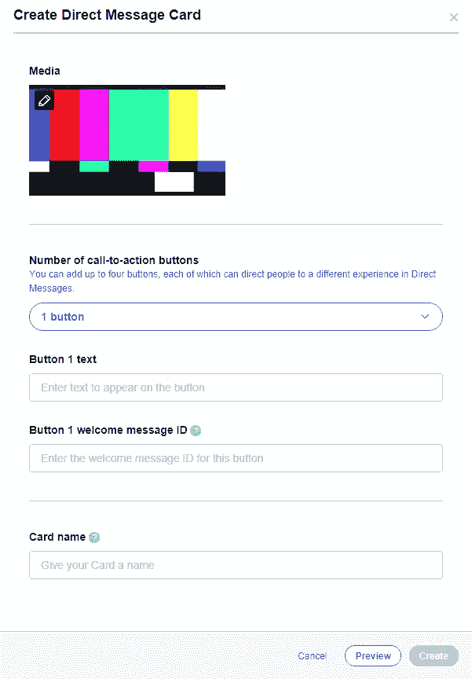
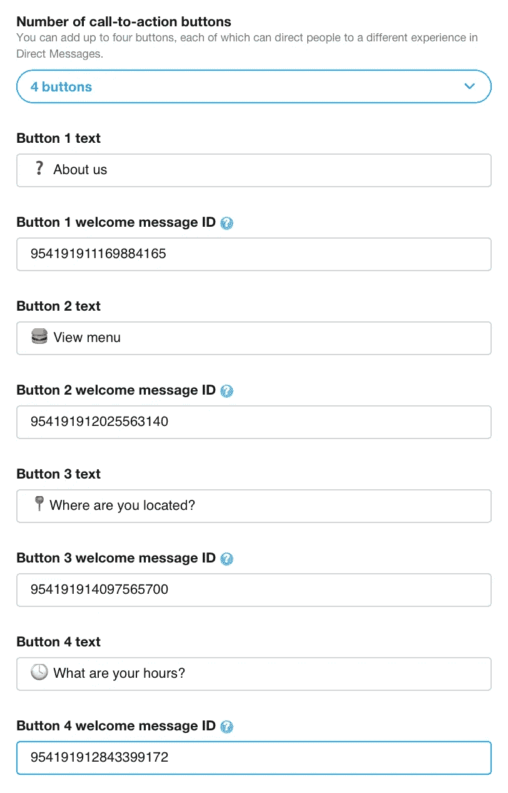
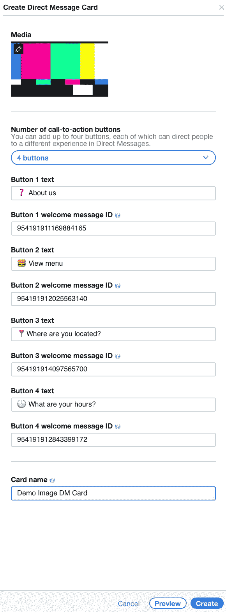
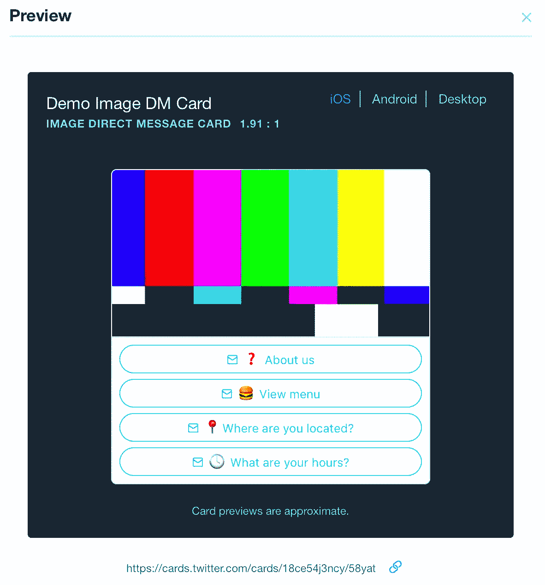
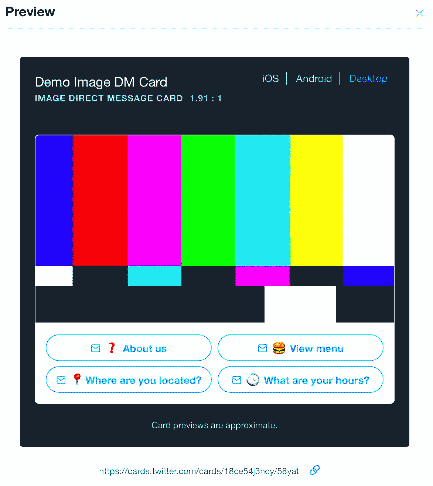
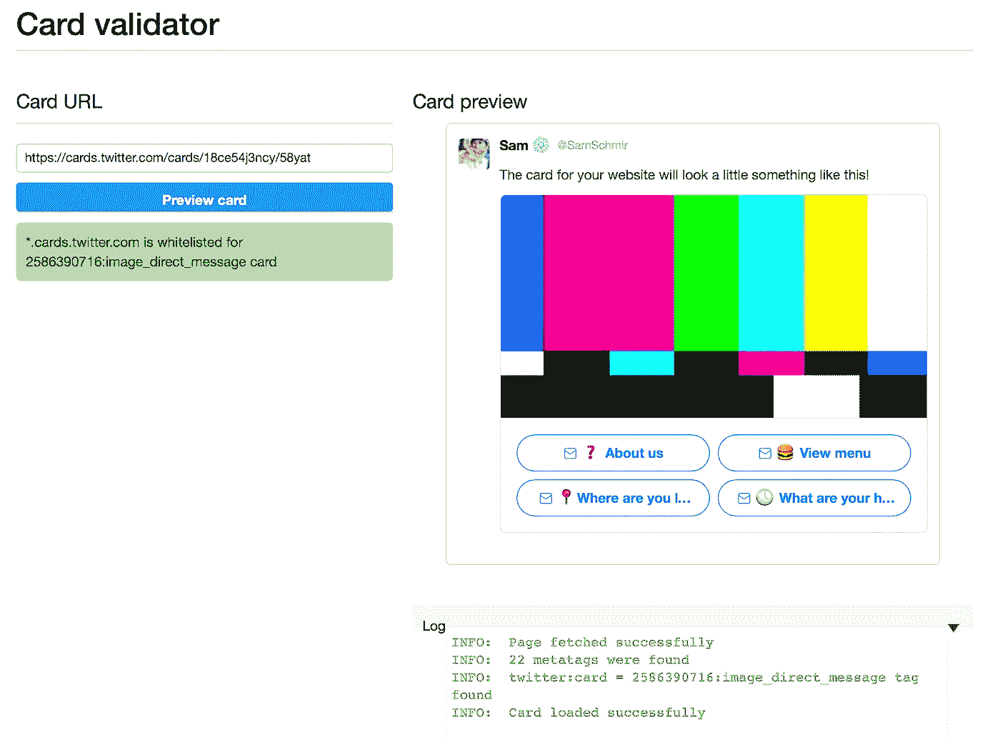

# Twitter 直接消息卡

> 原文：<https://medium.com/swlh/twitter-direct-message-cards-ff619bcdaab>

Twitter 已经使企业有可能通过使用 Twitter API 或第三方工具构建的直接消息机器人来加快客户服务。为了进一步推动对直接消息机器人的发现，Twitter 还推出了直接消息卡。这种特殊的卡可以创建两种不同的格式，图像和视频，也包含多达 4 种不同的 CTA。CTA 尤其有助于引导客户在 DMs 中获得不同的体验。

*注:* [*直接消息卡*](https://business.twitter.com/en/help/campaign-setup/Create_DM_Card.html) *公开提供，但仅在 Twitter 广告 UI 中向托管广告人显示。任何拥有 Ads API 访问权限的人都可以创建和使用它们。*

## 下面是如何制作一个直接的信息卡

*   前往[ads.twitter.com](https://ads.twitter.com)创意人员>卡片>创建卡片>图片或直接留言卡片

*   您应该会看到显示以下内容的屏幕…

*   您会想要将图像添加到您的卡上，确保它的比率为 5:2 或 1.91:1，并且小于 3 MB。如果您使用的是视频，请确保其比例为 16:9。*查看所有规格* [*此处*](https://business.twitter.com/en/help/campaign-setup/advertiser-card-specifications.html)

*   上传媒体后，您将进入添加 CTA(行动号召)按钮的部分。根据你在目的地管理系统中积累的经验，你最多可以添加四个。

在本例中，我将使用所有四个 CTA 按钮进行演示。

*注意:您只能为您为其创建 DM 卡的特定帐户输入欢迎消息 id。*

*   给你的 CTA 添加一些吸引人的文字。这些卡支持多达 24 个字符以及表情符号。

如果我为一家餐馆制作这张 DM 卡，它看起来会像这样。注意不同的 id。每个 ID 导致不同的场景，因此，四个 CTAs 文本可以吸引客户/用户的注意力。

*   你所要做的就是选择一个名字，然后创建！

*提示:预览卡片，先睹为快，然后找到网址*

# 要查看直接消息卡的使用案例，请参见这个 [Tweet 集合](https://twitter.com/SamSchmir/timelines/897240831123501056)

## 这个故事发表在 [The Startup](https://medium.com/swlh) 上，这是 Medium 最大的企业家出版物，拥有 287，184+人。

## 在这里订阅接收[我们的头条新闻](http://growthsupply.com/the-startup-newsletter/)。

