# Twitter Live

> 原文：<https://medium.com/swlh/twitter-live-3d4efa54c8e3>

# 如果这个特征存在的话，我们会经历怎样的共和党初选辩论。

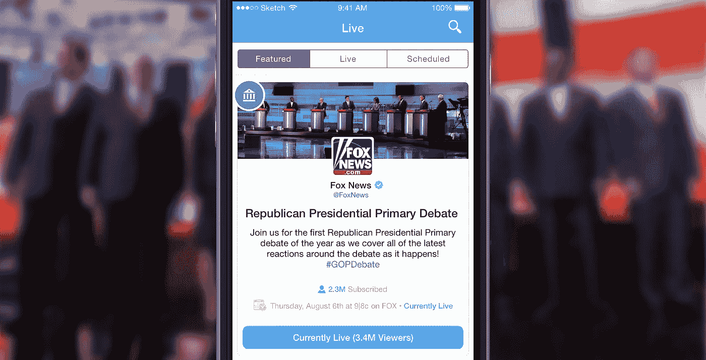

在这篇文章中，我将探索一个我认为 Twitter 应该引入的新特性。我将称之为:推特直播。我完全知道公司内部正在进行一项名为“[闪电项目](http://www.buzzfeed.com/mathonan/twitters-top-secret-project-lightning-revealed#.enWXlXwYa)”的工作，但我受到了克里斯·萨卡的帖子的启发:[“Twitter 可以是什么样的”](http://lowercasecapital.com/2015/06/03/what-twitter-can-be-2/)，所以我自己尝试设计了我认为**应该是什么样的**。

> **Twitter Live** 的前提是给世界一个**策划的** **特定事件的共享体验**，当**发生时**。

下面的设计是在 3 天的时间里完成的，所以原谅我缺乏润色，因为我赶着在共和党初选辩论时把它寄出去了。也就是说，我试图尽可能保持品牌。我希望这看起来像是 Twitter 明天可以实现的东西，而不需要重大的重新设计。

好了，够了，让我们开始吧！

# 去他妈的。我们会现场直播。

现在在应用程序的底部标签栏会有一个新图标叫做: **Live** 。

点击它会把你带到这里:

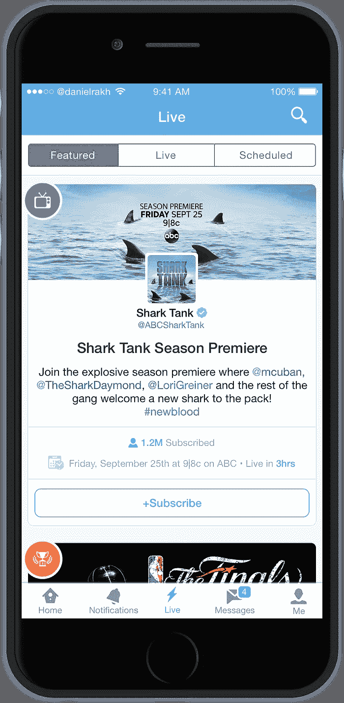

The icons on the top left hand corner will represent various types of events to give the user a quick visual cue about what the event is about as they scroll through the feed.

## 特色活动:

您将看到各种活动的提要，这些活动要么是当前正在直播的，要么将在不久的将来播出。对于当前未上线的活动，您可以订阅活动上线时的通知。

其中一些事件可能是:

*   电视节目
*   体育赛事
*   发展新闻
*   政治事件
*   颁奖典礼
*   音乐会/节日

让我们滚动事件，看看发生了什么…

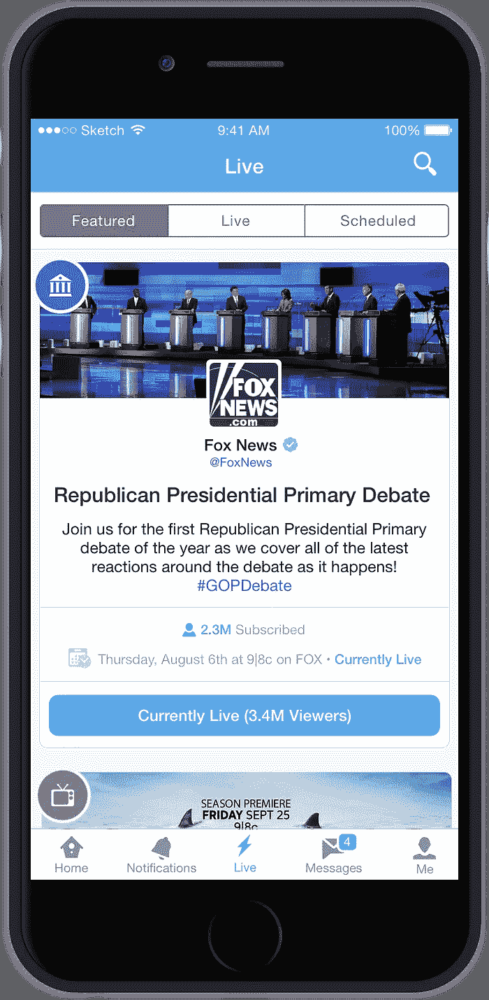

哦，看那个…共和党初选辩论正在进行中。好极了。我们想加入它。

所以我们点击“当前直播”按钮:

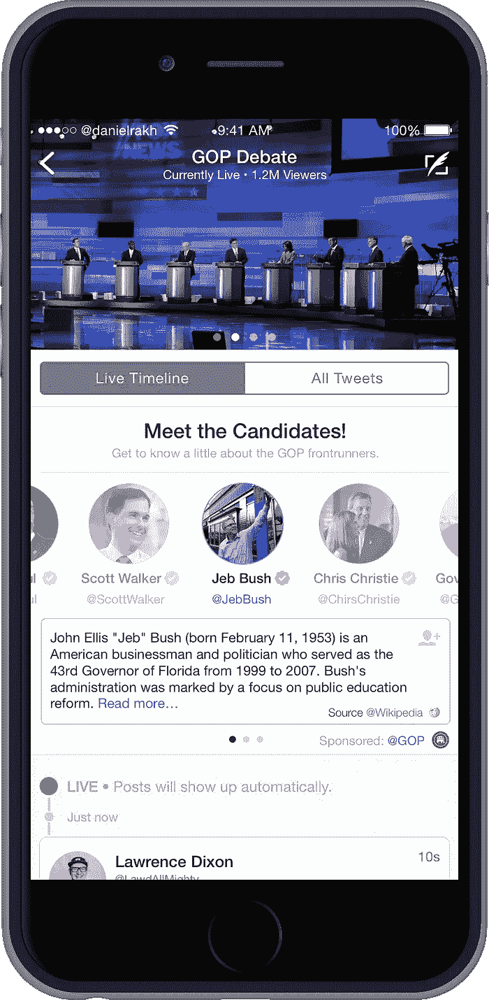

Pictures throughout the event appear on top in a swipeable carousel. Tapping on a candidate brings up a short blurb of information about them.

## 会见候选人:

啊！在我们需要的时候提供我们需要的信息。我们看到了共和党提供的一系列最优秀的候选人，只需点击他们的图标，我们就可以了解他们的一些信息，如果我们愿意，还可以选择阅读更多信息。

每场活动都将有一张特制的定制“卡片”附在顶部，这将提供比你的标准推文更丰富的体验。

哦，太好了，看起来我们可以刷卡了…就这么办吧！

我们在卡上向左滑动:

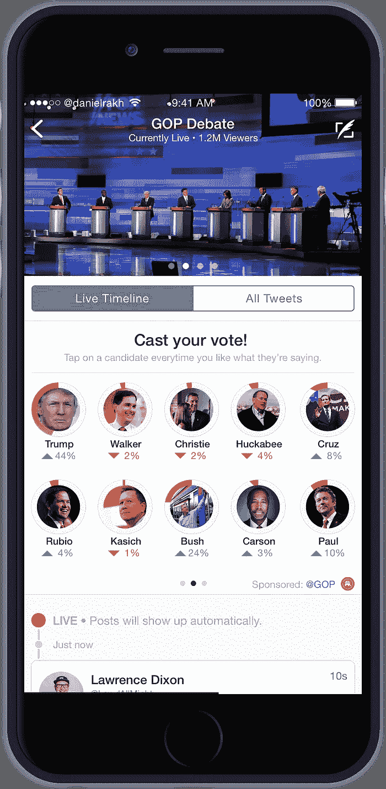

Tapping on a candidate everytime you like what they’re saying gives instant valuable insight at scale. Polling could be applied to anything form politics to concerts.

## 投票吧:

随着辩论的进行，你可以实时看到人们对每个候选人的感觉，并且**参与**体验**。**

这是 Twitter Live 设计的核心。你不仅看到了 Twitter 上其他人看到的事情，而且还一起经历和参与。

> 好像全世界都一起坐在客厅里。

啊伙计！你刚刚意识到你忘了遛狗。现在你会错过被问到的问题。别担心。向左滑动。

你走到外面，拿出手机跟着走:

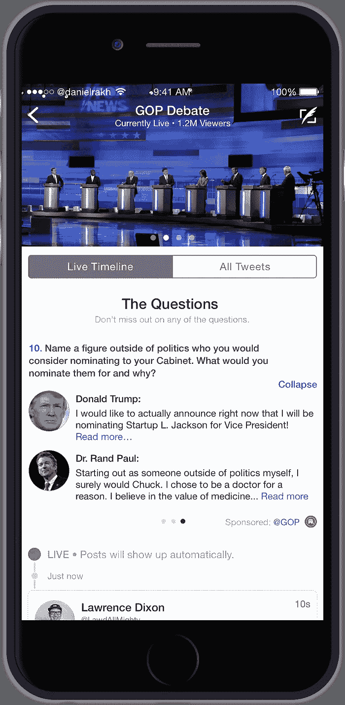

## FOMO 没有莫:

哦看那个。看起来唐纳德·特朗普刚刚宣布他将提名[初创公司 l·杰克逊](https://twitter.com/StartupLJackson)为副总裁。不错的选择，唐纳德！

我们甚至不需要再坐在电视机前就能跟上。这是实时的信息传递给你，因为它是以一种互动的方式发生的，我们还没有经历过。

嗯……底部那个红色闪烁的小点是什么？让我们刷卡吧…

## 实时时间线:

啊。这里是 Twitter Live 的核心: **Live Timeline** 。

实时时间线正是如此。无需刷新，你会看到由 Twitter 编辑团队精心挑选的推文。因此，这些推文可能会在短时间内获得大量点赞或转发，或者只是提供一些与当前相关的见解。实时时间线的美妙之处在于，你可以滚动到事件的任何一点，看看在那个特定的时刻什么是重要的。

> 你有一个擦洗器来快进或倒退一个事件。

说到时光倒流，让我们离开这场辩论，跳进我们的时间机器，回到大约 2015 年 6 月。

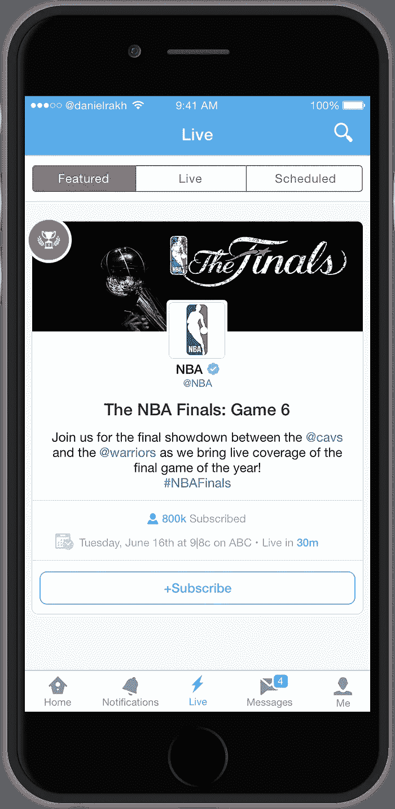

Tapping on the subscribe button will notify the user when the event goes live.

## 订阅活动:

啊！骑士和勇士的第六场比赛。这应该不错。看起来 30 分钟后就要上线了。让我们订阅活动，以便在活动开始时收到通知。

订阅一项活动会建立一种难以复制的预期。它还让用户了解情况。比赛什么时候开始？谁在乎。推特会告诉你。

> 把它当成任何即将到来的事件的电视指南。

快进两个小时，我们正在看比赛…

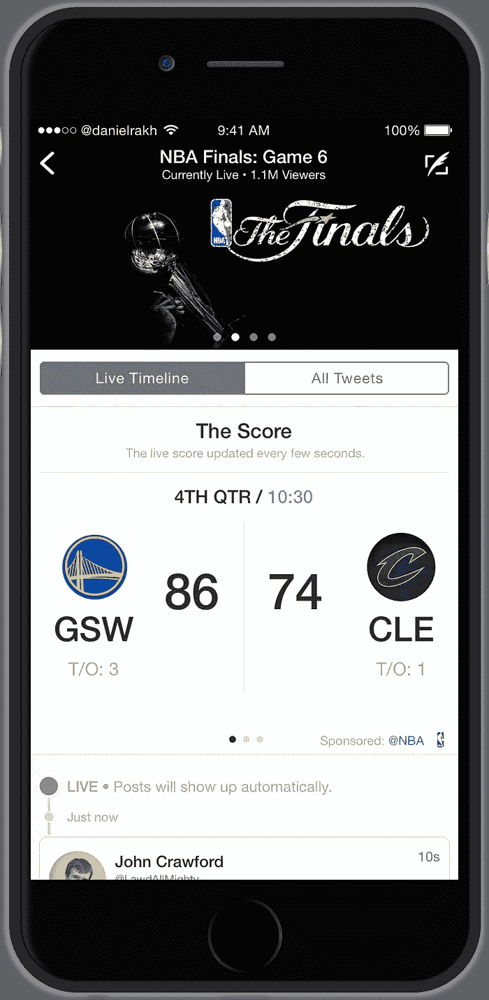

## 按需信息和上下文信息:

看起来事情正在升温。有些事情告诉我，即使勒布朗着火了，克里夫兰也不会渡过难关。不知道为什么？嗯…

体育在推特上是巨大的**。我不知道我们这个社会还有什么比体育更喜欢一起看的。如果我们不仅可以在任何给定的时刻看到比分，还可以看到球员的统计数据，为我们最喜欢的球员投票，并一起完成这一切，那该有多好。**

**我的意思是那很好，但我想买斯蒂芬·库里穿的那件衬衫。**

**让我们向左滑动，看看我们还能做什么…**

**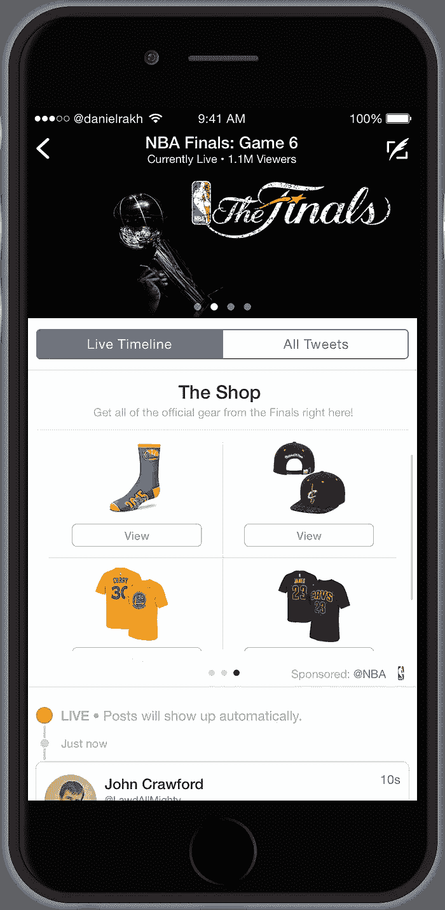**

**The Shop offers a vertically scrolling list with items related to the specific event.**

## **在环境中购物:**

**哇哦。我不知道你可以在推特上买东西。**

> **在推特上购物？那一定对生意有好处。**

**谷歌之所以有钱花在建造能够在建造你的自动驾驶汽车的同时挖掘天体的有自我意识的机器人上，是因为一个简单的词，叫做“意图”。当用户在谷歌上搜索某样东西时，他们是有意图的。当他们搜索“勒布朗·詹姆斯球衣”时，很可能他们正在寻找购买一件，而谷歌又给小猪银行增加了一便士。**

**意图是伟大的。但你知道还有什么很棒吗？“语境”。背景是指当我在看篮球比赛时，看到我想买的东西，只需轻轻一点就能买到。上下文是 Twitter 的金蛋，Twitter Live 以前所未有的丰富方式将它带给人们。**

**让我们看看实时时间线中发生了什么…**

**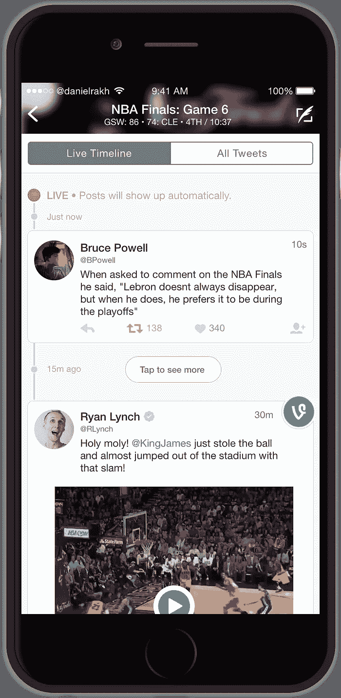**

## **不再仅仅是推文:**

**哦，那是一个很酷的勒布朗在每个人头上扣篮的藤蔓。看起来这里一切如常…**

**对一条推文进行约束的想法是惊人的。它只是简单的工作，所以我们不要管它。让我们保持推特作为美丽的原子单位。**

**但是，让我们也利用其他应用程序为我们带来相关信息。仅仅因为有人写了一些东西而不是发在推特上，并不意味着我们不应该看到它。Twitter 之外的所有这些信息，人们永远也不会看到…这真的很遗憾，尤其是当 Twitter 可以轻松访问这些信息的时候。**

**说到其他应用……让我们回到我们的时间机器，在 9 月 25 日我们最喜欢的节目《鲨鱼池》的首映式上回到未来。**

**那么新加入群体的鲨鱼是谁呢？让我们看看！**

**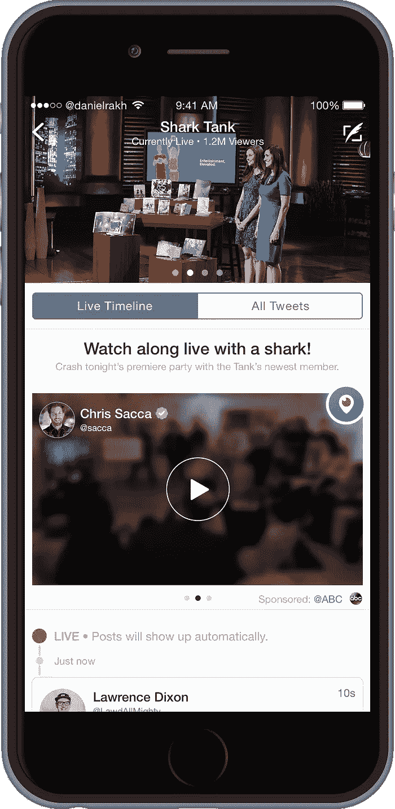**

**啊！好像是一个叫克里斯·萨卡的人。这家伙是谁？我希望他不是来取代马克·库班的。让我们加入他的直播流，看看这家伙是怎么回事。**

**哇！实际上我正在和其他鲨鱼一起看这部剧的首播。多酷啊！就像我们一起坐在房间里。好像他们是我最好的朋友。**

> **这是一种完全不同的体验，在其他任何地方都找不到。**

**沿着任何应用程序的线走下去，他们都无法获得这样的体验。这是推特独有的。**

**我喜欢推特。它是世界的神经系统，所以当它是如此伟大的产品却不断被华尔街滥用时，我真的很痛心。在 Twitter 的上一次财报电话会议上，杰克·多西说了一些类似的话:**

> **“我们有世界上最好的直播内容，但我们也有围绕它的最好的对话。”**

**这句话是关于 Twitter 在世界上无与伦比的作用的最准确的说法。然而，我也相信 Twitter 并没有充分利用这些直播内容。这正是 Twitter Live 试图解决的问题。**

**威廉·吉布森有一句话是这样说的:**

> **"未来已经到来——只是还没有被平均分配."**

**在 Twitter 的例子中，*内容*已经在这里了，只是还没有被平均分配。Twitter Live 提供了这样的服务。**

**那是什么账单？**

**….我们要做什么？**

**啊，是的…是的，我们会的！**

## **如果你喜欢这篇文章，请点击推荐和分享按钮: )**

**此外，你可能会喜欢我以前写的其他帖子:**

** [## 重新设计 Twitter 时刻

### 一项重新想象 Twitter 最新功能的概念设计研究。

medium.com](/p/f71658bbde68)  [## 介绍 tweet storm-Startups、Wanderlust 和生活黑客

### 这就是事情变得有趣的地方。让我们看看我们是否能设计出一条摆脱这种糟糕经历的路…

博客.成长.供给](https://blog.growth.supply/the-tweetstorm-373bd7e5eb54) 

## 我是谁？

我是一名具有工程意识的产品设计师，也是一名来自纽约市的具有设计意识的 iOS 工程师。我也碰巧想加入一个充满激情的团队，开发一些伟大的产品。如果你感兴趣的话，我们来聊聊:danielrak@me.com 或者[@丹尼尔拉克](http://twitter.com/danielrakh)

*发表于* **创业、旅游癖和生活黑客**

-**