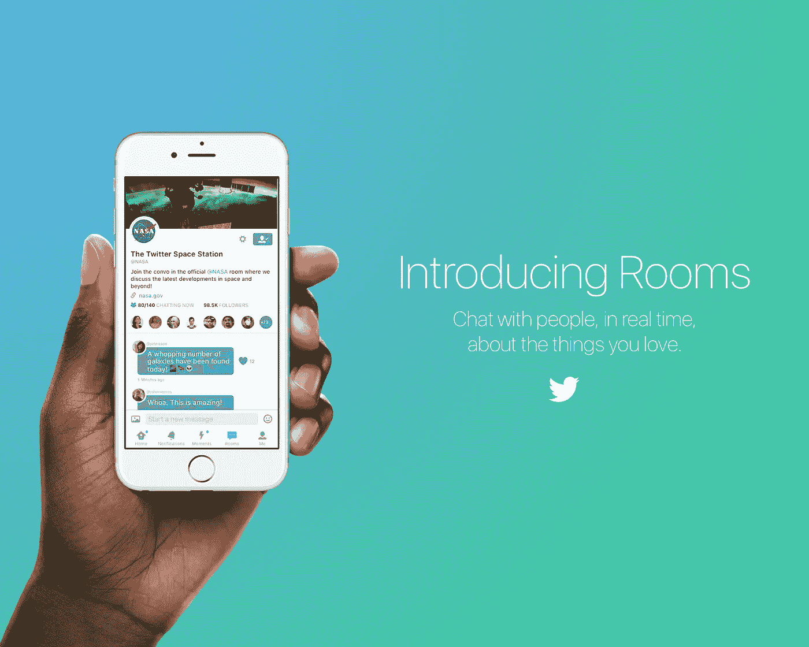
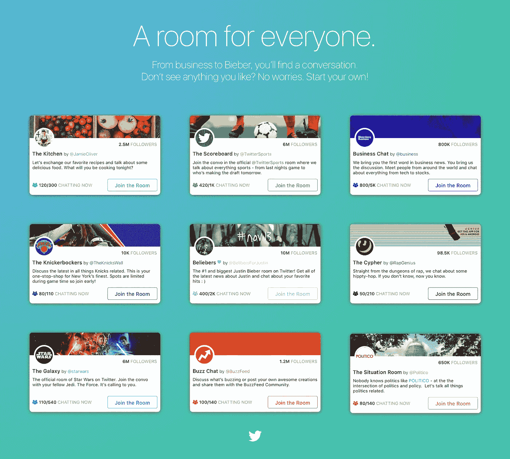
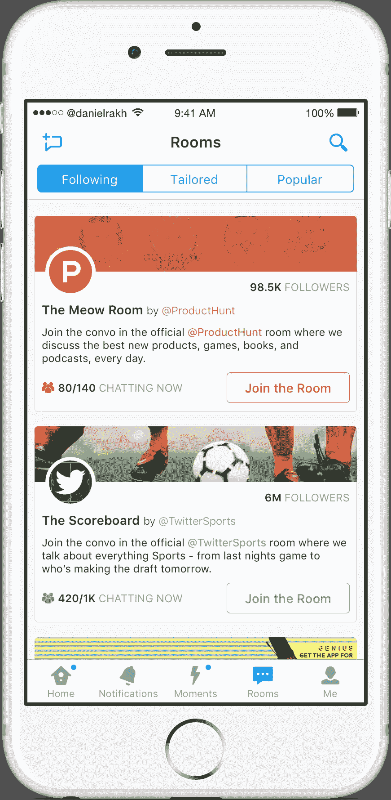
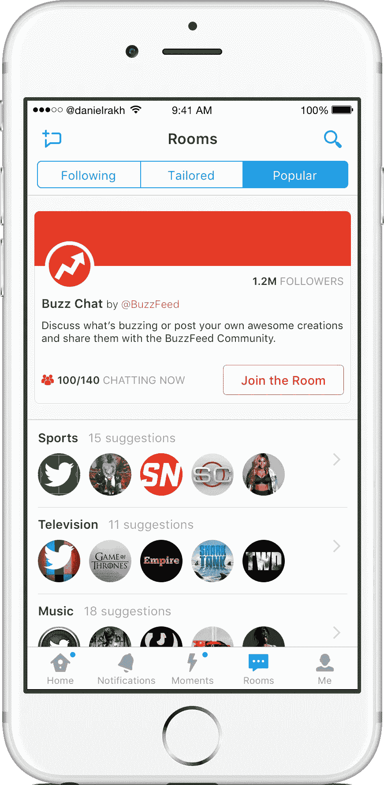
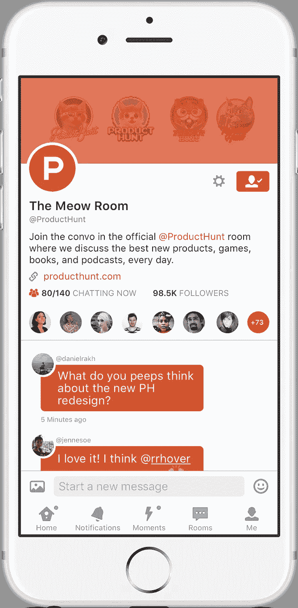
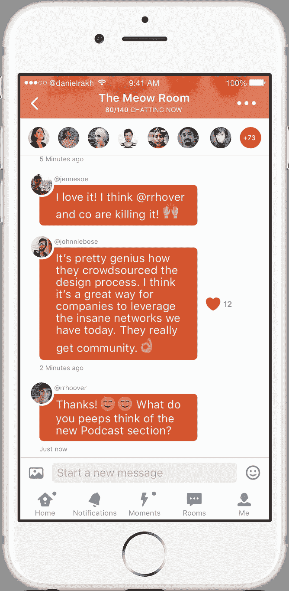
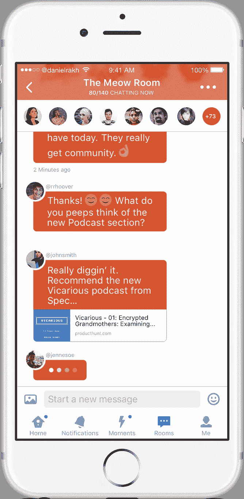

# 环球城市广场。

> 原文：<https://medium.com/swlh/twitter-rooms-e6f34e843e9a>

Disclosure: The images and designs in this post are in no way affiliated with Twitter Inc. This is simply a concept. *Pro tip: If the images are blurry, refresh the story.

> “我们认为(Twitter)是‘全球城镇广场’……这是一个非常公开、实时、即时的对话平台。”— [迪克·科斯特洛](https://medium.com/u/fd4ea9319cc6?source=post_page-----e6f34e843e9a--------------------------------)，2013 年(推特公司前首席执行官)

我一直认为这是描述推特抱负的完美比喻。当你听到“城镇广场”这个词时，你会想到什么？这句话让你想起了什么样的画面？我想起了 18 世纪美国殖民地某处的一个小镇，那里住满了一群市民。**我想到了“社区”这个词。**我也不禁想到了“噪音”这个词。我看到这些镇上的人互相叫喊，淹没了集体的声音。人们在说话，但他们没有被听到。

除非你是巴拉克·奥巴马、德雷克或其他社会名人，否则今天你的声音可能不会在 Twitter 上被听到。

为什么？

社区。 **Twitter 缺乏社区意识。**

我相信这是今天 Twitter 的基本问题，我的目标是尝试用一个新产品的概念设计来解决这个问题，我称之为 *Twitter Rooms* 。

在我们进入之前，让我们看看 Twitter 今天是如何工作的…

# 你和坎耶·韦斯特的区别。

Twitter 的症结是一个非常简单的广播模型。Twitter 上的每个人都有一群关注他们的人，因此可以访问那个人的推文。他们可以选择几乎实时地接收这条推文，或者在未来的某个时间补上这条推文。

现在有些人有数百万的追随者(坎耶·韦斯特)，而有些人只有几个。这极大地影响了你在 Twitter 上的体验。

你的关注者越少，你就越没有动力发微博……*除非*关注你的人对你的生活有某种意义(比如家人、朋友、同事)。

我可能会写一整篇文章来解释为什么会这样，但是我们必须承认，对于普通用户来说，他们的家人、朋友和同事不会使用 Twitter 来相互交流，因为他们使用的是以 F 开头的其他服务。我知道大多数阅读这篇文章的人都是技术人员，所以请注意，我们这里说的是普通人。你是例外，*不是规律。*

但这是旧闻，是过去的问题。让我们谈谈今天…

今天， **Twitter 不是一个社交网络，它是一个兴趣网络(**如果华尔街明白这一点，他们就不会再把它和脸书相提并论了……但那将是一天)。人们寻找与自己个人兴趣一致的用户。乔·史密斯追随坎耶·韦斯特是因为他是嘻哈音乐的领军人物，而不是因为他在 Twitter 之外与坎耶有实际关系。现在拿乔·史密斯乘以几百万，你就有了一个看起来像这样的模型:

在第一个图形中，Kanye West 是一个**“内容制作人”**。

什么是内容生产者？

你认为他们是什么。他们(或它)生产了通过 Twitter 传播的大量内容。它不一定只是一个人**，它也可以是一个世界事件，比如地震，或者今晚的《权力的游戏》。**

在第二张图中，内容制作者的追随者开始传播或贡献他们播种的内容。

问题是，大多数来自追随者的推文最终都进入了以太网。

为什么？

因为大多数人没有强大的追随者，所以他们最终会陷入 Twitterverse 的深渊，永远不会看到任何真正的参与。这就像你在镇上的广场上，每个人都在对其他人大喊大叫，所以没有人真正被听到或被认可他们所做的贡献。

这对新用户的用户体验尤其有害，因为他们期待从脸书、Snapchat 或 Instagram 等更亲密的体验中获得参与度。

我们如何解决这个问题？

**我们如何在不丧失 Twitter 特色的情况下增加用户参与度？**

我认为解决办法是通过社区。

# **打破僵局。**

一个伟大社区的标志是社区成员之间高质量的交流。它通常以将社区聚集在一起的内容为中心。在 Twitter 上，对话是最吸引人的体验之一……但这很难。

这有两个主要原因:

1.  **140 个字符的限制:**编辑你的想法并把它打包成 140 个字符或更少，这需要很大的努力。像“推特风暴”这样的结构就是这样的结果。“@回复你自己”tweet threading UI hack 有点帮助…但它仍然隐藏了所有的谈话内容。Twitter 的用户界面根本不符合对话。
2.  **发现**:我在哪里可以找到对话？现在，这是我追随的人的直接结果。如果我是新用户会怎样？目前，Twitter 向我展示了各种知名用户，如名人和知名品牌，但他们是生产者，而不是参与者。如果我发微博给他们，他们不会回应。Twitter 明白这一点，Moments(他们的新产品)旨在通过给你一个更专注于内容而不是你关注的实际人群的平行体验来补救这一点。这是伟大的第一步，但**我希望有办法找到更多像我一样的人。我需要找到我部落的人。和我有相似兴趣的人。对我要说的话做出回应的人…**

# **介绍 Twitter 聊天室。**

> **房间是一个你可以与人实时聊天的地方，谈论你喜欢的事情**。

这是一个由现有兴趣图驱动的聊天室的想法，人们今天来到 Twitter。

烹饪是你的爱好吗？太好了。碰巧的是，关注杰米·奥利弗的另外 300 万人也对烹饪超级有热情。你应该去看看他的名为“厨房”的推特空间，在那里你会遇到和你一样对草药和香料着迷的人。

让我们重温一下之前的图片，但现在房间是 Twitterverse 的一部分:

将此图与之前的图进行比较和对比。

你看出区别了吗？

粉丝们不再只是在网上发推特，他们现在有了一个不受推特本身限制的真正对话的地方。

与此同时，所有以前在 Twitterverse 中失去的潜在参与现在都集中在一个房间里。这是房间的目标…

> Rooms 的目标是给 Twitter 注入真正的社区。

现在让我们看看房间在今天的 Twitter 体验中会是什么样子…

过去的*消息*标签现在被藏在*我*标签下，以换取新的闪亮*房间*标签。

房间提要中有三个部分:

1.  **关注:**就像我可以关注用户一样，我现在可以关注房间，以便在我的 feed 中快速访问它们，并可能接收可能与相应房间的所有成员相关的推文。

The rooms that you are following.

2.定制:这将是 Twitter 为你推荐的个性化房间信息。它将类似于跟随进给的*。*

3.热门:这将是 Twitter 上最热门的房间的提要。

The rooms that are popular.

现在，让我们来看看房间的一些定义属性:

1.  任何人都可以创建一个房间:不管你是巴拉克·奥巴马、BuzzFeed 还是水管工乔，每个人都可以创建一个房间。
2.  **没有字符限制:**你不再在房间里发推文。不再发微博了？不再有 140 个字符的限制？亵渎神明！稍后会有更多相关信息…
3.  **适度:**这是关键。尽管我们已经从 AOL 聊天室的 a/s/l 时代走了很长一段路，但互联网上仍然充斥着巨魔。社区中的各个成员之间应该有一些自我监督，并可以选择报告人员&当然，至少有一个主持人有权将任何人赶出房间。主持人通常是创建房间的人。这是否意味着主持人需要一直在房间里？绝对不行。可以设置一个自动系统，让房间中被其他人标记“x”次的人自动离开。你可以发送的信息数量也应该有一个限制，比如说……一两分钟。
4.  **容量:**会议室的容量由主持人设定。你不希望出现一个房间里有几千人的情况。事情会很快失控。我想 1000 似乎是一个很好的底线？也许甚至有点太松懈了。
5.  私人的还是公共的:你可以选择在没有网络的地方开一个私人房间。假设你是光明会的一员，你想确保这个房间只接受邀请。你很幸运！房间对秘密社团友好。

让我们进入我最喜欢的房间之一——来自[产品搜索](https://medium.com/u/b8b4445269d0?source=post_page-----e6f34e843e9a--------------------------------)的好心人的喵房间。

需要注意的关键一点是，在房间里发送的消息**不**被认为是推文。因此，不应该有 140 个字符的限制。事实上，你可以在一个房间里分享推文，就像今天你可以在*消息*中分享一样。你也可以分享链接和几乎任何你今天可以在推特上发布的东西。

但更重要的是…

> Rooms 旨在缩短 Twitter 的学习曲线，同时为普通用户提供熟悉的体验。

对于新用户来说，*尤其是*是不是很棒，原因有二:

1.  可访问性:对于新用户来说，这是一个很好的方式，让他们以一种容易理解的方式加入到 Twitter 的对话中。没必要发微博。每个有 iPhone 的人都知道短信是如何工作的。学习曲线几乎不存在。
2.  **社交**:你不再只是关注 Twitter 上那些永远不会与你互动的热门账号，而是被介绍给真正的**真正的**与你有相似兴趣的人。几乎所有人都同意，在 Twitter 上最难做的事情之一是找到合适的人来关注，同时不断整理名单。 **Rooms 旨在缩短这一过程。它让你迅速进入一个网络，否则你需要花费大量的时间和精力去发现一个新用户，只需要为有相似兴趣的人提供一个聚会的地方。**

我相信这有可能成为新用户体验的游戏改变者，为他们轻松进入真正发推特的核心体验打下基础。他们现在可以有人发微博了。

# Dat 潜力。

我最近在想，为什么像我这样的技术人员特别喜欢 Twitter。

我们热情地使用它，并且经常是第一个指出 Twitter 在任何一天做错了什么的人…

我认为我们这样做是因为我们看到了 Twitter 的力量和潜力，并希望世界其他地方也能看到它。我们中的许多人建立了友谊，开始了我们的职业生涯，并通过无聊的埃隆·马斯克的一条推文筹集了 100 万美元。

但是我们为什么爱它呢？

我认为这是因为我们有一个强大而繁荣的社区。

我会第一个告诉你，我不确定这个提议是否可行。它仅仅是一个概念，可能在许多方面都有缺陷。然而，我 100%确定的是，无论是通过类似于房间的产品还是完全不同的东西，Twitter 都需要将社区的理念放在前面和中心。社区需要融入 Twitter 的体验中。这是拼图中缺失的一块。

## 我是谁？

我是一名具有工程意识的产品设计师，也是一名来自纽约市的具有设计意识的 iOS 工程师。我也碰巧想加入一个充满激情的团队，开发一些伟大的产品。

如果你感兴趣，我们来聊聊:**danielrak@me.com**或[@丹尼尔拉克 ](http://twitter.com/danielrakh)

## 如果你喜欢这篇文章，你也会喜欢这些！

 [## 超级天才

### 优步的产品设计提案。

medium.com](/p/686e16799228)  [## 重新设计 Twitter 时刻

### 一项重新想象 Twitter 最新功能的概念设计研究。

medium.com](/p/f71658bbde68)  [## Tweetstorm 简介

### 将新兴的推文风格设计到 Twitter 中。

medium.com](/p/373bd7e5eb54)