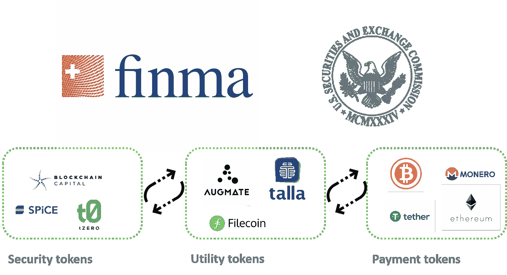
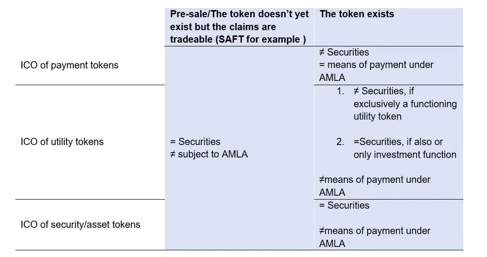
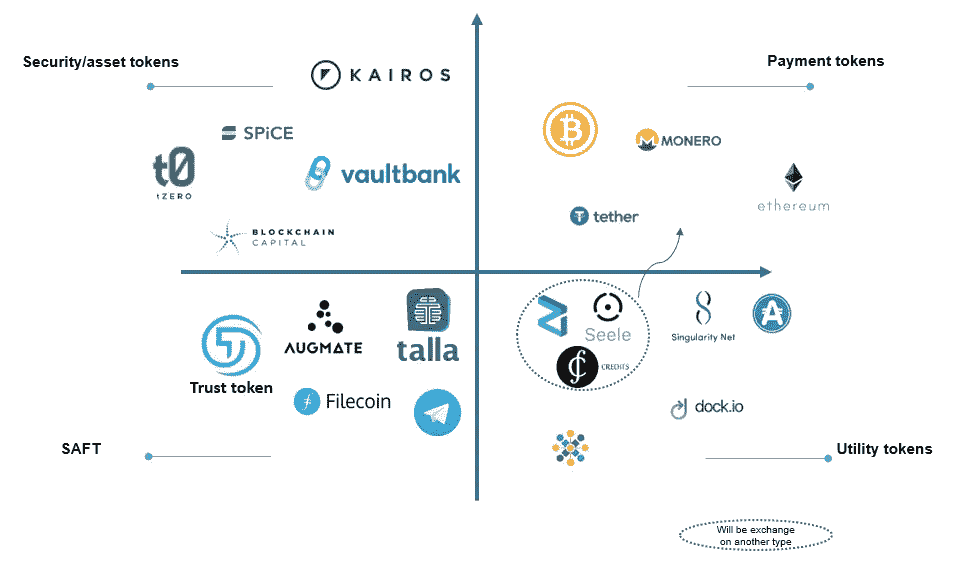

# 令牌的类型。新手投资者犯的四个错误。

> 原文：<https://medium.com/swlh/types-of-tokens-the-four-mistakes-beginner-crypto-investors-make-a76b53be5406>

对 ico 的大肆宣传和对能够产生 100 倍回报的项目的搜索促使 [**ICOscoring**](https://icoscoring.com/) 团队对不同类型的代币进行一些澄清，这通常是选择正确的投资项目时需要分析的重要因素之一。

在投资了 30 多个 ICO 之后，[我们的团队](https://icoscoring.com/article/ico-token-price/)可以明确的说，任何一个组织 ICO 的顶级项目都有可能失去投资吸引力，原因有三:

**1)颁发的令牌不会给项目增加价值**

**2)象征性价格增长不具备经济学原理**

**3)代币价格高估**

**在本文中，我们将为不同类型的令牌**及其在项目中的角色提供一个实践指南。此外，我们将尝试描述项目试图阻止投资者的最常见陷阱。

通常情况下，不合格的投资者并不完全了解项目的经济性，他们送出的 BTC/ETH 和得到的代币并不能为投资的项目增加价值，有时甚至不符合商业模式。此外，这些代币通常不赋予任何投票权。在这种情况下，唯一的赢家是创始人、股权投资者和早期买家，他们以高折扣率(有时可以达到 80%)购买代币。

虽然为特定业务模型引入代币的理由可能有争议，但定义代币类型及其价格的问题似乎更为根本，也有更多的解释。让我们更详细地讨论一下。

## **代币类型**

目前，代币还没有统一的分类。然而，美国 SEC 和瑞士 FINMA 已经开始着手解决这个问题。

这两个组织都将令牌分为两大类:

**-证券代币(这种类型在某种程度上类似于证券)**

**-公用事业令牌(这种类型使其持有者能够获得项目提供的服务)。**

另一个可以强调的类别可能被称为**“真实加密货币”**或**支付令牌**——这种类型有自己的区块链，通常被认为是一种支付手段。然而，SEC 和 FINMA 之间有一个很大的区别:SEC 专注于比较代币和证券，而 FINMA 专注于代币的经济功能。每种类型的令牌都有关键特征。

## **安全令牌(SEC) /资产令牌(FINMA)**

这类代币代表资产，如参与真实的实物基础、公司或收益流，或获得股息或利息支付的权利。就其经济功能而言，代币类似于股票、债券或衍生品。

## **实用令牌(SEC) /实用令牌(FINMA)**

此类别提供对项目将在未来推出的商品和服务的访问。此外，它们还可以作为项目商品和服务的一种折扣或优惠。

## **加密货币(SEC)/支付令牌(FINMA)**

通常，这一类别的令牌没有进一步的功能或者到其他开发项目的链接。广义而言，加密货币的目的是成为具有内在价值的物品(例如，类似于现金或黄金)，旨在实现购买、销售和其他金融交易。它们旨在提供许多与美元、欧元或日元等历史悠久的货币相同的功能，但没有政府或其他机构的支持。

根据令牌的类型，ICO 的组织者和参与者可能具有不同的权利和责任，下表简要介绍了这些权利和责任。

Financial market legislation in handling enquiries from ICO organisers

如果实用令牌没有增加产品功能的价值，并且只对投资目的重要，那么它可以被认为是安全令牌。95%以上的项目都使用实用令牌，有时它们被赋予完全荒谬的功能。这是法律限制的含义。

值得注意的是，对投资者来说，最安全的代币是安全代币。但是，这种类型的令牌使 ICO 更加复杂，需要 KYC/反洗钱程序。例如，FINMA 将这些代币视为一种证券，并对其适用与其他证券(股票、债券等)相同的规则。

然而，这种分类并不详尽。令牌的类型可能会在整个项目开发过程中进行修改，或者根据 SAFT 协议进行修改。Ziliqa、Seele 和 Credits 都在开发的早期阶段发行了 ERC-20 代币，后来的目标是用它们代替自己的加密货币。

Type of Tokens Map

**新手投资者最常犯的四个错误:**

1.公用事业代币因其性质而不被视为投资工具。然而，许多投资者购买公用事业代币，希望价格会上涨，因为对该项目旨在提供的商品和服务的需求不断增长。然而，这种代币的价格增长往往具有投机性质，是不可盈利的。

2.选择其价格与所提供功能的价格不对应的令牌。例如，如果 token 提供 1GB 的云存储，价格为 5 美元，而同样的 1GB 云存储可以在传统服务上以 1 美元的价格购买。

3.购买代币时没有考虑到项目可能会发行不同类型的代币。例如，Kairos 有两种不同类型的令牌:安全性和实用性。这种多样性会增加投资决策的难度。

4.购买在其经济或外部增长动力中没有任何价值生成机制的代币。

## **三个外卖**

> 1.在做投资决策时，需要分析代币的类型及其背后的经济。
> 
> 2.必须始终记住，代币的价格是基于经济学的基本原则，如需求法则和公平价值
> 
> 3.了解代币的基础价值及其当前和潜在价格，以防所有目标都实现，这始终是明智之举。

*更多资讯，* [*订阅 ICOscoring 电报频道*](https://t.me/ICOscoring)

## 这篇文章发表在 [The Startup](https://medium.com/swlh) 上，这是 Medium 最大的创业刊物，有 303，461+人关注。

## 在这里订阅接收[我们的头条新闻](http://growthsupply.com/the-startup-newsletter/)。

