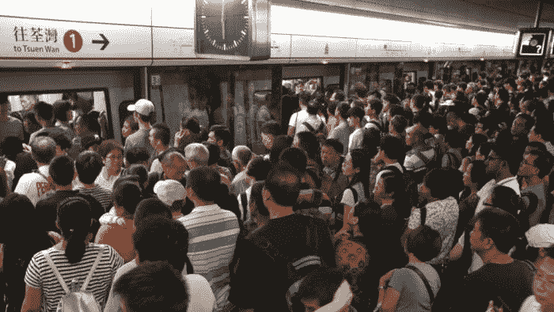
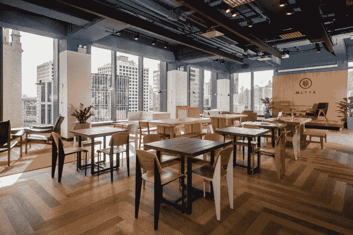

# 香港创业的典型一天

> 原文：<https://medium.com/swlh/typical-day-as-a-startup-in-hk-b3b3574842ec>

645 从女儿的踢打中醒来，大喊“啪啪”。慢跑下我的一些随机想法，因为如果我不这样做，我会忘记，永远无法找回它们。

刷牙，早餐吃面包、鸡蛋和牛奶，和女儿吻别，和妻子一起乘地铁去上班。

在路上和我妻子聊聊孩子和我们的一天。想要查看我的电子邮件和每日统计，但是不要用手机，尽可能积极地想象未来的一天。

在去我的工作空间的路上，听一段感恩的冥想视频，重新编程潜意识，让自己感到快乐和流入。

到达共同工作空间并开始工作。

时间过得很快。饿了之后，意识到已经 11 点 30 分了，于是去当地的面包店买几个面包，每个 1 美元。

回去，在重新开始工作之前，通过看一部加里·维纳查克、一些其他的创业公司或者有时是足球视频来放松一下。

下午 3 点左右，去梅塔见一个企业家伙伴，一个对我在 Shapr 上的工作感兴趣的人，或者一个导师。意识到咖啡比我的午餐还贵后，我忍住没点。改喝我瓶子里的水。

聊了一会儿之后，我和妻子赶地铁回家之前，先回去做了一点工作。

吃晚饭，和孩子们玩一会儿，在他们睡着后，回来做更多的工作。在感觉筋疲力尽地回到床上之前，和我的伴侣进行一次简短的电话讨论。

入睡前再听一段冥想视频。

## 这篇文章发表在[《创业](https://medium.com/swlh)》上，这是 Medium 最大的创业刊物，有+400，914 人关注。

## 订阅接收[我们的头条新闻](http://growthsupply.com/the-startup-newsletter/)。

