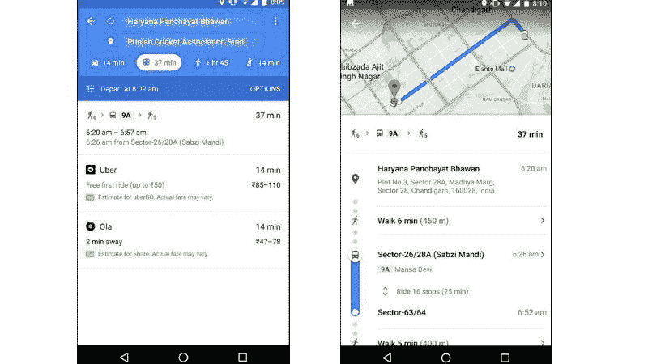
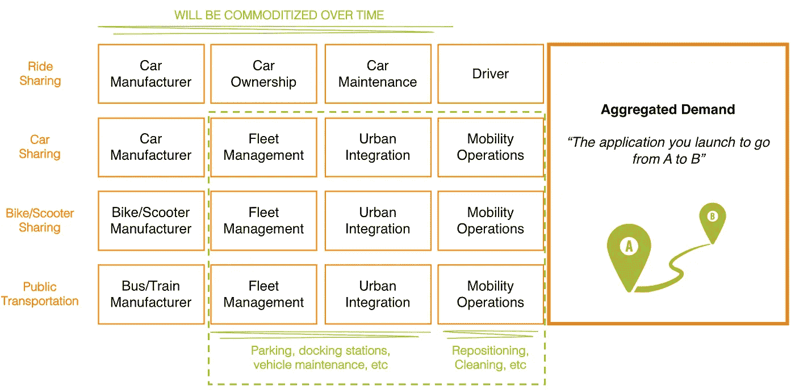

# 优步和 Lyft 正在挑战谷歌地图

> 原文：<https://medium.com/swlh/uber-and-lyft-are-taking-on-google-maps-4f4de68fea8b>

几个月前，我[提出了一个理由](/swlh/why-uber-lyft-and-didi-wont-dominate-urban-mobility-but-who-might-c41823d10397),即像优步和 Lyft 这样的乘车共享服务不具备主导城市交通所需的专业知识，汽车租赁公司、汽车制造商和汽车共享平台更有可能获胜。

没有反论点的论点是不完整的。最近 M&A 在移动领域的活动也引发了对更新的需求。

以下是 2018 年迄今为止发生的一些例子:

*   [优步以 2 亿美元收购了无人驾驶电动自行车共享服务 JUMP](https://www.uber.com/newsroom/welcomejump/)
*   优步和 Lyft 似乎在为 CitiBike 和 GoBike 的母公司 Motivate T5 在 T4 展开竞购战
*   优步和 Lyft 都在通过收购和合作进入电动滑板车服务领域
*   Lyft 已经宣布他们将在他们的应用程序中[提供公共交通选择，优步也正在开发这个应用程序](https://blog.lyft.com/posts/new-app)
*   优步通过与 Getaround 合作[优步租车公司推出汽车共享服务](https://www.engadget.com/2018/04/11/uber-rent/)

结果呢？

根据你所在的城市，拼车服务现在提供汽车、自行车、滑板车、直升机、船、人力车，以及公共火车和公共汽车的方向和预订。

> 本质上，拼车服务正在扩展为多模式的城市交通服务，使用任何交通工具将你从 A 地送到 B 地。

听起来很熟悉？

是的，谷歌地图和其他交通应用程序已经集成了多种交通选项，包括公共交通和拼车。

那么，为什么拼车服务会扩展到多种模式，它们会试图取代谷歌地图成为从 A 地到 B 地的头号应用吗？这里有一个比较这些服务的价值链的图示。

从这种比较中可以得出两个主要的教训。

**首先**，优步和 Lyft 都是数字公司，他们很清楚，如今你通过控制需求(而不是供应)垄断了价值链。通过提供最佳用户体验(UX)和聚合用户需求，你可以控制和模块化价值链中的前几个步骤。因此，当你在一个城市里走动时，它们会非常努力地成为你启动的主要应用程序。

**其次**，拼车不同于其他交通服务。拥有和运营汽车、火车和公共汽车是资本密集型和劳动密集型的，至少与拼车(司机拥有、维护和运营汽车)中可能出现的纯数字剧本相比是如此。因此，优步和 Lyft 从自行车和踏板车开始，这两种车的购买成本相对较低，而且更容易维护和重新定位。

总之，拼车巨头 a)向最简单的相邻服务(自行车和踏板车)多元化，b)与汽车共享运营商合作，c)通过使其应用程序完全多模式化(包括公共交通)来控制用户需求。如果他们成功地控制了需求，随着时间的推移，他们将能够模块化汽车共享和火车/公共汽车服务，使移动应用程序以下的一切都成为商品。

> 然而，在这个多模式的新游戏中，优步和 Lyft 并没有与 ZipCar 和 DriveNow 这样的汽车共享公司竞争；他们在与谷歌竞争，谷歌地图和谷歌助手是一个完全不同的竞争者。

城市交通仍然是一个值得关注的有趣市场。

*格雷格在 IBM 工作，常驻法国。以上文章为个人观点，不代表 IBM 的立场、策略或观点。*

## 这篇文章发表在 [The Startup](https://medium.com/swlh) 上，这是 Medium 最大的创业刊物，拥有 336，210 多名读者。

## 订阅接收[我们的头条新闻](http://growthsupply.com/the-startup-newsletter/)。

