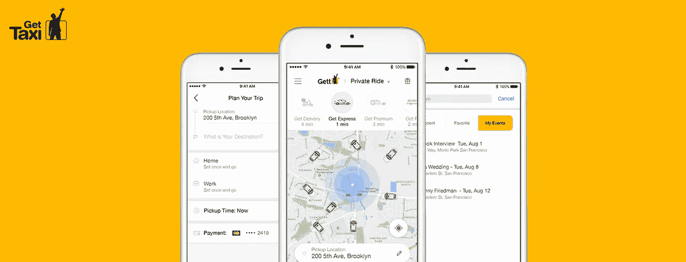
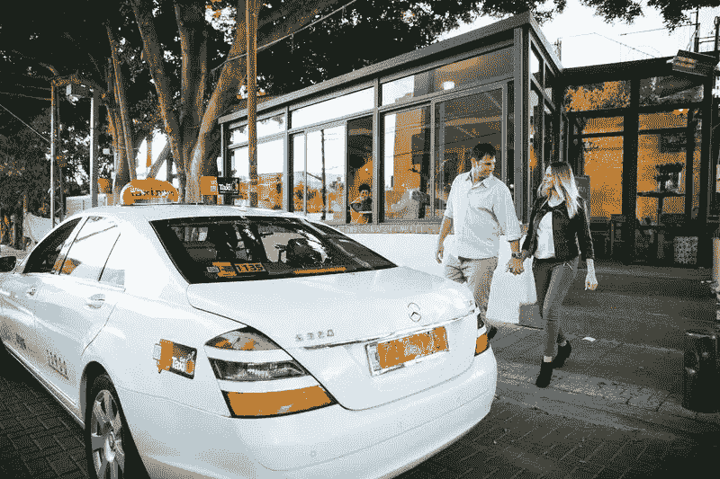
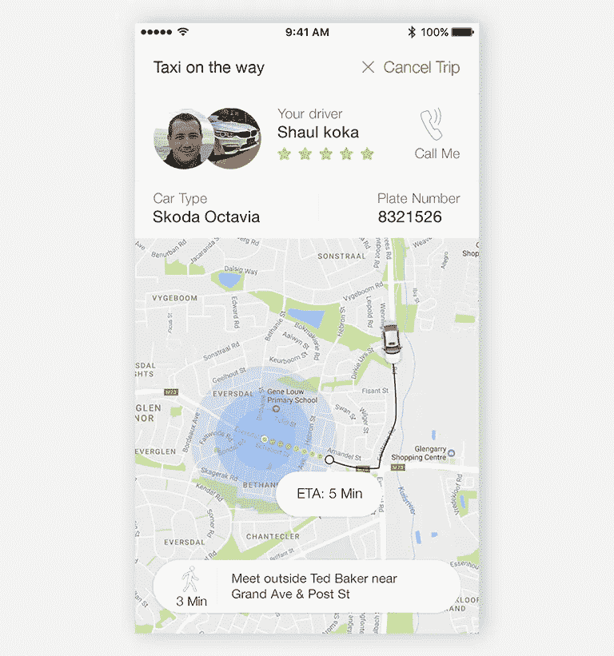
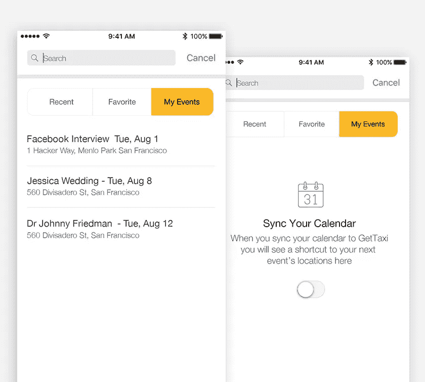
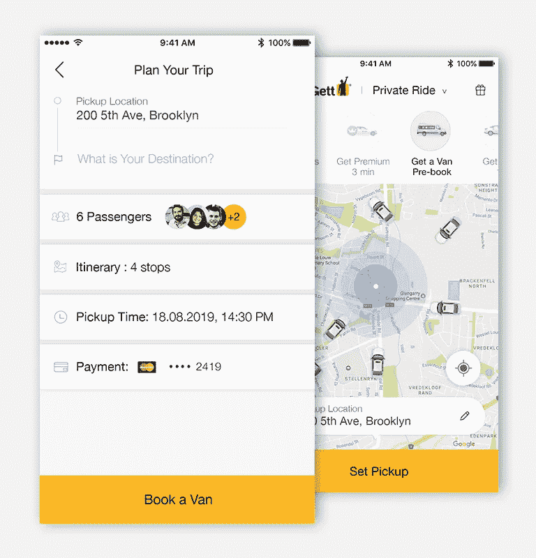
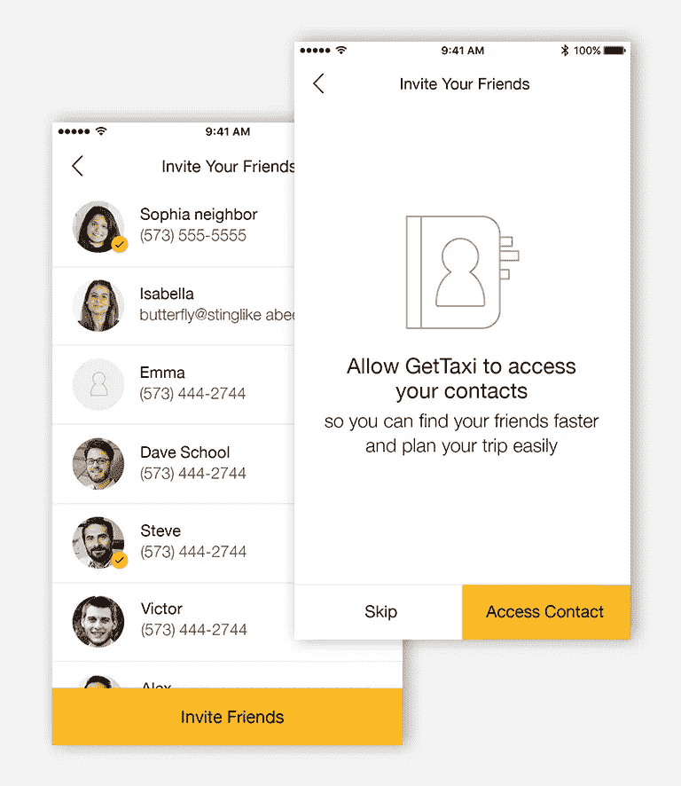
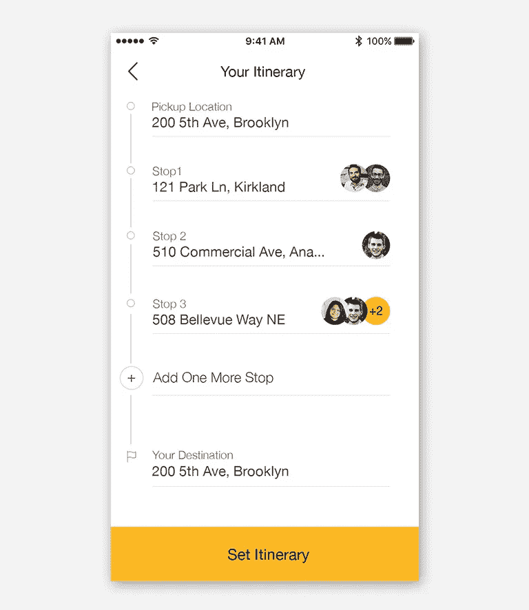

# UI/UX 案例研究:全新的“打车体验”

> 原文：<https://medium.com/swlh/ui-ux-case-study-a-brand-new-get-taxi-experience-6c43c7c815fa>

“Get Taxi” Redesign UI/UX

# 设定一个取货地点，奇迹就开始了

我测试了现有的“GetTaxi”应用程序，有 10 名参与者在特拉维夫附近有问题的接送区。我的目标是了解乘客和司机面临的痛点，并尝试提出创造性的解决方案。

# 问题是:

有限的街道标志、道路上的密集交通以及较差的 GPS 精度意味着乘客和司机使用兴趣点来协调他们的上车位置。当司机打电话给用户了解他们的取车地点时，他们变得很沮丧。

# 解决方案

让乘客走到附近的上车地点。

# 同步您的日历

用户期待“嘀嘀打车”对他们了解更多。他们希望更快地设定目的地。

我添加了一个新功能，允许用户同步他的日历。当他将同步他的日历时，他将看到到他的下一个事件位置的快捷方式。

# 和你的朋友一起买辆货车

我从用户故事中学到了很多，也了解了用户需要什么。用户表示，他们将很乐意选择与一群朋友一起获得一辆货车，并一起分摊付款。

我创建了一个流程来预订一辆货车，设置您的目的地并邀请您的朋友。旅行当天，您将能够在地图上看到接机时间和路线。您还会收到行程通知。

# 我们开始吧…:)

1.  在主屏幕上选择获得一辆货车。
2.  点击“设置拾音器”
3.  在“计划您的旅行”屏幕上，您需要设置您的目的地，邀请您的朋友参加旅行，设置您的旅程和接机时间。

# 邀请你的朋友去旅行

# 计划你的行程

计划在哪里停下来，去接谁

# 可用性测试

我想运行一个小体验来看看我的解决方案是否有效。我使用了上面的屏幕，并在 InVision 中为该应用程序构建了一个原型。我把它分享给用户，并给他们一些任务来检查他们是否理解屏幕。结果很惊人！

**我的 Youtube 频道:**

https://www.youtube.com/user/aviel20

## 这篇文章发表在[《创业](https://medium.com/swlh)》上，这是 Medium 最大的创业刊物，有 278，108+人关注。

## 在这里订阅接收[我们的头条新闻](http://growthsupply.com/the-startup-newsletter/)。

