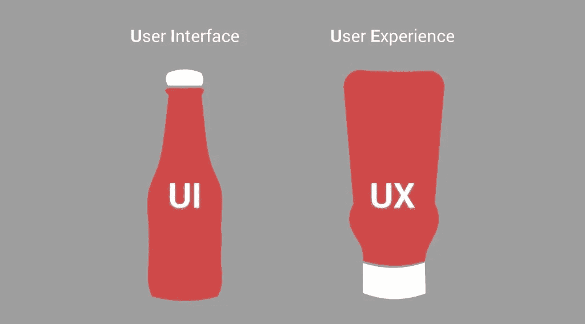
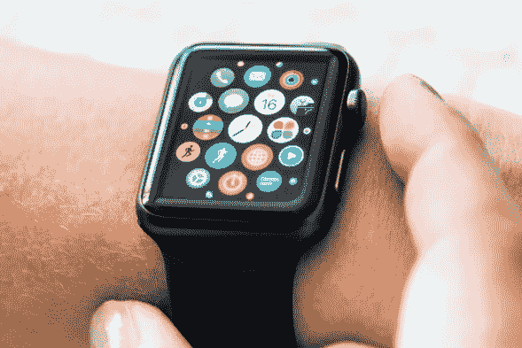
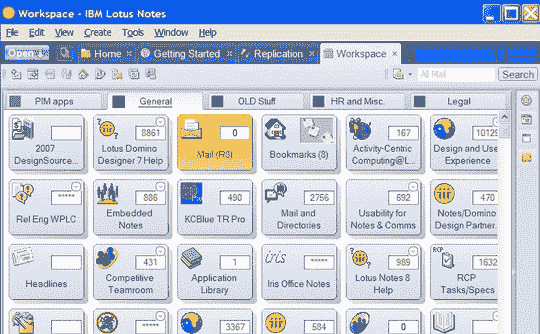
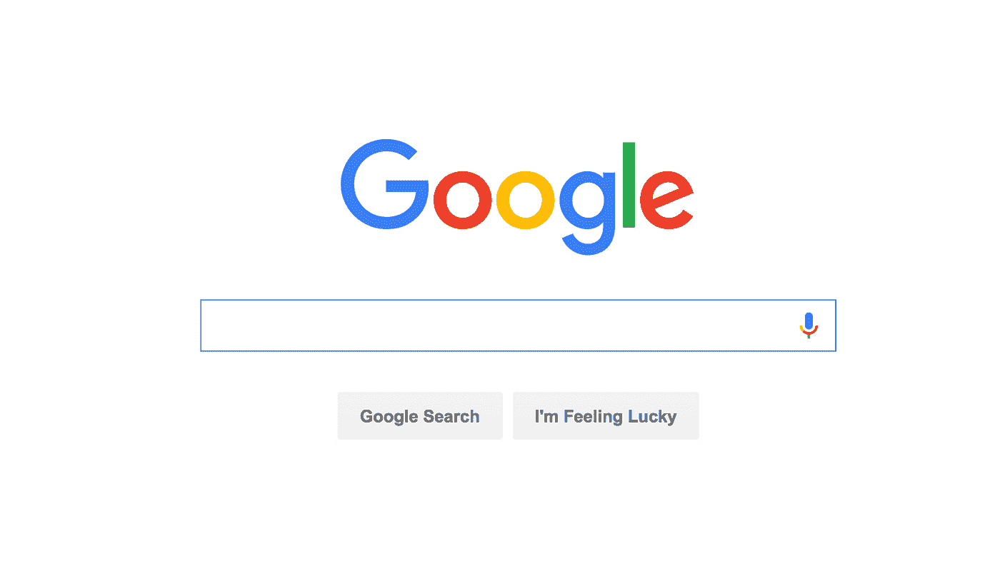
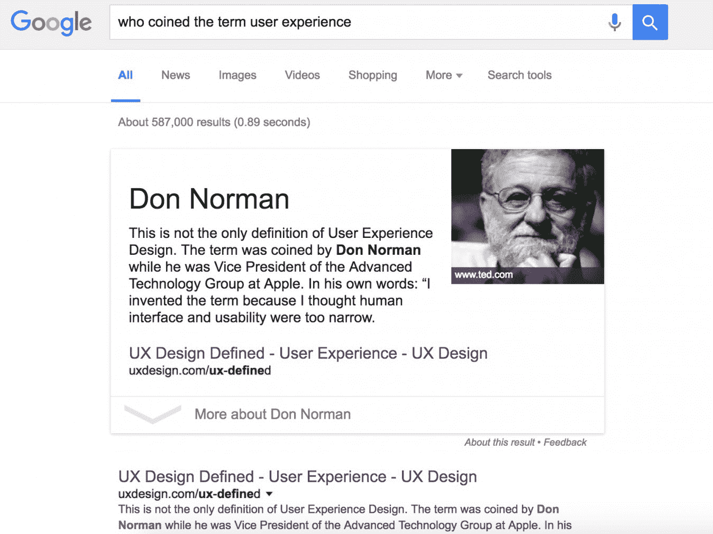

# UI vs UX:两半合二为一

> 原文：<https://medium.com/swlh/ui-vs-ux-two-halves-to-a-whole-c893670dc2b5>

我们每个人都是消费者。无论是食物、水、能源、产品、服务，只要你说得出来。我们大多数人很少意识到，在利用这些资源的过程中，至少有两个过程在进行。2018 年，大多数用例都涉及某种用户界面。

用户界面是人机交互的空间。

我喜欢把它想象成`The Pretty`、`The Stylish`、`The Sexy`和`The Interesting`。UI `(User Interface)`是我们用来与设备交互的一系列屏幕、页面、按钮、视觉元素和图标。

另一方面，UX `(User Experience)`是一个由认知科学家 Don Norman 创造的术语，他说它“包含了最终用户与公司、公司服务和产品互动的所有方面”。这是对它的完美定义。它是你对一个公司品牌体验的总结，而不仅仅是与单一产品或服务相关的体验。

诺曼说

> 示范性用户体验的第一个要求是满足客户的确切需求，不要大惊小怪。接下来是简单和优雅，生产出拥有和使用都令人愉悦的产品。

这充分说明了为什么用户体验如此重要，为什么有些产品成功了，而大多数产品却没有。他们不拘泥于这种高于一切的模式。

我们来看一个 UI 不好的例子。首先是 Lotus Notes:

Lotus Notes 是 80 年代末、90 年代初的一款非常老的软件，直到 2006 年，它还被用来处理一些与办公相关的任务。仅仅是第一眼看到这个软件，我就觉得理解它并让它工作是一种负担。事实证明，这个软件不只是看起来像一个负担，但它最终是一个负担使用。它不直观，不能识别[热键](/@tknbnola/saving-time-with-hot-key-mac-edition-dbc64e9e1e1b)约定，被视为开发软件时不要做什么的例子。对 Lotus Notes 用户体验的共识并不是很高。

这里有一个非常好的 UI 的例子。Google.com。

在这里，我们有最受欢迎和最简单的用户界面之一，有史以来接触互联网。Google.com 只有一个标志，搜索栏和两个按钮。非常简单，非常容易使用和理解，非常吸引人的眼睛和头脑。只需输入一个简单的字符串，只需点击一下，你就能获得数字化互联网的所有相关页面。这就是这个 UI 成为重量级之一的原因。它给最终用户提供了他们访问网站的确切目的。不多不少，只是它能找到的最相关的答案。通常情况下，返回的结果是非常正确的。

像 Google.com 这样强大的用户界面不仅仅可以转化为每天数百万的页面访问量，它还可以转化为出色的用户体验，并从长远来看带来更多的收入，这仅仅是因为你对谷歌品牌的用户体验有积极的态度。因此，当他们发布新软件，如他们自己的浏览器或智能手机时，你更倾向于沉迷于并支持这些产品和服务，因为你觉得你可以依赖它们给你带来出色的用户体验。

UX 并不局限于你产品的视觉界面。这是一个多维度的概念，涵盖了一个人的整个旅程，包括:

*   他们发现贵公司产品的过程
*   他们与界面交互时采取的动作序列
*   当他们试图完成任务时产生的想法和感觉
*   他们从整体互动中获得的印象

当你创建自己的应用程序时，你必须考虑用户的心态。你希望他们在查看和使用你的应用和产品时有什么样的感受。这可能是一个糟糕的应用程序或一个伟大的应用程序之间的区别。

## 这个故事发表在 [The Startup](https://medium.com/swlh) 上，这是 Medium 最大的创业刊物，有 286，184+人关注。

## 订阅接收[我们的头条新闻](http://growthsupply.com/the-startup-newsletter/)。

