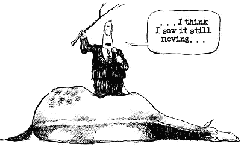
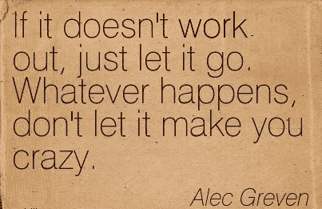

# 追随你的激情:如何定义这份兼职是否是你的真正目的

> 原文：<https://medium.com/swlh/un-following-your-passion-how-to-define-whether-this-side-gig-is-your-true-purpose-caf10a0119fe>

在我们这个充满喧嚣、大量机会和不断寻找“下一件大事”的时代，我看到有人在想这样的问题:“我如何找到我的激情？”、“我的人生该怎么办？”，“我不能只专注于一件事，我想做的事情太多了”，“我对很多事情都充满热情，我不能只专注于一个方向”……商业教练要么会帮助你“展现你的潜力”，要么会建议你重新考虑你的情况，然而，创造、行动和改变的内在愿望总是存在的。

我完全支持你们，伙计们。我对很多事情都很有热情，对我不安的头脑中出现的任何疯狂想法都充满热情，并且相信我(以及一群商业教练和专业人士)——就在任何地方达成任何事情而言，这并不好。

问题是，你并不孤单。还有其他像你我这样的人，他们看到什么就燃烧什么，大多数时候这阻止了他们真正到达目的地(任何目的地)。

> ****如果你搞不清楚自己的目的，那就搞清楚自己的激情。因为你的激情会引领你到达你的目标*** *。”——T·D·杰克斯主教**

*追随每一份兼职或者仅仅是兴趣可能会导致不必要的情况，在这种情况下你将一事无成。就像这个好人一样(哦，天哪，我真的很同情他——我也差不多是这种类型的人):*

**

*虽然我绝不是一名商业教练，但我可以分享一些对我有用的技巧，帮助我在“不要急于追求任何有吸引力的想法”和“不要失去另一个好机会”之间找到平衡。当试图找到自己的道路时(并且多年来一直朝着同一个方向前进)，这些可能会有所帮助，并且只需要坚持两件事:*

*   ***严重的自制力。***

*真的，你需要一些。相信我，对我个人来说，这一直是而且仍然是非常困难的。但是如果没有严格的计划，没有最终的目标，你的激情将会把你撕成碎片，甚至毁掉你的生活。不要让自己摆脱束缚。坚持不懈——这会为你节省时间和金钱。*

*尝试使用 [*Trello*](https://trello.com/) 板，或者任何其他帮助你专注于当前任务和目标的时间管理软件。为你的每一项爱好创建一个独立的板块，并跟踪你的进展。然后你可能会看到这是否会带你去任何地方，如果有的话。如果不是呢？*

*你应该知道什么时候下马。*

**

*可视化真的很有帮助。一旦你意识到你在浪费时间，并且在你的某个方向上毫无进展，你就会正确地设定你的优先事项。*

*   ***侧项目&多任务***

*现在，这可能看起来不是你能得到的最好的建议，但是请注意，如果没有规则 1，它就不起作用。*

*选择一个时髦的职业来满足自己雄心勃勃的一面，如果你必须/害怕放下一切，带着另一个疯狂的想法跑掉，但与此同时，*留出时间做你热爱的事情*。*

*是的，你可以两者兼得。其实很多人都是这样的。在晚上、晚上、周末工作，做他们热爱的/兼职的工作，直到它要么让他们厌烦，要么成为他们愿意并准备投入全部时间的*事情*。在大多数情况下，平衡两者是可以的，因为有时它们需要不同的技能，并且不会互相干扰。或者，从另一方面来说，他们来自同一个领域，所以你不必从一种模式切换到另一种模式。*

***不确定这份兼职是否适合你？***

*作为“B 计划”试试吧。你可以意识到自己没有足够的耐心、力量和意愿去面对新的激情——或者，如果你幸运的话，你最终会在其中找到自己真正的使命。*

*如果这不是你的道路，毕竟，它仍将算作一个有用的经验。谁知道未来会带来什么？从副业项目中获得的任何技能都可能是有用的。但是最重要的是，你目前的职业不会因此受到影响，你的生活积蓄/自尊/等等也不会受影响。一旦选择了一个方向(明智的决定),在保持谨慎的同时，你仍然可以探索其他感兴趣的领域——一步一步来，直到你准备好改变或者明白这根本不适合你。*

**

***有什么小技巧可以分享吗？***

> *“我们每个人都可以为自己定义抱负和进步。我们的目标是努力创造一个世界，在这个世界里，期望不是由阻碍我们前进的陈规定型观念设定的，而是由我们个人的激情、才能和兴趣设定的。—雪莉·桑德伯格*

*这些是我个人在发展职业生涯时，用来平衡我的全职和兼职爱好和副业的一些技巧。它们可能不适合每个人，但希望它们能给你一个思路。我们开始吧:*

*   *试着专注于一条职业道路——冷静思考。*

*看起来是正确的选择——它会给你带来固定期限的金钱，从长远来看，它看起来很有前途，如果有机会，你可能会真正享受它。对于热情的人来说，在几乎任何职业中找到快乐都不是问题。你曾经讨厌的工作可能会变成你最强烈的激情。*

*   ****当另一种激情击中你的时候，不要为了追随你新的投入而放弃一切。还没有，就是说。****

*先试试。小心点。作为一个副业，业余爱好，在周末，在你的业余时间。做一些研究。你喜欢吗？有利可图吗？你能在 5 年、10 年、15 年后做同样的事情吗(想想就害怕，但还是会害怕)？用这个职业养家糊口？如果没有，就毫不留情的扔掉。有数百种其他职业你可以更高效地胜任。明智地使用你的才能。*

*用你的头脑，冷静地思考。选择职业不像选择终身伴侣，所以不需要用心。只是激情，几乎任何职业都有。*

****吃和挠想要的只是一个开始***——一旦你明确了自己的职业，就很容易爱上自己正在做的事情。多看看你所选择的职业中的好榜样，多读读你的职业，融入其中，它会回报你的。*

*祝你好运！*

****

## *这篇文章发表在[《创业](https://medium.com/swlh)》上，这是 Medium 最大的创业刊物，有+385，976 人关注。*

## *在这里订阅接收[我们的头条新闻](http://growthsupply.com/the-startup-newsletter/)。*

**