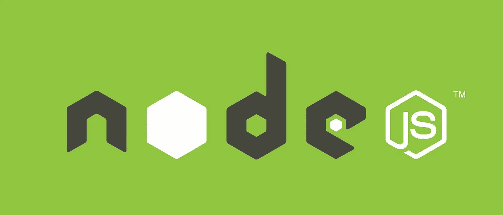
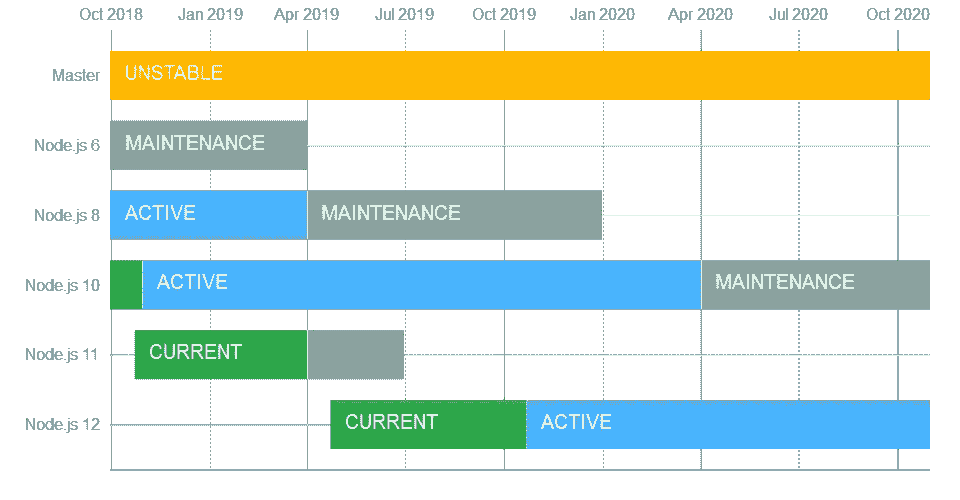
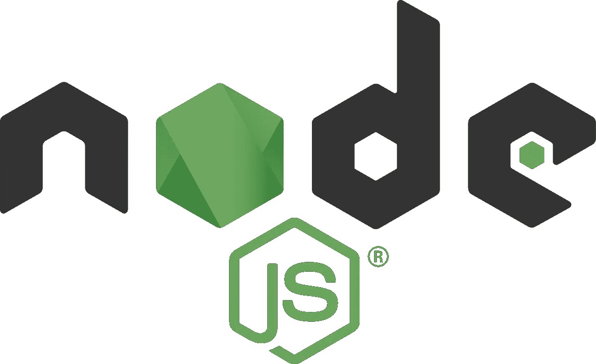

# 了解 2018 年节点版本的工作方式

> 原文：<https://medium.com/swlh/understanding-how-node-releases-work-in-2018-6fd356816db4>

## 快速浏览 Node 版本如何与今年 Node j.s 中发生的变化和更新一起工作。

[**Node js**](https://cdn-images-1.medium.com/max/2000/1*aeWo6e6FC8InJwBl3TmpDw.jpeg)

Node.js 是一个 JavaScript 运行时环境。这个运行时环境包括执行用 JavaScript 编写的程序所需的一切。

拥有超过 55，000 个⭐️Node.js 的开源服务器环境。Node.js 是免费的，可以在各种平台上运行，如 Windows、Linux、Unix、Mac OS X 等。Node.js 在服务器上使用 JavaScript，并拥有世界上最流行的包管理器 Node Package Manager (NPM)。

**TL；DR:** 在本文中，我们将试图准确理解节点发布和版本控制是如何工作的。

# 为什么这很重要？

理解 Node j.s 发行版和版本管理的工作方式一直是 Node 社区中的一个问题。这已经到了一个地步，Node j.s 的官方新版本发布了 Node Foundation 的博客帖子，现在甚至提供了 Node source 等地方的链接，以进一步解释和减少歧义。所以这里的目的是简化一些混淆的概念，看看 Node j.s 是如何工作的

# 熟悉术语

让我们快速看一下 Node j.s 社区中经常使用的关键术语。

1.  **Semvar 机制:** Semvar 的意思是语义版本化。它只是一个类似于 3 位数和 2 个小数点的符号[例如: *1.3.5* ，其中“1”是**主版本号**，“3”是**次版本号**，“5”是**补丁版本号**。].像大多数以开发人员为中心的社区一样，Node j.s 社区利用这种机制进行版本控制。
2.  **补丁:**补丁是在不增加新行为或不改变旧行为的情况下对一个版本所做的任何更改，主要是错误修复。
3.  **次要:**次要(变更)是指任何时候有新的行为添加到版本中，代码库不会改变性能，但新的内容会被添加以“检出”，这意味着您可能不想在您的生产环境中使用这些变更。
4.  **Major:**Major(变更)是任何突破性的变更，任何实际上改变代码工作方式、影响性能和发布线中生产环境的变更。
5.  **发布线:**这简直就是任何一个主要的发布，它分为当前和 LTS。
6.  **当前版本:**节点 j.s 在任一时间点的最新版本称为当前版本。
7.  **LTS 版本:**这只是长期支持的意思，它指的是 Node 将长期支持的版本，比如说 2 年零几个月。
8.  **生命周期结束(EOL):** 生命周期结束是指所有形式的支持都已从版本中撤出的阶段。

# 了解发布流编号

现在让我们看看 Node j.s 发布流的编号，偶数和奇数以及它们的意义。

[**Official Node j.s Release Schedule**](https://github.com/nodejs/Release/blob/master/schedule.png)

在上面的图表中，我们可以看到一个偶数主发布模式。这就是交替版本号的工作方式:

*   奇数版本的发行版不会得到长期支持。
*   奇数版本仅在六个月内受支持，之后将停产。
*   偶数版本是唯一得到长期支持的版本。
*   长期支持从大约 1 年零 6 个月的活跃期开始，适当提交适合生产环境的经过真正测试的功能。
*   然后在活跃期后进入 1 年的维护期，这里主要是安全补丁和漏洞修复。

# 关于 Node j.s 发布生命周期的更多信息:日期

您可能已经注意到，在 Node js 社区中，四月和十月这两个月份有着特殊的含义。这是因为大多数发布都发生在这两个月。

*   每年 10 月，偶数版本会进入长期支持阶段，在某些年份，我们还会推出奇数版本！
*   但是，4 月份有时会带来新的版本，也标志着偶数版本的维护长期支持的开始，这是一个积极的长期支持。

总之，偶数发布线的**当前阶段**仅持续 **6 个月**，从**4 月到 10 月**，然后成为下一个 **18 个月**的**活跃 LTS** ，之后进入**维护 LTS**12 个月。在 **12 个月后**变为 **EOL** 并且支架被切断。

# Node j.s 年 4 月报告

4 月，Dubnium 发布了 Node j.s 版本 10.0.0，作为当前的 Node j.s 版本。下面是 Dubnium 附带的新变化列表。

*   Dubnium 增加了 ABI 稳定模块 API(N-API)作为官方支持的 API 层。，这将减少原生模块的维护成本和生产环境中升级 Node.js 版本的摩擦。
*   Dubnium 增加了现代化的加密支持，升级到 OpenSSL 1.1.0 Node j.s 现在可以充分利用 OpenSSL 完成的工作。
*   Dubnium 还带来了错误处理方面的显著改进。
*   v8 发动机附带的所有改进都可以在 Dubnium 上直接获得。
*   诊断跟踪也有了很大的改进，为 performance API 用户计时事件发出了新的跟踪事件，使得计时和性能问题现在更加明显。
*   Dubnium 随 npm 5.6 一起发布，但是该团队已经承诺更新到 6 已经快到了。

> Node j.s 从 metric 网站和 docker 图片获得了 10 亿次以上的下载。

# Node j.s 年 10 月报告

上个月是 10 月，几个月前新发布的 Node j.s 10.x 现在可以获得积极的长期支持，新的当前版本是 Node j.s 11。如您所知(如果您阅读了本文),当前版本在生命周期结束前将只有 6 个月的支持，在生命周期结束时，支持将完全停止。因此，如果您在 Node 10 中有一个重要的项目，建议您继续使用 Node 10，而不要将生产代码更新到 Node 10。当前版本是为了在本地尝试新功能。

这些新功能包括:

*   重新安排间隔计时器，即使前一个计时器发生错误。
*   对 FreeBSD 10 的支持也被削减了。
*   伊斯兰法院联盟更新到 63.1，增加了信德、毛利、土库曼、爪哇、国际语、库尔德语、科萨语和许多数据改进。
*   REPL 现在支持顶级 for-await-of，这确保了访问者检查带有`await: true`的 for-of 语句，以便能够正确处理`state.containsAwait`。

[这是变更日志](https://github.com/nodejs/node/blob/4f809c007c6fc23b73b696d945b694d7eba5cba4/doc/changelogs/CHANGELOG_V11.md#semver-major-changes)的链接

> *记得使用节点版本管理器(NVM)在工作站上的不同版本节点之间切换。*

# 如何用 NVM 更新我的节点版本

由于有了节点版本管理器，在各种项目中更新和使用新的或多个版本的节点变得非常容易。

*   首先，运行 `nvm --version`，确保你已经安装了 NVM

你可以从这里得到 NVM。安装后，您可以通过运行 nvm install 命令获得新版本的 node，如下所示:

要使用该版本，您只需运行 nvm use 命令，如下所示:

# 我应该使用什么更新？

[**Node j.s**](https://www.google.com.ng/url?sa=i&source=images&cd=&cad=rja&uact=8&ved=2ahUKEwjqyqCZ6M7eAhVM1hoKHYAEDV8Qjxx6BAgBEAI&url=https%3A%2F%2Fen.wikipedia.org%2Fwiki%2FNode.js&psig=AOvVaw10m9tOY2EWJpsiqEjGIVvS&ust=1542110697407097)

***回答:看情况，但强烈推荐 Node j.s 10。***

> 您只能在本地使用当前版本，以便在开发服务器中使用，而不能在生产中使用。

由于 Node j.s 10 现在处于长期支持状态，它可以用于生产环境和需要扩展的应用程序。随着性能的提升、错误处理方式的改进、更高效的错误诊断、跟踪事件以及对安全性的专注，您可以放心，您的应用不会崩溃或缺乏支持。对于仍在使用 Node 的开发者。js 4.x 或 Node。js 6.x，强烈建议你考虑升级到 Node。js 10。

除了 Node j.s 10 的上述特性之外，这里还有一些实验特性:

*   Workers API:在这里，每个 worker 都有自己的事件循环，这自动导致 worker 的详细调试。
*   fs Promises API:这允许接收承诺而不是回调。
*   REPL 中增加了顶级等待。
*   NodeChakra 已经发布了时间旅行调试。
*   js 可读流获得 AsyncIterators 支持。

# 结论

理解节点版本如何工作有助于您决定在任何特定的项目中使用什么版本，并正确地管理期望。我们已经查看了发布生命周期、日期甚至常用术语，我希望这足够有见地，这些概念中的许多我从 nodesource 博客中完全理解。请在评论中留下你的任何问题。

[**跟我来这里**](/@viclotana) **如果你喜欢看这篇文章，请按住鼓掌键。**

## 这篇文章发表在 [The Startup](https://medium.com/swlh) 上，这是 Medium 最大的创业刊物，有+393，714 人关注。

## 订阅接收[我们的头条新闻](http://growthsupply.com/the-startup-newsletter/)。

