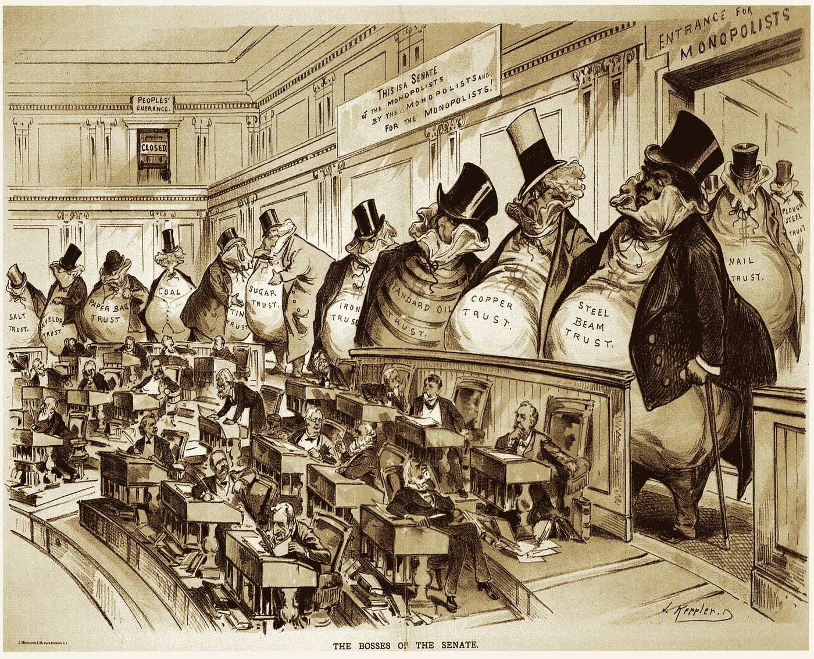

# 理解后现代经济

> 原文：<https://medium.com/swlh/understanding-the-postmodern-economy-ad4dca1a5934>

历史的教训和新兴的现代镀金时代的概念。

History repeats itself. | “The Bosses of the Senate” | [**Joseph Keppler Puck Lithograph**](https://jackholesrealm.wordpress.com/2015/06/09/the-people-yes/comment-page-1/), colored, 1889

史蒂文·格林豪斯的作品*《大挤压》*在关于社会契约的章节中描述了美国经济在战后时期是如何被大规模提振的。

社会契约的概念被描述为产生于这样一个事实，即在第二次世界大战后，美国是唯一…