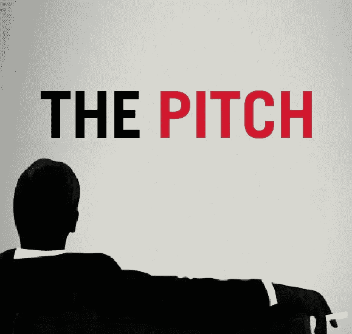

# 理解了这个概念，对我的生意和生活都有帮助。

> 原文：<https://medium.com/swlh/understanding-this-concept-has-helped-me-in-business-and-in-life-ec91a8ef67c6>

不管你喜不喜欢，你在这个星球上的存在都是由一系列音高组成的。

你努力进入学校。你想找个女朋友。你推销是为了找工作或创业。你想结婚。你想要孩子等等。

你们这么多人做错了什么？

像 1990 年代电视广告中的廉价销售员一样盲目推销，出售神奇海绵。

# 从融洽开始。

## 首先举个例子:

你在 LinkedIn 上给我发盲信。

你对我说，你有某个领域最好的产品，你想和我讨论一下。

你没有提到我做过的任何事情或者任何表明你了解我的事情。你使用了一个通用的推介模板，在我之前你已经把它发给了很多人。

当我在任何一个平台上看到任何一条消息时，我该怎么做？我做大多数人做的事。

我删除你的信息，忽略你，永远不再处理你或你的业务。

美女呢？只需要不到一秒钟的时间，就可以摆脱你的信息，永远删除你。

我不是告诉你这是一个洞；我告诉你是为了不让你失去成功的机会。**在推销任何东西之前，你必须始终保持融洽的关系。**句号。

# 蒂姆先生，你是如何开始融洽关系的？

你首先发送一条不超过九句话的短信。

信息必须每三句有一个段落，以便于阅读。
你必须听起来像人类。开玩笑，表示同情等。
你必须尊重他人的时间。
你必须迅速切入正题。你必须表现出你的关心，并且你已经对这个人做了调查。

上面的列表有助于建立一些初步的融洽关系，让你变得可爱。讨人喜欢的人会去生活中的一些地方，和对他们有价值的人聊天。

> “融洽总是第一步，而不是球场。一旦建立了融洽的关系，这种推销就会奏效”

我以为每个人都知道这一点，但我最近才知道这并不广为人知。现在是了，没有借口。

通过使用融洽关系，你建立了一座桥梁，让想法在你和你试图与之聊天并最终推销的人之间流动。一旦这座桥梁建立起来，你就有了一种方法去接近那个人，并让他们采取行动。

# 先展示价值。

我什么意思？价值是一个很难解释的东西。简单来说，价值意味着交付一些对他人有益的东西。目的实际上是相互的价值。这就是你们在互动中双赢的地方。

显示价值非常简单。

> ***“首先，你要对你想推介的人做好调研。然后你试着找出对他们来说什么是重要的***

# 让我给你举个例子:

前几天，我去见了一位非常有影响力的招聘人员，询问一些职业选择。每个人都想让他代表他们，他知道每一个你可以梦想为之工作的公司。他出演的角色都是高薪的，他的支持可以改变你的职业生涯。

我没有进去向他推销为什么我是自史蒂夫·乔布斯创建苹果以来的最佳候选人，而是做了自己的调查。我查了他的推特、LinkedIn 和脸书账户。

我回顾了我们以前的书面通信。我找出了最初是谁介绍我们重新建立起影响力和信任的。

通过研究，我采取了以下行动:

–我遇见他时没有穿西装，因为他的推特资料说他喜欢牛仔裤
–我找到了他的出生地(一个我去过的地方)并谈论了这件事
–我找到了几个他不认识的非常有影响力的人，并向他们引荐，以增加他的业务收入
–我发现了他迫切需要的一项技能(博客和社交媒体协助)

# 大球场。

我很早就到了咖啡馆去见招聘人员。我问他想要什么，他要了一杯果汁。我没有像其他猴子那样给他一瓶，而是请他坐下(让他看我在付钱)，并和女服务员聊了聊，看看他们有什么果汁可供选择。

女服务员告诉我，他们有瓶装果汁和鲜榨果汁。我告诉她鲜榨的会很棒。让我们停一下。为什么要付出额外的努力？因为展示价值首先要表现出你在乎。重要的是小细节。

我终于坐下来，开始建立融洽的关系。然后，我通过介绍几个我们一起工作过的人来创造一种团体感，这样事情就变得很自然，就像我们来自同一个群体。

然后，我简单地谈了一些对他来说很私人的事情，以进一步展示融洽的关系。

一旦所有这些都解决了，执行起来就非常容易了。我会慢慢来。

我首先确认我认为他需要的东西(社交媒体建议)是他想要的东西。我用手机展示了满足这种需求的能力。然后，如果他需要帮助，我主动提出(免费)帮助他。

过程的第二部分是看我认为他必须知道的联系人对他是否有价值。他确认了联系方式，我提供了一个介绍，他很高兴地确认他想要。

然后我带着广告进来了。一字不差地，我是这样说的:

*“嘿，我有一个小挑战，希望你能给我一些建议。我正在寻找重新创造我的职业生涯，并期待看到市场上有什么，工作明智的。我应该从哪里开始？”*

现在让我们花一分钟来分析这个动作。在这一点上，我已经建立了融洽的关系，让他接触到我所拥有的他想要的技能，为他的网络增加了一个非常有价值的联系人，并确保他有最好喝的果汁来度过他的早晨。

你认为他的反应是什么？

他说了以下的话:

“蒂姆，我想我可以帮你。可能是时候看看外面有什么了。你能把你的简历和几个你感兴趣的角色发给我吗，我会开始和几个我认为会有你喜欢的角色的人聊天。”

**融洽，打勾。**
**互值丹田，打勾。**
**发声人形，滴答作响。**
**简单、简短、非面对面的音高传递，勾。**

不过还有最后一步:你必须真正做到你说要做的事情。如果你不采取行动，让别人为你的推销热汗淋漓是没有用的。

采取行动是不够的。行动需要迅速。

所以，十分钟后，回到办公室后，我给他发了一封电子邮件，介绍了他承诺的一切。执行力就是一切。

# ***结束语* * *

不做以上任何一件事就直接投球是懒惰的表现。懒惰的人最终会在生活中失败，并有巨大的遗憾。你必须展现价值，并与你想推销的任何人保持融洽的关系。投入额外的时间意味着更少的投球和更成功的结果。

你推销的人时间有限(你也是)，他们不可能答应每一个要求。因此，你需要花时间把它做好。否则，当你总是被拒绝时，除了你自己，你没有其他人可以责怪。

> “盲目发送自私的信息将会让你一事无成”

这是在浪费你的时间，让你觉得自己像个废物。用这个简单的推销策略，你可以把你的结果提高 10 倍。试试看，让我知道你怎么做。

*原贴于*[*Addicted2Success.com*](https://addicted2success.com/success-advice/dont-pitch-straight-away-show-value-and-build-rapport-first/)

## 如果你喜欢读这篇文章，请推荐并分享它，以帮助其他人找到它！

# 行动呼吁

如果你想提高你的工作效率，学习一些有价值的生活窍门，那就订阅我的私人邮件列表吧。你还将获得我的免费电子书，它将帮助你成为改变游戏规则的在线影响者。

[**点击这里马上订阅！**](http://timdenning.net/free-ebook)

## 这个故事发表在 [The Startup](https://medium.com/swlh) 上，这是 Medium 最大的创业刊物，拥有 295，232+人关注。

## 在这里订阅接收[我们的头条新闻](http://growthsupply.com/the-startup-newsletter/)。

