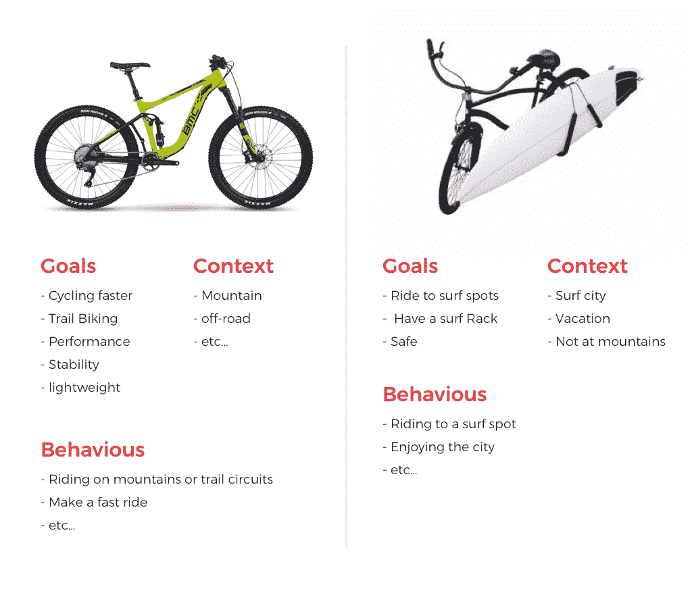

# 了解你的用户可以帮助你交付好的产品。

> 原文：<https://medium.com/swlh/understanding-your-users-can-help-you-deliver-good-products-f0162adbf0d3>

用户体验(UX)，意味着产生好的产品，促进用户友好的体验。它的目标是满足目标人群，也就是知道用户想要什么，并快速简单地给他们。

> 当你试图取悦每个人的时候，你最终不会取悦任何人。

# **找到设计目标**

你越了解你的用户，你就越能理解他们想做什么，这是决定你的产品应该包含什么和不应该包含什么的最好方法。

你要做的是避免构建为所有人做所有事情的产品，或者使用所有可能的场景，相反，你必须构建可以帮助你的用户实现他们目标的产品。

设计产品时，确保每个用户在特定的*环境中有特定的 ***目标*** ，并使用特定的 ***行为*** 。这是我们的设计目标。*

# *目标、行为、背景*

*当你开始研究你的用户时，最重要的三样东西是他们的 ***目标、行为和背景。****

*为了理解这一点，让我们以这两辆自行车为例，它们在全球范围内的销售非常成功:*

**

*让我们看看每辆自行车的目标、行为和背景。

想象一下，如果你让我在山里开一辆越野，看到我和那辆黑色的后，你的第一反应会是什么？！也许你可以笑出声来，说我疯了。 ***是的*** 这很正常，不是一辆好自行车，公司赢得了数百万美元购买它，但它不是针对山区环境优化的，因为它不符合环境，它不会有助于实现绿色自行车的相同目标，也不可能执行相同的行为。*

> *这里的结论是，不管你的产品如何，或者他是如何制造的，但是他是如何针对你的最终用户的目标、行为和环境进行优化的。*

*要做一个好的产品，一定要了解你的用户，他们想要什么，他们想完成什么，他们遇到了什么问题，他们什么时候做这些。因为这样做可以帮助你制造出优秀的产品。*

# *概念模型*

*概念模型是对事物如何工作的解释，通常是高度简化的。

一如既往让我们回到唐·诺曼的名著《日常事物的*设计》中，用一个例子来解释概念模型。**

*****如果你觉得对别人有帮助请分享。享受阅读！！*****

****

## **这篇文章发表在 [The Startup](https://medium.com/swlh) 上，这是 Medium 最大的创业刊物，拥有 294，522+人关注。**

## **在这里订阅接收[我们的头条新闻](http://growthsupply.com/the-startup-newsletter/)。**

****