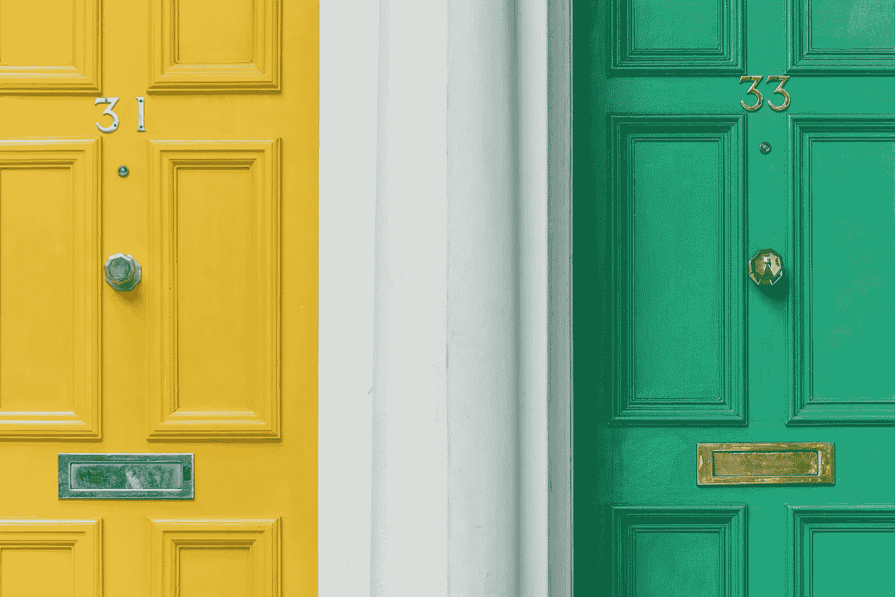

# 撤销不够好的谎言

> 原文：<https://medium.com/swlh/undo-the-lie-of-not-being-good-enough-837d85401f96>

在你的一生中，你会遇到让你失望的人。有时候，他们是好人，有时候不是。有时，他们很生气，很快就做出判断，或者有时你只是在他们倒霉的一天抓住了他们。有时候，他们只是在那一刻被吸引，而你是一个不幸的旁观者。不管怎样，他们都会拿你出气，他们会告诉你 ***你还不够好*** 然后把你拆了。

当我还是个孩子的时候，我会在情感、身体和智力层面上面对这些情况。我几乎相信所有扔给我的东西。现在不同了。有什么变化？现在，我承认这一点——我允许它刺痛我，但我不会接受它作为我的真理。我不再用消极的自我对话来贬低自己。

你知道是什么驱使我吗？人们告诉我我不够好。当人们告诉你不能做某事的时候。它只是点燃了我的竞争之火，驱使我去冒险，并让我获得新的机会。

> *“即使你绝对处于最佳状态，你还是配不上错误的人。即使在最糟糕的情况下，你对合适的人来说仍然是值得的。”—凯伦·萨尔曼索恩*

然而，头脑有时很有说服力。这里有三个提醒，每当我发现自己处于消极的自我对话状态时，我都会提醒自己。

# **1。** **停止拿自己和别人比较**

我相信我在 20 岁左右就不再拿自己和别人比较了。当时，我正在我最喜欢的咖啡馆里读艾克哈特·托尔的《新地球》。这本书，是关于想要增加一个人的个人幸福和减少一个人自我毁灭的倾向，完全改变了我的生活。

我希望并决定通过对密友更加公开我的不安全感来增加我的个人幸福，有时我会将自己与他们的品质相比较。承认我的不安全感感觉很好，我也很欣慰我的朋友们理解我。作为回报，他们也向我敞开了他们的不安全感，这让我大吃一惊。他们也和别人比较，甚至和我的品质比较。

那时我才知道，我们都把自己和别人比较。有无限多的品质和几乎无限多的人可以和我们比较。一旦我们开始走这条路，我们将永远找不到尽头。尤其是当拿某人的优点和你的缺点比较时。你觉得你会怎么判断？

当我开始用平等和理解的眼光看待我的朋友和其他人，而不是嫉妒和评判时，我能够看到他们作为一个人的本质。这听起来可能不是你想听的，但我学会了 ***爱足够的*** 。

如果你总是想成为别人，你永远都不够好。你总是想要更多。那是一个永无止境的循环，永远不会带来个人的幸福。相反，要意识到你是谁，你拥有什么已经足够了。如果你有爱你的人，为什么你不能？你就够了。好好利用这一点，你会找到个人的幸福，就像我一样。

> “生活中有一件有趣的事情，一旦你开始注意到你所感激的事情，你就开始忽略你所缺少的东西。”—德国肯特

# **2。** **你对的比错的多**

我们很容易忘记什么是对的。就我而言，当好事发生时，我不会庆祝，所以我也不会接受。即使有，也只是短暂的。然而我对困扰我的事情很着迷。是想要改变的循环思想成为了我的习惯。直到我受到这句话的启发:

> 只要你还在呼吸，无论你感觉多么虚弱或者多么绝望，对的都比错的多—乔恩·卡巴特-津恩

对我来说，这是一个强有力的提醒，我希望这也是一个。我有时倾向于放大我所有察觉到的缺点。这句话帮助我记住，我也有很多喜欢自己的地方。现实是，我们的生活中，对的往往比错的多。这不是一个完美的世界，但有很多美丽的东西，只要我们愿意去看和欣赏它。

只需环顾四周**和*选择看到好的东西*** 。不要让出错的小事分散你的快乐。当你允许自己看到事物有多美好时，快乐和喜悦就会发生在你身上。

# **3。** **改变发生在接受你现在所处的位置之后**

我学到的关于做出改变和到达我生命中的下一个篇章的知识是，我不能对我要去的地方感到完全满意，直到我能接受和欣赏我现在的位置。过去的痕迹会一直留在我的脑海里，这让我无法做出任何改变。

当我把改变的责任留给未来的自己以便现在感到安全时，我正在储存越来越多的问题让我以后去处理。为了改变，为了开始过我想要的生活，我必须从今天开始生活。

> 还有什么比对已经存在的东西产生内心的抗拒更徒劳、更疯狂的呢–艾克哈特·托尔

当我释放对事物现状的抗拒时，我为更多的机会创造了空间。放下我的“应该”是我改变生活的最有力的方式。

*原载于 2018 年 2 月 8 日*[*【ye-chen.com】*](https://ye-chen.com/undo-the-lie-of-not-being-good-enough/)*。*

## 这篇文章发表在 [The Startup](https://medium.com/swlh) 上，这是 Medium 最大的创业刊物，拥有 294，522+读者。

## 在这里订阅接收[我们的头条新闻](http://growthsupply.com/the-startup-newsletter/)。

