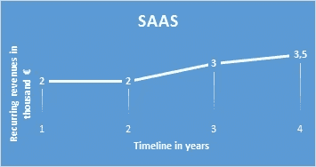
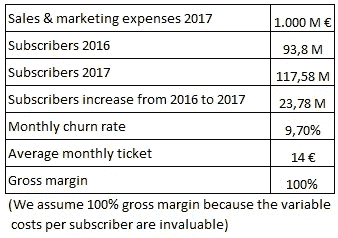
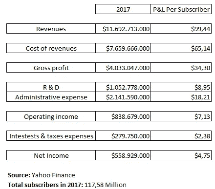

# 单元经济学:增长是创业公司的最终目标吗？

> 原文：<https://medium.com/swlh/unit-economics-is-growth-the-ultimate-goal-of-a-startup-b319df9c45f>

为了回答这个问题，我打算先解释一下*单位经济学*是什么意思。

这是一种衡量销售一单位产品或服务的盈利能力的方法。每种商业模式都有其特定的*单位经济*，根据您想要做的分析，您可以选择不同的模式，例如:

-航空公司:座位、飞机、航线

-餐馆:订单、场所

-市场:客户、交易

> 投资者问你的第一个与单位经济学相关的问题是:你需要多少“单位经济学操作”才能达到收支平衡？这是销售一个单位经济效益的固定成本/边际贡献。

对这个概念的深刻理解会让你意识到经常性收入的重要性。在我之前在一家搜索基金担任分析师后，我意识到了这一点的重要性，在那里，经常性收入是购买一家公司不可或缺的标准(如果你有兴趣了解更多这方面的信息，请点击[此处](https://www.searchfund.org/))。这意味着你的公司能够在没有任何额外投资或销售努力的情况下创造收入，换句话说就是降低投资风险。每一年，一家公司都是从上一年的经常性收入减去客户流失的收入开始的。

Figure 1: Recurring revenues business model. Source: Own elaboration.

尽管如此，我们在 [Lanzadera](https://lanzadera.es/) 上说，处于早期阶段的初创公司应该专注于尽可能快的增长，以实现产品与市场的契合，并验证价值主张。同时，建议衡量公司业绩的盈利能力。

我们现在将使用网飞的案例，它是基于年度报告和新闻发布的数据，以更好地理解单位经济学。

**网飞—单位经济学案例**

在此分析中，我们将使用订户作为网飞的单位经济学*我们将进行一些计算，目的是更好地了解网飞的单位订户性能。*

Figure 2: Netflix´s data. Source: Own elaboration based on data from annual reports and press release.

CAC (1) =(销售和营销费用/#赢得的新客户)= 42 €

CLV (2) =(每月每用户收入*毛利率%)/每月流失率= 144 €

网飞的 CLV 与 CAC 的比率是 3.5。这是一个健康的比率，也就是说，在营销网飞上每投入 1 €，就能产生 3.5€的毛利润。

另一个需要计算的有趣数字是回收期，即公司为了获得新客户而需要收回营销投资的月数。

回收期= CAC /(每个用户每月收入*毛利率%) = 3 个月

据 neilpatel.com 称，网飞的月流失率为 9.7%。

客户生命周期月数= 1 /月流失率% = 10.3 个月

减去客户生命周期月数的回收期后，结果是每个用户产生 7.3 个月的毛利润。

简而言之，CMO(3)将利用*单位经济学*来增加长期回报合理的营销预算，这将来自于*获得新客户* & *增加客户忠诚度*。

在这里，我们计算了网飞 P&L 2017 年的每用户报告，目的是全面了解每用户的性能。

Figure 3: Netflix´s annual report. Source: Own elaboration based on data from Yahoo Finance.

现在想象一下这个意想不到的案例研究:让我们假设朝鲜将向自由贸易开放其国家，而网飞正在考虑筹集一轮投资以进入该国。实现 TAM(4)需要多少资金？

假设朝鲜 2500 万人口中，有 1200 万是网飞的潜在客户。经过计算，TAM*CAC，结果是网飞将需要 4.8 亿€来实现其所有的潜在客户。

最后，我将总结一下*单位经济学*有用的一些原因:

-了解您业绩的盈利能力

-准确预测你的财务状况

-不扩大不盈利的业务

尽管我们上面提到了这些，我们建议不要只关注单位经济，因为真正重要的是绝对数字，比如年净收入，这将使你的公司成长。*单位经济学*是 Listair Croll&Benjamin Yoskovitz 在其著作*精益分析*中定义的“创新会计”的一部分。

注意事项:

(1) CAC:客户获取成本

(2) CLV:顾客生命价值

(3) CMO:首席营销官

(4) TAM:潜在市场总量

## 这篇文章发表在 [The Startup](https://medium.com/swlh) 上，这是 Medium 最大的创业刊物，拥有+403，714 名读者。

## 在这里订阅接收[我们的头条新闻](http://growthsupply.com/the-startup-newsletter/)。

