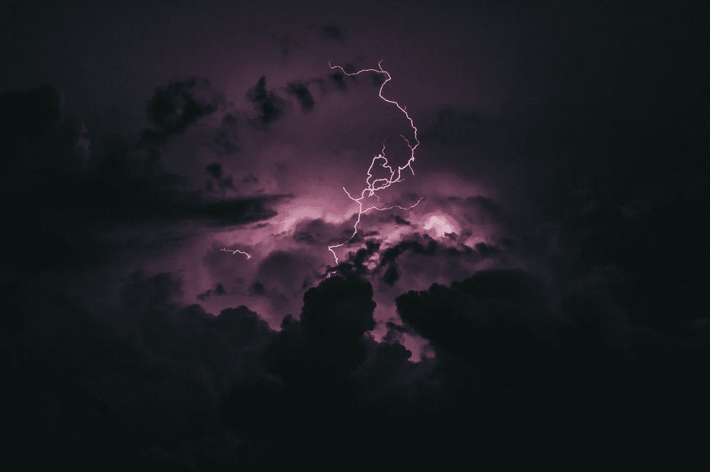

# 掀起一场风暴

> 原文：<https://medium.com/swlh/unleashing-a-storm-76fb327ba7b6>

Photo by [Breno Machado](https://unsplash.com/photos/in9-n0JwgZ0?utm_source=unsplash&utm_medium=referral&utm_content=creditCopyText) on [Unsplas](https://unsplash.com/?utm_source=unsplash&utm_medium=referral&utm_content=creditCopyText)h

残酷的诚实能为你的写作生涯带来什么。

残酷的诚实是一件可怕的事情，不是吗？与世界分享你所有隐藏的秘密、弱点、欲望和问题。

但是，让我们面对现实吧。

如果你不与世界分享那些被锁在心灵深处的东西，那些试图自由爬行的隐藏的恶魔，那么为什么会有人在乎呢？

人类能想到的每一个话题以前都有人写过。

所以除非你有非常独特的视角带给这个世界，否则你只会淹没在杂乱中。这种独特的视角存在于你自己所面临的所有问题中，以及你个人是如何处理它们的。

# 分享其中一个秘密将永远是一场与自己的战斗

> 高度重视维护权力和地位是人类的天性。我们只是太在意别人对我们的看法。这种倾向在我们心中根深蒂固，我们会一直这样下去。

正因为如此，分享我们最深的秘密是我们很少做的事情，尤其是在公共论坛上。

我们害怕别人会评价我们。我们害怕他们会认为我们是失败者。我们害怕自己会失去社会地位。

比如我最近发表了一篇文章，题目是“[高学历，却穷得要死](/swlh/highly-educated-but-poor-as-hell-d8dc4c32aead)”。

在这篇文章中，我基本上是在分享，在我生命的大部分时间里，我都在努力赚钱，尽管我在不同类型的工作中有很多资历和经验。

我之所以分享这篇文章，主要是因为我觉得在创意行业中有很多人都在为同一个问题而挣扎，但他们太害怕了，不敢与世界分享他们的问题。

**当我在写这篇文章的时候，很多这样的想法出现了:**

> “你敢发表这篇文章。谁愿意听一个穷了大半辈子的人说话？你会失去作为作家的所有信誉！”

我很高兴我按了“发布”键。

那篇特别的文章成了我迄今为止阅读量最大的文章，也是引起最多人共鸣的文章。

在某些方面，这个结果对我来说也有点奇怪。人们开始回复这篇文章，给我一些如何克服这个问题的“建议”。然而，我从来没有要求解决方案或同情。

我只是想和人们分享我的经历，以及我觉得有创造力的人可以做些什么。

# 今天我决定发起一场风暴，直接冲进去

当我们发表来自内心深处的东西时，我们害怕会出现“风暴”。我们将面对读者的所有羞辱。我们会和周围的人产生的所有问题。

今天，我决定释放自己的风暴，看看会发生什么。

如果阻碍我写作生涯的主要问题是，每当我想发表一篇文章时，它都迫使我与自己的恐惧作斗争，那么对此只有一个合乎逻辑的解决方案。

> 我决定今天花一天时间头脑风暴一下我所有隐藏的秘密。然后，我会在这篇文章中列出它们，并简单地把它们放在那里。

一旦我做到了，我还有什么好害怕的呢？

就算变成“灾难”，成千上万的人都在嘲笑我，那又怎么样？就算有些自称是我朋友的人因为这种“地位的丧失”而和我拉开距离，那又怎么样？

一旦我把所有隐藏的秘密都公布于众，那么我所害怕的一切都会在一场巨大的风暴中向我袭来。

或者，也许我会发现什么都没发生。

一个选择是，我迄今为止建立的一切都将被摧毁，我可以再次开始建立我的生活。但这一次，带着纯粹的诚实和真实。

另一个选择是，我会从我周围的人那里得到支持，我会明白在分享我隐藏的秘密方面没有什么好害怕的。

不管这两件事发生哪一件，都会让我平静下来。每当我发表一篇文章，我将不再有什么可害怕的。

我可以做我自己。写一些我真正关心的事情。

# 以下是我隐藏的秘密:

1.  我 18 岁的时候搬到了国外，只是为了见我的父母才偶尔回家。这样过了 7 年，我父亲去世了。我知道我会一直感到内疚，因为我没有机会花更多的时间和他在一起，也因为在他去世前我根本不在他身边。
2.  当我十几岁的时候，我强烈沉迷于像《魔兽世界》、《魔兽争霸 3》或《暗黑破坏神 2》这样的游戏。我在某个时刻差点让学校不及格，因为我深深地陷入了这种加法和懒惰中，以至于我完全忘记了学校。常常，我甚至没有吃适当的食物，而是呆在电脑前简单地吃薯片和喝可乐。
3.  有时候，我觉得自己是个失败者，因为我不能为我和我的伴侣从工作中获得体面的生活。我也完全不会理财。
4.  我经常在想和家人在一起的愿望和想成为世界上最好的跨文化交流作家的渴望之间纠结，我认为这让我有必要住在国外。
5.  我第一次喝酒，是在我 16 岁左右的时候，我喝到了酒精中毒的程度，我去了医院。直到今天，讲这个故事让我感到害羞，因为我的家人以前总是为此取笑我。这是我几年前停止饮酒的原因之一。
6.  我真的很想念我的妈妈，我非常担心她…尤其是现在她一个人在家。我真的很想做更多的事来支持她，但是我不知道该怎么做，又能做些什么。这常常让我在那方面感到无助。
7.  虽然我已经教会了自己要善于社交，甚至在群体中表现得相当好，但事实上我是超级内向的。大多数时候，比起做其他事情，我更喜欢坐在我的笔记本电脑前写自己的东西。
8.  我害怕没有人会关心我的作品。我的工作将永远无足轻重。
9.  我有一家总部设在格鲁吉亚的公司，它的存在主要是为了接收付款，因为不可能向我居住的国家(伊朗)进行国际转账。问题是，我有时会展示公司，好像它是“国际”的，以使我的工作看起来比实际更大，并赢得客户。
10.  我总是担心我和我的伴侣正在失去对自己生活的控制。从四面八方，我们周围的人都在试图影响我们的决策过程。我总是害怕被推到这样一种境地:我以取悦他人的方式生活。
11.  我对不能给我的伴侣提供有趣的生活感到非常抱歉。因为我们仍处于建立事业的过程中，我们几乎所有的时间都与工作联系在一起。我们偶尔会遇到朋友，进行短途旅行，但这显然是不够的。
12.  我连一个[真粉丝](http://kk.org/thetechnium/1000-true-fans/)都没有，真的让我对自己很失望。根本没有人真正认真地关注我的工作，阅读我的大部分作品。
13.  我常常觉得自己是个局外人，因为我就是。在过去的 7 年里，我一直生活在 3 个不同的国家。我的社交圈和我的生活环境变化如此频繁，以至于我根本没有一个属于我的特定地方。
14.  从某种意义上说，我一直在努力“与众不同”。在我高中的最后几年，我留着非洲式发型，被称为非洲式发型。上课时，人们喜欢往我的头发里扔纸团，这样下课后我就可以从头发里拉出几十个纸团。后来，这种与众不同的愿望在我移居印度尼西亚时表现了出来，并从那里继续下去。
15.  如果有一件事我真的很糟糕，那就是让我身边的人对我的生活感到舒服。除了我的搭档，我身边没有人真的相信我能在写作生涯中取得成功。当然，这有时会导致自我怀疑。
16.  过去，[我也很难坚持做一个项目](/swlh/you-can-start-but-can-you-finish-cf7d76350789)。我是那种喜欢提出想法的有创造力的人，但也很快对新想法和新机会感到兴奋。
17.  从十几岁开始，我就一直受胃病的困扰。然而，我从来没有真正让医生看过。尽管我知道这种行为有多愚蠢，但我想我害怕这次检查会暴露出的结果。
18.  我是那些花大量时间阅读自助书籍，但几乎从不实施书中所写内容的人之一。
19.  当我专注于一个项目时，我会如此投入，以至于忘记了几乎所有其他事情。与此同时，我生活的所有其他方面都可能变成一场灾难，而我甚至不会注意到它。
20.  我的梦想是在我的余生中每隔几年左右搬到一个新的国家…但同时在德国和伊朗拥有公寓，以便在我们的两个家里度过一年中的一半左右。但我真的怀疑这是否会发生，因为这种生活方式让我和我的伴侣很难有足够的时间和家人在一起。

好了，就这样。现在你知道我性格中最薄弱的部分了。

毕竟，分享它们并不困难。

当然，这并不是我隐藏的全部秘密。仅仅在一篇文章中列出它们是不可能的。但我想到的是主要的那个。

现在，我只是向后靠，看看会发生什么。

*   人们将如何应对残酷的诚实？
*   有人会在乎吗？
*   在这个练习之后，我会有什么感觉？
*   这是否会让我在以后的文章中更容易注入我真实的观点？

我希望你能接受我的邀请，和我一起踏上探索之旅。

# 行动号召:

你准备好释放你自己的风暴了吗？

与世界分享你最隐秘的秘密、弱点、欲望和问题？把自己从向周围人隐藏真实自我的需要中解放出来？

那你为什么不和我一起做这个练习呢？

*   发表你自己的关于你最不为人知的秘密的文章，然后和全世界分享。
*   使用# brutalhonesty 标签并在 Twitter 上分享，这样我们就可以找到彼此。
*   挑战你的作家朋友参与。

最好的，

定时（timing 的缩写）

## 这篇文章发表在[《创业](https://medium.com/swlh)》上，这是 Medium 最大的创业刊物，有 281，454+人关注。

## 订阅接收[我们的头条新闻](http://growthsupply.com/the-startup-newsletter/)。

