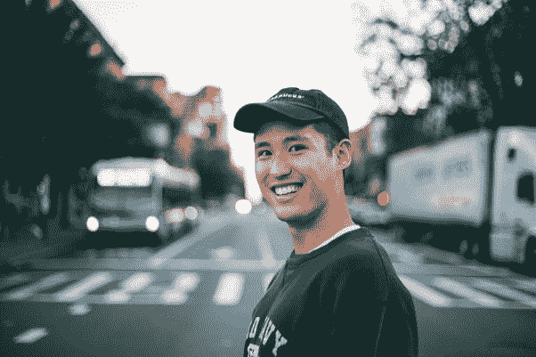

# 用这三种方法释放你的快乐

> 原文：<https://medium.com/swlh/unlock-your-happiness-with-these-3-methods-9a838dd0e3d6>

> “我们都应该努力过上非凡的*生活。”*

在过去的五年里，我一直在研究快乐和积极心理学。最糟糕的事情发生在我身上& 2013 年，我在与癌症的斗争中失去了母亲。从此走上了个人发展的道路。

当世界满足我们当前的期望时，我们就能感受到幸福。每当生活顺心如意时，我们往往会感到快乐 *&* 当我们的期望没有实现时，我们会感到不快乐**。**

**当你有意识地意识到自己感到幸福，并对生活感到深深的满足时，真正的快乐和幸福就在一起了——每时每刻。**

**这里有三种方法开始在你的生活中培养快乐**

## ****增强自我意识****

**为了让我们体验非凡的生活，我们必须开始关注发展我们的自我意识。了解你的想法、情绪、优点和缺点是什么&为什么你会有它们，这非常重要。**

**随着我们对自己越来越熟悉，我们可以开始改善我们的弱点&关注更重要的生活目标。**

**成功的关键是要有一个详细的计划让你达到目标，并意识到理解的重要性&与自己建立更深层次的联系。开始问自己一些自我反省的问题，例如:**

> **我的缺点是什么，如何改进？**
> 
> **我在消极的想法和情绪上花了多少时间？**

**这类问题允许我们从当前的现实中后退一步，这样我们就能对我们最喜欢做的事情有一个更清晰的认识。**

**释放快乐的关键是花更多的时间在你喜欢和享受的事情上，因为那是你感觉最有活力的时候。**

## ****多动动你的身体****

**优化你的健康并确保你足够的锻炼是你每天情绪感受的重要组成部分。**

**如果你缺乏活力，感觉没有动力，不能保持专注，或者在一天中的某些时候感觉懒洋洋的，那么适度的体育活动对你来说是必要的。**

> **这些都是你身体衰弱的迹象&你必须采取行动。**

**你的身体在生物学上被创造来移动、奔跑、跳跃、游泳、举起、远足等等。这是健康长寿的秘诀。[研究表明](https://draxe.com/benefits-of-exercise/)锻炼可以增加你的快乐程度，提高你的注意力，改善睡眠质量，并增加整体能量。**

**保持体力活动带来一系列好处，你应该从今天开始。你的健康是一个关键的习惯，如果你想要成功和快乐，它必须成为一个优先事项。一开始可能会有挑战，但你会因此拥有更好的生活。**

**当你不喜欢自己的感觉和外表时，我们很难保持快乐。这是因为我们缺乏自信，这种自信会发展成对自己形象和现状的自我怀疑。**

**不要陷入永远无法改变的心态，因为那只是一个借口。**

## ****心存感激****

**你幸福的基础取决于你对生活本身的欣赏。我们必须选择欣赏而不是自怜。**

**当你对你已经拥有的东西心存感激时，生活会向你展示它的祝福。研究表明[心存感激](https://www.psychologytoday.com/blog/what-mentally-strong-people-dont-do/201504/7-scientifically-proven-benefits-gratitude)能减少诸如后悔、恐惧、愤怒和焦虑等有害情绪。这与有效增加我们的幸福和减少抑郁相关。**

**感恩也被证明对克服过去的创伤有很大的帮助。这是因为训练你的思维去关注更多值得欣赏的事物，这会阻止我们的注意力从过去或我们无法控制的事物上移开。**

**我们必须选择感恩我们在生活中最艰难的时候已经拥有的东西，因为这是我们培养感恩的方式。首先感谢你早上醒来&有睁开眼睛的能力。**

**早上第一件事就是表达感激，这让我们的心处于感激的状态。请记住，感恩可以减少消极的想法和感觉，如果我们没有在早上第一时间控制自己的想法，这种消极的想法和感觉就会经常发生。**

***你越感恩，就越快乐。***

****

## **这篇文章发表在 [The Startup](https://medium.com/swlh) 上，这是 Medium 最大的创业刊物，有 295，232+人关注。**

## **订阅接收[我们的头条新闻](http://growthsupply.com/the-startup-newsletter/)。**

****