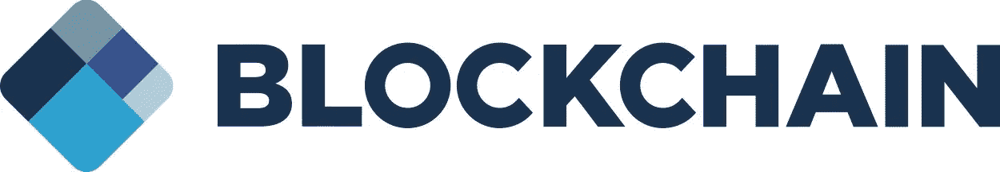
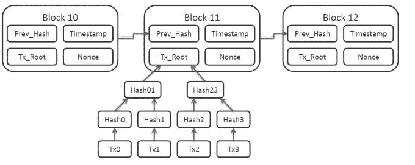
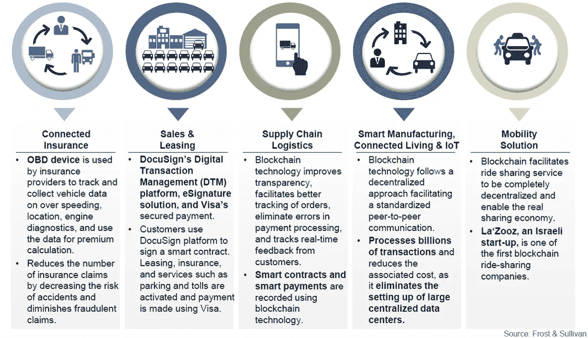
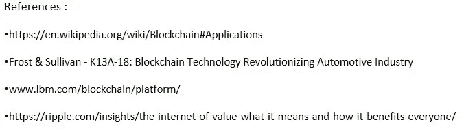

# 解开区块链的区块

> 原文：<https://medium.com/swlh/unraveling-the-blocks-of-blockchain-7ad29209bd33>

credit-[https://commons.wikimedia.org/wiki/File:Blockchain_Logo.jpg](https://commons.wikimedia.org/wiki/File:Blockchain_Logo.jpg)

**什么是区块链** —它是一个分布式账本，用来记录交易。就是这样。没有更复杂的定义。

让我们再深入一点。

**商业视角** —区块链有助于实现资产(有形和无形)和价值的高效转移。因此，它节省了时间，降低了成本，增加了信任。区块链的四个基本组成部分。

*   共享分类帐(仅附加整个业务网络共享的分布式记录系统)
*   智能合同(无需人工干预即可执行或实施的业务规则)
*   隐私(交易安全且可验证)
*   信任(交易由相关参与者背书)。

**技术视角** —它是由链条连接的一系列方块。每个块维护一个时间戳和到前一个块的链接。它适用于记录事件，其他用例有身份管理、事务管理等。

微软、IBM 和英特尔是帮助开发、测试和部署区块链应用程序的一些技术公司。微软 Azure 的区块链解决方案、IBM 的由 hyperledger 项目支持的 bluemix 区块链平台、英特尔的锯齿湖区块链平台是这些公司为实现区块链解决方案而开发的一些框架。

第一个实现区块链的例子可以追溯到 2008 年，当时是中本聪的**比特币**。

**关键好处** —区块链在去中心化的平台上工作。透明性、消除第三方、降低成本、小额支付、加密安全性和不变性是区块链解决方案的主要优势。

**#InternetOfValues** —区块链实现价值交换。它赋予了#InternetOfValues 新的含义。有了价值互联网，外币支付等价值交易可以立即发生，就像人们几十年来一直在网上分享文字、图像和视频一样。而且不仅仅是钱。价值互联网将实现对某人有价值的任何资产的交换，包括股票、选票、常旅客积分、证券、知识产权、音乐、科学发现等等。

**公立与私立区块链**

公共区块链也称为开放或无许可，允许任何人查看或发送交易，只要它们是共识过程的一部分。还有区块链联盟，其中只有预先选择数量的节点被授权使用分类帐。公共网络的例子是比特币。

私有区块链也称为许可，使用访问控制层来控制谁有权访问网络。它们将写入分布式分类帐的能力限制在一个组织内，如公司内的一组员工。它们不依赖匿名节点来验证交易，也不受益于网络效应。

**用例** —其最高接受度和用例在金融领域。支付、货币兑换、贷款结算、汇款、交易、抵押、索赔结算等。

让我们看一些非财务用例。尤其是汽车。

**汽车使用案例** —这些是区块链在汽车行业的现有应用。

供应链管理

乘车共享等移动服务

零售和租赁

运营商选择和智能合同

支持流动性的支付和奖励

截至 2016 年，汽车关键功能领域的区块链渗透率约为 2.0%，预计到 2025 年将达到 37%。

汽车行业的未来用例将包括联网汽车、自动驾驶、物联网、工业 4.0、智能制造、3D 打印、智能预测、万物起源。五大增长机会是:

**挑战** —区块链是炒作吗，某种程度上是。因为它有自己的挑战，当然不会解决所有问题。安全性、复杂性以及知识和技能不足是其中的一些挑战。区块链不是一项“颠覆性”技术，而只是一个基础，一个具有巨大潜力来创造未来应用和系统的概念。大规模采用还需要几十年时间。

## 这篇文章发表在 [The Startup](https://medium.com/swlh) 上，这是 Medium 最大的创业刊物，有 289，682+人关注。

## 订阅接收[我们的头条新闻](http://growthsupply.com/the-startup-newsletter/)。

