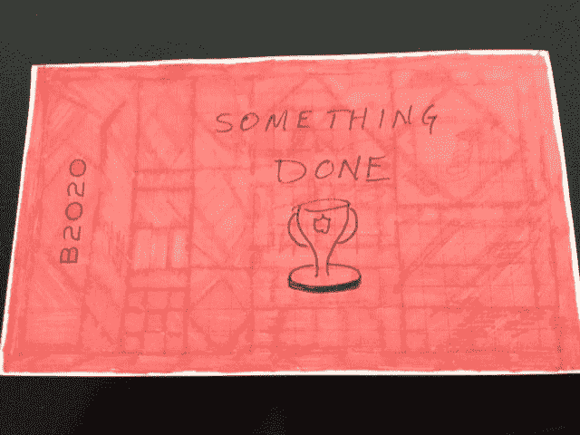
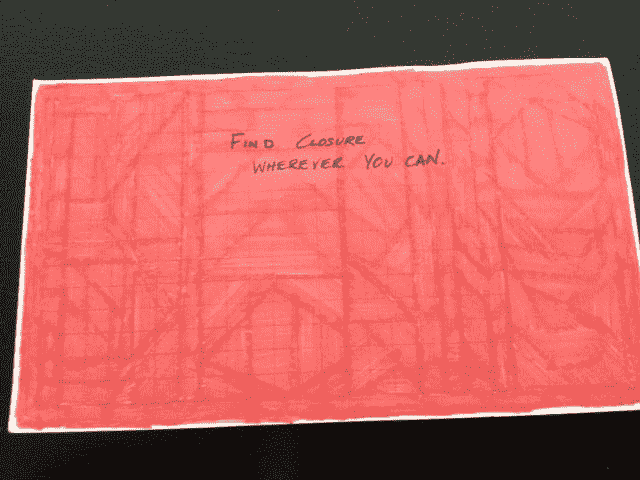

# 解开领导变革的橡皮筋球

> 原文：<https://medium.com/swlh/unraveling-the-rubber-band-ball-of-leading-change-47485f2308d6>

Photo: Shutterstock

第一个故事。一天深夜，在公司转型工作进行了大约六个月后，我走近一位团队成员的空桌子，放下一份文件。在他摆放整齐的桌面中央，有一个信息夹，夹着一张 3x5 的索引卡。我拿起两面都用红色记号笔着色的卡片。卡片的正面写着这样的话:同样，背面写着:尽你所能找到终结。

在举手帮助改变一种文化和公司之前，这位领导者已经成功地为塞斯纳 Citation 喷气式飞机提供了数百万美元的内饰超过十年。充满有形成就的日子现在是在模糊的宇宙中度过的，用流程图帮助改造一个有 75 年历史的文化，而不那么多疑的员工是他进步的唯一证据。

第二个故事是由已故的伟大的迈克尔·哈默博士讲述的，对变革的领导者很有帮助。他注意到，20%的人从第一天起就加入了。这些人会举手询问他们能帮上什么忙。另外 20%是不可救药的怀疑论者，不太可能支持变革。中间的 60%正在决定是加入第一组还是第二组。哈默博士指出，变革领导者的主要责任是**保持中间的 60%远离底部的 20** 。

普遍的误解是，为了成功，每个人都需要接受、承诺和参与变革努力，这是不准确的。事实是，由正式和非正式思想领袖组成的团队中的一些人必须承诺并参与推动成功。绝大多数人，即使是在下层的 20%，也不会积极反抗。大多数抵抗都是被动的，可以说既不会帮助也不会伤害事业。大多数人将学习新的流程和系统，并胜任自己的工作。有些人会选择不同的道路，自愿离开这个行业。少数人将继续抵制并被要求离开。这些员工认为新的工作方式不适合他们。这很正常。

转型期间的领导是你在工作中最难做的事情。这是令人沮丧的，痛苦的缓慢，筋疲力尽，充满了更多的不确定性，超过了大多数人在几周或几个月内所能接受的程度。这很正常。

在其他人离开一天后，变革领导者会花很长时间去同情。这很正常。

他们思考下一步要做什么才能接触到不情愿的领导者，以及如何向同行听众说正确的话，让他们与愿景联系起来。他们想知道如何支持那些看起来是抵抗者，但可能只需要更多信息来帮助他们理解的人。他们经常会问自己为什么要参加这项任务。随着时间的推移，他们通常会决定做这项工作是为了有所作为，成为一个榜样，创建一个持久的组织，并建立一种他们兴奋地称之为自己的文化。这很正常。

这种努力不一定能成功地改变文化，但它会 100%地改变每一个变革领导者。

我的建议是，拥抱你正在做的工作的重要性，并与领导的动机联系起来，为人们和公司做更好的事情。定期休息一下，理清思绪，远离烦恼(例如，长周末，长距离散步，长距离跑步，长约翰·西尔弗)，对待工作而不是自己太认真。

**外卖:**这是必不可少的必要工作，它不会消失。那些挺身而出去做那些不舒服的、不受欢迎的、对一个组织实现其潜力至关重要的事情的领导者是勇敢的领导者的榜样。我还没有见过有太多这样的组织。

## 还有什么？

*您可以访问我们的网站* [*这里*](https://davidporteradvisors.com) *了解更多关于戴维·波特顾问的信息。当你准备好的时候，我已经准备好进行正确的对话了。我们都会学到一些东西。*

## 这个故事发表在 [The Startup](https://medium.com/swlh) 上，这是 Medium 最大的创业刊物，拥有 329，974+人关注。

## 在这里订阅接收[我们的头条新闻](http://growthsupply.com/the-startup-newsletter/)。

