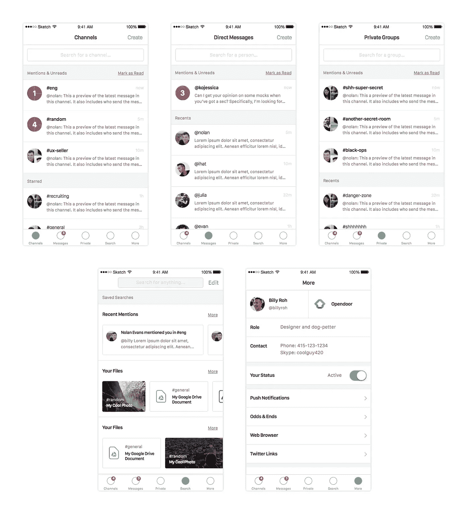
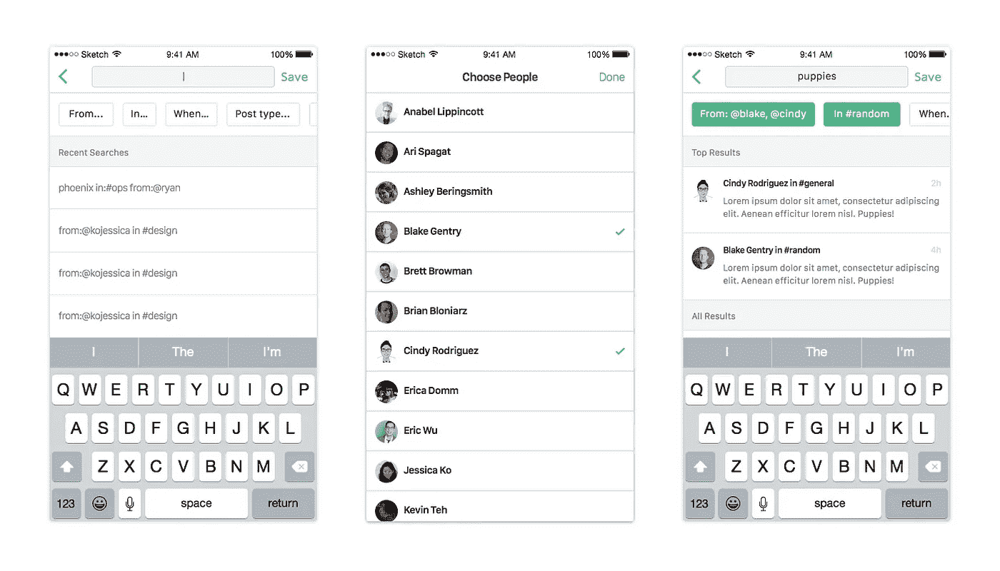

# 不请自来的重新设计:iOS 的 Slack

> 原文：<https://medium.com/swlh/unsolicited-redesign-slack-for-ios-61f57f879a12>

我每天都用 Slack，很爱用。这是一款制作精良的产品，很明显它倾注了大量的心血。但是我是一个吹毛求疵的设计师，有太多的空闲时间！所以这里有一个主动的重新设计，解决了我在**导航、通知和搜索**方面的问题。

# **更快的导航**

**问题:**Mac 版 Slack 上的导航真是爽快。在 iOS 上没有那么多，滑动，点击和搜索。🐢

**可能的解决方案:**标签和持久历史。🐇

## **标签、标签、标签(对着*账单、账单、账单*的曲调)**

标签栏是加速导航的一种快速而简单的方式。有一种方法可以做到:

这种结构的优点如下:

*   **多任务处理:**当你在频道和消息之间来回切换时，你不会失去你的位置。
*   **预览:**在每个表格单元格中，您可以看到最新消息的预览。如果有通知，你可以看到通知你的东西。

## **刷机，多刷机！**

我最喜欢的 Mac 版 Slack 的部分是可以通过⌘ + [和⌘ + ]快速循环我的频道历史。如果我正在读一些东西，而我被一个通知分散了注意力，我想回到我正在读的东西，这真的很有用。

那么如何才能把这个带到 iOS 上呢？也许我们可以用分页视图做些什么。

有了这个，我们就可以得到**持久的历史。你不需要在刚刚阅读的对话中寻找答案，你只需要扫一下就可以了。点击后退按钮会让你回到标签的根视图。**

编辑:一位同事刚刚告诉我，你实际上可以用两个手指滑动来完成这个操作。但是我想一个手指滑动仍然是一个进步？

# **更丰富的通知**

**问题:**iOS 应用上的应用内通知是个谜。我得到了一个微妙的徽章，但也仅此而已。这就很难判断这家公司是着火了，还是什么都没有。😓

**可能的解决方案:**更丰富的通知💰

## **吐司，美味的吐司**

一个可能的解决方案是:应用内通知。他们可以区分四种不同的类型，为您提供更多的背景信息，因此您可以相应地确定优先级:

1.  信息
2.  提及
3.  @频道或@这里
4.  有人在某处发帖

而且它们可以像 Android 上的[吐司](http://developer.android.com/guide/topics/ui/notifiers/toasts.html)一样被轻易打发掉，所以如果你一次收到几个，它们也不会太多。它可能看起来像这样:

这给我们带来了什么:

*   背景:你可以浏览一下通知，看看你是否需要执行它。
*   **速度**:你可以点击通知，快速导航到该事物。然后你可以滑动回到你在的地方。

# **搜索为一级功能**

搜索是 Slack 最好的功能之一。这让我不会因为那些已经被回答了一百万次的事情去烦我的同事。不过，在 iOS 应用程序上，这可能会更难一些，原因如下:

**第一期:**有限的房产。我可以在桌面上一次查看很多结果来找到我想要的，而我的手机只能显示几个。🏠

**问题 2:** 打字慢。在桌面上编写一个复杂的查询来找到我想要的东西既快又容易。在手机上没那么多。🙍

**问题 3:** Slack 会产生大量信号，但也会产生大量噪声。我发现很难跟上我感兴趣的东西。📣

**可能的解决方案:**在线预览、结构化搜索和保存的搜索。🔍

## 嵌入式预览

首先，我们可以将右侧抽屉中的许多内容作为保存的搜索移动到搜索选项卡中。然后，我们将从[收件箱](http://www.google.com/inbox/)中窃取信息，并在线显示每个搜索的结果，如下所示:

这意味着您可以在一个视图中看到多个查询的结果。又好又高效。

## 结构化搜索

在电话上打字又慢又不准确。在尝试搜索*“小狗@布莱克，@辛迪在:# random”*时，我可能会打出 20 个错别字。

我们可以通过提供启示来使结构化搜索变得更容易:

实际上，它可能是这样的:

这样，我们可以更快地搜索，减少错误。

## 保存的搜索

我喜欢 Slack 鼓励透明，但它可能是压倒性的。在闲聊午餐发生了什么的时候，我很容易错过关于业务进展如何的报告。

减少噪音的一种方法是保存搜索:

这给了我们一些好东西:

*   **避开噪音**:你可以密切关注你关心的事情。它也是可定制的，所以每个人都可以决定什么对自己是重要的。
*   鼓励透明度:既然搜索可以帮你屏蔽噪音，这就不会阻止人们公开与公司分享。

由于我不知道 Slack 团队工作的约束条件，我可能犯了很多错误。我提出的解决方案只是众多解决方案中的一个，可能不是最好的。但是我做这个很开心，所以我希望你仍然喜欢这个帖子！🙏

*感谢* [*康纳·奇莫斯基*](https://twitter.com/connorcimowsky) *和* [*凯尔·范·埃森*](https://twitter.com/kyleve) *阅读本文草稿。*

*发表于* **创业、旅游癖和生活黑客**

-