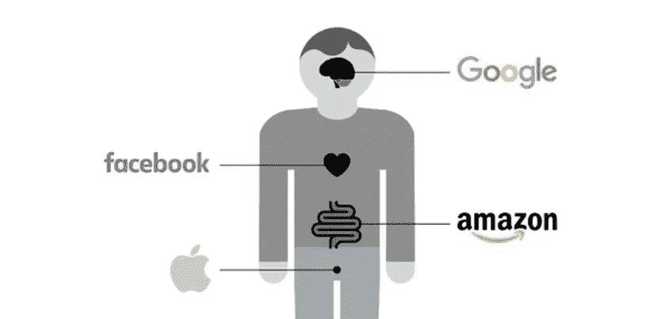
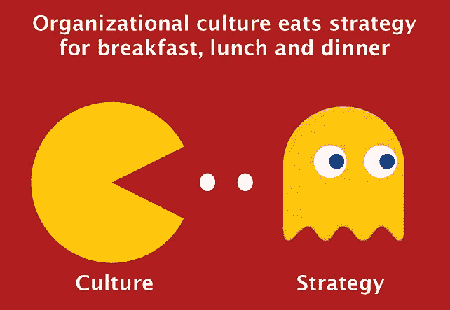

# 解开数字共享的困惑

> 原文：<https://medium.com/swlh/unsquandering-of-the-digital-commons-5b1c87385361>

## 公司财富与公共利益。科技平台能两者兼顾吗？

你有没有想过公众对科技行业的信任值多少钱？现在我们知道了。这至少是[5000 亿美元](https://www.marketwatch.com/story/tech-sector-forfeits-half-a-trillion-dollars-in-value-over-2-week-span-2018-03-28)——在[剑桥分析公司丑闻](https://qz.com/1240039/the-cambridge-analytica-scandal-is-confusing-this-timeline-will-help/)首次曝光后的两周内的损失金额。如此多的价值处于危险之中，这是硅谷巨头们清算的时刻。这也是我们重新想象如何组织和管理*数字公共资源*的机会。

不管是有意还是无意，这些技术平台将自己设定为[公共资源](https://en.wikipedia.org/wiki/Commons)的保管人。Lyft 和优步向数百万司机和乘客提供开放接入。Youtube、Twitter 和 Instagram 利用它们的平台来获取用户生成的内容。AppStore 和 GooglePlay 是应用开发者接触潜在客户的平台。然而，正如阳光基金会的亚历山大·霍华德指出的那样，“我们的公共广场建在私人平台上，设计时并没有考虑到公民利益。”

*Platform Index compiled by* [*Holger Schmidt*](https://netzoekonom.de/author/holgerschmidt/)

直到一些雄心勃勃、天马行空的初创公司给了我们今天所依赖的互联网平台，数字共享才得以存在。大型科技公司会辩称，尽管有丑闻、数据泄露和对隐私的抱怨，我们都变得更好了——服务的普及和科技股的惊人表现就是证据。

> 打破规则，挑战传统智慧，打破现状是大技术存在的方式

然而，有人呼吁拆分亚马逊，呼吁政府“T2”修复脸书。“看起来谷歌、苹果和阿里巴巴的电子蜜月已经结束了。消费者和监管者都越来越警惕在[赢家通吃](https://www.bloomberg.com/view/articles/2017-08-24/america-s-most-winner-take-all-industry-visualized)型市场中运营的渴求数据的公司。为*ProPublica*撰稿的 [Julia Angwin](https://medium.com/u/9fffcdfcbff2?source=post_page-----5b1c87385361--------------------------------) 的建议肯定是合理的: *(1)对数据泄露处以罚款；(2)警察政治广告；(3)让科技公司对不良内容负责，以及(4)设立道德审查委员会。*传统上，保护公共资源是政府的职责，但大型科技公司也可以在政府介入之前先行一步。

> 许多硅谷巨头还没有机会摆脱他们叛逆的创业身份，现在他们发现自己被社会对他们的期望程度惊呆了

An *Infographic from Scott Galloway’s book:* “[The Four: The Hidden DNA of Amazon, Apple, Facebook, and Google](https://www.penguinrandomhouse.com/books/547991/the-four-by-scott-galloway/9780735213654/)”

在具有系统重要性的全球企业中，从零到英雄过去需要几十年时间。企业有时间成熟起来，重新评估他们在社会中的角色，并考虑他们愿意接受的责任程度。今天的许多硅谷巨头还没有机会摆脱他们叛逆的创业身份，现在他们发现自己被社会对他们的期望程度惊呆了。打破规则，打破现状是大技术存在的原因；抑制一个人的 DNA 可能说起来容易做起来难。

当利益相关者找到更好地管理公共资源的方法时，公共资源的悲剧就会得到解决。在这种情况下，开明的自身利益应该推动科技公司的首席执行官们加速他们公司的文化变革；这可以从修改行话和重新思考组织结构开始。

## **改变词汇**

成功的公司以以客户为中心为荣。这种关系的框架是“顾客为王”,而政府(通常是行业监管者)是公司为顾客服务的障碍。

但是，如果公共机构，无论是国家、州、城市还是市一级的公共机构，都被有意且明确地包括在а潜在客户群中，那会怎么样呢？如果一个典型的董事会议程包括一个反复出现的项目，考虑核心技术如何服务于公众利益，会怎么样？

> 人们不禁会想，如果优步从早期开始就把市政当局、城市和城镇，而不仅仅是优步乘客，视为自己的客户，它会取得怎样的成就。

这并不是说企业必须讨好监管者，也不是说政府机构应该接受他们应该监管的公司的服务。公共利益是由许多机构在许多层面上代表的，当企业像对待其他潜在客户一样给予他们同样的礼貌和考虑时，共同利益的双赢就成为可能。

Keynote by Andrew Chakhoyan at [Web Summit](https://medium.com/u/a1fdc10b6ff6?source=post_page-----5b1c87385361--------------------------------) 2019\. Lisbon, Portugal

以优步为例。纽约时报[报道](https://www.nytimes.com/2017/05/16/world/canada/a-canadian-town-wanted-a-transit-system-it-hired-uber.html)当加拿大的因尼斯菲尔需要运输系统时，它保留了优步的服务。值得注意的是，并不是优步创造了一种产品，并将其营销和销售到世界各地的许多城镇，而是一个小镇的开明领导，他们雇用了这家公司来满足其运输需求。人们不禁会想，如果优步把市政当局、城市和城镇，而不仅仅是优步乘客，视为自己的客户，它会取得怎样的成就。

## **改变组织**

> 为了继续蓬勃发展，一家全球性公司必须找到一个更大的问题来解决，而不是保护过去已经实现的商业模式

首席*内部说客*这个词经常被用来描述公司内部的政府关系主管。[游说](https://dictionary.cambridge.org/us/dictionary/english/lobby)，根据《剑桥词典》的解释，是"*试图说服当选官员采取特定行动或改变法律。这个定义本身就暗示了企业和政府间固有的利益不一致。*

但是如果我们专注于共同的目标呢？或许一家公司不需要说客，但需要首席合伙人。以 LinkedIn 为例，它最近推出了[经济图表](https://economicgraph.linkedin.com/)，其明确的目标是“*与私人和公共组织合作，让地方政府、非营利组织和教育工作者能够做出明智的决定，创造积极的经济成果。”*解决问题是企业成功和持续繁荣的方式，一家全球性公司必须找到更大的问题来解决，而不是保护过去已经实现的商业模式。

## **改变文化**

正如彼得·德鲁克令人信服地指出的那样，文化将战略作为早餐。术语的改变和组织结构图的修改只能到此为止，但当态度和价值观调整时，真正的转变是可能的。现在是时候重新讨论使命和愿景如何变得更具包容性，并专注于创造超越股东的社会价值。

> 这项技术本身是价值中立的，因此由公司来部署它，以维护和保护我们的数字公共资源，造福大多数人，而不是少数人。

Peter Drucker’s wisdom [visualized](https://www.torbenrick.eu/blog/culture/organisational-culture-eats-strategy-for-breakfast-lunch-and-dinner/)

高管最终必须接受新的责任水平，并意识到与利益相关者的真诚合作可以在许多方面获得回报，包括声誉收益、赢得的媒体价值、消费者忠诚度等。高盛估计“标准普尔 500 指数公司账面上的商誉和其他无形资产为 2.6 万亿美元，占其总资产的 10%”

总而言之，科技企业完全有能力为公众利益进行创新。这项技术本身是价值中立的，因此公司应该以维护和保护我们的数字共享空间的方式来部署它，以造福大多数人，而不是少数人。让我们不要让缺乏想象力阻碍进步。

**你读过吗？**

*   管理到底是为了什么？
*   [信任去哪儿了？我们怎么把它带回来？](/@ChakhoyanAndrew/where-did-the-trust-go-and-how-do-we-bring-it-back-25e94ce12d29)
*   如果每个人都休假会怎样？

## 这个故事发表在[的创业](https://medium.com/swlh)上，这是 Medium 最大的创业刊物，有 358，974+人关注。

## 订阅接收[我们的头条新闻](http://growthsupply.com/the-startup-newsletter/)。

