# 在 TED 2018 上揭开我们神奇的混合现实演示背后的秘密

> 原文：<https://medium.com/swlh/unveiling-the-secrets-behind-our-magical-mixed-reality-demo-at-ted-2018-733f2b99bbb1>

## 关于我们如何能够为 TED 2018 打造世界上最精确的混合现实体验之一的详细技术概述

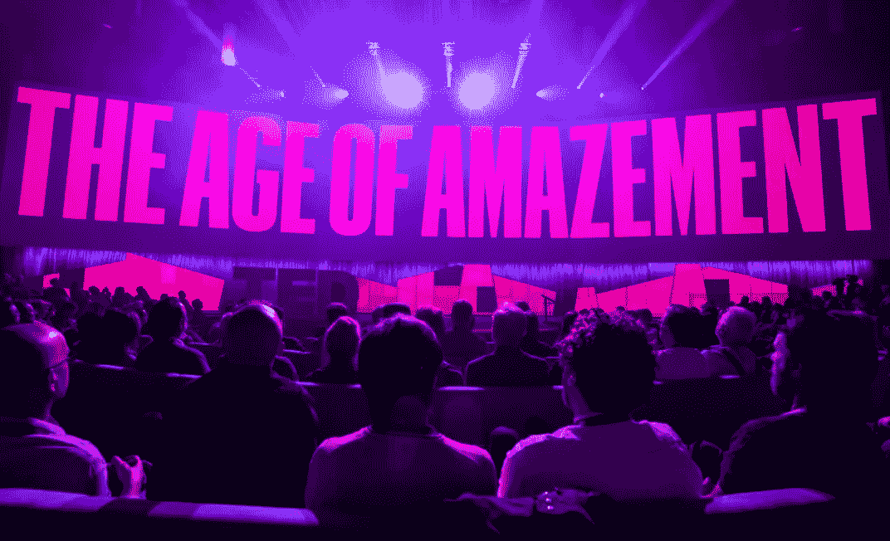

Image from [https://ted2018.ted.com/](https://ted2018.ted.com/)

每个魔术师都遵守三条规则:

1.  永远不要泄露秘密
2.  练习到极致
3.  不要在同样的观众面前重复表演

值得庆幸的是，我们是技术专家，我们相信分享知识可以让更多的人创新和开发更棒的体验。但是在某种程度上，技术专家就像魔术师一样。我们有时会把不可能变成可能，给观众带来惊奇和敬畏。

上周在 TED 2018 上，我们就是这么做的。

我们展示了世界上最精确的混合现实体验之一。通过使用 [Occipital 的](https://occipital.com/)深度感应相机和他们的混合现实框架，我们能够让我们的观众相信虚拟物体是真实的，事实上，他们正在与现实世界的物体进行互动。

## 暂停怀疑

当我们观看一部视觉效果惊人的电影时，我们往往会沉浸在那个世界中，心甘情愿地接受虚构为现实。这种意愿被称为暂停怀疑。

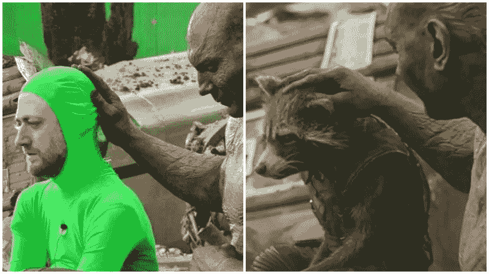

We suspend our disbelief to truly enjoy Rocket Raccoon’s character in the Guardian of the Galaxy.

通过我们的演示，我们确保了混合现实体验尽可能真实。像虚拟阴影的投射，将虚拟物体隐藏在物理场景后面，以及以不到 1 毫米的空间精度将虚拟体验与物理模型对齐，这些都让 TED 与会者感觉他们通过一个神奇的镜头看到了另一个世界。

[看看下面的演示](https://www.youtube.com/watch?v=TQ_q8Spmjqg&feature=youtu.be)。请注意我们是如何将不明飞行物的影子投射到桌子上，并将虚拟的水隐藏在实际的峡谷后面的。随着相机的移动，体验保持不变，并锁定到物理模型，因此观众可以从各个角度享受体验。

[https://www.youtube.com/watch?v=TQ_q8Spmjqg&feature = youtu . be](https://www.youtube.com/watch?v=TQ_q8Spmjqg&feature=youtu.be)

# 在后台

# 1.创建物理模型

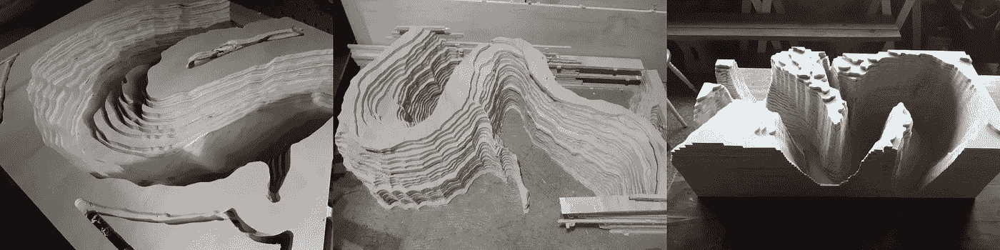

这个物理模型是大峡谷的一部分的复制品，叫做马蹄弯。我们用 33 层 3/8 砂光胶合板在数控切割机上切割而成。

我们利用谷歌地图上的地形视图获取了该区域的物理地形数据。地形图上有标记峡谷高度变化的线条。然后，我们在 Photoshop 中将这些标记描绘成单独的图层，并使用 live trace 将它们转换成矢量文件。

这些向量通过一个名为 V-Carve Pro 的程序被转换成 CNC 路由器的 g 代码。一旦转换，数控路由器花了大约 3 个小时切割所有层。每一层都用砂纸打磨、粘合并钉牢。

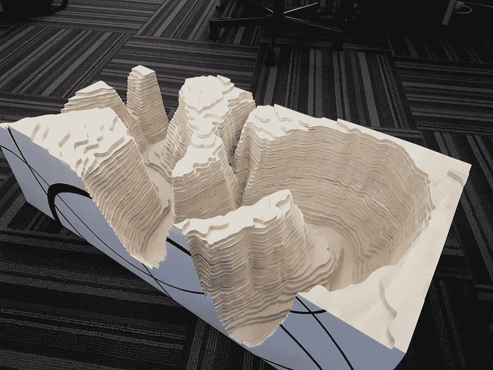

# 2.创建数字模型

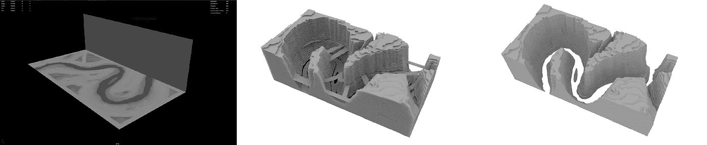

3D 峡谷是通过使用实际地点的卫星地质图制作的。我们将彩色图层放入 Photoshop，并将其挤压成 3D 图层。该软件还允许 OBJ 提取。从 Photoshop 中导出，我们将 3D 峡谷以平板的形式呈现给 Autodesk Maya。从那里，我们可以开始添加其他虚拟物体，如不明飞行物和怪物。这个数字模型对于创造超空间精确的混合现实体验至关重要。

# 3.制作虚拟物体的动画

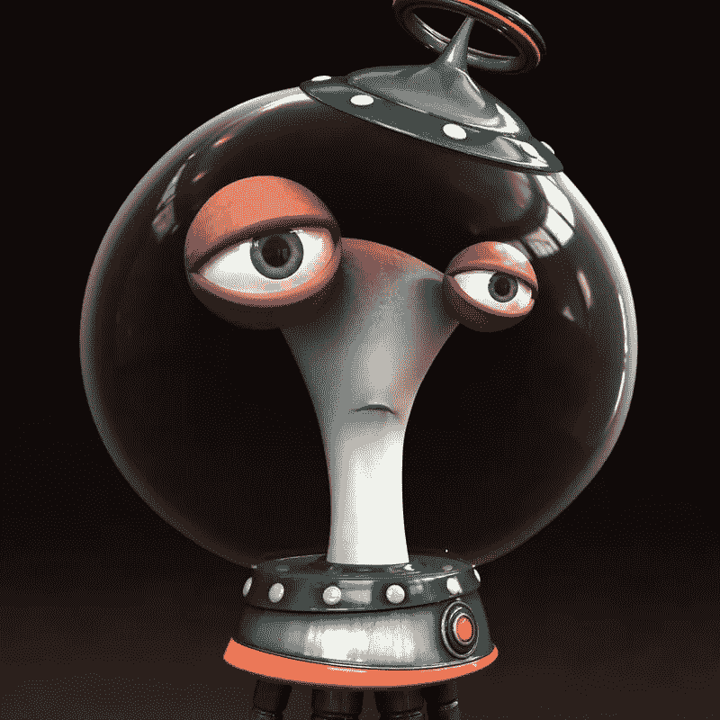

可以使用 Unity Animator 或在 Maya 中为 Unity 制作动画，并使用“发送到 Unity”功能导出到 Unity。对于这种体验，我们开始在 Autodesk Maya 中制作动画，但后来由于角色之间的交互，我们不得不在 Unity 中重新制作动画。

我们必须应对的一个额外挑战是关卡的世界排名。通常情况下，场景放置在 0，0，0 (x，y z)中。对于这个项目来说，有必要放置一个与其物理环境相匹配的水平面；也就是说，场景从 0，0，0 (x，y，z)移动到空间中由虚拟标记预先定义的新位置，以匹配物理到数字舞台对准。

# 4.使用桥接引擎

在设计阶段的早期，我们希望解决方案能够为我们提供最佳的混合现实体验，而且便于携带，便于人群使用。一个关键的技术要求是显示遮挡，虚拟物体可以隐藏在现实世界的物体后面。我们的项目负责人 Aaron Hilton (Steampunk Digital)积极参与了 [Occipital 的桥接引擎](https://occipital.com/)的开发，因此我们能够在 MR 体验中使用预发布功能。

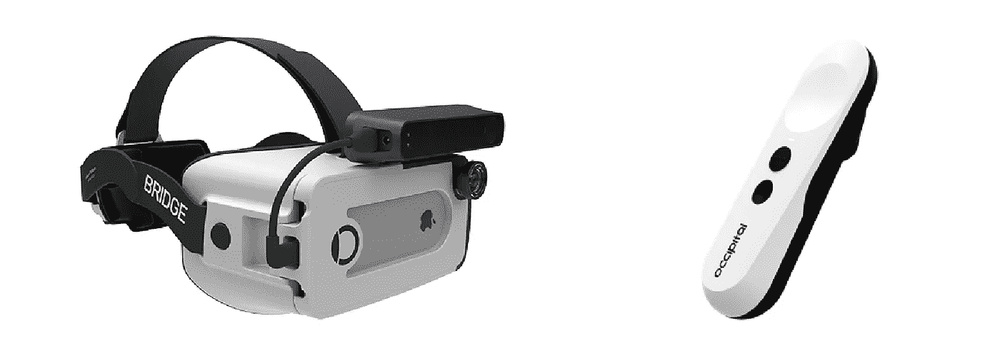

Bridge 是一个混合现实套件，包括遥控器、耳机、结构传感器和 Bridge Engine SDK。它致力于提供完全由 iPhone 驱动的立体声混合现实。首先，用户扫描空间，生成他们希望跟踪的世界的精确 3D 模型，然后激活完全混合现实渲染模式，从板载相机投影实时彩色图像。这种实时彩色投影即使从单个 RGB 相机光源也能给人以深度感。虚拟物体可以在真实的物理世界表面上投射阴影，反弹，并被真实的物理世界表面覆盖，为用户提供他们周围的全景。

在我们的案例中，我们选择在 iPad 上使用 Bridge Engine，使用标准的结构传感器、支架和可选的广角镜头。一旦连接并校准，带有镜头的结构传感器可以看到更宽的视野，提高其跟踪精度，并且在没有桥耳机的情况下工作，减去立体视觉。手持 iPad 也意味着我们将使用触摸屏进行输入，而不是使用遥控器。我们选择保持简单的控制，轻击屏幕适合最小化新人的学习曲线，并有助于演示现场互动。

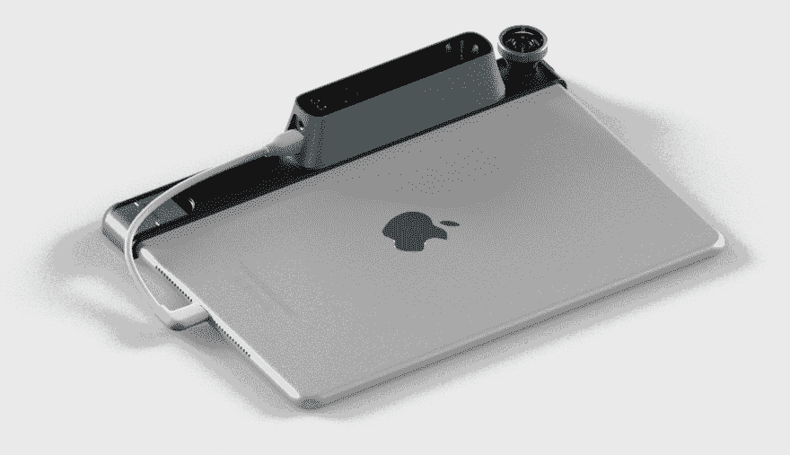

我们实验了不同的着色器来模拟遮挡，实验了许多不同的水材质，以及基于物理的渲染(PBR)材质，这些材质都经过了优化，可以在线性颜色空间中运行。交互是结合 C#脚本、Unity Mechanim 状态机和带有事件触发器的动画轨道构建的。最终的包由 Unity 生成，用项目文件把 C#转换成低级的 C++中间体，最后由 XCode 内置成一个 iOS app。我们还修改了本机 Objective-C 引导代码的启动行为，这样我们就可以输入调试设置并进行扫描，但是一旦扫描完成就隐藏调试设置。

我们试验了不同的桥引擎设置，优化了最佳效果和增强的跟踪鲁棒性。我们在 iPad 体验中使用了单色模式，这允许实时颜色通过未扫描的区域。通常，立体模式会在没有扫描几何图形的地方屏蔽掉实时颜色，但是单色模式可以显示所有没有屏蔽的彩色摄像机。我们还使用环境照明调整，以颜色匹配周围照明变化的温度，以匹配人眼看到的桥引擎渲染的内容。

# 5.扫描物理模型及其周围区域

还需要创建可部署的体验，其中模型的数字版本必须与物理模型精确匹配。我们在设计和制作过程中非常小心，以确保数字版本和物理版本是等效的、精确的副本。

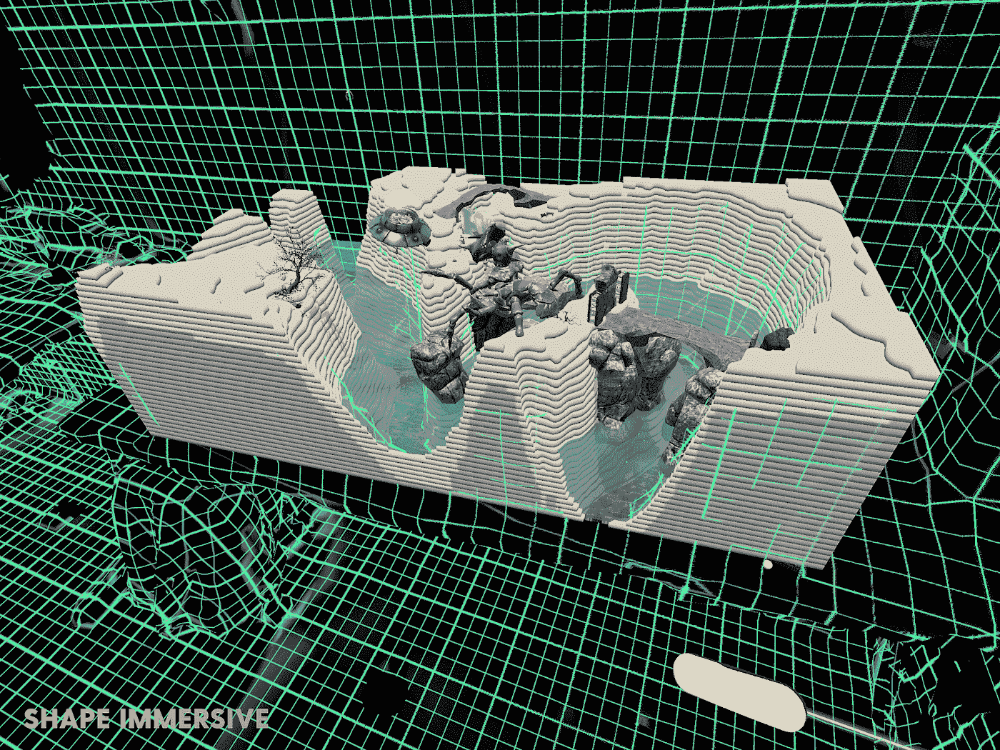

在 Unity 中，我们搭建了一个包含数字模型的虚拟“舞台”。我们用体验中想要的所有视觉元素装扮了数字模型。

在开发过程中，我们通过 Bridge Engine 从 playthrough 进行了环境扫描，并将扫描结果从 iPad 传输回 Unity。通过这种方式，我们可以快速原型化将“舞台”放置到真实世界的环境中，而无需经历完整的构建过程。

对于现场对准，我们首先考虑使用可以检测和计算对准的基准标记。然而，随着开发的进展，我们开发了一个独特的关键点对齐系统，在实践中也非常容易使用。它的工作原理是将两个特征点放在一个伪混合现实 VR 模式中，将数字和物理版本对齐，然后我们切换到纯混合现实并完成对齐。最终的对齐是通过按住控制器按钮，同时在模型周围物理移动来完成的，虚拟模型以 1:10 的比例跟随，与相机的物理运动相比移动缓慢。

这种对准技术在所有 6 度运动中同时起作用；位置(x，y，z)和旋转(俯仰-偏航-滚动)，非常直观。我们可以看到数字“水”从物理峡谷模型的哪里漏出来，并进行细微的调整以获得精确的拟合。

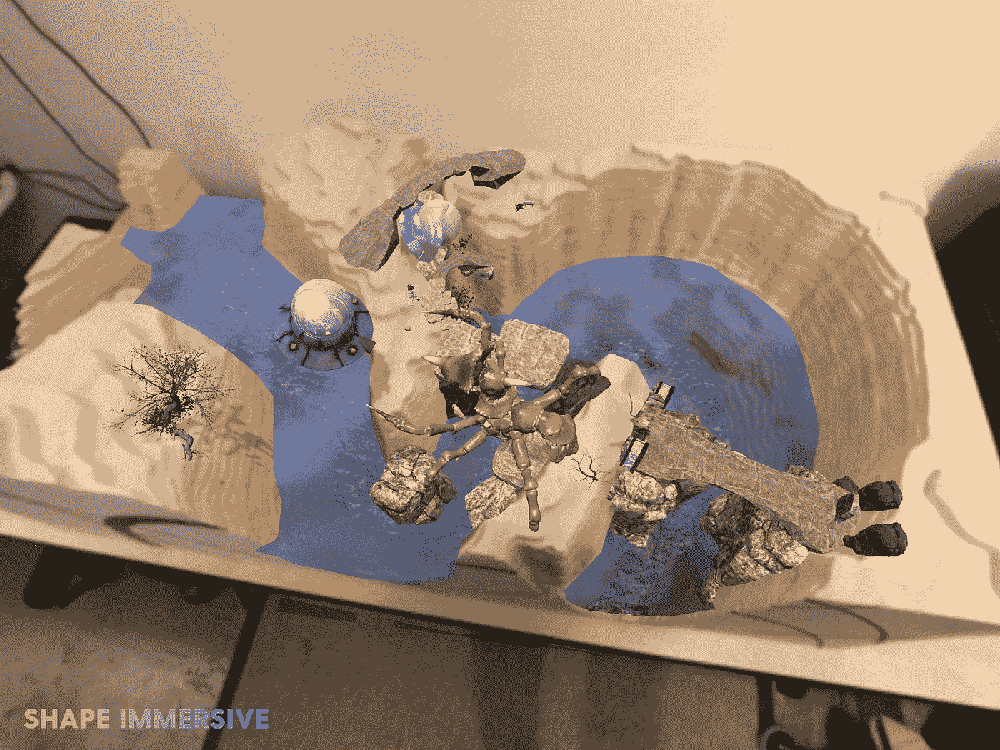

# 6.交付混合现实体验

在 TED 大会上，我们非常兴奋地与贵宾们分享我们的经历。我们扫描了整个区域，包括墙壁、窗帘、桌子，并缩小了峡谷本身的几个关键帧。虚拟水完全符合实际峡谷壁的排列，跟踪非常稳定。

当 TED 贵宾来体验时，他们能够享受上帝般的视角，从各个角度观看故事的展开。许多人对各种各样的虚拟物体印象深刻，如树木、岩石、桥梁和动物，以及它们如何能够遮挡或保持与物理模型一致。AR 领域的专家也对我们将虚拟物体隐藏在物理物体后面(遮挡)、将阴影投射到现实世界物体上以及跟踪体验的演示印象深刻。

# 最后的想法

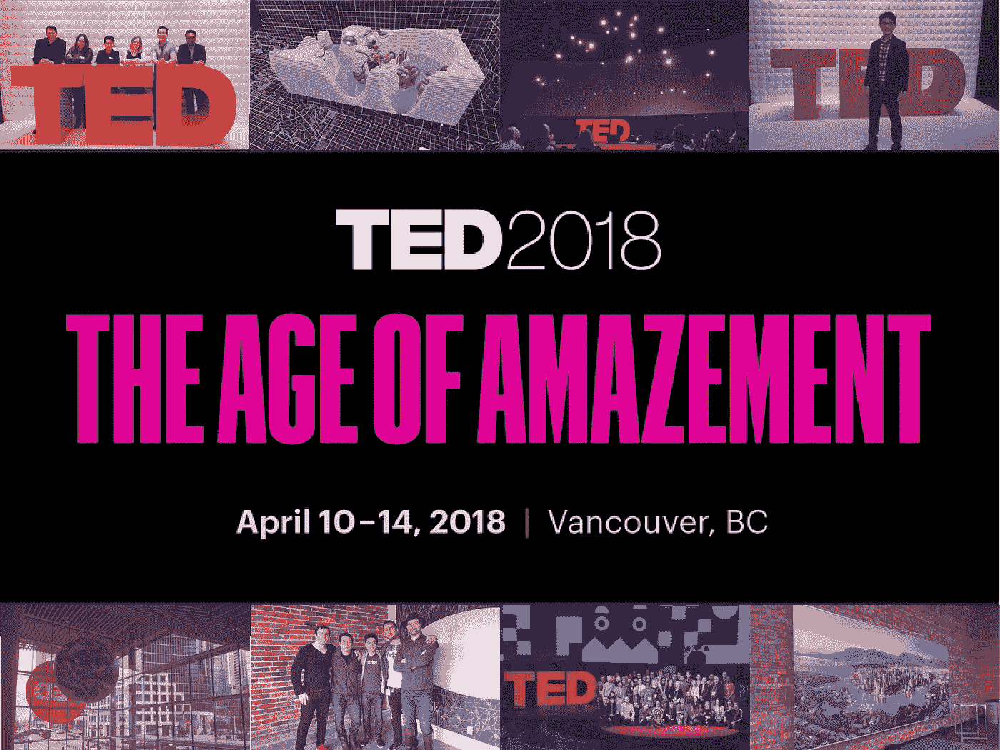

随着帷幕落下，我们的 TED 经历也告一段落。参与“惊奇时代”是一种真正的荣誉，我们迫不及待地想进一步发展这项技术。

在 [Shape Immersive](http://www.shapeimmersive.com) ，我们相信增强现实和混合现实将是下一个基本的平台转变，取代今天的多点触摸界面。这种将虚拟世界与现实世界融合的想法开辟了一个全新的领域，在这个领域中，我们的体验将以我们从未想象过的方式延伸。

当 AR 设备变得更加普遍时，对空间数据的需求将呈指数级增长。我们相信区块链技术可以帮助实现空间数据的普遍可访问性，这样任何人都可以创建可扩展和持久的 AR 体验。

我想对这个团队大加赞赏——[Aaron Hilton](https://www.linkedin.com/in/aaronhilton/)(蒸汽朋克数码)[June Kim](https://www.linkedin.com/in/kimjune01/)&[Michael Yagudaev](https://www.linkedin.com/in/yagudaev/)(nano 3 labs)[Amir Tamadon](https://www.linkedin.com/in/amir-r-tamadon-4504b74/)(VR Square)[Jeffrey Jang](https://www.linkedin.com/in/jeffreyjang/)&Jonathan Andrews(沉浸式技术)在短短 4 周内将这一愿景变为现实，我的投资人[Victory Square Technologies](http://www.victorysquare.com/)从第一天起就支持我们，还有 [TED](https://ted2018.ted.com/)

在圣克拉拉[增强世界博览会](https://augmentedworldexpo.com/)(5 月 31 日至 6 月 1 日)上，我们将继续展示为什么空间数据对于令人惊叹的 AR 体验非常重要。来看看我们吧！

# 我们是谁？

[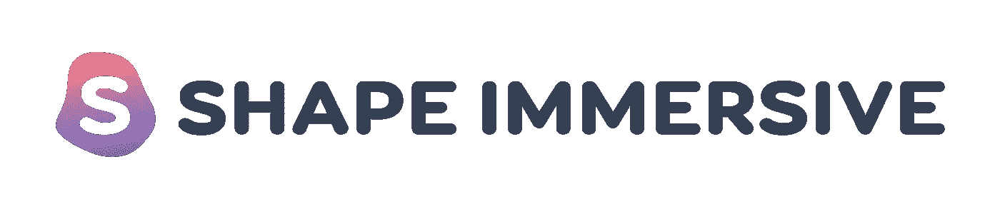](http://www.shapeimmersive.com)

我们正在建立一个分散的市场，使空间数据可以普遍访问，因此任何人都可以创建可扩展和持久的增强现实体验。

点击这里查看我们的网站:[www.shapeimmersive.com](http://www.shapeimmersive.com)

特别感谢 Aaron Hilton、June Kim、Jonathan Andrews 和 Amir Tamadon 对本文的贡献。

## 这个故事发表在 [The Startup](https://medium.com/swlh) 上，这是 Medium 最大的创业刊物，拥有 318，583+人关注。

## 在这里订阅接收[我们的头条新闻](http://growthsupply.com/the-startup-newsletter/)。

