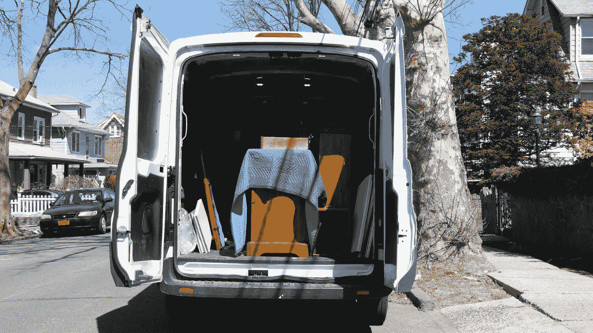
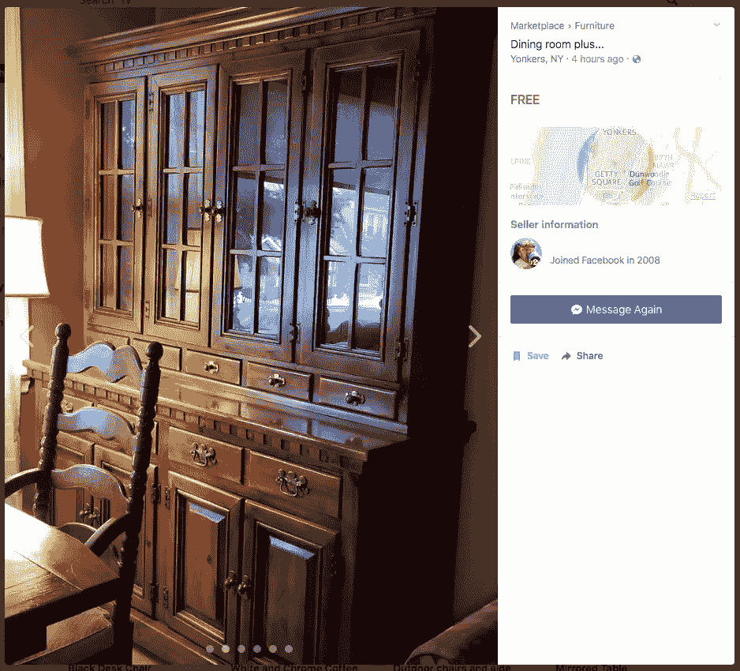
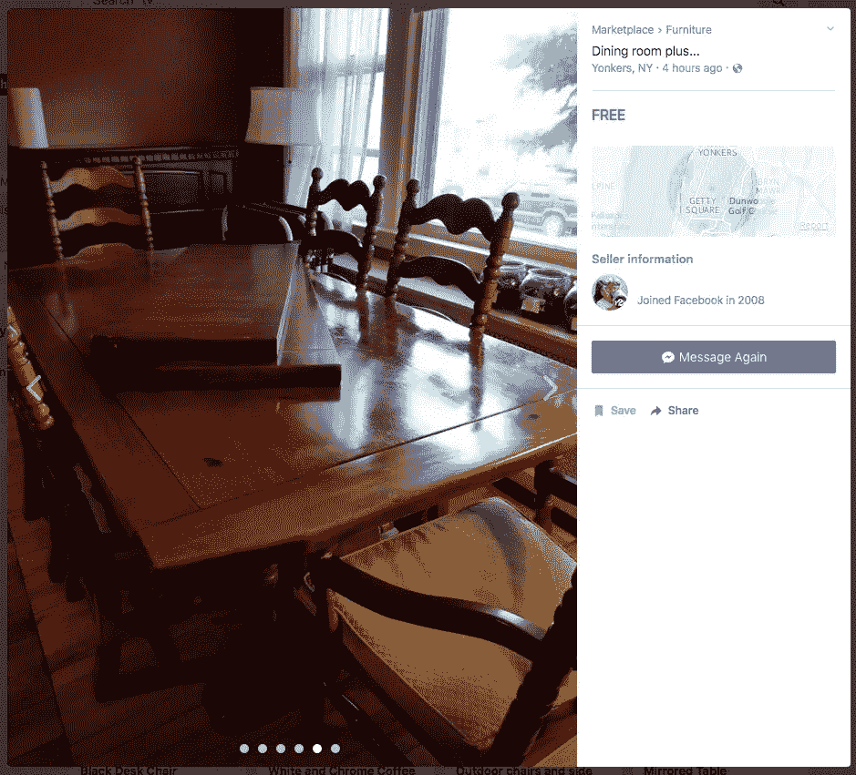
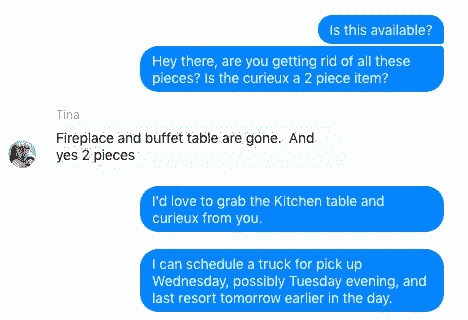
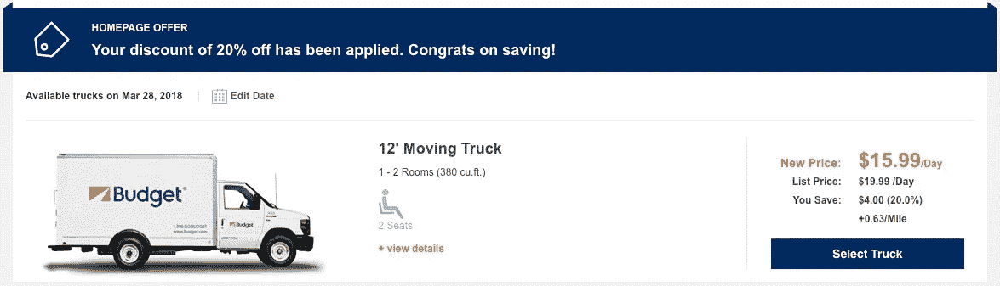
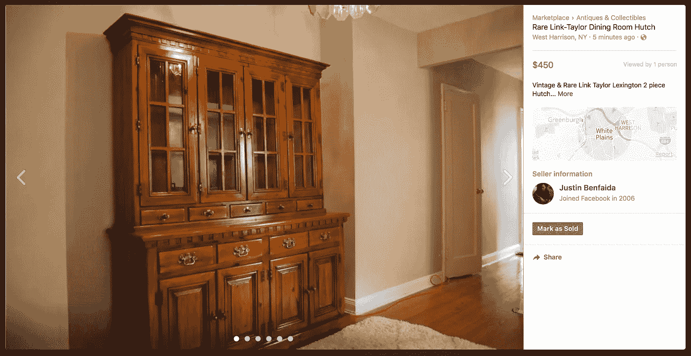
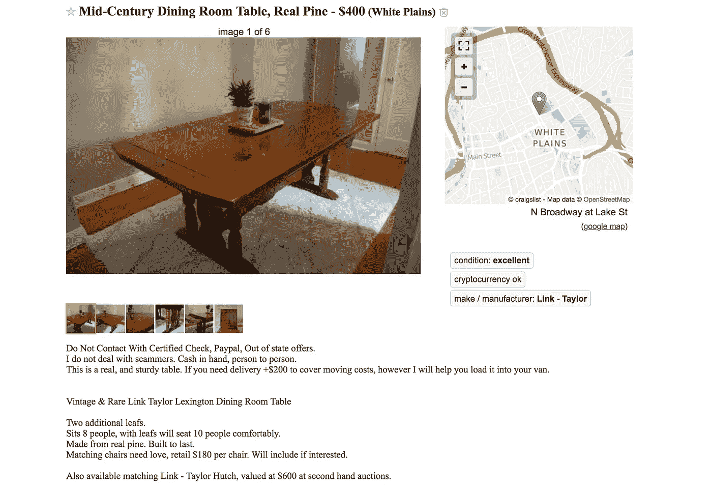
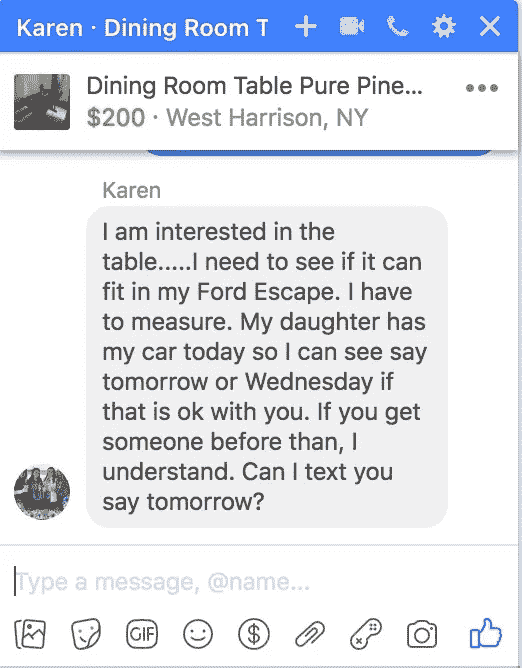

# 向$1000 挑战升级:移动 2，$211

> 原文：<https://medium.com/swlh/upcycling-challenge-towards-1000-move-2-211-168253cfcd73>

*升级挑战创意前奏* [*这里*](/@justinbenfaida/upcycling-the-experimental-journey-to-reach-1000-12ae9b9b53bd) *&下面:*

一个非紧急系列，从 0 美元开始，通过商品升级赚取 1000 美元。要达到这个目标需要多少步骤？**我能以多快的速度**卖掉一件不是全新的*物品？这是一个向上循环的实验，一个人的垃圾是纯粹的财富。*

**从我的升级名**的绝对 0 美元开始，我一直在寻找[craigslist.org](http://craigslist.org)的免费内容部分。一旦我产生了投资资本，我就可以购买被低估的资产，然后以更高的价格卖出。我还发现材料部分很有趣，有大理石板、厨柜和大量的瓷砖。在这次测试中，我也不打算把我的公寓变成储物者的天堂,所以可以肯定地说，未来我不会有太多的重叠销售。

# 起始利润:56.86 美元

**The Find:**Facebook market place，20 英里内免费搜索。纽约扬克斯免费的“餐厅加…”(T25)。在列表中有一个带桌叶的大木头桌子，以及一个薄而宽的带玻璃框的橱柜，用来展示盘子和玻璃器皿，如果你愿意的话，还有一个瓷器柜。
**在威彻斯特公平假定的转售价格:**桌子——150 美元，哈奇——120 美元。这是一个了不起的发现。

**狗屁。我需要一辆卡车。这些都是相当大的一块，我之前说过我不会把这个公寓变成囤积者的天堂。我招募了我的女朋友，让她用她的小比特犬手臂帮我把这些作品拿回来拍照、评估，并从停车场拿到四楼。 ***感谢贝比。*****

## **距离+采购成本:**

**通行费:** $1.19 x2 = $2.38
**卡车租赁:** $43.33 总共，我以每英里 0.63%的价格支付了 20.86 美元。
**距离:** 33 英里= 0 美元汽油当我以最大加油量租了一辆卡车时，我没有损坏油箱！
**时间:** 3.5 小时*(我们应该将此处的时间加入到整体时薪中来计算利润。)*

# 投资后的当前利润总额:11.15 美元

## 重新列表#1:“稀有链接-泰勒餐厅厨柜/橱柜/古董餐厅表匹配可用”

在这里列出清单时，我们要做的第一件事是**弄清楚我们有什么。**当你开始一次深潜时，谷歌是你最好的朋友——*只要知道什么时候走出搜索的兔子洞。*橱柜内的一枚邮票显示这是 Link-Taylor 的“松树殖民地”作品，这家公司成立于 20 世纪 60-70 年代，后来被一家更大的公司收购。

几乎不可能找到我们找到的确切型号，但有一个型号的大小和外观都差不多，现在我可以想出一个定价的主意了。转售价格约为 300-500 美元。**我打算把它标在 300-600 美元，并允许自己被压低价格。** *“世纪大盗！”*

几分钟后，我收到了迈克发来的电子邮件，上面有他在特拉华州的区号电话号码。他的邮件写道:给我发短信，告诉我最低价。规则一: ***在谈判中，你永远不要开第一个价。几分钟后，Mike 想用银行本票付款，因为他“出城了”,搬运工会来取支票。**谨防骗局和骗子……他们都完了。** **如果情况古怪或好得令人难以置信，那很可能就是这种情况。**如果卖家不能见面，并要求等待支票结算，不要上当。这是一个骗局，支票最终在几天后被退回，你就倒霉了。我通过 craigslist 收到了无数诈骗邮件和短信。***

## 重新列表 2:“林克-泰勒松木餐桌”

经过我们的谷歌深潜，我们发现这也是一个松木制成的林克泰勒作品，非常坚固耐用。这些椅子经过多年的使用和染色织物(我的意思是，这东西已经有 60 年的历史了)，已经不是很好了。我用油漆开罐器刮掉了桌子底部的儿童口香糖，并把桌面从一边到另一边擦干净。

我考虑学习如何更换椅子，但我目前 11 美元的预算没有留给我购买的空间，我们需要在昨天卖掉它。我会把它作为免费的结实的桌椅来推销*(这些椅子的零售价是每把 180 美元)*带桌子。但是我们必须继续前进，为下一次翻转留出空间。我将它标记为 400 美元，OBO**(*稍后注意，在玩了如何稍微降低价格后，它被降低到 200 美元)**。这让糟糕的谈判者知道，“嘿，伙计，让我知道你认为它值多少钱，这样我就可以回来给你更高的价格。”

# 现在我们等着。我将根据意见调整价格，以确定需求。

## ***一周后:***

在假期(复活节)周末结束后，似乎各地的浏览量都在回升。我在当地的一个私人团体上列出了这张桌子，价格是 200 美元，我们需要继续我们的上行周期之旅。

第二天，我收到了凯伦发来的信息，说这位女士可以得到她的卡车。果不其然，我们安排在周五早上，看到这张漂亮的松木桌子处于完美状态，我们回到了董事会，我们知道有时你必须后退才能前进。感谢 Karen 参与#upcyclingproject。

# **售出:200 美元**

## 我们将暂时搁置这个问题，并把它放到下一篇文章中。

**错过了从 0 美元到 57 美元的第一次翻转？** [**看这里！**](/swlh/the-upcycling-challenge-towards-1000-move-1-56-86-f3b3c0c96547)订阅下面的#upcyclechallenge 时事通讯。在跟随我们从一无所有到 1000 美元的旅程的同时，掌握升级自行车的技巧和诀窍。

**本次升级实验的所有收益将捐赠给非营利组织**[**court land ' s Connection。**](http://www.courtlandsconnection.org/vision) Courtland 的关系为寻求康复之路的个人提供经济支持，并帮助他们实现梦想。[药物过量是美国意外死亡的主要原因，阿片类药物推动了这一流行病。](https://www.asam.org/docs/default-source/advocacy/opioid-addiction-disease-facts-figures.pdf)在基层支持恢复+戒毒。

## 这篇文章发表在 [The Startup](https://medium.com/swlh) 上，这是 Medium 最大的创业刊物，拥有 314，785+的读者。

## 订阅接收[我们的头条新闻在这里](http://growthsupply.com/the-startup-newsletter/)。

