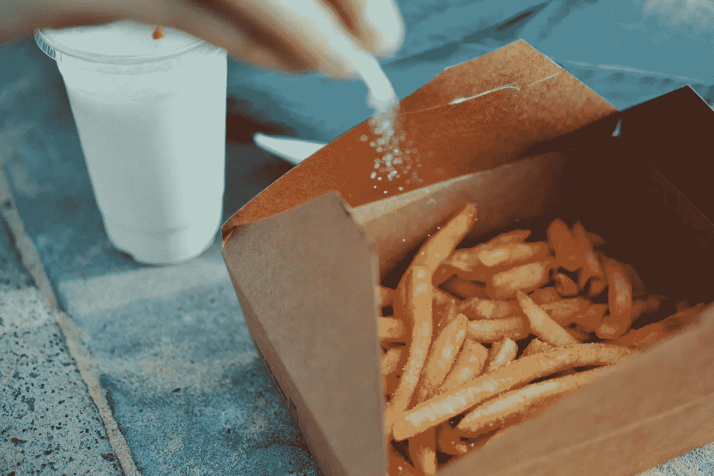

# 通过追加销售提升你的自由职业者业务

> 原文：<https://medium.com/swlh/upgrade-your-freelance-business-by-upselling-4cb7d6c50c43>

## 你想要薯条吗？

追加销售是从客户那里获取更多信息的一种极其有效的方式。快餐业已经掌握了让你认为“是的，只是多一点钱，我就得到更多价值”的艺术，并让你扣动扳机，超过你最初想要的。在线供应商也从这种方法中获益——亚马逊将其 35%的收入归功于 2006 年的追加销售。

那么，作为一名自由职业者，你如何在不惹人讨厌的情况下开始推销你的客户呢？关键是产品化，即把你的服务打包成一个盒子，然后把这个盒子卖给客户。

# 产品化

许多自由职业者在提案写作、谈判和范围蔓延中苦苦挣扎。当你开始将你的服务产品化时，这个问题几乎完全消失了。对于一个产品，你阅读它的描述，判断它是否正确，然后扣动扳机。服务也是如此，唯一的区别是人们购买的不是实物产品，而是由企业所有者提供的服务。这种视角的微妙变化非常强大，原因如下:你的范围是明确界定的，任何额外的工作都可以作为“附加物”出售，或者我喜欢称之为“附带订单”。你设计网站吗？提供虚拟主机、搜索引擎优化、标志设计和所有“按菜单点菜”的附加功能，既允许客户挑选他们需要的项目，也给人一种印象，即他们通过购买几个低成本的项目而不是一个昂贵的包获得了更多的价值。以下是一些提示:

*   **包月** 提供你的服务作为订阅，会减少客户的摩擦和恐惧。客户喜欢“试用你”一个月的想法，如果你试图让他们承诺更大的范围，他们会犹豫不决。提供按月支付结构可以缓解这种摩擦，让你可以出售各种不同的东西。
*   **“全套”定价** 总会有预算更高的客户愿意为您的高端工作买单，让他们轻松地选择您的“全功能”产品。
*   **【起价】定价** 给客户一个好的“非必需”选项是让客户对你的服务满意的一个好选择。这对于潜在的订阅服务尤其有效，比如增长型营销，如果客户相信你会提供价值，他们可以向你投入大量资金。这也是开始尝试**追加销售**和**附加产品的好方法。**
*   **自助结账** 您目前是否使用联系表作为客户请求服务的方式？如今，随着商业自动化的兴起，顾客变得越来越善变，开始期待自助服务。让您的客户直接通过您的网站订购服务(如果您的网站支持该功能)
*   **展示例子** 在将你的服务产品化时，如果你能向潜在客户展示他们将获得的东西，他们将更有可能放心地将辛苦赚来的钱花在你的服务上。展示评论、作品集和演示都是增加信任度的好方法。

# 追加销售

让你的顾客增加消费不是一件容易的事，你需要让他们认为他们是掌控者。上面的建议将有助于实现这一目标，但你仍然需要更进一步。

*   **交叉销售** 你提供的每一项服务都是一块乐高积木。这些砖块本身很好(尽管有点简单)，但放在一起可以形成一个比它们本身更大的结构。这里的关键是给客户 FOMO——害怕错过，如果他们每月不多付你 10 美元，他们就会错过价值远远超过 10 美元的潜在价值。当你认为顾客容易受到影响时，你应该巧妙地引导他们转向你的其他产品。
*   **展示证据** 客户喜欢证据——“如果你在这项服务上多花 100 美元，你就能多得到 50%的 X”。这通常是非常困难的，因为并不总是有明确的证据证明你卖的东西确实更好，但这总是要努力争取的，因为客户最喜欢的是明确的证据，证明你的产品有价值。如果没有任何可用的统计数据，一个简单的解决方案是让客户证明或链接到权威博客文章来验证你的说法。
*   **免费试用** 对于基于订阅的服务，让您当前的付费客户免费试用您正在尝试追加销售的其他服务。这让他们尝到了味道，如果他们喜欢，他们会回来吃更多。

# 结论

如果以一种无摩擦、易于消费的包装呈现给客户，追加销售就会奏效。将你的服务产品化是创造一个适合追加销售的环境的最好方法，并且给自由职业者和顾客都带来很多好处。

希望开始将您的服务产品化并通过追加销售赚钱吗？**结账**[**https://service bot . I**](https://servicebot.io)o 它处理了计费、结账、客户管理等痛点，让服务产品化变得简单。

## 这个故事发表在 [The Startup](https://medium.com/swlh) 上，这里有 258，400 多人聚集在一起阅读 Medium 关于创业的主要故事。

## 订阅接收[我们的头条新闻](http://growthsupply.com/the-startup-newsletter/)。

