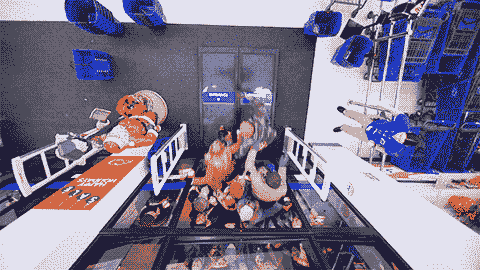

# 利用全面的客户培训来完善您的用户体验

> 原文：<https://medium.com/swlh/use-full-funnel-customer-education-to-perfect-your-user-experience-f0ba2be0ade>

*一个卓越的学习平台揭示了客户参与行为的大量数据分析，比任何调查都多。它记录了哪些课程最吸引人(哪些不吸引人)以及顾客在完成课程后获得的分数。*

# 优化您的用户之旅，吸引需求群体

首先，我们知道的是:营销人员似乎非常重视需求创造。

如此严重，以至于 2016 年需求生成基准报告[1]的 130 名受访者中有 67%表示他们的需求性别预算今年将会增加，其中很大一部分可能会分配给内容营销。在这一比例中，近 40%的人预计会上涨 20%或更多。

因此，没错，SaaS 企业理解需求创造对增加收入的力量。

问题就变成了什么样的平台、策略和内容最能吸引需求？没有企业愿意在一个最终失败的项目上花费大笔资金。然而，SiriusDecisions 最近的研究得出结论，B2B 组织制作的内容有 60%到 70%没有被使用[2]。PQ Media 的另一项研究[3]认为每年浪费的 B2B 内容价值为 500 亿美元。

这主要是因为缺乏与潜在买家的相关性。但是其他原因呢？人们不知道它是否可用，也不知道在哪里可以找到内容。

对您的组织来说，情况不一定如此。用教育内容来挑战这些统计数据，帮助潜在客户找到你，并推动他们完成购买之旅。

# 需求生成与销售线索生成

虽然密切相关，但需求挖掘和销售线索挖掘在营销策略方面存在微妙的差异。简而言之，需求挖掘会让人们对你的产品和服务产生广泛的兴趣。另一方面，Lead gen 精确定位并收集潜在客户的具体数据，旨在将他们转化为富有成效的销售线索。

需求挖掘和潜在客户挖掘通常遵循一致的买家旅程，从认知和强烈兴趣到达成交易，并最终与客户建立长期的[合作关系](https://www.schoolkeep.com/blog/a-beginners-guide-to-building-an-online-channel-partner-training-program?utm_campaign=elearningindustry.com&utm_source=%2Fengage-demand-gen-optimize-user-journey-full-funnel-customer-education&utm_medium=link)。

# 用教育内容推动需求生成漏斗

是什么让[教育成为如此强大的需求和引领 gen 工具](https://www.schoolkeep.com/beginners-guide-to-online-training)？每天都有大量广告和营销帖子轰炸潜在客户。(一项调查发现，一个人每天接触 5000 条广告消息。) [4]

所以你的内容必须从令人眼花缭乱的混乱中脱颖而出。提供吸引你的潜在客户并能在日常生活中实际使用的相关内容[5]打破了所有单调的推销和点击诱饵。

Total Product Marketing 的负责人迪安·阿拉(Dean Ara)在最近的一篇博客文章中对此做了最好的总结:

> 他写道:“简单地推销你的特色、好处和荣誉是一种推销你的服务的死路一条。”。“事实是，买家不再有时间或兴趣听你或你的产品有多棒。买家不想了解你；他们想知道你如何能帮助他们。这就是为什么今天的销售前景挖掘最佳实践都围绕着一个关键部分——教育。*【6】*

# 教育内容推动业务增长的 4 种方式

## 1.它启动了需求挖掘

潜在客户有业务挑战要解决，这导致他们在网上搜索答案。通过精明的 SEO 策略和对买家角色的深入了解，你的产品和服务就会出现。

在这一点上，免费提供教育内容。这样做可以向潜在客户展示你的产品是如何消除一个痛点的，并进一步确立你帮助他们的兴趣，而不仅仅是完成一笔立即的销售。

## 2.它通过销售漏斗的中间来培养他们

一旦你发现潜在客户是一个合格的销售线索，就用培养性的电子邮件或课程链接来吸引他们。

正如 Dean Ara 在他的博客中指出的那样，买家现在更喜欢独立、主动地寻找解决方案，而不是依赖销售人员来指导他们。他说，“*现在，成功的销售潜在客户的产生取决于你创造高质量教育内容的能力，首先是针对潜在客户的需求，其次是雇佣你提供服务的重要性*”。

为访问者提供他们自己做出购买决定所需的资源。

## 3.它加快了入职流程

一旦潜在客户签约，下一步就是快速[入职流程](https://www.schoolkeep.com/blog/8-ways-training-automation-helps-you-attract-onboard-retain-customers)以缩短价值实现时间。你希望客户尽快意识到你产品的价值。这就是产品培训(入职前、入职期间和入职后)发挥重要作用的地方，可以采用网络研讨会、面对面研讨会或按需在线培训的形式。

我们认为，在线按需培训仍然是最好的方法，原因有二:

1.  **性价比高。** 将学习的任何部分数字化自动化，可以减少你需要雇佣的客户成功教练的数量。
2.  **支持主动的客户教育。** [按需培训使客户](https://www.schoolkeep.com/customer-training)能够主动进入在线课程，了解您的产品或服务是如何运作的，而无需等待下一次在线研讨会或面对面的课堂。这比反应式教育要好，后者通常表现为昂贵且浪费时间的支持票。

相关阅读:[有效客户入职计划的六个步骤](https://www.schoolkeep.com/blog/six-steps-to-an-effective-customer-onboarding-program?utm_campaign=elearningindustry.com&utm_source=%2Fengage-demand-gen-optimize-user-journey-full-funnel-customer-education&utm_medium=link)

## 4.它有助于留住客户，防止客户流失

任何一个 SaaS 专家都会告诉你，如果同等数量或更多数量的客户流失，每个月签下大量新客户对底线几乎没有影响(如果有的话)。因此，SaaS 的盈利能力几乎完全取决于留住新客户和现有客户。

所以，通过训练来提高你的记忆力。当您推出新功能或产品时，一定要向现有客户发送培训模块，向他们展示如何利用这些新功能来提高他们的利润和生产力。

但是不要等到有了新品再推。为客户提供最新的行业动态和专家的其他指导。你不应该总是做销售，而应该总是教书。

# 利用教育内容获得创意

2016 年需求生成基准报告还研究了营销人员如何将白皮书、案例研究和电子书作为流行的内容营销形式。选择的范围提醒你不必局限于任何一种结构。

如今，强大的培训软件整合了多种格式，从电子书和音频文件到丰富多彩的信息图表和视频。

如果你目前没有使用视频，你应该使用。思科[8]预测，到 2020 年，IP 视频流量将占全球消费者互联网流量的 82%。人们喜欢同时接受教育和娱乐，而视频是实现这一点的完美工具。想想现在互联网上那些无处不在的食谱视频——它们不仅看起来有趣，而且教人如何做饭。根据这个概念制作你的培训视频。

一想到要拍视频就慌？不要这样。市场上有大量复杂但价格合理的视频制作工具和编辑软件。

此外，创建优秀学习计划的材料就在你的指尖。您可以轻松地重新利用以前的博客文章、幻灯片演示、电子书、白皮书、音频文件和信息图。将它们拼凑成一堂引人入胜的课。整合您的所有资产，打造无与伦比的教育用户体验，无论是课程还是工具包。

事实上，根据 LookBook HQ 的一项调查，60%的营销人员重复使用内容来创建“快餐式”的指导。重新利用您的 evergreen 材料可以腾出时间和资源，在需要时开发定制和原创内容。

# 教育提供了对客户需求的洞察

一个卓越的[学习平台](https://www.schoolkeep.com/blog/how-to-create-an-online-course-in-5-easy-steps?utm_campaign=elearningindustry.com&utm_source=%2Fengage-demand-gen-optimize-user-journey-full-funnel-customer-education&utm_medium=link)揭示了客户参与行为的大量数据分析，比任何调查都多。它记录了哪些课程最吸引人(哪些不吸引人)以及顾客在完成课程后获得的分数。

挖掘这些数据以及支持中心的入场券(你仍然会收到，但由于培训，数量会减少)来评估指导。注意你的教育材料在哪里最有影响，哪些有共鸣，哪些不足。

使用这些信息来根据客户的需求定制您的培训。然后观察这些新课程对你公司的产品产生更多的需求。

如果你想为你的业务的任何一个方面提供前沿教育，看看 T2 的学校就知道了。先看看[创建在线培训项目](https://www.schoolkeep.com/beginners-guide-to-online-training)的初学者指南。

## 脚注:

1.  [2016 年需求生成基准报告](http://e61c88871f1fbaa6388d-c1e3bb10b0333d7ff7aa972d61f8c669.r29.cf1.rackcdn.com/DGR_DG035_SURV_BenchmarkSurvey_Jan_2016_Final.pdf?utm_campaign=elearningindustry.com&utm_source=%2Fengage-demand-gen-optimize-user-journey-full-funnel-customer-education&utm_medium=link)
2.  在 SiriusDecisions 2014:超过 60%的 B2B 内容最终成为“内容荒地”
3.  [如何解决 B2B 内容营销的 500 亿美元问题](https://econsultancy.com/blog/66882-how-to-fix-the-50bn-problem-in-b2b-content-marketing/?utm_campaign=elearningindustry.com&utm_source=%2Fengage-demand-gen-optimize-user-journey-full-funnel-customer-education&utm_medium=link)
4.  [新研究揭示了日常广告暴露](https://sjinsights.net/2014/09/29/new-research-sheds-light-on-daily-ad-exposures/?utm_campaign=elearningindustry.com&utm_source=%2Fengage-demand-gen-optimize-user-journey-full-funnel-customer-education&utm_medium=link)
5.  [新研究揭示了日常广告曝光](https://sjinsights.net/2014/09/29/new-research-sheds-light-on-daily-ad-exposures/?utm_campaign=elearningindustry.com&utm_source=%2Fengage-demand-gen-optimize-user-journey-full-funnel-customer-education&utm_medium=link)
6.  [利用教育作为销售前景挖掘工具](https://totalproductmarketing.com/education-sales-prospect-generation-tool/?utm_campaign=elearningindustry.com&utm_source=%2Fengage-demand-gen-optimize-user-journey-full-funnel-customer-education&utm_medium=link)
7.  [以下是你的客户流失率如此之高的原因，以及你可以做些什么来解决这个问题](https://www.salesforce.com/blog/2016/08/why-your-churn-is-so-high-how-to-fix-it.html?utm_campaign=elearningindustry.com&utm_source=%2Fengage-demand-gen-optimize-user-journey-full-funnel-customer-education&utm_medium=link)
8.  [思科视觉网络指数:预测和方法，2016–2021 年](https://www.cisco.com/c/en/us/solutions/collateral/service-provider/visual-networking-index-vni/complete-white-paper-c11-481360.html?utm_campaign=elearningindustry.com&utm_source=%2Fengage-demand-gen-optimize-user-journey-full-funnel-customer-education&utm_medium=link)
9.  [LookBook HQ —资源](https://www.lookbookhq.com/resources/?utm_campaign=elearningindustry.com&utm_source=%2Fengage-demand-gen-optimize-user-journey-full-funnel-customer-education&utm_medium=link)

[**访问网站**](http://relay.elearningindustry.com/aff_c?offer_id=130&aff_id=2&aff_sub=1)

**记账**

SchoolKeep 是一款现代化、易于使用的软件，用于快速创建品牌在线培训模块并提供相关内容。

*原载于 2017 年 9 月 28 日*[*【elearningindustry.com】*](https://elearningindustry.com/engage-demand-gen-optimize-user-journey-full-funnel-customer-education)*。*

## 这个故事发表在 [The Startup](https://medium.com/swlh) 上，这是 Medium 最大的企业家出版物，拥有 291，182+人。

## 在这里订阅接收[我们的头条新闻](http://growthsupply.com/the-startup-newsletter/)。

